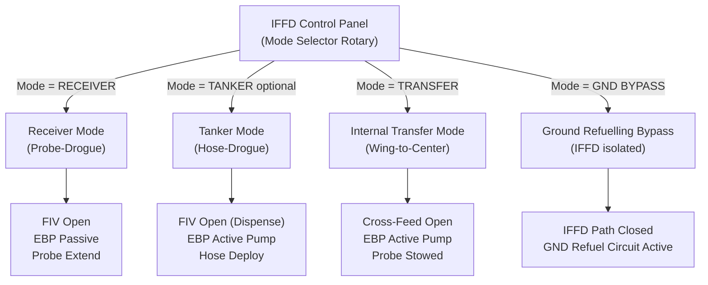
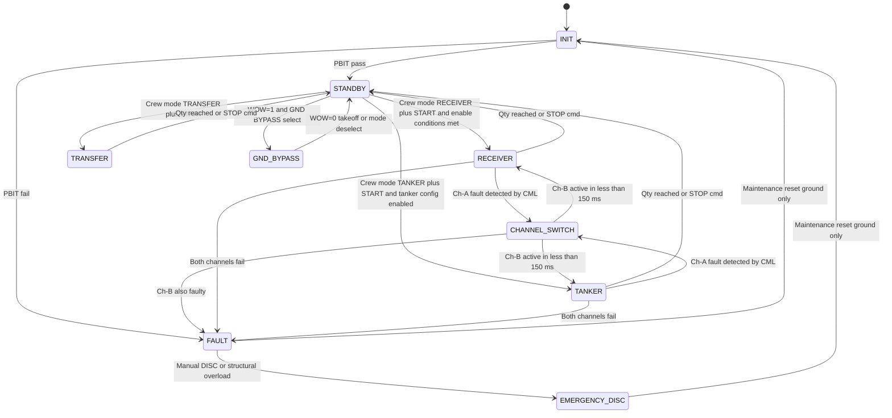

# ATLAS 040-049 · Section 04 · Subsection 048 · 010 — Fuel Dispensing Architecture and Modes

## §0. Hyperlink Policy

All internal cross-references use relative Markdown links within the Q+ATLANTIDE CSDB repository. External regulatory citations in §19/§20 are marked  where hyperlinks are pending. Parent context: [ATLAS 048 README](./README.md). Related subsubject documents are linked in §20.

---

## §1. Purpose

This document defines the **system-level architecture** and **operational mode framework** for the In-Flight Fuel Dispensing (IFFD) system of the programme-defined aircraft type, per ATA 48. The IFFD architecture centres on the dual-channel In-Flight Fuel Dispensing Control Unit (IFFDCU), which governs mode selection, channel management, fuel path configuration, and safety interlocks across four principal IFFD modes: **Receiver Mode**, **Tanker Mode** (optional), **Ground Refuelling Bypass**, and **Internal Fuel Transfer Mode**.

The architecture is wholly electric — no hydraulic actuation is used. Mode transitions are commanded from the dedicated IFFD Control Panel and are managed by IFFDCU software qualified to DO-178C DAL B. The channel switching logic ensures that a single channel fault does not interrupt an ongoing aerial refuelling operation.

---

## §2. Applicability

| Attribute | Value |
|-----------|-------|
| Aircraft Program | programme-defined aircraft type |
| ATA Chapter | ATA 48 — In-Flight Fuel Dispensing |
| Certification Basis | CS-25 Amendment 28; SFAR 88 |
| Applicable Standards | DO-178C DAL B; DO-160G; ARINC 664 P7; ARINC 429 |
| Control Unit | IFFDCU — dual-channel, hot standby |
| Mode Selection Interface | Dedicated IFFD Control Panel (center console) |
| S1000D SNS | 048-010 |

---

## §3. Functional Description

The IFFD architecture on the programme-defined aircraft type is structured around four operational modes, each defining a distinct fuel-path topology and control loop:

1. **Receiver Mode (Probe-Drogue)**: The aircraft accepts fuel from an external tanker via the retractable refuelling probe. The IFFDCU opens the Fuel Inlet Isolation Valve (FIV), arms the Electric Boost Pumps (EBP) in passive receive mode, monitors flow rate via the Coriolis meter, and distributes received fuel to the selected onboard tank(s) per the pre-set quantity target.

2. **Tanker Mode — Hose-Drogue (optional)**: The aircraft dispenses fuel to a receiver via the under-fuselage or wing-mounted hose-reel assembly. The IFFDCU activates EBP in pump mode, commands hose-reel deployment, manages drogue basket position, and monitors coupling lock status. Flow control uses the same PID loop as Receiver Mode but drives EBP in the outbound direction.

3. **Ground Refuelling Bypass**: Used during ground maintenance or when the IFFD circuit requires isolation. The IFFD fuel path (probe, FIV, EBP-IFFD) is bypassed and the aircraft uses the standard ATA 28 ground refuelling circuit. The IFFDCU enters a monitoring-only state; no actuation commands are issued.

4. **Internal Fuel Transfer Mode (Wing-to-Center)**: The IFFDCU commands the cross-feed manifold valves and EBP to redistribute fuel between internal tanks (wing inner/outer to center tank or vice versa) for CG management or tank balancing. This mode does not involve external fuel coupling.

### §3.1 Mode Comparison

| Mode | Fuel Direction | Probe/Hose | EBP Role | FIV State | ECAM Synoptic |
|------|---------------|------------|---------|-----------|--------------|
| Receiver (Probe-Drogue) | Inbound — tanker to aircraft | Probe extends | Passive receive | Open | IFFD RCV |
| Tanker (Hose-Drogue) | Outbound — aircraft to receiver | Hose deploys | Active pump | Open (dispense) | IFFD TNK |
| Ground Refuelling Bypass | Inbound — ground cart | Probe stowed | Off | Closed (IFFD) | FUEL GND |
| Internal Transfer | Internal — tank to tank | Probe stowed | Active pump | Closed (IFFD) | FUEL XFER |

### Diagram 1: IFFD Mode Selection and Functional Flow



---

## §4. System Architecture

### §4.1 IFFDCU Dual-Channel Architecture

The IFFDCU comprises two identical processing channels (Channel A and Channel B) implemented on dissimilar hardware platforms to guard against common-cause hardware failures. Channel A is designated as active at power-on; Channel B executes the same control algorithm in shadow mode, continuously comparing its output with Channel A at 50 ms cross-check intervals.

On detection of a Channel A output disagreement (≥ 2 consecutive cross-check failures), the IFFDCU Channel Management Logic (CML) initiates a controlled channel switch: Channel B becomes active within 150 ms while Channel A is de-energised and flagged for maintenance. A single channel reversion is transparent to the crew (no flight crew alert below WARNING level) unless the fault also affects fuel flow.

Both channels interface with the aircraft AFDX network (ARINC 664 P7) via independent network interface cards. The active channel transmits IFFD health and operational parameters to CMS (ATA 45) and ECAM (ATA 31/42). The standby channel transmits channel-health-only frames at a reduced rate.

### §4.2 Mode Selection and Enable Logic

Mode selection is performed via the IFFD Control Panel rotary selector. The IFFDCU validates each mode request against a set of enable conditions before accepting the transition:

| Mode | Enable Conditions |
|------|-----------------|
| Receiver | In flight (WOW = 0), IAS < 350 kt, radio alt > 100 ft, PBIT pass |
| Tanker | In flight (WOW = 0), IAS < 300 kt, tanker config pin = TRUE, PBIT pass |
| Internal Transfer | Any phase (on-ground or in-flight), PBIT pass |
| Ground Bypass | WOW = 1 (ground only) |

If an enable condition is not met, the IFFDCU inhibits the mode transition and generates a crew ADVISORY on the ECAM IFFD synoptic page.

### Diagram 2: IFFDCU Dual-Channel and Interface Architecture

```mermaid
graph LR
    PANEL["IFFD Control Panel\n(Mode / Qty / START-STOP)"] -->|Discrete| CML["Channel Management Logic\n(CML — IFFDCU)"]
    CML --> CH_A["Channel A\n(Active — DO-178C DAL B)"]
    CML --> CH_B["Channel B\n(Hot Standby — DO-178C DAL B)"]
    CH_A -->|50 ms cross-check| CH_B
    CH_A -->|AFDX NIC-A| AFDX["AFDX Network\n(ARINC 664 P7)"]
    CH_B -->|AFDX NIC-B (reduced)| AFDX
    AFDX --> CMS["CMS ATA 45"]
    AFDX --> ECAM["ECAM ATA 31/42"]
    CH_A -->|Mode commands| ACTUATORS["EBP / FIV / Probe EMA\nHose-Reel / Crossfeed Valves"]
    CH_A -->|Emergency cmd| EDU["Emergency Disconnect Unit\n(EDU)"]
    FQMS["FQMS ATA 28\n(ARINC 429)"] -->|Tank qty data| CH_A
    WOW["WOW Sensor\n(28V DC discrete)"] -->|Ground inhibit| CML
    RA["Radio Altimeter\n(< 100 ft inhibit)"] -->|Discrete| CML
```

---

## §5. Components and Line-Replaceable Units

| LRU | Part Number | Qty | Location | Replacement Interval |
|-----|-------------|-----|----------|----------------------|
| IFFDCU (Channel A) |  | 1 | Avionics bay | On-condition / 15,000 FH |
| IFFDCU (Channel B) |  | 1 | Avionics bay | On-condition / 15,000 FH |
| IFFD Control Panel |  | 1 | Center console | On-condition |
| Channel Management Logic Module |  | 1 | IFFDCU chassis | On-condition / 15,000 FH |
| AFDX NIC (Channel A) |  | 1 | IFFDCU chassis | On-condition |
| AFDX NIC (Channel B) |  | 1 | IFFDCU chassis | On-condition |
| WOW Discrete Interface Card |  | 1 | IFFDCU chassis | On-condition |
| Mode Configuration Pin Assembly |  | 1 | Nose avionics bay | Delivery / reconfiguration only |

---

## §6. Interfaces

| Interface | Peer System | Protocol / Bus | Data Exchanged |
|-----------|-------------|----------------|----------------|
| Mode selection commands | IFFD Control Panel | Discrete (28 V DC) | Mode selector position, START/STOP |
| Fuel quantity / tank data | ATA 28 FQMS | ARINC 429 | Tank quantities, density, CG |
| 28 V DC power (IFFDCU control) | ATA 24 Electrical | 28 V DC bus | IFFDCU power, panel power |
| 270 V DC power (EBP drive) | ATA 24 Electrical | 270 V DC bus | EBP motor drive |
| CMS fault reporting | ATA 45 CMS | AFDX (ARINC 664 P7) | Fault codes, channel status |
| ECAM synoptic update | ATA 31 Indicating | ARINC 664 P7 | Mode state, channel status, flow rate |
| FMS fuel target | ATA 22 FMS | ARINC 429 | Target quantity, transfer schedule |
| WOW ground inhibit | ATA 32 Landing Gear | Discrete (28 V DC) | Weight-on-wheels status |
| Radio altimeter (< 100 ft inhibit) | ATA 34 Navigation | Discrete (28 V DC) | Height above ground |
| Tanker config pin | Aircraft Config Interface | Discrete hard-wired | Tanker capability enable flag |

---

## §7. Operations and Modes

| Mode | Trigger | Channel State | Fuel Path | Duration / Notes |
|------|---------|--------------|-----------|-----------------|
| INIT | Power-on | PBIT — both channels | All valves closed | Typically < 30 s PBIT |
| STANDBY | PBIT pass | Channel A active, B shadow | All valves closed | Awaiting crew selection |
| RECEIVER | Crew: RECEIVER + START | Channel A drives probe / FIV | Inbound — tanker to aircraft | Until qty reached or STOP |
| TANKER | Crew: TANKER + START | Channel A drives hose / FIV | Outbound — to receiver | Until qty reached or STOP |
| TRANSFER | Crew: TRANSFER + START | Channel A drives crossfeed | Internal — wing to center | Until qty reached or STOP |
| GND BYPASS | WOW = 1 + BYPASS select | Monitoring only | ATA 28 GND circuit | Ground operations |
| CHANNEL SWITCH | CML detects Ch-A fault | Ch-B becomes active | Maintains current mode | Transparent < 150 ms |
| FAULT | Ch-A + Ch-B fault | FAULT state | All valves closed | ECAM WARNING |
| EMERGENCY DISC | Manual DISC or auto-trigger | Emergency state | IFFD path isolated | EDU fires < 100 ms |

### Diagram 3: IFFD Architecture Mode State Machine



---

## §8. Performance and Budgets

| Parameter | Requirement | Target | Status |
|-----------|-------------|--------|--------|
| PBIT execution time | < 30 s | 25 s typical |  |
| Channel A → Channel B switchover | < 150 ms | 120 ms |  |
| Cross-check interval (Ch-A vs Ch-B) | ≤ 50 ms | 50 ms |  |
| Mode transition time (STANDBY → active) | < 3 s | 2.5 s |  |
| Mode enable condition check latency | < 200 ms | 100 ms |  |
| IFFDCU CBIT coverage | > 97% failure detection | 98% target |  |
| AFDX health frame (Ch-B standby rate) | 1 Hz | 1 Hz |  |
| AFDX active IFFD data rate | 10 Hz | 10 Hz |  |

---

## §9. Safety, Redundancy and Fault Tolerance

- **Dual-channel hot standby**: Channel B remains fully armed at all times; transition to active is automatic and requires no crew action.
- **Mode enable condition checking**: All four modes are gated by hardware-discrete enable conditions (WOW, radio altimeter, IAS, config pin) that cannot be overridden by software alone.
- **WOW inhibit for aerial modes**: Receiver and Tanker modes are hard-inhibited on the ground (WOW = 1), preventing inadvertent aerial mode actuation during maintenance.
- **Radio altimeter inhibit**: Additional safety layer preventing IFFD activation below 100 ft AGL during approach/go-around.
- **Tanker config pin hardware interlock**: Tanker mode is unavailable unless a physical configuration pin is installed and correctly wired, preventing accidental tanker operations on receiver-only aircraft.
- **All-electric actuator de-energisation on fault**: On entry to FAULT state, all EBP, FIV, and probe/hose actuators are de-energised; fail-safe FIV spring-closes the IFFD fuel path.
- **DO-178C DAL B software**: Mode transition logic, enable condition gating, and channel management logic are all within the DAL B software scope — each function has rigorous structural coverage requirements (MC/DC).

---

## §10. Maintenance and Diagnostics

| Task | Interval | Access | Tools Required |
|------|----------|--------|----------------|
| IFFDCU dual-channel IBIT | A-check | Avionics bay / ECAM maintenance mode | None (software-driven) |
| Mode transition functional test (all 4 modes) | C-check | IFFD panel + maintenance laptop | IFFD IBIT mode via DLCS |
| Channel switch test (simulate Ch-A fault) | B-check | IFFD panel + avionics bay | IFFD IBIT fault injection |
| WOW / RA inhibit circuit check | A-check | Landing gear / radio altimeter bay | Discrete signal analyser |
| Tanker config pin inspection | Reconfiguration | Nose avionics bay | Continuity tester |
| AFDX NIC port loopback test | C-check | Avionics bay | AFDX test set |
| IFFDCU software update | As released | Avionics bay | DLCS / ACARS |

---

## §11. Configuration and Software

- IFFDCU software DAL: **DO-178C DAL B**; Part Number ; Version 1.0.0.
- Mode transition logic and Channel Management Logic (CML) are within DAL B scope with MC/DC structural coverage requirements.
- Tanker mode software capability is present in all IFFDCU units; it is enabled/disabled via the aircraft configuration data module loaded at delivery. The tanker config pin provides a hardware interlock as an independent safety barrier.
- Channel A and Channel B execute from separate non-volatile memory partitions; a software update to one channel does not affect the other until a controlled dual-update procedure is completed.
- IFFDCU self-test library (PBIT + CBIT) is part of the DAL B application binary; IBIT is a separate loadable test partition also at DAL B.

---

## §12. Environmental and Physical Constraints

| Constraint | Specification | Standard |
|-----------|--------------|---------|
| Operating temperature (IFFDCU) | −55 °C to +70 °C | DO-160G Section 4 |
| Humidity | 95% RH non-condensing | DO-160G Section 6 |
| Vibration (avionics bay) | Random 0.04 g²/Hz, 20–2,000 Hz | DO-160G Section 8 |
| EMI / EMC | Cat M — high-power radio transmitters proximity | DO-160G Section 20/21 |
| Power quality | 28 V DC ± 4 V; 270 V DC ± 27 V | MIL-STD-704F |
| AFDX interface | ARINC 664 P7 conformant | ARINC 664 P7 |
| Altitude derating | None (sealed IFFDCU chassis) | DO-160G Section 4 |
| Connector standard | MIL-DTL-38999 Series III | AS50151 |

---

## §13. Human Factors and Crew Interface

- **Mode Selector Rotary**: Five positions — OFF, RECEIVER, TANKER, TRANSFER, GND BYPASS. Rotary has mechanical detent at each position with tactile feedback.
- **Qty Preset Dial**: Graduated in 100 lb increments from 0 to 50,000 lb; digital readout on IFFD panel LCD.
- **START / STOP Pushbuttons**: Green illuminated START, red illuminated STOP (illuminated when mode active).
- **DISC Button**: Guard-covered red pushbutton — triggers emergency disconnect (electric path). Crew advised to hold for 3 s if no disconnect confirmation.
- **ECAM ADVISORY (blue)**: Mode inhibit condition not met — displayed with specific inhibit reason (e.g., "IFFD INHIBITED WOW").
- **ECAM CAUTION (amber)**: Channel switch occurred — "IFFD CH-A FAULT CH-B ACTIVE".
- **ECAM WARNING (red)**: Both channels failed or EDU fired — "IFFD FAULT" / "IFFD DISCONNECT".

---

## §14. Test and Validation

| Test | Method | Acceptance Criterion | Status |
|------|--------|---------------------|--------|
| PBIT timing verification | Software simulation | PBIT complete < 30 s |  |
| Channel switchover timing | Hardware fault injection | Switchover < 150 ms |  |
| Mode enable condition gating | Software simulation + ground test | All 4 modes correctly inhibited |  |
| WOW inhibit functional test | Ground test | Receiver/Tanker blocked when WOW=1 |  |
| Tanker config pin interlock | Ground test | Tanker mode unavailable without pin |  |
| DO-178C DAL B code coverage | Software MCDC analysis | 100% MC/DC for CML and mode logic |  |
| AFDX NIC loopback | Avionics integration test bench | All frames delivered, no loss |  |

---

## §15. Regulatory Compliance

| Regulation | Requirement | Compliance Method | Status |
|-----------|-------------|------------------|--------|
| CS-25 §25.975 | Fuel jettison system | SSA + flight test |  |
| DO-178C DAL B | IFFDCU software | SAS + code review + coverage |  |
| ARINC 664 P7 | AFDX interface | ICD compliance review |  |
| DO-160G | IFFDCU hardware | Environmental test report |  |
| MIL-STD-704F | 28 V DC / 270 V DC power quality | Power quality analysis |  |

---

## §16. Certification Evidence

-  Software Accomplishment Summary (SAS) — IFFDCU DO-178C DAL B
-  CML and mode transition logic MC/DC coverage report
-  Channel management fault injection test report
-  IFFD System Safety Assessment (SSA) — mode architecture coverage
-  WOW / RA inhibit circuit qualification evidence
-  DO-160G Environmental Test Report (IFFDCU)
-  Tanker config pin interface control document (ICD)

---

## §17. Open Issues

| ID | Description | Owner | Target | Status |
|----|-------------|-------|--------|--------|
| IFFD-010-OI-001 | Define channel switchover criteria for ongoing fuel transfer (acceptability of 150 ms gap) | Q-AIR |  |  |
| IFFD-010-OI-002 | Confirm IAS limit for Receiver mode (350 kt vs structural coupling limit) | Q-AIR / Q-MECHANICS |  |  |
| IFFD-010-OI-003 | Evaluate need for crew ADVISORY when WOW inhibit is in effect during pre-flight IFFD test | Q-AIR |  |  |

---

## §18. Glossary

| Acronym / Term | Definition |
|---------------|-----------|
| IFFDCU | In-Flight Fuel Dispensing Control Unit — dual-channel DO-178C DAL B controller for IFFD |
| CML | Channel Management Logic — IFFDCU function managing active/standby channel selection |
| EBP | Electric Boost Pump — electrically-driven IFFD fuel transfer pump |
| FIV | Fuel Inlet Isolation Valve — fail-safe closed valve on IFFD fuel path |
| WOW | Weight-on-Wheels — landing gear compression sensor used as ground inhibit signal |
| RA | Radio Altimeter — provides height above ground; used for IFFD < 100 ft inhibit |
| PBIT | Power-on Built-In Test — self-test executed at power-on by IFFDCU |
| CBIT | Continuous Built-In Test — ongoing self-monitoring during IFFDCU operation |
| IBIT | Initiated Built-In Test — maintenance-initiated self-test via DLCS |
| DAL | Design Assurance Level — software criticality classification per DO-178C |

---

## §19. Citations

| Standard | Title | Issuer | Applicability |
|---------|-------|--------|--------------|
| CS-25 Amendment 28 | Certification Specifications for Large Aeroplanes | EASA | IFFD architecture compliance |
| DO-178C | Software Considerations in Airborne Systems | RTCA | IFFDCU DAL B — CML and mode logic |
| DO-160G | Environmental Conditions and Test Procedures | RTCA | IFFDCU hardware qualification |
| ARINC 664 P7 | Aircraft Data Network — AFDX | ARINC | IFFDCU network interface |
| ARINC 429 | Digital Information Transfer System | ARINC | FQMS and FMS data links |
| MIL-STD-704F | Aircraft Electric Power Characteristics | US DoD | 28 V DC / 270 V DC power quality |
| S1000D Issue 5.0 | International Specification for Technical Publications | ASD/AIA/ATA | CSDB documentation |

---

## §20. References

| Document | Path | Relation |
|---------|------|---------|
| ATLAS 048-000 | [./048-000-In-Flight-Fuel-Dispensing-General.md](./048-000-In-Flight-Fuel-Dispensing-General.md) | IFFD system overview |
| ATLAS 048-060 | [./048-060-In-Flight-Fuel-Dispensing-Control-and-Indication.md](./048-060-In-Flight-Fuel-Dispensing-Control-and-Indication.md) | Panel and ECAM interface detail |
| ATLAS 048-070 | [./048-070-Safety-Interlocks-Emergency-Disconnect-and-Jettison.md](./048-070-Safety-Interlocks-Emergency-Disconnect-and-Jettison.md) | Safety interlocks |
| ATLAS 048-080 | [./048-080-IFFD-Monitoring-Diagnostics-and-Control-Interfaces.md](./048-080-IFFD-Monitoring-Diagnostics-and-Control-Interfaces.md) | Monitoring and diagnostics |
| ATLAS 048 README | [./README.md](./README.md) | Subsection index |
| Q+ATLANTIDE Baseline | [../../../../organization/Q+ATLANTIDE.md](../../../../organization/Q+ATLANTIDE.md) | Governance |

---

## §21. Footprint

| Metric | Value |
|--------|-------|
| Architecture | `ATLAS` — Aircraft Top Level Architecture Schema/System |
| Master range | `000–099` |
| Code range | `040-049` |
| Section | `04` — Aviónica, Información & APU |
| Subsection | `048` — In-Flight Fuel Dispensing |
| Subsubject | `010` — Fuel Dispensing Architecture and Modes |
| Primary Q-Division | Q-AIR |
| Support Q-Divisions | Q-MECHANICS, Q-DATAGOV, Q-GREENTECH, Q-GROUND |
| ORB support | ORB-PMO, ORB-LEG |
| Governance class | `baseline` |
| Document ID | `QATL-ATLAS-1000-ATLAS-040-049-04-048-010-FUEL-DISPENSING-ARCHITECTURE-AND-MODES` |
| Version | 1.0.0 |
| Status | active |
| Created | 2026-05-10 |
| Updated | 2026-05-10 |

---

## §22. Change Log

| Version | Date | Author | Change Description |
|---------|------|--------|--------------------|
| 1.0.0 | 2026-05-10 | Q-AIR / ATLAS Working Group | Initial baseline release — IFFD architecture and modes for programme-defined aircraft type |
