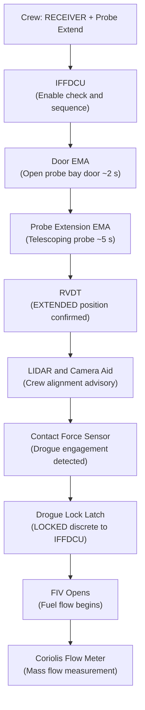
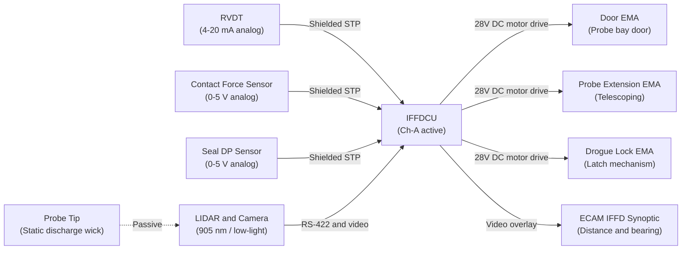
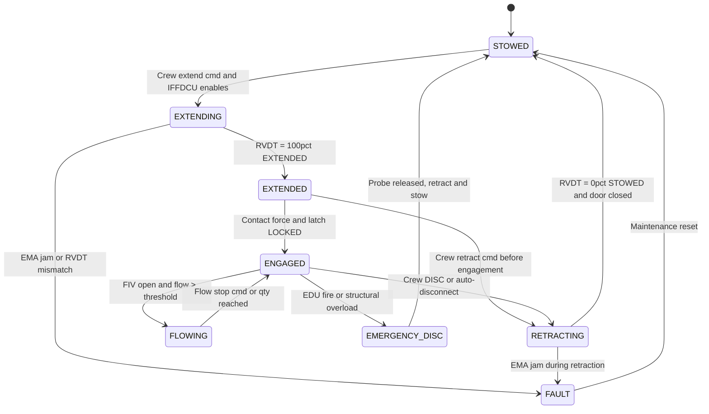

# ATLAS 040-049 · Section 04 · Subsection 048 · 020 — Refuelling Probe-Drogue and Receptacle Interfaces

## §0. Hyperlink Policy

All internal cross-references use relative Markdown links within the Q+ATLANTIDE CSDB repository. External regulatory citations in §19/§20 are marked  where hyperlinks are pending. Parent context: [ATLAS 048 README](./README.md). Related subsubject documents are linked in §20.

---

## §1. Purpose

This document specifies the **refuelling probe, drogue, and receptacle interfaces** for the programme-defined aircraft type in Receiver Mode under ATA 48. The retractable refuelling probe is the primary receiver-side coupling mechanism, housed in the nose section of the aircraft and actuated by an Electromechanical Actuator (EMA) — no hydraulic cylinder is used. The probe interfaces with a standard NATO-type drogue basket on the dispensing tanker.

Probe extension and retraction are guided by a LIDAR/camera-aided alignment system to assist crew positioning relative to the tanker drogue. Position sensing uses a Rotary Variable Differential Transducer (RVDT) for stow/deploy state reporting. Seal integrity is monitored continuously during engagement to detect leakage. The ATA 28 fuel path isolation valve prevents contamination of the main fuel system before probe engagement and after disconnection.

---

## §2. Applicability

| Attribute | Value |
|-----------|-------|
| Aircraft Program | programme-defined aircraft type |
| ATA Chapter | ATA 48 — In-Flight Fuel Dispensing |
| Configuration | Receiver Mode (standard) |
| Probe Type | Retractable, telescoping, electrically actuated |
| Drogue Type | NATO standard probe-drogue (basket type) |
| Actuation | Electromechanical Actuator (EMA) — no hydraulic |
| Extension / Retraction Time | < 8 s |
| Probe DO-160G Qualification | Full — including Zone 1A lightning direct effects |
| S1000D SNS | 048-020 |

---

## §3. Functional Description

The probe assembly is installed in a pressurised housing located in the aircraft nose section, offset to the right of the centreline by approximately 0.4 m to maintain windshield and nose sensor clearance. In the stowed position, a flush aerodynamic door closes over the probe bay; the door is actuated by a secondary EMA (Door EMA) commanded in sequence with the main probe extension EMA.

When the crew selects Receiver Mode and commands probe extension, the IFFDCU commands the Door EMA to open the probe bay door, then commands the Probe Extension EMA to extend the telescoping probe to its fully deployed position. Extension time from stowed to locked-extended is < 8 s. The RVDT reports continuous position data; the IFFDCU verifies EXTENDED + LOCKED status before arming the fuel flow path.

The LIDAR/camera alignment aid provides the crew with a video feed and distance/bearing overlay on the ECAM IFFD synoptic page, assisting approach to the tanker drogue. The system gives no active flight control input — it is a crew advisory system only.

On probe tip contact with the drogue basket, a contact force sensor in the probe tip confirms engagement. The drogue lock mechanism in the probe receptacle locks the drogue to the probe via a spring-loaded latch. The IFFDCU receives a LOCKED discrete and opens the Fuel Inlet Isolation Valve (FIV) to begin fuel flow.

Probe seal integrity is monitored by a differential pressure sensor across the probe barrel seal. A leak above the threshold (> 5 PSI/min drop) generates a crew CAUTION and inhibits fuel flow.

### §3.1 Probe Extension Sequence

| Step | Event | Duration |
|------|-------|---------|
| 1 | Crew commands RECEIVER + Probe Extend | — |
| 2 | IFFDCU enables extension (all conditions met) | < 200 ms |
| 3 | Door EMA opens probe bay door | ~ 2 s |
| 4 | Probe Extension EMA extends telescoping probe | ~ 5 s |
| 5 | RVDT confirms EXTENDED position | < 100 ms |
| 6 | IFFDCU sets PROBE EXTENDED flag | — |
| 7 | Crew manoeuvres to drogue (LIDAR/camera aid) | Pilot-dependent |
| 8 | Contact force sensor detects drogue engagement | — |
| 9 | Drogue lock latches; LOCKED discrete to IFFDCU | < 500 ms |
| 10 | FIV opens; fuel flow begins | < 1 s after LOCKED |

### Diagram 1: Probe-Drogue Functional Flow

---

## §4. System Architecture

The probe assembly integrates three electromechanical actuators (Door EMA, Probe Extension EMA, Drogue Lock EMA) controlled by the IFFDCU via discrete motor drive signals on the 28 V DC bus. The RVDT is a passive inductive sensor powered by the IFFDCU signal conditioning module; its output is a 4–20 mA analog signal transmitted to the IFFDCU via shielded twisted-pair wiring.

The LIDAR/camera system is an independent sensor cluster mounted ahead of the probe bay, interfaced to the IFFDCU via a dedicated RS-422 serial link and a video output to the ECAM display unit. The LIDAR operates at 905 nm; the camera is a low-light capable unit with integral IR illumination for night/low-visibility refuelling.

The probe assembly is qualified to DO-160G including Zone 1A lightning direct strike. The probe tip is fitted with a static discharge wick to bleed charge during drogue approach and prevent spark on contact with the fuel-wetted drogue basket.

### Diagram 2: Probe Assembly Interface Architecture

---

## §5. Components and Line-Replaceable Units

| LRU | Part Number | Qty | Location | Replacement Interval |
|-----|-------------|-----|----------|----------------------|
| Probe Assembly (complete) |  | 1 | Nose section — probe bay | On-condition / 5,000 cycles |
| Probe Bay Door EMA |  | 1 | Nose section — door hinge | On-condition / 8,000 cycles |
| Probe Extension EMA |  | 1 | Probe housing | On-condition / 5,000 cycles |
| Drogue Lock EMA |  | 1 | Probe tip assembly | On-condition / 5,000 cycles |
| RVDT (position sensor) |  | 1 | Probe barrel | On-condition / 10,000 FH |
| Contact Force Sensor |  | 1 | Probe tip | On-condition / 5,000 contacts |
| Seal Differential Pressure Sensor |  | 1 | Probe barrel mid-section | On-condition / 10,000 FH |
| LIDAR Unit |  | 1 | Nose — forward of probe bay | On-condition / 15,000 FH |
| Camera Unit (low-light / IR) |  | 1 | Nose — forward of probe bay | On-condition / 15,000 FH |
| Static Discharge Wick |  | 2 | Probe tip | 500 cycles or B-check |
| Probe Barrel Seal Kit |  | 1 set | Probe barrel | 1,000 FH or C-check |

---

## §6. Interfaces

| Interface | Peer System | Protocol / Bus | Data Exchanged |
|-----------|-------------|----------------|----------------|
| Probe EMA motor drive | IFFDCU Ch-A | 28 V DC discrete | Extension / retraction command |
| RVDT position data | IFFDCU signal conditioning | 4–20 mA analog | Probe position (stowed / deployed) |
| Contact force signal | IFFDCU analog input | 0–5 V analog | Drogue engagement force (0–1,000 N) |
| Seal DP sensor | IFFDCU analog input | 0–5 V analog | Seal leakage monitoring (PSI/min) |
| LIDAR range / bearing | IFFDCU RS-422 | RS-422 serial | Range (m) and bearing (°) to drogue |
| Camera video | ECAM display unit | CVBS / HD-SDI | Alignment video feed with overlay |
| FIV control | IFFDCU Ch-A | 28 V DC discrete | Open / close FIV on probe lock/unlock |
| ATA 28 fuel path | FQMS / fuel system | Hydraulic fluid / fuel path | Fuel flow — tanker to aircraft tanks |
| Lightning bond | Airframe structure | Bonded strap | Static dissipation, lightning protection |

---

## §7. Operations and Modes

| Mode | Probe State | Door State | RVDT Indication | FIV State |
|------|-------------|-----------|----------------|-----------|
| Stowed (normal flight) | Retracted | Closed | STOWED | Closed |
| Extending | Extending | Open | 0%–100% position | Closed |
| Extended, seeking drogue | Fully extended | Open | EXTENDED | Closed |
| Engaged (drogue locked) | Extended, locked | Open | EXTENDED + LOCKED | Open |
| Fuel flowing | Extended, locked | Open | EXTENDED + LOCKED | Open (flow) |
| Retracting (post-transfer) | Retracting | Open | 100%–0% position | Closed |
| Fault / Emergency Retract | Retracting (EMA) | Open (until retracted) | Position | Closed |

### Diagram 3: Probe State Machine

---

## §8. Performance and Budgets

| Parameter | Requirement | Target | Status |
|-----------|-------------|--------|--------|
| Probe extension time (stowed to locked) | < 8 s | 6 s typical |  |
| Probe retraction time (locked to stowed) | < 8 s | 6 s typical |  |
| RVDT position accuracy | ± 0.5° | ± 0.3° |  |
| LIDAR range accuracy | ± 0.5 m at 30 m range | ± 0.3 m |  |
| Contact force sensor range | 0–1,000 N, ± 10 N | ± 5 N |  |
| Seal leak detection threshold | < 5 PSI/min drop | 3 PSI/min |  |
| Probe cycles life | ≥ 5,000 cycles | 5,000 cycles |  |
| DO-160G Zone 1A lightning compliance | Full qualification | Pass all tests |  |
| Probe tip static discharge (pre-contact) | Complete discharge < 2 s | 1.5 s |  |

---

## §9. Safety, Redundancy and Fault Tolerance

- **RVDT with independent monitoring**: Probe position is reported by RVDT; the IFFDCU cross-checks RVDT data against EMA encoder to detect position sensor failures.
- **FIV fail-safe closed**: The Fuel Inlet Isolation Valve is spring-return-to-closed; loss of actuator power closes the fuel path, preventing uncontrolled fuel flow if the probe loses seal integrity.
- **Static discharge wick**: Prevents electrostatic spark on initial drogue contact — critical safety requirement for fuel-wetted connector.
- **DO-160G Zone 1A lightning**: Probe is qualified for direct lightning strike; bonded to airframe via dedicated bonding strap to ensure controlled current path.
- **Seal integrity monitor**: Continuous differential pressure monitoring across probe barrel seal; CAUTION generated and fuel flow inhibited on detection of seal leakage exceeding threshold.
- **Emergency retraction on fault**: On EMA or RVDT fault, the IFFDCU commands emergency retraction; if EMA is jammed, a mechanical shear link allows probe to be expelled and jettisoned as a last resort.
- **LIDAR/camera as advisory only**: Probe alignment aid provides crew information but does not provide flight control inputs — no autopilot coupling, eliminating a class of coupled-system hazards.
- **IAS limit for probe operation**: Probe is qualified for operation up to 350 KIAS (structural loads analysis); the IFFDCU inhibits extension above this airspeed using ADS data from ATA 34.

---

## §10. Maintenance and Diagnostics

| Task | Interval | Access | Tools Required |
|------|----------|--------|----------------|
| Probe extension / retraction functional test | A-check | IFFD panel / ECAM maintenance mode | None |
| RVDT calibration check | 3,000 FH | Nose access panel | RVDT calibrator tool |
| Contact force sensor calibration | 2,000 cycles | Probe tip assembly | Force calibration fixture |
| Probe barrel seal inspection and pressure test | 1,000 FH or C-check | Probe bay | Pressure decay test kit |
| Static discharge wick replacement | 500 cycles or B-check | Probe tip | Standard toolkit |
| LIDAR / camera alignment verification | B-check | Nose external access | Alignment target board |
| EMA motor brush / bearing inspection | 5,000 FH | Probe housing (LRU replacement) | Standard LRU toolkit |
| Probe assembly lubrication | C-check | Probe telescoping barrel | Approved lubricant per CMM |
| DO-160G lightning bond resistance check | C-check | Nose section bonding points | Bonding resistance meter |

---

## §11. Configuration and Software

- Probe extension/retraction and alignment system control software is part of the IFFDCU DO-178C DAL B software suite.
- LIDAR/camera firmware is independently qualified to DO-178C DAL C (advisory system only); Part Number .
- Probe cycle life counter maintained in IFFDCU non-volatile memory; accessible via CMS ATA 45 maintenance interface.
- Contact force sensor calibration coefficients stored in IFFDCU configuration data module, updated via DLCS on sensor replacement.

---

## §12. Environmental and Physical Constraints

| Constraint | Specification | Standard |
|-----------|--------------|---------|
| Operating temperature (probe) | −55 °C to +85 °C (skin heating at high IAS) | DO-160G Section 4 |
| Icing (probe nose, door seal) | Anti-iced by probe bay bleed — electric heater mat | DO-160G Section 24 |
| Vibration (nose section, taxi and flight) | 10–2,000 Hz, 8 g (nose-mounted, high-vibration zone) | DO-160G Section 8 |
| Lightning direct effects (Zone 1A) | Attachment zone — initial + swept stroke qualification | DO-160G Section 22 |
| EMI — LIDAR (905 nm) | Laser safety Class 1M (eye-safe at > 7 m) | IEC 60825-1 |
| Probe structural loads | Limit load at 350 KIAS, 1,000 N contact force | CS-25 §25.305 |
| Fuel compatibility | Jet-A, Jet A-1, JP-8, SAF blends — probe seal materials qualified | DO-160G Section 11 |

---

## §13. Human Factors and Crew Interface

- **ECAM IFFD Synoptic — Probe Page**: Shows probe position graphically (stowed / extending / extended), RVDT percentage, drogue lock status (LOCKED / UNLOCKED), contact force indication, seal integrity status (OK / LEAK).
- **LIDAR/Camera overlay**: Video feed displayed on lower ECAM MFD with range (m) and bearing (°) to tanker drogue overlaid in amber text.
- **CAUTION "PROBE SEAL LEAK"**: Amber ECAM CAUTION generated if seal DP drops > threshold; fuel flow automatically inhibited.
- **CAUTION "PROBE POS DISAGREE"**: RVDT vs EMA encoder mismatch beyond 5% — crew awareness; probe retraction recommended.
- **Night/IMC operations**: IR camera illumination provides guidance in low-visibility or night conditions; range rated to 30 m detection.

---

## §14. Test and Validation

| Test | Method | Acceptance Criterion | Status |
|------|--------|---------------------|--------|
| Probe extension / retraction timing | Ground functional test | < 8 s extension, < 8 s retraction |  |
| RVDT position accuracy | Calibration bench | ± 0.5° across full stroke |  |
| Contact force sensor accuracy | Calibration fixture | ± 10 N across 0–1,000 N range |  |
| Seal pressure decay test | Pressure decay test kit | < 3 PSI/min drop at 55 psig |  |
| LIDAR range accuracy | Ground alignment test | ± 0.5 m at 30 m range |  |
| DO-160G Zone 1A lightning test | Lightning test lab | Pass initial + swept stroke |  |
| Probe cycle life endurance | Qualification test rig | ≥ 5,000 cycles no failure |  |
| Static discharge wick performance | ESD test | Full discharge < 2 s |  |
| Aerial refuelling engagement (flight test) | Flight test campaign | Probe-drogue engagement at 300 KIAS |  |

---

## §15. Regulatory Compliance

| Regulation | Requirement | Compliance Method | Status |
|-----------|-------------|------------------|--------|
| CS-25 §25.979 | Pressure fuelling system | Design analysis + seal test |  |
| CS-25 §25.305 | Structural loads — probe | Structural analysis + FEM |  |
| DO-160G Section 22 | Lightning direct effects Zone 1A | Lightning qualification test |  |
| IEC 60825-1 | LIDAR laser safety (Class 1M) | Laser safety assessment |  |
| DO-178C DAL B/C | Probe control and LIDAR firmware | SAS + code coverage |  |
| SFAR 88 | Fuel tank safety — IFFD path | Fuel system safety analysis |  |

---

## §16. Certification Evidence

-  Probe Assembly Structural Analysis Report (CS-25 §25.305)
-  DO-160G Zone 1A Lightning Direct Effects Qualification Report
-  Probe Seal Qualification Report (pressure, temperature, fuel compatibility)
-  LIDAR Laser Safety Assessment (IEC 60825-1 Class 1M)
-  Probe Cycle Life Endurance Test Report (≥ 5,000 cycles)
-  Aerial Refuelling Engagement Flight Test Report

---

## §17. Open Issues

| ID | Description | Owner | Target | Status |
|----|-------------|-------|--------|--------|
| IFFD-020-OI-001 | Define SAF blend compatibility specification for probe barrel seals | Q-GREENTECH |  |  |
| IFFD-020-OI-002 | Confirm LIDAR laser wavelength compatibility with night-vision goggles (NVG) used in military tanker operations | Q-AIR |  |  |
| IFFD-020-OI-003 | Assess probe anti-icing heater mat power budget vs ATA 24 load shedding | Q-AIR / Q-MECHANICS |  |  |

---

## §18. Glossary

| Acronym / Term | Definition |
|---------------|-----------|
| RVDT | Rotary Variable Differential Transducer — position sensor reporting probe deploy/stow state |
| EMA | Electromechanical Actuator — electric motor-driven actuator for probe extension and door |
| FIV | Fuel Inlet Isolation Valve — fail-safe closed valve on IFFD fuel inlet path |
| LIDAR | Light Detection and Ranging — 905 nm laser sensor for probe-drogue range measurement |
| Drogue | Basket-shaped aerodynamic stabiliser at tanker hose end; receives probe tip for coupling |
| LOCKED | Discrete signal from drogue lock latch mechanism indicating secure probe-drogue engagement |
| Zone 1A | DO-160G lightning zone — initial and swept stroke direct attachment; highest lightning exposure |
| Seal DP | Differential pressure across probe barrel seal — used to detect seal leakage in flight |
| CMM | Component Maintenance Manual — LRU-level maintenance procedures document |
| Static Wick | Passive discharge device bleeding electrostatic charge from probe tip before drogue contact |

---

## §19. Citations

| Standard | Title | Issuer | Applicability |
|---------|-------|--------|--------------|
| CS-25 Amendment 28 §25.979 | Pressure fuelling system | EASA | Probe and FIV design |
| CS-25 Amendment 28 §25.305 | Strength and deformation | EASA | Probe structural qualification |
| DO-160G Section 22 | Lightning Direct Effects | RTCA | Zone 1A probe qualification |
| DO-178C | Software Considerations in Airborne Systems | RTCA | Probe control DAL B; LIDAR DAL C |
| IEC 60825-1 | Safety of Laser Products | IEC | LIDAR laser classification |
| SFAR 88 | Fuel Tank Safety | FAA | IFFD fuel path safety |
| S1000D Issue 5.0 | International Specification for Technical Publications | ASD/AIA/ATA | CSDB documentation |
| ARINC 429 | Digital Information Transfer System | ARINC | FQMS data interface |

---

## §20. References

| Document | Path | Relation |
|---------|------|---------|
| ATLAS 048-000 | [./048-000-In-Flight-Fuel-Dispensing-General.md](./048-000-In-Flight-Fuel-Dispensing-General.md) | IFFD system overview |
| ATLAS 048-010 | [./048-010-Fuel-Dispensing-Architecture-and-Modes.md](./048-010-Fuel-Dispensing-Architecture-and-Modes.md) | IFFD architecture and modes |
| ATLAS 048-030 | [./048-030-Fuel-Transfer-Pumps-Valves-and-Manifolds.md](./048-030-Fuel-Transfer-Pumps-Valves-and-Manifolds.md) | EBP and FIV detail |
| ATLAS 048-070 | [./048-070-Safety-Interlocks-Emergency-Disconnect-and-Jettison.md](./048-070-Safety-Interlocks-Emergency-Disconnect-and-Jettison.md) | Emergency disconnect |
| ATLAS 048 README | [./README.md](./README.md) | Subsection index |
| Q+ATLANTIDE Baseline | [../../../../organization/Q+ATLANTIDE.md](../../../../organization/Q+ATLANTIDE.md) | Governance |

---

## §21. Footprint

| Metric | Value |
|--------|-------|
| Architecture | `ATLAS` — Aircraft Top Level Architecture Schema/System |
| Master range | `000–099` |
| Code range | `040-049` |
| Section | `04` — Aviónica, Información & APU |
| Subsection | `048` — In-Flight Fuel Dispensing |
| Subsubject | `020` — Refuelling Probe-Drogue and Receptacle Interfaces |
| Primary Q-Division | Q-AIR |
| Support Q-Divisions | Q-MECHANICS, Q-DATAGOV, Q-GREENTECH, Q-GROUND |
| ORB support | ORB-PMO, ORB-LEG |
| Governance class | `baseline` |
| Document ID | `QATL-ATLAS-1000-ATLAS-040-049-04-048-020-REFUELLING-PROBE-DROGUE-AND-RECEPTACLE-INTERFACES` |
| Version | 1.0.0 |
| Status | active |
| Created | 2026-05-10 |
| Updated | 2026-05-10 |

---

## §22. Change Log

| Version | Date | Author | Change Description |
|---------|------|--------|--------------------|
| 1.0.0 | 2026-05-10 | Q-AIR / ATLAS Working Group | Initial baseline release — Probe-drogue and receptacle interfaces for programme-defined aircraft type |
