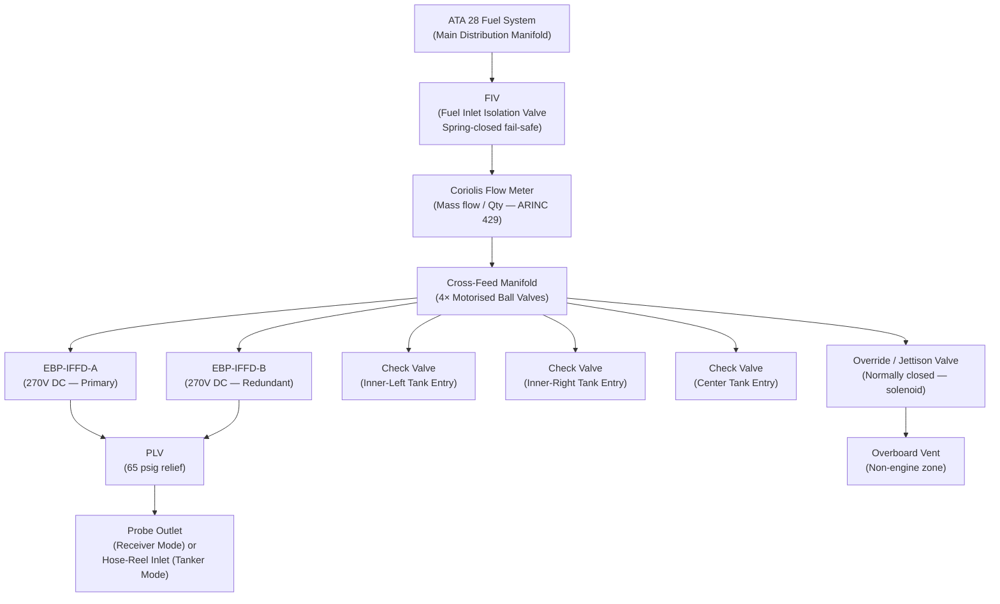
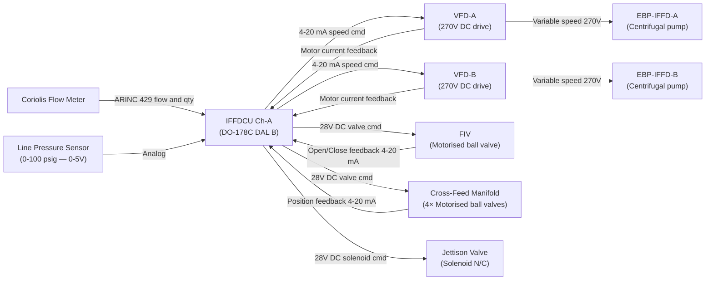
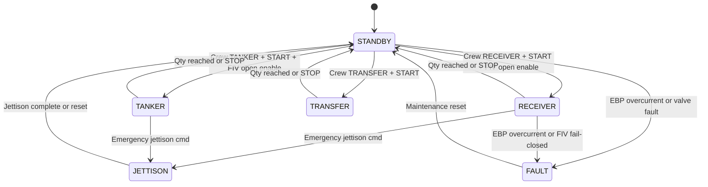

# ATLAS 040-049 · Section 04 · Subsection 048 · 030 — Fuel Transfer Pumps Valves and Manifolds

## §0. Hyperlink Policy

All internal cross-references use relative Markdown links within the Q+ATLANTIDE CSDB repository. External regulatory citations in §19/§20 are marked  where hyperlinks are pending. Parent context: [ATLAS 048 README](./README.md). Related subsubject documents are linked in §20.

---

## §1. Purpose

This document details the **electric fuel transfer pumps, valves, and manifold assembly** for the In-Flight Fuel Dispensing (IFFD) system on the programme-defined aircraft type per ATA 48. All fuel actuation within the IFFD circuit is electric — no hydraulic pumps or hydraulically actuated valves are used.

The IFFD fuel circuit comprises two Electric Boost Pumps (EBP-IFFD-A and EBP-IFFD-B) powered from the 270 V DC bus, a cross-feed manifold assembly with motorised ball valves, Fuel Inlet Isolation Valves (FIV), an override/jettison valve, a Pressure Limiting Valve (PLV), a Coriolis-type flow meter, and check valves at each tank entry. The IFFDCU governs pump speed, valve state, and flow path configuration in each operational mode.

---

## §2. Applicability

| Attribute | Value |
|-----------|-------|
| Aircraft Program | programme-defined aircraft type |
| ATA Chapter | ATA 48 — In-Flight Fuel Dispensing |
| Actuation Architecture | All-electric — no hydraulic pumps or valves |
| EBP Power Bus | 270 V DC (ATA 24) |
| Valve Actuation | 28 V DC motorised ball valves |
| Flow Meter Type | Coriolis (mass flow) |
| PLV Burst Limit | 65 psig |
| Check Valve Locations | Tank entry points (inner, outer, center) |
| S1000D SNS | 048-030 |

---

## §3. Functional Description

The IFFD fuel circuit is a dedicated fuel path that branches from the main ATA 28 fuel distribution manifold at the Fuel Inlet Isolation Valve (FIV). When the FIV is open, fuel can flow through the IFFD circuit; when closed (spring-return default), the IFFD circuit is fully isolated from the main fuel system.

**Electric Boost Pumps (EBP)**: Two EBPs (EBP-IFFD-A and EBP-IFFD-B) are installed in the center tank sump region. In Receiver Mode, the EBPs operate at minimum speed (back-pressure mode) to prevent siphoning when the tanker provides positive pressure. In Tanker Mode, the EBPs operate at commanded speed (governed by IFFDCU PID loop) to deliver the required flow rate to the outbound hose assembly. In Internal Transfer Mode, the EBPs transfer fuel between tanks via the cross-feed manifold.

**Cross-Feed Manifold Valves**: Four motorised ball valves on the cross-feed manifold allow the IFFDCU to configure fuel routing between left-wing inner, left-wing outer, center, and right-wing inner / outer tanks. Each valve has a 4–20 mA position feedback to the IFFDCU.

**Pressure Limiting Valve (PLV)**: A spring-loaded relief valve set at 65 psig protects the IFFD circuit from overpressure. In Tanker Mode, EBP speed is PID-controlled to maintain line pressure at 50 psig; the PLV provides a last-resort overpressure protection.

**Check Valves**: Non-return check valves installed at each tank entry point prevent backflow from the tank into the IFFD manifold when a particular tank branch is not active. This prevents tank-to-tank fuel migration during mode changes.

**Override / Jettison Valve**: A solenoid-actuated override valve provides a parallel fuel path to the overboard jettison vent. This valve is normally closed and is only opened on emergency jettison command or during specific maintenance testing (see ATA 048-070).

**Coriolis Flow Meter**: Installed in the IFFD main supply line downstream of the FIV. Provides mass flow rate (lb/min) and cumulative transferred quantity (lb) to the IFFDCU via ARINC 429. Coriolis measurement is independent of fuel density variation, providing accurate quantity accounting across all fuel types (Jet-A, SAF blends).

### §3.1 Fuel Circuit Functional Breakdown

| Component | Function | Fail-Safe State |
|-----------|---------|----------------|
| FIV (Fuel Inlet Isolation Valve) | Isolates IFFD from main fuel system | Spring-closed (fail-safe) |
| EBP-IFFD-A | Primary IFFD fuel pump | Off (requires enable command) |
| EBP-IFFD-B | Redundant IFFD fuel pump | Off (requires enable command) |
| Cross-Feed Manifold Valve × 4 | Selects fuel routing per tank | Normally closed (spring) |
| PLV | Overpressure relief at 65 psig | Open on overpressure (passive) |
| Coriolis Flow Meter | Mass flow and qty measurement | Passive (no moving parts) |
| Check Valve × 5 | Prevents tank-to-tank backflow | Closes on reverse flow (passive) |
| Override / Jettison Valve | Emergency jettison path | Normally closed (solenoid) |

### Diagram 1: IFFD Fuel Circuit Functional Flow

---

## §4. System Architecture

The EBPs are centrifugal-type electric pumps with variable-speed drives controlled by the IFFDCU. Each EBP has a dedicated variable frequency drive (VFD) powered from the 270 V DC bus. The IFFDCU commands EBP speed via a 4–20 mA analog signal (0 = off, 20 mA = max speed / max flow). Motor current is monitored by the VFD and reported back to the IFFDCU; an overcurrent trip (> 120% rated current for > 2 s) shuts down the EBP and generates a fault.

The cross-feed manifold is a manifold block with four motorised ball valves arranged in a H-manifold topology. Each valve can independently open or close to configure the fuel flow path. Valve position feedback (open/closed discrete + 4–20 mA position) is wired directly to the IFFDCU.

The PLV is a purely mechanical spring-loaded valve with no electrical interface — it operates autonomously based on line pressure. Its set point is factory-adjusted and verified during C-check maintenance.

### Diagram 2: Pump and Valve Control Architecture

---

## §5. Components and Line-Replaceable Units

| LRU | Part Number | Qty | Location | Replacement Interval |
|-----|-------------|-----|----------|----------------------|
| EBP-IFFD-A (centrifugal pump) |  | 1 | Center tank sump | On-condition / 12,000 FH |
| EBP-IFFD-B (centrifugal pump) |  | 1 | Center tank sump | On-condition / 12,000 FH |
| VFD-A (270 V DC variable freq drive) |  | 1 | EE bay | On-condition / 15,000 FH |
| VFD-B (270 V DC variable freq drive) |  | 1 | EE bay | On-condition / 15,000 FH |
| FIV (Fuel Inlet Isolation Valve) |  | 1 | IFFD manifold — center fuselage | On-condition / 10,000 FH |
| Cross-Feed Manifold Valve × 4 |  | 4 | IFFD manifold — center fuselage | On-condition / 10,000 FH |
| Cross-Feed Manifold Block |  | 1 | Center fuselage | On-condition |
| PLV (Pressure Limiting Valve) |  | 1 | IFFD supply line | On-condition / C-check calibration |
| Coriolis Flow Meter |  | 1 | IFFD main supply line | On-condition / 10,000 FH |
| Line Pressure Sensor |  | 2 | IFFD supply line (upstream / downstream) | On-condition / 5,000 FH |
| Check Valve (tank entry) |  | 5 | Tank entry fittings | On-condition / C-check |
| Override / Jettison Valve |  | 1 | IFFD manifold — cross-feed branch | On-condition / A-check functional test |

---

## §6. Interfaces

| Interface | Peer System | Protocol / Bus | Data Exchanged |
|-----------|-------------|----------------|----------------|
| EBP speed command | IFFDCU Ch-A | 4–20 mA analog | EBP speed setpoint |
| EBP motor current feedback | VFD-A/B | 4–20 mA analog | Motor current (overcurrent detect) |
| 270 V DC power (EBP drive) | ATA 24 Electrical | 270 V DC bus | EBP motor drive power |
| 28 V DC power (valve actuation) | ATA 24 Electrical | 28 V DC bus | Valve motors and solenoids |
| FIV position feedback | IFFDCU Ch-A | 4–20 mA + discrete | FIV open/closed state |
| Cross-feed valve position feedback | IFFDCU Ch-A | 4–20 mA + discrete | Valve positions |
| Coriolis flow data | IFFDCU Ch-A | ARINC 429 | Mass flow rate (lb/min), qty (lb) |
| Line pressure data | IFFDCU Ch-A | 0–5 V analog | Upstream and downstream pressure |
| Jettison valve command | IFFDCU (emergency) | 28 V DC solenoid | Open jettison path |
| ATA 28 fuel path | FQMS / ATA 28 system | Fuel path (physical) | Fuel flow from/to tanks |

---

## §7. Operations and Modes

| Mode | EBP State | FIV State | Manifold Config | PLV Active? | Flow Direction |
|------|-----------|-----------|----------------|------------|---------------|
| Standby (in flight) | Off | Closed | All valves closed | No | No flow |
| Receiver | Minimum speed (back-pressure) | Open | Selected tank branch open | Passive | Inbound |
| Tanker | PID-governed speed | Open | Dispense branch open | Yes (passive) | Outbound |
| Internal Transfer | PID-governed speed | Closed | Source and dest branches | Yes (passive) | Source→Dest |
| Jettison (emergency) | Off or max speed | Open | Jettison branch | Yes (passive) | To overboard vent |
| Ground Bypass | Off (IFFD EBPs off) | Closed | All closed | No | ATA 28 GND circuit |

### Diagram 3: EBP and Valve State Machine

---

## §8. Performance and Budgets

| Parameter | Requirement | Target | Status |
|-----------|-------------|--------|--------|
| EBP max flow rate (per pump) | ≥ 1,800 lb/min | 2,000 lb/min |  |
| EBP combined max flow rate | ≥ 3,000 lb/min | 3,200 lb/min |  |
| FIV open/close time | < 2 s | 1.5 s |  |
| Cross-feed valve open/close time | < 3 s | 2 s |  |
| PLV set pressure | 65 psig ± 2 psig | 65 psig |  |
| Coriolis flow meter accuracy | ± 0.5% of reading | ± 0.3% |  |
| EBP overcurrent trip threshold | 120% rated for > 2 s | 120% for 2 s |  |
| Check valve cracking pressure | 0.2 psig | 0.15 psig |  |
| EBP efficiency (at 1,500 lb/min) | ≥ 75% | 78% target |  |

---

## §9. Safety, Redundancy and Fault Tolerance

- **Dual EBPs (A and B)**: EBP-A and EBP-B can each supply > 60% of rated flow independently; combined operation provides full rated flow. IFFDCU monitors both and can switch to single-pump operation on failure.
- **FIV spring-return-to-closed**: Primary safety barrier — loss of electrical power returns FIV to closed state, isolating IFFD from the main fuel system and preventing uncontrolled fuel flow.
- **Check valves at tank entries**: Prevent backflow from any tank into the manifold, maintaining fuel segregation during mode transitions.
- **PLV passive overpressure protection**: Purely mechanical — operates independent of IFFDCU. Protects receiver aircraft and tanker hose from overpressure regardless of software state.
- **Coriolis redundancy**: Coriolis meter has no moving parts (vibrating tube design); immune to contamination-based failures that affect impeller-type meters.
- **VFD overcurrent protection**: Hardware overcurrent trip at 120% rated for > 2 s protects EBP motor and wiring independent of IFFDCU software action.
- **Jettison valve normally-closed solenoid**: Requires continuous 28 V DC signal to remain open; any electrical supply interruption closes the jettison path automatically.

---

## §10. Maintenance and Diagnostics

| Task | Interval | Access | Tools Required |
|------|----------|--------|----------------|
| EBP functional test (flow bench) | 6,000 FH | Center tank sump access | Flow bench + pressure gauge |
| FIV open/close timing check | B-check | Center fuselage manifold | IFFDCU IBIT + timer |
| Cross-feed valve calibration | C-check | Center fuselage manifold | IFFDCU IBIT + position analyser |
| PLV set point verification | C-check | IFFD supply line | Pressure test bench |
| Coriolis flow meter calibration | 5,000 FH | IFFD main supply line | Calibration flow standard |
| Check valve backflow test | C-check | Tank entry fittings | Pressure decay test kit |
| VFD drive health check | B-check | EE bay | VFD diagnostic software |
| Jettison valve functional test (no flow) | A-check | IFFD manifold | IFFDCU IBIT (dry actuation) |
| EBP internal inspection | 12,000 FH or on-condition | Center tank sump | Borescope + impeller inspection tool |

---

## §11. Configuration and Software

- EBP speed control PID loop is part of IFFDCU DO-178C DAL B software; gains are stored in aircraft configuration data module and loadable via DLCS.
- VFD-A and VFD-B have independent firmware qualified to DO-178C DAL C; Part Numbers .
- Coriolis flow meter calibration coefficients stored in IFFDCU configuration data module, updated via DLCS on meter replacement.
- PLV set point is a mechanical factory calibration — no software interface. Set point must be verified physically during maintenance.
- EBP accumulated hours counter maintained in IFFDCU non-volatile memory for PHM prognostic calculations.

---

## §12. Environmental and Physical Constraints

| Constraint | Specification | Standard |
|-----------|--------------|---------|
| EBP operating temperature (fuel wetted) | −40 °C to +80 °C | DO-160G Section 4 |
| EE bay temperature (VFD) | −55 °C to +70 °C | DO-160G Section 4 |
| Vibration (EBP — tank-mounted) | 20–2,000 Hz, 10 g | DO-160G Section 8 |
| Manifold pressure rating | 100 psig working, 200 psig proof | CS-25 §25.979 |
| Fuel compatibility | Jet-A, Jet A-1, JP-8, SAF blends | DO-160G Section 11 |
| EMI (VFD switching noise) | Conducted/radiated limits | DO-160G Section 20/21 |
| Fire protection (manifold zone) | CS-25 §25.863 | CS-25 Amendment 28 |

---

## §13. Human Factors and Crew Interface

- **ECAM IFFD Synoptic — Pumps/Valves Page**: EBP-A and EBP-B status (ON / OFF / FAULT), EBP speed (%), FIV status (OPEN / CLOSED / FAULT), cross-feed manifold valve states, line pressure (psig), flow rate (lb/min), total qty transferred (lb).
- **CAUTION "IFFD EBP-A FAULT"**: EBP-A overcurrent trip or VFD fault; crew can continue on EBP-B at reduced flow rate.
- **CAUTION "IFFD FIV DISAGREE"**: FIV position feedback does not match commanded state; crew recommended to stop IFFD operation.
- **WARNING "IFFD OVERPRESSURE"**: Line pressure sensor exceeds 60 psig (PLV approaching set point); EBP speed automatically reduced by IFFDCU.

---

## §14. Test and Validation

| Test | Method | Acceptance Criterion | Status |
|------|--------|---------------------|--------|
| EBP flow rate (single pump) | Flow bench | ≥ 1,800 lb/min at rated speed |  |
| EBP flow rate (dual pump) | Flow bench | ≥ 3,000 lb/min |  |
| FIV timing | IFFDCU IBIT | < 2 s open and close |  |
| FIV fail-safe (power loss) | Ground test | Closes within 2 s |  |
| PLV cracking pressure | Pressure bench | 65 ± 2 psig |  |
| Coriolis meter accuracy | Calibration standard | ± 0.5% of reading |  |
| Check valve backflow leak | Pressure decay | < 0.01 lb/min at 30 psig |  |
| VFD overcurrent trip | Fault injection test | Trip at 120% for > 2 s |  |
| Full IFFD circuit leak test | Pressure decay | < 0.5% system volume in 5 min |  |

---

## §15. Regulatory Compliance

| Regulation | Requirement | Compliance Method | Status |
|-----------|-------------|------------------|--------|
| CS-25 §25.979 | Pressure fuelling system | Analysis + pressure test |  |
| CS-25 §25.863 | Flammable fluid fire protection | Zonal safety analysis |  |
| SFAR 88 | Fuel tank safety | Fuel system safety analysis |  |
| DO-160G | Hardware qualification | Environmental test report |  |
| DO-178C DAL B/C | IFFDCU and VFD software | SAS + code coverage |  |

---

## §16. Certification Evidence

-  EBP Qualification Test Report (flow, thermal, vibration)
-  FIV Qualification Report (pressure, fail-safe, cycling)
-  PLV Factory Calibration and Qualification Report
-  Coriolis Flow Meter Calibration Certificate
-  IFFD Circuit Pressure Test Report (CS-25 §25.979)
-  DO-160G Environmental Test Report (EBP, VFD, manifold valves)

---

## §17. Open Issues

| ID | Description | Owner | Target | Status |
|----|-------------|-------|--------|--------|
| IFFD-030-OI-001 | Confirm EBP sump installation feasibility in center tank — access clearance analysis | Q-MECHANICS |  |  |
| IFFD-030-OI-002 | Assess VFD switching noise impact on ARINC 429 data lines in adjacent IFFD wiring harness | Q-AIR |  |  |
| IFFD-030-OI-003 | Define SAF blend viscosity range effect on Coriolis flow meter accuracy and calibration | Q-GREENTECH |  |  |

---

## §18. Glossary

| Acronym / Term | Definition |
|---------------|-----------|
| EBP | Electric Boost Pump — 270 V DC centrifugal pump for IFFD fuel transfer |
| VFD | Variable Frequency Drive — 270 V DC electronic drive controlling EBP speed |
| FIV | Fuel Inlet Isolation Valve — spring-return-closed valve isolating IFFD from ATA 28 |
| PLV | Pressure Limiting Valve — mechanical spring-loaded overpressure relief at 65 psig |
| Coriolis | Flow meter type using Coriolis effect for direct mass flow measurement (no density compensation needed) |
| Cross-Feed Manifold | H-manifold with 4 motorised ball valves configuring tank-to-tank or IFFD routing |
| N/C | Normally Closed — valve/solenoid default state is closed; requires energy to open |
| Jettison Valve | Normally-closed solenoid valve opening the overboard fuel dump path |
| Cracking Pressure | Minimum pressure differential required to open a check valve |
| SAF | Sustainable Aviation Fuel — alternative fuel blend requiring compatible seal materials |

---

## §19. Citations

| Standard | Title | Issuer | Applicability |
|---------|-------|--------|--------------|
| CS-25 Amendment 28 §25.979 | Pressure fuelling system | EASA | IFFD manifold pressure design |
| CS-25 Amendment 28 §25.863 | Flammable fluid fire protection | EASA | IFFD manifold zone fire analysis |
| SFAR 88 | Fuel Tank Safety | FAA | Fuel circuit safety |
| DO-160G | Environmental Conditions and Test Procedures | RTCA | EBP, VFD, manifold hardware qual |
| DO-178C | Software Considerations in Airborne Systems | RTCA | VFD firmware DAL C; IFFDCU DAL B |
| MIL-STD-704F | Aircraft Electric Power Characteristics | US DoD | 270 V DC / 28 V DC power quality |
| S1000D Issue 5.0 | International Specification for Technical Publications | ASD/AIA/ATA | CSDB documentation |

---

## §20. References

| Document | Path | Relation |
|---------|------|---------|
| ATLAS 048-000 | [./048-000-In-Flight-Fuel-Dispensing-General.md](./048-000-In-Flight-Fuel-Dispensing-General.md) | IFFD system overview |
| ATLAS 048-010 | [./048-010-Fuel-Dispensing-Architecture-and-Modes.md](./048-010-Fuel-Dispensing-Architecture-and-Modes.md) | IFFD architecture and modes |
| ATLAS 048-040 | [./048-040-Fuel-Quantity-Flow-and-Pressure-Control.md](./048-040-Fuel-Quantity-Flow-and-Pressure-Control.md) | Flow and pressure control |
| ATLAS 048-070 | [./048-070-Safety-Interlocks-Emergency-Disconnect-and-Jettison.md](./048-070-Safety-Interlocks-Emergency-Disconnect-and-Jettison.md) | Jettison valve and safety |
| ATLAS 048 README | [./README.md](./README.md) | Subsection index |
| Q+ATLANTIDE Baseline | [../../../../organization/Q+ATLANTIDE.md](../../../../organization/Q+ATLANTIDE.md) | Governance |

---

## §21. Footprint

| Metric | Value |
|--------|-------|
| Architecture | `ATLAS` — Aircraft Top Level Architecture Schema/System |
| Master range | `000–099` |
| Code range | `040-049` |
| Section | `04` — Aviónica, Información & APU |
| Subsection | `048` — In-Flight Fuel Dispensing |
| Subsubject | `030` — Fuel Transfer Pumps Valves and Manifolds |
| Primary Q-Division | Q-AIR |
| Support Q-Divisions | Q-MECHANICS, Q-DATAGOV, Q-GREENTECH, Q-GROUND |
| ORB support | ORB-PMO, ORB-LEG |
| Governance class | `baseline` |
| Document ID | `QATL-ATLAS-1000-ATLAS-040-049-04-048-030-FUEL-TRANSFER-PUMPS-VALVES-AND-MANIFOLDS` |
| Version | 1.0.0 |
| Status | active |
| Created | 2026-05-10 |
| Updated | 2026-05-10 |

---

## §22. Change Log

| Version | Date | Author | Change Description |
|---------|------|--------|--------------------|
| 1.0.0 | 2026-05-10 | Q-AIR / ATLAS Working Group | Initial baseline release — IFFD pumps, valves and manifolds for programme-defined aircraft type |
