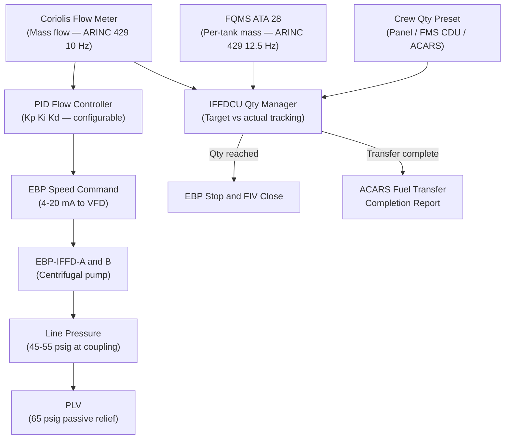
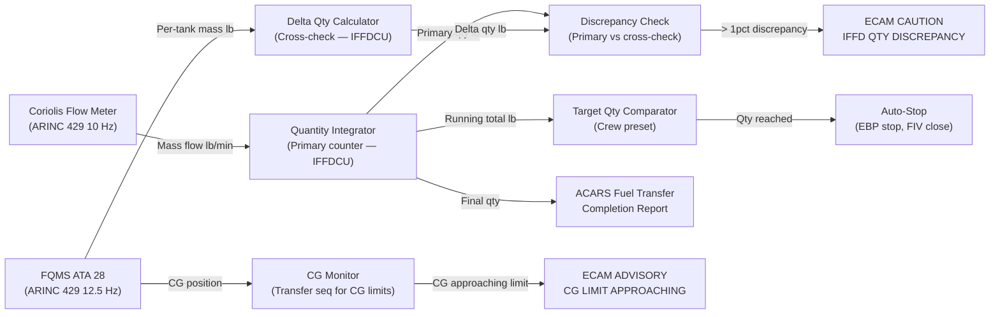
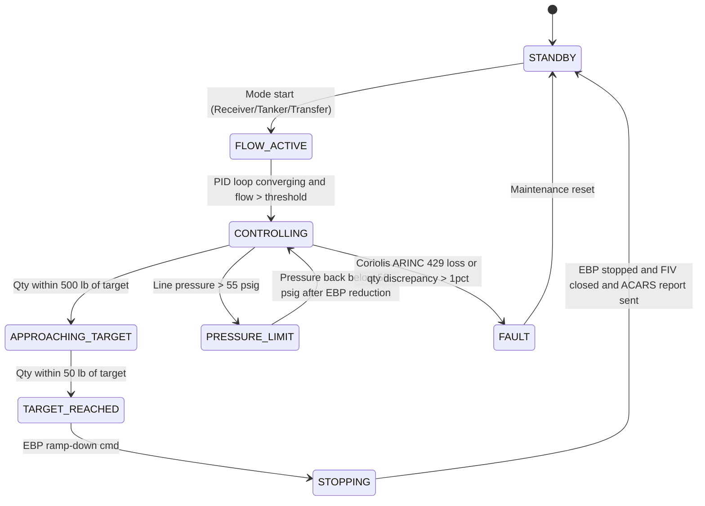

# ATLAS 040-049 · Section 04 · Subsection 048 · 040 — Fuel Quantity Flow and Pressure Control

## §0. Hyperlink Policy

All internal cross-references use relative Markdown links within the Q+ATLANTIDE CSDB repository. External regulatory citations in §19/§20 are marked  where hyperlinks are pending. Parent context: [ATLAS 048 README](./README.md). Related subsubject documents are linked in §20.

---

## §1. Purpose

This document specifies the **fuel quantity measurement, flow rate control, and pressure management** functions for the In-Flight Fuel Dispensing (IFFD) system on the programme-defined aircraft type per ATA 48. These functions ensure that: (a) the correct quantity of fuel is transferred to or from the aircraft within the crew-preset target; (b) flow rate is maintained at the commanded level within the system's pressure envelope; and (c) total quantity transferred is accurately counted and reported via ACARS for fleet fuel accounting.

The IFFDCU implements a PID flow control loop that compares the measured mass flow rate (Coriolis flow meter) with the target flow rate (derived from transfer schedule and EBP pressure set point) and adjusts EBP speed to minimise error. The Fuel Quantity Measurement System (FQMS — ATA 28) provides real-time per-tank mass data to the IFFDCU for target quantity tracking and CG monitoring during transfer.

---

## §2. Applicability

| Attribute | Value |
|-----------|-------|
| Aircraft Program | programme-defined aircraft type |
| ATA Chapter | ATA 48 — In-Flight Fuel Dispensing |
| Flow Meter Type | Coriolis (mass flow — no density compensation needed) |
| Flow Rate Control | PID loop in IFFDCU DO-178C DAL B |
| Pressure Range (coupling) | 45–55 psig at receiver probe |
| Quantity Accounting | ACARS uplink at transfer completion |
| FQMS Interface | ARINC 429 (per-tank mass and density) |
| S1000D SNS | 048-040 |

---

## §3. Functional Description

### §3.1 Fuel Quantity Measurement Interface

The IFFDCU receives per-tank fuel mass data from the FQMS (ATA 28) via ARINC 429 at 12.5 Hz update rate. The FQMS provides:
- Mass per tank (lb) — inner-left, inner-right, outer-left, outer-right, center
- Fuel density (lb/US gal) — for cross-validation with Coriolis volumetric data
- CG (centre of gravity) position — for transfer mode sequencing to maintain within CG envelope

The IFFDCU calculates the instantaneous total onboard fuel quantity and monitors transfer progress against the preset target quantity. When the cumulative transferred quantity (from Coriolis counter) reaches the preset target (within ± 50 lb), the IFFDCU commands EBP to stop and FIV to close.

### §3.2 Target Quantity Setting

The crew sets the target quantity via the IFFD Control Panel qty preset dial (graduations of 100 lb, range 0–50,000 lb). The target can also be uplinked via ACARS from the ground operations centre (as a pre-departure transfer schedule) or entered via the FMS CDU IFFD page. The IFFDCU accepts the lowest of: panel preset, FMS CDU input, or ACARS uplink as the effective transfer limit.

### §3.3 Flow Rate PID Control

The PID flow control loop operates as follows:
- **Setpoint**: Commanded flow rate (lb/min) — derived from transfer schedule or maximum rated flow if no schedule is set.
- **Process Variable**: Measured mass flow rate from Coriolis meter (ARINC 429, updated at 10 Hz).
- **Error**: Setpoint − Process Variable.
- **Output**: EBP speed command (4–20 mA to VFD) — clamped between minimum speed (prevent cavitation) and maximum speed (EBP rated).
- **PID Gains**: Kp, Ki, Kd stored in IFFDCU configuration data module; tuned for each EBP type at nominal fuel temperature (15 °C, Jet-A).

Anti-windup is implemented in the integral term to prevent integrator saturation during valve transitions. The IFFDCU also implements a feed-forward term based on target flow rate to improve transient response at mode start.

### §3.4 Pressure Control

In Receiver Mode, line pressure at the probe coupling is set by the tanker; the IFFDCU monitors pressure at the IFFD supply line (upstream of probe) and limits EBP back-pressure to 55 psig via EBP speed reduction if the upstream pressure exceeds threshold.

In Tanker Mode, the IFFDCU PID loop controls EBP speed to maintain 50 psig at the hose-reel inlet (nominal). The PLV provides passive overpressure relief at 65 psig.

### §3.5 ACARS Fuel Received Report

At completion of each transfer (STOP command or qty target reached), the IFFDCU generates a Fuel Transfer Completion Report containing:
- Quantity transferred (lb) — from Coriolis counter
- Transfer start and stop time (UTC)
- Mode (RECEIVER / TANKER / TRANSFER)
- Pre/post transfer tank quantities (from FQMS)
- EBP operating hours delta

This report is uplinked via ACARS to the ground fleet management system and optionally printed on the aircraft ACARS printer.

### Diagram 1: Flow Control Functional Chain

---

## §4. System Architecture

### §4.1 Control Loop Architecture

The IFFDCU PID loop executes at 20 Hz. At each cycle:
1. Read Coriolis flow rate (ARINC 429).
2. Read FQMS per-tank quantities (ARINC 429).
3. Calculate cumulative transferred quantity (running integral of Coriolis flow).
4. Calculate PID output → EBP speed command.
5. Check pressure limits (line pressure vs PLV set point) — reduce EBP speed if > 55 psig.
6. Check qty target — stop EBP and close FIV if target reached.
7. Transmit IFFD operational data to CMS/ECAM via AFDX.

The IFFDCU cross-checks Coriolis-derived total quantity against FQMS delta-quantity (difference in FQMS tank reading before/after transfer). A discrepancy > 1% triggers a crew CAUTION "IFFD QTY DISCREPANCY" and logs the event in the maintenance fault log.

### §4.2 Quantity Accounting

The IFFDCU maintains two independent quantity counters:
- **Primary counter**: Coriolis meter integral — high accuracy (± 0.3%), not dependent on FQMS.
- **Cross-check counter**: FQMS delta — lower accuracy (± 1%), used for discrepancy detection only.

The primary counter value is used for ACARS fuel transfer report and crew display. The cross-check counter is logged for maintenance review.

### Diagram 2: Quantity Control and Accounting Architecture

---

## §5. Components and Line-Replaceable Units

| LRU | Part Number | Qty | Location | Replacement Interval |
|-----|-------------|-----|----------|----------------------|
| Coriolis Flow Meter |  | 1 | IFFD main supply line | On-condition / 10,000 FH |
| Line Pressure Sensor (upstream FIV) |  | 1 | IFFD manifold upstream | On-condition / 5,000 FH |
| Line Pressure Sensor (downstream EBP) |  | 1 | IFFD manifold downstream | On-condition / 5,000 FH |
| IFFDCU PID Module (software partition) | N/A — software | 1 | IFFDCU Ch-A | As IFFDCU LSP update |
| ACARS Data Link Unit interface |  | 1 | Avionics bay (shared ATA 46) | On-condition |
| FQMS Interface Card (ARINC 429 RX) |  | 1 | IFFDCU chassis | On-condition |

---

## §6. Interfaces

| Interface | Peer System | Protocol / Bus | Data Exchanged |
|-----------|-------------|----------------|----------------|
| Per-tank fuel mass | ATA 28 FQMS | ARINC 429 (12.5 Hz) | Tank masses (lb), density, CG |
| Mass flow rate | Coriolis flow meter | ARINC 429 (10 Hz) | Flow rate (lb/min), cumulative qty (lb) |
| Target qty — FMS CDU | ATA 22 FMS | ARINC 429 | Transfer target quantity (lb) |
| Target qty — ACARS uplink | ATA 46 Information | ACARS / VHF | Pre-departure transfer schedule |
| EBP speed command | VFD-A/B | 4–20 mA analog | Speed setpoint |
| Pressure data | Line pressure sensors | 0–5 V analog | Upstream and downstream pressure |
| ACARS fuel report uplink | ATA 46 ACARS | ACARS / VHF | Fuel transfer completion report |
| ECAM qty display | ATA 31 Indicating | AFDX (ARINC 664 P7) | Flow rate, qty transferred, pressure |
| CMS fault logging | ATA 45 CMS | AFDX (ARINC 664 P7) | Qty discrepancy fault log |

---

## §7. Operations and Modes

| Mode | Flow Control Active | Pressure Target | Qty Counter | ACARS Report |
|------|--------------------|-----------------|-----------|--------------| 
| Standby | No | N/A | Reset | No |
| Receiver | PID active — min back-pressure | 45–55 psig | Counting inbound | At completion |
| Tanker | PID active — outbound flow | 50 psig at hose inlet | Counting outbound | At completion |
| Internal Transfer | PID active — internal routing | 30–45 psig (shorter path) | Counting transfer | No ACARS (internal) |
| Ground Bypass | Not active (IFFD isolated) | N/A | Not running | No |
| Fault | Off — EBP stopped | N/A | Frozen (for logging) | Partial report on fault |

### Diagram 3: Flow and Pressure Control State Machine

---

## §8. Performance and Budgets

| Parameter | Requirement | Target | Status |
|-----------|-------------|--------|--------|
| Coriolis mass flow accuracy | ± 0.5% of reading | ± 0.3% |  |
| Total quantity transfer accuracy (primary) | ± 0.5% of transfer qty | ± 0.3% |  |
| PID loop execution rate | ≥ 10 Hz | 20 Hz |  |
| FQMS data update rate | ≥ 10 Hz | 12.5 Hz |  |
| Flow rate setpoint step response (63%) | < 5 s | 3 s typical |  |
| Pressure regulation accuracy (tanker) | ± 2 psig at 50 psig setpoint | ± 1 psig |  |
| ACARS report transmission delay | < 30 s post-completion | 20 s |  |
| Qty discrepancy detection threshold | > 1% | 1% |  |
| Auto-stop deadband (qty target) | ± 50 lb | ± 50 lb |  |

---

## §9. Safety, Redundancy and Fault Tolerance

- **Dual quantity counters**: Primary (Coriolis) and cross-check (FQMS delta) provide independent qty tracking; > 1% discrepancy triggers CAUTION.
- **Auto-stop on target reached**: Automatic EBP stop and FIV close when transfer target is reached — prevents tank overfill or excess dispensing without crew action.
- **Pressure limiting — dual layer**: IFFDCU software limits EBP speed if pressure > 55 psig (soft limit); PLV passively opens at 65 psig (hard mechanical limit).
- **FQMS CG monitoring during transfer**: IFFDCU monitors CG impact of ongoing fuel transfer; generates ADVISORY if CG approaches limits, allowing crew to adjust routing via manifold valve selection.
- **Anti-windup PID**: Prevents integrator saturation during valve state transitions, avoiding flow rate overshoot that could cause pressure spikes.
- **Coriolis no-moving-parts design**: Vibrating tube type — immune to impeller fouling or bearing failure; provides reliable measurement in all fuel contamination conditions.
- **ACARS partial report on fault**: If IFFD enters FAULT state mid-transfer, a partial fuel report is transmitted via ACARS to prevent data loss for ground fuel accounting.

---

## §10. Maintenance and Diagnostics

| Task | Interval | Access | Tools Required |
|------|----------|--------|----------------|
| Coriolis flow meter calibration | 5,000 FH | IFFD supply line | Calibration flow standard |
| PID gain validation (IBIT) | C-check | Avionics bay / DLCS | IFFD IBIT + calibration run |
| Pressure sensor calibration | 5,000 FH | IFFD manifold | Pressure calibrator |
| FQMS ARINC 429 link check | A-check | Avionics bay | ARINC 429 analyser |
| Qty discrepancy log review | Per operator schedule | CMS ATA 45 | CMS maintenance terminal |
| ACARS interface test | B-check | Avionics bay | ACARS test message |
| PID gains update (via DLCS) | As required | Avionics bay | DLCS workstation |

---

## §11. Configuration and Software

- PID flow control module is part of IFFDCU DO-178C DAL B software; Part Number .
- PID gains (Kp, Ki, Kd) and flow rate setpoints are stored in IFFDCU configuration data module (loadable via DLCS).
- ACARS fuel report format defined per ARINC 620 (Airline Operational Communications) and airline-specific message schema.
- Coriolis meter calibration coefficients stored in IFFDCU configuration data module, updated via DLCS on meter replacement.
- Qty discrepancy threshold (default 1%) is configurable per operator preference in the IFFDCU configuration data module.

---

## §12. Environmental and Physical Constraints

| Constraint | Specification | Standard |
|-----------|--------------|---------|
| Coriolis meter fuel temperature | −40 °C to +80 °C | DO-160G Section 4 |
| Coriolis meter vibration | 10–2,000 Hz, 6 g | DO-160G Section 8 |
| Pressure sensor range | 0–100 psig, ± 0.25% FS | DO-160G Section 4 |
| ARINC 429 interface | Low-speed (12.5 kbps) | ARINC 429-17 |
| ACARS data link availability | > 95% in continental airspace | ARINC 620 |
| Fuel compatibility (Coriolis) | Jet-A, Jet A-1, JP-8, SAF | DO-160G Section 11 |

---

## §13. Human Factors and Crew Interface

- **IFFD Synoptic — Quantity Page**: Shows pre-transfer tank quantities (lb per tank), target quantity (lb), quantity transferred to date (lb), flow rate (lb/min), time to completion estimate (min), pressure at coupling (psig).
- **Qty preset confirmation**: After crew dials preset and presses START, ECAM displays "IFFD PRESET: XXXXX LB — CONFIRM?" with YES/NO soft keys — prevents inadvertent wrong quantity transfer.
- **ACARS FUEL RCV REPORT**: Automatically generated and transmitted; crew notified via ECAM ADVISORY "IFFD ACARS REPORT SENT" at transfer completion.
- **CAUTION "IFFD QTY DISCREPANCY"**: Amber ECAM CAUTION if Coriolis vs FQMS delta disagree by > 1%; crew action: verify FQMS sensors and transfer records, land and inspect if persistent.
- **ADVISORY "IFFD CG LIMIT"**: Blue ECAM ADVISORY if fuel CG approaches limits; crew action: modify tank selection sequence via IFFD panel manifold override.

---

## §14. Test and Validation

| Test | Method | Acceptance Criterion | Status |
|------|--------|---------------------|--------|
| Coriolis accuracy at rated flow | Calibration flow standard | ± 0.5% across 500–3,000 lb/min |  |
| PID step response | Hardware-in-loop simulation | 63% of setpoint within 5 s |  |
| Auto-stop at target qty | Ground functional test | Stop within ± 50 lb of target |  |
| Pressure regulation accuracy | Flow bench | ± 2 psig at 50 psig setpoint |  |
| Qty discrepancy detection | Fault injection test | CAUTION at 1% discrepancy |  |
| ACARS report format validation | ACARS loopback test | Report received and parsed |  |
| Anti-windup PID stability | HIL simulation | No overshoot > 5% of setpoint |  |

---

## §15. Regulatory Compliance

| Regulation | Requirement | Compliance Method | Status |
|-----------|-------------|------------------|--------|
| CS-25 §25.979 | Pressure fuelling — overpressure | PLV analysis + test |  |
| DO-178C DAL B | PID flow control software | SAS + MC/DC coverage |  |
| ARINC 429 | FQMS and Coriolis data links | ICD compliance |  |
| ARINC 620 | ACARS operational message | Message format review |  |

---

## §16. Certification Evidence

-  IFFDCU PID Software Accomplishment Summary (SAS) — DO-178C DAL B
-  Coriolis Flow Meter Calibration and Qualification Report
-  PLV Set Point and Qualification Report
-  ACARS Fuel Transfer Report Format ICD (ARINC 620 compliance)
-  IFFD System Integration Test Report (PID + Coriolis + FQMS)

---

## §17. Open Issues

| ID | Description | Owner | Target | Status |
|----|-------------|-------|--------|--------|
| IFFD-040-OI-001 | Validate PID gains for SAF blends (different density/viscosity vs Jet-A) | Q-GREENTECH |  |  |
| IFFD-040-OI-002 | Define ACARS fuel report schema for military tanker operations (vs civil airline operations) | Q-AIR / ORB-LEG |  |  |
| IFFD-040-OI-003 | Determine minimum EBP speed to prevent cavitation at FL350 (reduced fuel density) | Q-AIR |  |  |

---

## §18. Glossary

| Acronym / Term | Definition |
|---------------|-----------|
| PID | Proportional-Integral-Derivative — feedback control algorithm for flow rate regulation |
| FQMS | Fuel Quantity Measurement System — ATA 28 system measuring per-tank fuel mass |
| Coriolis | Mass flow meter type using Coriolis effect — measures mass flow directly, no density compensation |
| ACARS | Aircraft Communications Addressing and Reporting System — VHF/SATCOM data link |
| AHM | Aircraft Health Monitoring — ground-based fleet monitoring using ACARS data |
| Anti-Windup | PID technique preventing integrator over-accumulation during actuator saturation |
| Feed-Forward | Control term improving transient response by anticipating setpoint changes |
| PLV | Pressure Limiting Valve — passive mechanical overpressure relief at 65 psig |
| VFD | Variable Frequency Drive — electronic drive controlling EBP motor speed |
| HIL | Hardware-in-Loop — simulation technique using real hardware within simulation loop |

---

## §19. Citations

| Standard | Title | Issuer | Applicability |
|---------|-------|--------|--------------|
| CS-25 Amendment 28 §25.979 | Pressure fuelling system | EASA | Pressure control compliance |
| DO-178C | Software Considerations in Airborne Systems | RTCA | PID control software DAL B |
| ARINC 429-17 | Digital Information Transfer System | ARINC | FQMS and Coriolis data links |
| ARINC 620 | Data Link Ground System Standard | ARINC | ACARS fuel transfer report |
| S1000D Issue 5.0 | International Specification for Technical Publications | ASD/AIA/ATA | CSDB documentation |

---

## §20. References

| Document | Path | Relation |
|---------|------|---------|
| ATLAS 048-000 | [./048-000-In-Flight-Fuel-Dispensing-General.md](./048-000-In-Flight-Fuel-Dispensing-General.md) | IFFD system overview |
| ATLAS 048-030 | [./048-030-Fuel-Transfer-Pumps-Valves-and-Manifolds.md](./048-030-Fuel-Transfer-Pumps-Valves-and-Manifolds.md) | Pumps and valves detail |
| ATLAS 048-060 | [./048-060-In-Flight-Fuel-Dispensing-Control-and-Indication.md](./048-060-In-Flight-Fuel-Dispensing-Control-and-Indication.md) | Panel and ECAM display |
| ATLAS 048-080 | [./048-080-IFFD-Monitoring-Diagnostics-and-Control-Interfaces.md](./048-080-IFFD-Monitoring-Diagnostics-and-Control-Interfaces.md) | QAR and ACARS AHM |
| ATLAS 048 README | [./README.md](./README.md) | Subsection index |
| Q+ATLANTIDE Baseline | [../../../../organization/Q+ATLANTIDE.md](../../../../organization/Q+ATLANTIDE.md) | Governance |

---

## §21. Footprint

| Metric | Value |
|--------|-------|
| Architecture | `ATLAS` — Aircraft Top Level Architecture Schema/System |
| Master range | `000–099` |
| Code range | `040-049` |
| Section | `04` — Aviónica, Información & APU |
| Subsection | `048` — In-Flight Fuel Dispensing |
| Subsubject | `040` — Fuel Quantity Flow and Pressure Control |
| Primary Q-Division | Q-AIR |
| Support Q-Divisions | Q-MECHANICS, Q-DATAGOV, Q-GREENTECH, Q-GROUND |
| ORB support | ORB-PMO, ORB-LEG |
| Governance class | `baseline` |
| Document ID | `QATL-ATLAS-1000-ATLAS-040-049-04-048-040-FUEL-QUANTITY-FLOW-AND-PRESSURE-CONTROL` |
| Version | 1.0.0 |
| Status | active |
| Created | 2026-05-10 |
| Updated | 2026-05-10 |

---

## §22. Change Log

| Version | Date | Author | Change Description |
|---------|------|--------|--------------------|
| 1.0.0 | 2026-05-10 | Q-AIR / ATLAS Working Group | Initial baseline release — IFFD fuel quantity, flow and pressure control for programme-defined aircraft type |
