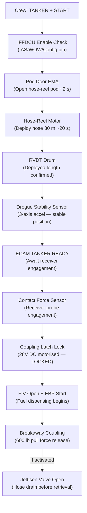
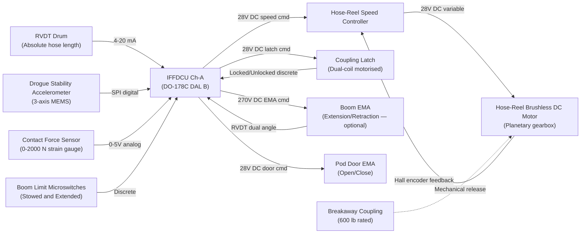
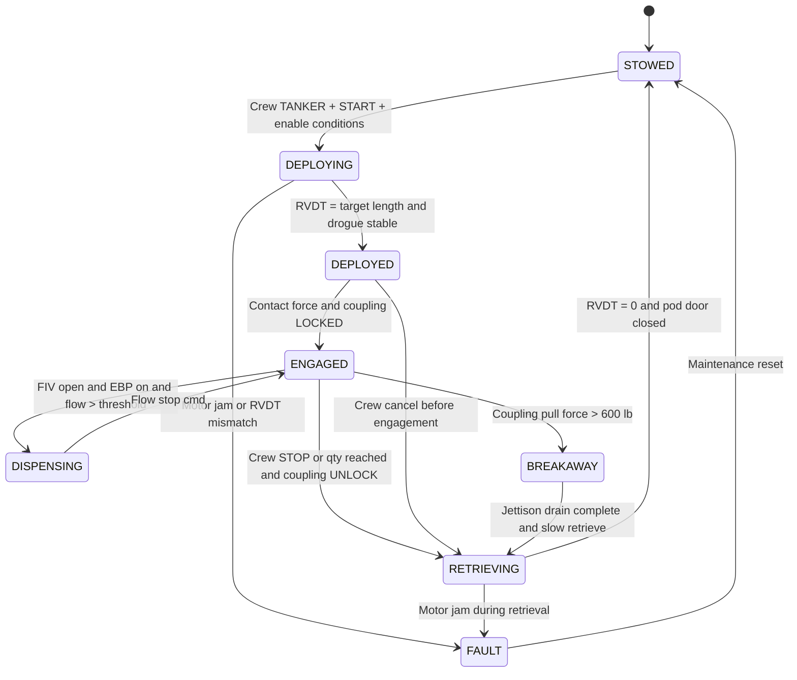

# ATLAS 040-049 · Section 04 · Subsection 048 · 050 — Dispensing Hose-Boom and Coupling Interfaces

## §0. Hyperlink Policy

All internal cross-references use relative Markdown links within the Q+ATLANTIDE CSDB repository. External regulatory citations in §19/§20 are marked  where hyperlinks are pending. Parent context: [ATLAS 048 README](./README.md). Related subsubject documents are linked in §20.

---

## §1. Purpose

This document specifies the **dispensing hose-reel assembly, drogue deployment, boom, and coupling interfaces** for the programme-defined aircraft type when configured in **Tanker Mode** (optional fit). In Tanker Mode, the aircraft dispensing system provides fuel to a receiver aircraft via a flexible fuel hose and NATO-standard drogue basket. All actuation is electric — no hydraulic actuation is used for hose-reel drive, drogue deployment, or coupling lock/unlock mechanisms.

Key safety features include a breakaway coupling rated at 600 lb pull force, hose stow integrity sensors, boom limit microswitches, and a contact force sensor at the drogue assembly. The IFFDCU governs all hose/boom sequencing, drogue position monitoring, and coupling state management. The tanker configuration is an optional aircraft fit, enabled via the tanker configuration pin (see ATA 048-010).

---

## §2. Applicability

| Attribute | Value |
|-----------|-------|
| Aircraft Program | programme-defined aircraft type |
| ATA Chapter | ATA 48 — In-Flight Fuel Dispensing |
| Configuration | Tanker Mode (optional fit — configuration pin required) |
| Hose Type | Flexible fuel hose with drogue basket (NATO standard) |
| Hose-Reel Drive | Electric motor (28 V DC) |
| Drogue Deployment | Electric actuator (deploy/retract) |
| Breakaway Coupling | Rated at 600 lb pull force |
| Hose Stow Monitoring | RVDT sensor on hose-reel drum |
| Boom Limit Switches | Mechanical microswitches at travel limits |
| MIL-STD-1760 Interface | Required for tanker/receiver electrical compatibility |
| S1000D SNS | 048-050 |

---

## §3. Functional Description

The hose-reel assembly is installed in an under-fuselage fairing pod (or optionally in a wing pod for dual-hose tanker configuration). The pod is aerodynamically faired and includes a hinged access door opened by a dedicated Door EMA prior to hose-reel deployment.

**Hose-Reel Assembly**: An electric motor (28 V DC) drives the hose-reel drum via a planetary gearbox. The hose is a flexible braided fuel hose qualified for fuel pressures up to 100 psig. Hose deployment is controlled by IFFDCU commands (deploy / retrieve / hold), with hose speed governed by a speed controller to prevent hose whip. The hose-reel RVDT sensor reports drum angular position, from which deployed hose length is calculated (calibrated to drum circumference and hose diameter).

**Drogue Deployment**: A drogue basket assembly is attached to the end of the hose. The drogue is maintained in a stable trailing position by aerodynamic drag. A drogue position sensor (accelerometer-based, 3-axis) reports drogue stability and deviation from nominal position (excessive oscillation triggers a crew CAUTION). The drogue assembly includes a breakaway coupling rated to release at 600 lb axial pull force, protecting both the tanker hose and receiver probe from structural overload.

**Boom Extension (optional)**: For rigid boom dispensing (if configured), an electric boom extension actuator (270 V DC EMA) extends the boom from the aft fuselage. Boom extension/retraction is governed by boom limit microswitches at both travel limits (stowed and fully extended positions). The boom angle is reported by a dual RVDT assembly.

**Coupling Lock/Unlock**: Once a receiver probe engages the drogue, the coupling latch mechanism electrically locks the probe (28 V DC motorised latch). A contact force sensor at the drogue assembly confirms engagement. The IFFDCU commands the fuel path open (FIV open, EBP start) only after COUPLING LOCKED discrete is confirmed.

**Breakaway Coupling**: A mechanical breakaway coupling is installed between the hose and drogue assembly. It releases at a rated pull force of 600 lb ± 50 lb when the receiver aircraft manoeuvres beyond normal separation. On breakaway release, the jettison valve is commanded open to drain residual fuel from the hose before hose retrieval.

### §3.1 Hose-Reel Deployment Sequence

| Step | Event | Duration |
|------|-------|---------|
| 1 | Crew selects TANKER mode + START | — |
| 2 | IFFDCU checks enable conditions (WOW=0, IAS < 300 kt, config pin) | < 200 ms |
| 3 | Pod door EMA opens hose-reel pod door | ~ 2 s |
| 4 | Hose-reel motor deploys hose to preset length (default: 30 m) | ~ 20 s |
| 5 | RVDT confirms deployed length; DROGUE DEPLOYED status set | — |
| 6 | Drogue stability sensor confirms stable position | ~ 5 s settling |
| 7 | ECAM displays TANKER READY — await receiver engagement | — |
| 8 | Contact force sensor detects receiver probe engagement | Pilot-dependent |
| 9 | Coupling latch locks; COUPLING LOCKED discrete to IFFDCU | < 500 ms |
| 10 | FIV opens; EBP starts; fuel dispensing begins | < 1 s after LOCKED |

### Diagram 1: Tanker Hose-Reel Functional Flow

---

## §4. System Architecture

### §4.1 Hose-Reel Drive Architecture

The hose-reel motor is a brushless DC motor (28 V DC) with a 3-stage planetary gearbox providing the torque required to deploy and retrieve the hose against aerodynamic drag loads. Motor speed is governed by a dedicated speed controller (part of the IFFDCU actuator drive card), with speed feedback from a Hall-effect encoder on the motor shaft. The RVDT on the drum provides absolute hose length position; the encoder provides incremental speed feedback for the speed controller.

Hose deploy/retrieve speed is limited to 1.5 m/s maximum to prevent hose whip during deployment. During retrieval after a breakaway event, retrieve speed is reduced to 0.5 m/s (slow mode) to prevent hose slack oscillation.

### §4.2 Coupling Lock Architecture

The coupling latch mechanism uses a 28 V DC motorised actuator (12 mm stroke) with dual-coil design (primary and secondary). Primary coil is used for normal lock/unlock cycles. Secondary coil provides backup unlock command (emergency disconnect path). Contact force is measured by a strain-gauge force sensor (0–2,000 N range) bonded to the coupling body.

### Diagram 2: Hose-Reel and Coupling Interface Architecture

---

## §5. Components and Line-Replaceable Units

| LRU | Part Number | Qty | Location | Replacement Interval |
|-----|-------------|-----|----------|----------------------|
| Hose-Reel Assembly (complete) |  | 1 | Under-fuselage pod / wing pod | On-condition / 3,000 deployments |
| Hose-Reel Brushless DC Motor |  | 1 | Hose-reel pod | On-condition / 5,000 FH |
| Hose-Reel Speed Controller |  | 1 | Hose-reel pod (EE section) | On-condition / 10,000 FH |
| Fuel Dispensing Hose (30 m) |  | 1 | Hose-reel drum | On-condition / 2,000 deployments or C-check |
| Drogue Basket Assembly |  | 1 | Hose end | On-condition / 1,000 deployments |
| Drogue Stability Accelerometer |  | 1 | Drogue assembly | On-condition / 10,000 FH |
| Coupling Latch Mechanism (dual-coil) |  | 1 | Drogue coupling | On-condition / 5,000 lock cycles |
| Contact Force Sensor |  | 1 | Coupling body | On-condition / 5,000 engagements |
| Breakaway Coupling |  | 1 | Hose-drogue junction | Replace after each activation |
| RVDT (hose-reel drum) |  | 1 | Hose-reel drum shaft | On-condition / 10,000 FH |
| Boom Assembly (optional rigid boom) |  | 1 | Aft fuselage | On-condition / 2,000 cycles |
| Boom EMA |  | 1 | Boom housing | On-condition / 5,000 FH |
| Boom Limit Microswitches |  | 2 | Boom travel limits | On-condition / B-check |
| Pod Door EMA |  | 1 | Hose-reel pod | On-condition / 3,000 cycles |

---

## §6. Interfaces

| Interface | Peer System | Protocol / Bus | Data Exchanged |
|-----------|-------------|----------------|----------------|
| Hose-reel motor speed command | IFFDCU Ch-A → speed controller | 0–5 V analog | Deploy/retrieve speed setpoint |
| RVDT drum position | IFFDCU Ch-A | 4–20 mA analog | Deployed hose length (m) |
| Drogue stability data | IFFDCU Ch-A | SPI digital | 3-axis acceleration (g) |
| Contact force sensor | IFFDCU Ch-A | 0–5 V analog | Probe engagement force (N) |
| Coupling latch command | IFFDCU Ch-A | 28 V DC discrete | Lock / Unlock command |
| Coupling locked status | IFFDCU Ch-A | 28 V DC discrete | LOCKED / UNLOCKED |
| Boom EMA command | IFFDCU Ch-A | 270 V DC PWM | Extend / Retract |
| Boom RVDT angle | IFFDCU Ch-A | 4–20 mA analog | Boom angle (°) |
| Boom limit switches | IFFDCU Ch-A | 28 V DC discrete | Stowed / Extended limit hit |
| 28 V DC power (reel, latch, door) | ATA 24 Electrical | 28 V DC bus | Hose-reel, latch, pod door power |
| 270 V DC power (boom EMA) | ATA 24 Electrical | 270 V DC bus | Boom extension motor power |
| MIL-STD-1760 signal interface | Receiver aircraft (external) | MIL-STD-1760 | Electrical compatibility signals |

---

## §7. Operations and Modes

| Mode | Hose-Reel State | Drogue State | Coupling | Boom | ECAM |
|------|----------------|-------------|---------|------|------|
| Stowed (normal flight) | Retracted, drum locked | Stowed in pod | Unlocked | Stowed | Normal |
| Deploying | Deploying (speed-controlled) | Emerging from pod | Unlocked | As applicable | IFFD DEPLOYING |
| Deployed / Awaiting | Deployed (30 m nominal) | Trailing, stable | Unlocked | Extended | TANKER READY |
| Engaged (receiver locked) | Deployed, holding | Locked to receiver | LOCKED | Holding | TANKER ACTIVE |
| Dispensing fuel | Deployed, holding | Locked to receiver | LOCKED | Holding | TANKER FLOW |
| Retrieving | Retrieving (speed-controlled) | Retracting | Unlocked | Retracting | IFFD RETRIEVING |
| Breakaway | Reel in slow mode | Free / detached | Released | As applicable | TANKER BREAKAWAY |
| Fault | Reel stopped | Held/stowed | Fault | Stopped | TANKER FAULT |

### Diagram 3: Hose-Reel and Coupling State Machine

---

## §8. Performance and Budgets

| Parameter | Requirement | Target | Status |
|-----------|-------------|--------|--------|
| Hose deployment time (0 to 30 m) | < 25 s | 20 s |  |
| Hose retrieval time (30 m to 0) | < 30 s | 25 s |  |
| Breakaway coupling release force | 600 ± 50 lb | 600 lb |  |
| Drogue stability (max oscillation) | < ± 15° from nominal | ± 10° |  |
| Hose qualified pressure | ≥ 100 psig working | 100 psig |  |
| Coupling latch lock / unlock time | < 1 s | 0.8 s |  |
| Boom extension time (0 to full) | < 15 s | 12 s |  |
| RVDT hose length accuracy | ± 0.3 m at 30 m | ± 0.2 m |  |
| Hose life (deployments) | ≥ 2,000 deployments | 2,000 |  |

---

## §9. Safety, Redundancy and Fault Tolerance

- **Breakaway coupling passive safety**: Mechanically releases at 600 lb pull force without requiring any electrical command — protects tanker and receiver structure independent of IFFDCU state.
- **Boom limit microswitches**: Hardware travel limits prevent boom over-extension or retraction beyond physical stops; both limits are wired directly to IFFDCU and independently to EBP emergency stop relay.
- **Hose whip prevention**: Hose deploy/retrieve speed limited to 1.5 m/s; reduced to 0.5 m/s in slow mode post-breakaway to prevent hose oscillation hazard.
- **Drogue stability monitoring**: 3-axis accelerometer provides continuous drogue oscillation monitoring; crew CAUTION generated if oscillation exceeds ± 15° from nominal.
- **Coupling dual-coil latch**: Primary and secondary coils provide independent lock/unlock actuation — secondary coil is the emergency disconnect path (see ATA 048-070).
- **Fail-stowed pod door**: Pod door EMA is spring-return-closed; loss of power closes pod door, protecting hose-reel from environmental exposure and aerodynamic loads.
- **MIL-STD-1760 interface compatibility**: Tanker/receiver electrical signal compatibility per MIL-STD-1760 for operation with military receiver aircraft.

---

## §10. Maintenance and Diagnostics

| Task | Interval | Access | Tools Required |
|------|----------|--------|----------------|
| Hose inspection (visual + pressure test) | 500 deployments | Pod access | Pressure test bench |
| Drogue basket inspection | 500 deployments | Pod access (external) | Visual + NDT for cracks |
| Breakaway coupling replacement | After each activation | Pod access | Standard LRU toolkit |
| Coupling latch functional test | B-check | Pod access | IFFDCU IBIT |
| RVDT drum calibration | 3,000 deployments | Hose-reel motor bay | RVDT calibrator tool |
| Boom limit microswitch test | A-check | Aft fuselage | IFFDCU IBIT |
| Boom EMA actuator inspection | 2,000 cycles | Aft fuselage | Borescope + torque check |
| Pod door EMA timing check | B-check | Pod door area | Timer + IFFDCU IBIT |
| Hose replacement | 2,000 deployments | Pod drum access | Hose reel tooling kit |
| Drogue stability accelerometer calibration | 5,000 FH | Drogue assembly | Calibration jig |

---

## §11. Configuration and Software

- Hose-reel speed controller firmware is qualified to DO-178C DAL C; Part Number .
- Hose deploy length (default 30 m) is configurable via IFFDCU configuration data module (range: 10–40 m).
- Breakaway force calibration certificate for each coupling must be retained in aircraft technical log.
- Boom configuration (rigid boom vs hose-reel) is set via aircraft configuration data module; not changeable in flight.
- MIL-STD-1760 signal compatibility matrix maintained in IFFD system Interface Control Document (ICD).

---

## §12. Environmental and Physical Constraints

| Constraint | Specification | Standard |
|-----------|--------------|---------|
| Hose-reel pod temperature | −55 °C to +70 °C (pod environment) | DO-160G Section 4 |
| Hose operating temperature | −40 °C to +80 °C | DO-160G Section 11 |
| Hose pressure rating | 100 psig working, 200 psig proof | CS-25 §25.979 |
| Hose fuel compatibility | Jet-A, Jet A-1, JP-8, SAF blends | DO-160G Section 11 |
| Drogue drag force at 300 KTAS | < 200 N (nominal) | Aerodynamic analysis |
| Pod door structural loads | CS-25 §25.305 limit loads at Vd | CS-25 Amendment 28 |
| MIL-STD-1760 interface | Signal levels and connector type | MIL-STD-1760C |
| IAS limit (hose deployed) | 300 KIAS maximum | IFFDCU mode enable logic |

---

## §13. Human Factors and Crew Interface

- **ECAM Tanker Synoptic**: Hose deployed length (m), drogue position (STOWED / DEPLOYED / UNSTABLE), coupling status (LOCKED / UNLOCKED), breakaway status, contact force (N), boom position (if applicable).
- **CAUTION "DROGUE UNSTABLE"**: Amber ECAM CAUTION if drogue oscillation > ± 15°; crew action — reduce IAS or abort refuelling.
- **WARNING "TANKER BREAKAWAY"**: Red ECAM WARNING on breakaway coupling activation; crew action — retrieve hose (slow mode automatic), ACARS breakaway event report.
- **ADVISORY "HOSE LIFE LIMIT"**: Blue ECAM ADVISORY at 1,900 deployments (100 before limit); crew action — plan hose replacement at next maintenance.
- **MIL-STD-1760 COMPATIBLE**: ECAM display confirms MIL-STD-1760 signal compatibility on receiver probe engagement.

---

## §14. Test and Validation

| Test | Method | Acceptance Criterion | Status |
|------|--------|---------------------|--------|
| Hose deployment timing | Ground functional test | < 25 s for 30 m |  |
| Breakaway coupling release force | Calibration fixture test | 600 ± 50 lb |  |
| Coupling latch lock/unlock | Ground functional test | < 1 s lock, < 1 s unlock |  |
| Drogue stability (wind tunnel) | Wind tunnel test | < ± 15° oscillation at 300 KTAS |  |
| Hose pressure qualification | Pressure bench | 200 psig proof, no leak |  |
| Boom limit microswitch function | Ground test | EMA stops at both limits |  |
| Hose life endurance test | Qualification test rig | ≥ 2,000 deployments no failure |  |
| Tanker mode flight test | Flight test campaign | Receiver engagement at 270 KIAS |  |

---

## §15. Regulatory Compliance

| Regulation | Requirement | Compliance Method | Status |
|-----------|-------------|------------------|--------|
| CS-25 §25.979 | Hose pressure rating | Pressure qualification test |  |
| CS-25 §25.305 | Pod door structural loads | FEM structural analysis |  |
| MIL-STD-1760C | Tanker/receiver signal interface | Interface compliance matrix |  |
| DO-160G | Hardware qualification | Environmental test report |  |
| DO-178C DAL C | Hose-reel speed controller firmware | Software qualification |  |
| SFAR 88 | Fuel hose and jettison path | Fuel system safety analysis |  |

---

## §16. Certification Evidence

-  Fuel Dispensing Hose Qualification Report (pressure, fuel compatibility, cycling)
-  Drogue Basket Wind Tunnel Test Report (stability characterisation)
-  Breakaway Coupling Qualification Report (600 lb release force calibration)
-  Pod Door Structural Analysis Report (CS-25 §25.305)
-  MIL-STD-1760C Interface Compliance Matrix
-  Tanker Mode Aerial Refuelling Flight Test Report

---

## §17. Open Issues

| ID | Description | Owner | Target | Status |
|----|-------------|-------|--------|--------|
| IFFD-050-OI-001 | Define hose length requirement (30 m vs 20 m vs 40 m) for target receiver aircraft types | Q-AIR / ORB-LEG |  |  |
| IFFD-050-OI-002 | Assess aerodynamic interference between hose-reel pod and wing trailing edge at 300 KIAS | Q-AIR / Q-MECHANICS |  |  |
| IFFD-050-OI-003 | Confirm MIL-STD-1760C revision level applicable to intended receiver aircraft types | Q-AIR / ORB-LEG |  |  |

---

## §18. Glossary

| Acronym / Term | Definition |
|---------------|-----------|
| Drogue | Basket-shaped aerodynamic stabiliser at hose end; receives receiver aircraft probe for coupling |
| Hose-Reel | Electric motor-driven drum assembly storing and deploying the flexible fuel dispensing hose |
| Breakaway Coupling | Passive mechanical coupler releasing at rated pull force (600 lb) to protect tanker/receiver |
| RVDT | Rotary Variable Differential Transducer — absolute position sensor on hose-reel drum shaft |
| Boom | Rigid fuel dispensing extension (optional) for precision receiver coupling without drogue |
| Limit Switch | Mechanical microswitch at boom/hose travel limits; stops actuator to prevent over-travel |
| MIL-STD-1760 | US DoD standard for aircraft/store electrical interconnection — tanker/receiver compatibility |
| Planetary Gearbox | Multi-stage gear reduction providing high torque for hose-reel drum at low motor speed |
| Contact Force Sensor | Strain-gauge sensor measuring probe-to-drogue engagement force (0–2,000 N) |
| Drogue Stability | Angular deviation of drogue basket from nominal trailing position — monitored by accelerometer |

---

## §19. Citations

| Standard | Title | Issuer | Applicability |
|---------|-------|--------|--------------|
| CS-25 Amendment 28 §25.979 | Pressure fuelling system | EASA | Hose and coupling pressure rating |
| CS-25 Amendment 28 §25.305 | Strength and deformation | EASA | Pod door structural loads |
| MIL-STD-1760C | Aircraft/Store Electrical Interconnection | US DoD | Tanker/receiver signal compatibility |
| DO-160G | Environmental Conditions and Test Procedures | RTCA | Hose-reel, drogue hardware qualification |
| DO-178C | Software Considerations in Airborne Systems | RTCA | Hose-reel speed controller DAL C |
| SFAR 88 | Fuel Tank Safety | FAA | Hose and jettison path safety |
| S1000D Issue 5.0 | International Specification for Technical Publications | ASD/AIA/ATA | CSDB documentation |

---

## §20. References

| Document | Path | Relation |
|---------|------|---------|
| ATLAS 048-000 | [./048-000-In-Flight-Fuel-Dispensing-General.md](./048-000-In-Flight-Fuel-Dispensing-General.md) | IFFD system overview |
| ATLAS 048-010 | [./048-010-Fuel-Dispensing-Architecture-and-Modes.md](./048-010-Fuel-Dispensing-Architecture-and-Modes.md) | Tanker mode architecture |
| ATLAS 048-030 | [./048-030-Fuel-Transfer-Pumps-Valves-and-Manifolds.md](./048-030-Fuel-Transfer-Pumps-Valves-and-Manifolds.md) | Fuel path interface |
| ATLAS 048-070 | [./048-070-Safety-Interlocks-Emergency-Disconnect-and-Jettison.md](./048-070-Safety-Interlocks-Emergency-Disconnect-and-Jettison.md) | Emergency disconnect |
| ATLAS 048 README | [./README.md](./README.md) | Subsection index |
| Q+ATLANTIDE Baseline | [../../../../organization/Q+ATLANTIDE.md](../../../../organization/Q+ATLANTIDE.md) | Governance |

---

## §21. Footprint

| Metric | Value |
|--------|-------|
| Architecture | `ATLAS` — Aircraft Top Level Architecture Schema/System |
| Master range | `000–099` |
| Code range | `040-049` |
| Section | `04` — Aviónica, Información & APU |
| Subsection | `048` — In-Flight Fuel Dispensing |
| Subsubject | `050` — Dispensing Hose-Boom and Coupling Interfaces |
| Primary Q-Division | Q-AIR |
| Support Q-Divisions | Q-MECHANICS, Q-DATAGOV, Q-GREENTECH, Q-GROUND |
| ORB support | ORB-PMO, ORB-LEG |
| Governance class | `baseline` |
| Document ID | `QATL-ATLAS-1000-ATLAS-040-049-04-048-050-DISPENSING-HOSE-BOOM-AND-COUPLING-INTERFACES` |
| Version | 1.0.0 |
| Status | active |
| Created | 2026-05-10 |
| Updated | 2026-05-10 |

---

## §22. Change Log

| Version | Date | Author | Change Description |
|---------|------|--------|--------------------|
| 1.0.0 | 2026-05-10 | Q-AIR / ATLAS Working Group | Initial baseline release — IFFD hose-boom and coupling interfaces for programme-defined aircraft type |
