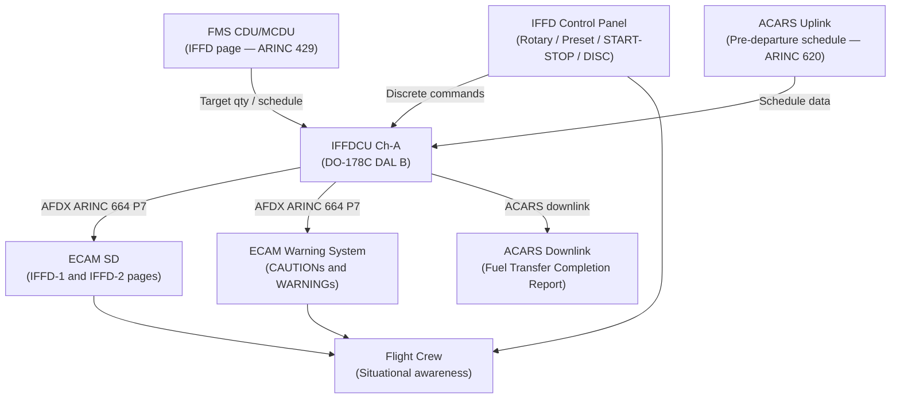
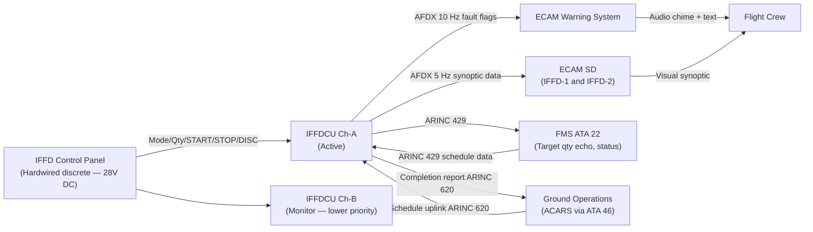
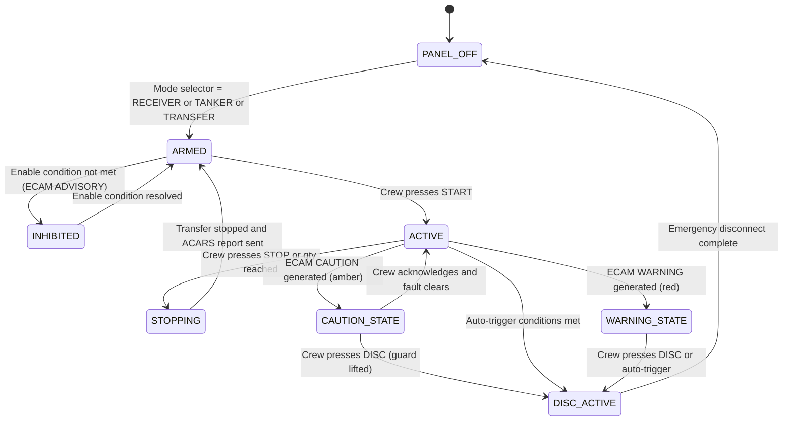

# ATLAS 040-049 · Section 04 · Subsection 048 · 060 — In-Flight Fuel Dispensing Control and Indication

## §0. Hyperlink Policy

All internal cross-references use relative Markdown links within the Q+ATLANTIDE CSDB repository. External regulatory citations in §19/§20 are marked  where hyperlinks are pending. Parent context: [ATLAS 048 README](./README.md). Related subsubject documents are linked in §20.

---

## §1. Purpose

This document specifies the **control panel, ECAM synoptic pages, crew alerting, FMS/MCDU data entry interfaces, and ACARS uplink** for the In-Flight Fuel Dispensing (IFFD) system on the programme-defined aircraft type per ATA 48. These interfaces form the crew-to-IFFD interaction layer, providing all means for mode selection, quantity presetting, flow monitoring, and fault awareness.

The IFFD Control Panel is a dedicated hardware panel located below the center console, providing direct crew control independent of touchscreen or MFD interfaces. ECAM IFFD synoptic pages provide situational awareness. FMS CDU/MCDU data entry supports pre-planned transfer scheduling. ARINC 429 data from the FMS provides fuel target data uplinked before flight or via ACARS in flight.

---

## §2. Applicability

| Attribute | Value |
|-----------|-------|
| Aircraft Program | programme-defined aircraft type |
| ATA Chapter | ATA 48 — In-Flight Fuel Dispensing |
| Control Panel Location | Below center console (dedicated IFFD panel) |
| ECAM Synoptic | IFFD page — selectable from ECAM SD (System Display) |
| FMS Interface | ARINC 429 — fuel target data, transfer schedule |
| CDU/MCDU Page | IFFD page on FMS CDU |
| ACARS Uplink | Pre-departure transfer schedule and post-transfer report |
| S1000D SNS | 048-060 |

---

## §3. Functional Description

### §3.1 IFFD Control Panel

The dedicated IFFD Control Panel provides direct hardware controls for IFFD operation, independent of software display systems. The panel is backlit and designed for gloved-hand operation in military configurations. Controls include:

- **Mode Selector Rotary Switch**: 5-position (OFF / RECEIVER / TANKER / TRANSFER / GND BYPASS). Spring-loaded detent at each position. Tactile feedback via raised detent profile.
- **Quantity Preset Dial**: Rotary graduated in 100 lb increments from 0 to 50,000 lb. Dual concentric — outer ring for ×10,000 lb, inner ring for ×1,000 lb, centre pushbutton for ×100 lb fine adjust. LCD quantity readout on panel face.
- **START Pushbutton**: Green illuminated (push to start, illuminates green when mode active).
- **STOP Pushbutton**: Red illuminated (push to stop, illuminates red in fault state).
- **DISC (Disconnect) Pushbutton**: Red, guard-covered. Triggers emergency electric disconnect. Hold for 3 s to confirm (prevents inadvertent actuation). Guard cover must be lifted first.
- **MANUAL OVERRIDE Toggle**: Guard-covered toggle — allows manual open/close of FIV and EBP start/stop if IFFDCU is in fault state (for controlled shutdown).
- **Panel Brightness Rheostat**: Adjustable panel backlight (NVG-compatible mode available via secondary function).

### §3.2 ECAM IFFD Synoptic Pages

Two ECAM IFFD synoptic pages are provided, accessible via the ECAM SD (System Display) page cycle:

**Page IFFD-1 (Flow and Coupling)**:
- Schematic diagram showing probe/hose position, coupling status, FIV state, EBP state.
- Flow rate (lb/min) — numeric with trend arrow.
- Total quantity transferred (lb) — numeric with target quantity and progress bar.
- Coupling status: LOCKED (green) / UNLOCKED (white) / FAULT (amber).
- EBP-A and EBP-B status: ON (green) / OFF (white) / FAULT (amber).
- FIV status: OPEN (green) / CLOSED (white) / FAULT (amber).
- Line pressure at coupling (psig).

**Page IFFD-2 (Tank Quantities and CG)**:
- Per-tank fuel quantity (lb per tank) — bar chart format, colour-coded by tank type.
- CG position indicator — needle on CG envelope diagram.
- Pre-transfer and current quantities side-by-side.
- Estimated time to complete (min).
- ACARS report status: PENDING / SENT / FAILED.

### §3.3 FMS CDU/MCDU IFFD Page

The FMS CDU (ATA 22) provides an IFFD data entry page for pre-planned operations:
- **Receiver callsign** (alpha 6 characters) — tanker scheduling identification.
- **Target quantity** (lb) — overrides panel dial if FMS input is active.
- **Transfer start time** (UTC) — for pre-scheduled transfers.
- **Max flow rate** (lb/min) — operator-configurable limit.
- **Receiving tank selection** — specify which tanks to fill (auto or manual selection).

FMS IFFD data is transmitted to the IFFDCU via ARINC 429. The IFFDCU accepts FMS data when the panel mode selector is in a valid mode position.

### §3.4 ACARS Interface

Pre-departure transfer schedule is received from ground operations via ACARS VHF/SATCOM link (ARINC 620 format). The schedule includes receiver callsign, target quantity, time window, and max flow rate. On receipt, the IFFDCU compares ACARS schedule with FMS CDU entry; discrepancies generate an ECAM ADVISORY.

At transfer completion, the Fuel Transfer Completion Report is uplinked via ACARS (see ATA 048-040 §3.5).

### Diagram 1: Control and Indication Architecture

---

## §4. System Architecture

The IFFD Control Panel interfaces with IFFDCU Channel A via discrete wiring (28 V DC logic levels). All panel switch positions are hardwired — not via digital bus — ensuring that loss of AFDX or other data network does not prevent crew control of the IFFD system. The panel discrete signals are also fed to Channel B (lower-priority monitoring bus) for cross-comparison.

The ECAM IFFD synoptic data originates from IFFDCU Channel A (active) via AFDX. ECAM page data is refreshed at 5 Hz. The ECAM warning system receives IFFD fault flags from IFFDCU via a dedicated AFDX message (10 Hz) with three severity levels: ADVISORY (blue), CAUTION (amber), WARNING (red).

### Diagram 2: Panel and ECAM Interface Data Flow

---

## §5. Components and Line-Replaceable Units

| LRU | Part Number | Qty | Location | Replacement Interval |
|-----|-------------|-----|----------|----------------------|
| IFFD Control Panel |  | 1 | Center console — below thrust levers | On-condition |
| IFFD Panel LCD Display |  | 1 | IFFD panel face | On-condition / 10,000 FH |
| ECAM SD Display Unit (shared ATA 31) |  | 2 | Center instrument panel | On-condition (ATA 31 managed) |
| AFDX Network Interface Card (IFFDCU) |  | 2 | IFFDCU chassis | On-condition |
| FMS CDU (shared ATA 22) |  | 2 | Pedestal (ATA 22 managed) | On-condition (ATA 22 managed) |
| ACARS Data Link Unit (shared ATA 46) |  | 1 | Avionics bay (ATA 46 managed) | On-condition (ATA 46 managed) |
| DISC Pushbutton Guard Assembly |  | 1 | IFFD panel | On-condition (inspect at A-check) |

---

## §6. Interfaces

| Interface | Peer System | Protocol / Bus | Data Exchanged |
|-----------|-------------|----------------|----------------|
| Mode selector position | IFFDCU Ch-A | 28 V DC discrete (5 positions) | Mode selection |
| Qty preset value | IFFDCU Ch-A | BCD discrete or 0–5 V analog | Quantity target (lb) |
| START / STOP commands | IFFDCU Ch-A | 28 V DC discrete | Transfer start/stop |
| DISC command | IFFDCU Ch-A (+ EDU backup) | 28 V DC discrete | Emergency disconnect |
| ECAM IFFD synoptic data | ATA 31 ECAM (SD) | AFDX (ARINC 664 P7) | Flow rate, qty, states |
| ECAM IFFD fault flags | ATA 31 ECAM warning | AFDX (ARINC 664 P7) | ADVISORY/CAUTION/WARNING |
| FMS fuel target data | ATA 22 FMS | ARINC 429 | Target qty, schedule, callsign |
| ACARS schedule uplink | ATA 46 ACARS | ACARS VHF/SATCOM | Pre-departure schedule |
| ACARS completion report | ATA 46 ACARS | ACARS VHF/SATCOM | Fuel received/dispensed report |
| Panel brightness control | ATA 33 Lighting | 28 V DC dimmer | Panel illumination level |

---

## §7. Operations and Modes

| Mode | Panel Indication | ECAM Page | ECAM Message | Alert Level |
|------|-----------------|-----------|-------------|------------|
| STANDBY | Green ARMED lamp | IFFD-1 — idle schematic | None | None |
| RECEIVER active | Green START illuminated | IFFD-1 — probe extended / flow | None (if normal) | None |
| TANKER active | Green START illuminated | IFFD-1 — hose deployed / flow | None (if normal) | None |
| TRANSFER active | Green START illuminated | IFFD-2 — tank-to-tank flow | None (if normal) | None |
| Channel A fault (Ch-B active) | Amber CH FAULT lamp | IFFD-1 — amber CH indicator | IFFD CH-A FAULT CH-B ACTIVE | CAUTION |
| Qty discrepancy | No panel change | IFFD-2 — amber QTY flag | IFFD QTY DISCREPANCY | CAUTION |
| Overpressure | Amber OVERPRES lamp | IFFD-1 — amber pressure | IFFD OVERPRESSURE | CAUTION |
| Emergency disconnect | Red DISC ACTIVE lamp | IFFD-1 — red DISC flag | IFFD DISCONNECT | WARNING |
| Both channels failed | Red FAULT lamp | IFFD-1 — red FAULT | IFFD FAULT | WARNING |

### Diagram 3: Crew Interaction State Machine

---

## §8. Performance and Budgets

| Parameter | Requirement | Target | Status |
|-----------|-------------|--------|--------|
| Panel control actuation to IFFDCU response | < 200 ms | 100 ms |  |
| ECAM IFFD synoptic refresh rate | ≥ 4 Hz | 5 Hz |  |
| ECAM fault flag delivery (CAUTION/WARNING) | < 1 s | < 500 ms |  |
| FMS ARINC 429 data latency | < 100 ms | < 80 ms |  |
| ACARS schedule receipt processing | < 30 s | 20 s |  |
| ACARS completion report transmission | < 30 s post-completion | 20 s |  |
| DISC button actuation to IFFDCU command | < 50 ms | 30 ms |  |
| Panel NVG compatibility | MIL-L-85762A Class B | Compliant |  |

---

## §9. Safety, Redundancy and Fault Tolerance

- **Hardwired panel discretes**: IFFD Control Panel uses hardwired 28 V DC discrete signals — panel commands are available even if AFDX network is degraded, providing a safety-critical control backup path.
- **DISC button double-protection**: Guard cover must be lifted and button held for 3 s — two independent physical actions prevent inadvertent emergency disconnect activation.
- **MANUAL OVERRIDE toggle**: Guard-covered toggle allows crew to manually close FIV/stop EBP in controlled manner if IFFDCU enters FAULT state but does not auto-stop — provides a last-resort manual shutdown path.
- **ECAM WARNING audio + visual**: IFFD WARNING conditions trigger both visual text on ECAM and aural chime (master warning tone), ensuring crew awareness even without visual attention to ECAM.
- **ACARS data validation**: IFFDCU validates ACARS schedule against FMS CDU input; discrepancy generates ADVISORY to alert crew to potential data entry error.
- **NVG-compatible panel**: Military configuration requires NVG-compatible illumination; panel brightness rheostat supports MIL-L-85762A Class B NVG compatibility mode.

---

## §10. Maintenance and Diagnostics

| Task | Interval | Access | Tools Required |
|------|----------|--------|----------------|
| IFFD panel switch continuity test | A-check | Center console | Continuity tester |
| DISC button guard integrity check | A-check | Center console | Visual inspection |
| ECAM IFFD page functional test | B-check | Avionics bench / IFFD IBIT | ECAM maintenance mode |
| ARINC 429 FQMS and FMS link check | A-check | Avionics bay | ARINC 429 analyser |
| ACARS IFFD interface test | B-check | Avionics bay | ACARS loopback test |
| Panel LCD brightness and NVG test | C-check | Center console | NVG illumination meter |
| ECAM fault message validation | C-check | ECAM maintenance mode | IFFD IBIT fault injection |

---

## §11. Configuration and Software

- ECAM IFFD synoptic page data format is part of IFFDCU AFDX output message definition (ICD).
- ECAM synoptic page layout and colour coding defined in EFIS/ECAM Display Software ICD (ATA 31 interface).
- FMS CDU IFFD page software is part of FMS application software (ATA 22); interface with IFFDCU defined in ARINC 429 ICD.
- ACARS message format for IFFD schedule and completion report per ARINC 620 and airline-specific schema.
- Panel NVG mode enabled via a discrete input from the NVG switch (ATA 33 lighting control); brightness defaults to NVG-compatible level when NVG mode is active.

---

## §12. Environmental and Physical Constraints

| Constraint | Specification | Standard |
|-----------|--------------|---------|
| IFFD panel operating temperature | −20 °C to +70 °C | DO-160G Section 4 |
| IFFD panel humidity | 95% RH (sealed panel) | DO-160G Section 6 |
| Panel vibration | 10–2,000 Hz, 4 g (center console location) | DO-160G Section 8 |
| Panel NVG compatibility | MIL-L-85762A Class B | MIL-L-85762A |
| ECAM display luminance | 50–500 cd/m² (full range adjustable) | ATA 31 (ECAM spec) |
| DISC button guard force | 10–20 N lift force | Human factors standard |
| AFDX network | ARINC 664 P7 conformant | ARINC 664 P7 |

---

## §13. Human Factors and Crew Interface

- **Panel location**: Below center console, within easy reach of both pilot and co-pilot. Guard-covered DISC button positioned to require deliberate action (guard lift + 3 s hold).
- **Tactile feedback**: All switches have tactile detent; START/STOP buttons have distinct force profiles (START = 5 N, STOP = 3 N) to reduce misidentification.
- **ECAM IFFD-1 (primary)**: Displayed automatically when IFFD mode is active — does not require manual ECAM page selection.
- **ECAM IFFD-2 (secondary)**: Displayed on crew request or automatically if a CG LIMIT APPROACHING advisory is generated.
- **Colour coding**: Green = normal/active; Amber = caution/degraded; Red = warning/fault; White = off/inactive; Blue = advisory. Consistent with ECAM system-wide colour standard.
- **Audio alerts**: CAUTION — single chime + amber text; WARNING — triple chime + red text + master warning light; ADVISORY — no chime + blue text.

---

## §14. Test and Validation

| Test | Method | Acceptance Criterion | Status |
|------|--------|---------------------|--------|
| Panel switch continuity | Bench test | All switches < 1 Ω closed |  |
| DISC button guard and hold test | Functional test | Requires guard lift + 3 s hold |  |
| ECAM IFFD-1 data accuracy | Avionics integration test | All fields match IFFDCU output |  |
| ECAM IFFD refresh rate | AFDX timing analysis | ≥ 4 Hz displayed refresh |  |
| FMS CDU IFFD page entry | FMS bench test | Target qty accepted by IFFDCU |  |
| ACARS schedule parse and apply | ACARS loopback test | Schedule applied, discrepancy detected |  |
| Panel NVG compatibility | NVG illumination test | MIL-L-85762A Class B compliant |  |
| ECAM CAUTION/WARNING audio | Avionics integration test | Chime + text within 500 ms of fault |  |

---

## §15. Regulatory Compliance

| Regulation | Requirement | Compliance Method | Status |
|-----------|-------------|------------------|--------|
| CS-25 §25.1301 | Function and installation — controls | Design review + test |  |
| CS-25 §25.1309 | Equipment, systems and installations | SSA + functional test |  |
| CS-25 §25.1543 | Instrument markings | Display standard review |  |
| DO-178C DAL B | IFFDCU control logic | SAS + coverage |  |
| ARINC 664 P7 | AFDX network | ICD compliance review |  |
| ARINC 620 | ACARS operational messages | Format review |  |
| MIL-L-85762A | NVG compatibility | Illumination test |  |

---

## §16. Certification Evidence

-  IFFD Control Panel Human Factors Assessment (CS-25 §25.1301)
-  ECAM IFFD Synoptic Design Review (ATA 31 ECAM standard)
-  ARINC 429 FMS/IFFD Interface Control Document (ICD)
-  ACARS IFFD Message Format Specification (ARINC 620)
-  Panel NVG Qualification Test Report (MIL-L-85762A Class B)
-  DISC Button Guard Functional Test Report

---

## §17. Open Issues

| ID | Description | Owner | Target | Status |
|----|-------------|-------|--------|--------|
| IFFD-060-OI-001 | Confirm ECAM IFFD-1 auto-pop vs manual selection on mode activation (airline vs military crew preference) | Q-AIR |  |  |
| IFFD-060-OI-002 | Define NVG compatibility requirement applicability (military configs only or all variants) | Q-AIR / ORB-LEG |  |  |
| IFFD-060-OI-003 | Align ACARS IFFD message schema with airline ops IT system (SAP fuel management API) | Q-DATAGOV |  |  |

---

## §18. Glossary

| Acronym / Term | Definition |
|---------------|-----------|
| ECAM | Electronic Centralised Aircraft Monitor — aircraft system monitoring and alerting display system |
| SD | System Display — lower ECAM display showing system synoptic pages |
| CDU | Control Display Unit — FMS alphanumeric data entry unit |
| MCDU | Multipurpose Control Display Unit — combined FMS CDU with additional system pages |
| ACARS | Aircraft Communications Addressing and Reporting System — VHF/SATCOM data link |
| NVG | Night Vision Goggles — image intensifier devices requiring NVG-compatible cockpit illumination |
| AFDX | Avionics Full-Duplex Switched Ethernet — deterministic aircraft data network (ARINC 664 P7) |
| ADVISORY | ECAM blue message — informational alert, no crew action required unless noted |
| CAUTION | ECAM amber message — abnormal condition requiring crew awareness and possible action |
| WARNING | ECAM red message — hazardous condition requiring immediate crew action |

---

## §19. Citations

| Standard | Title | Issuer | Applicability |
|---------|-------|--------|--------------|
| CS-25 Amendment 28 §25.1301 | Function and installation | EASA | IFFD control and display compliance |
| CS-25 Amendment 28 §25.1309 | Equipment, systems and installations | EASA | IFFD system SSA |
| DO-178C | Software Considerations in Airborne Systems | RTCA | IFFDCU and ECAM software |
| ARINC 664 P7 | Aircraft Data Network — AFDX | ARINC | IFFDCU to ECAM data link |
| ARINC 429-17 | Digital Information Transfer System | ARINC | FMS and FQMS data links |
| ARINC 620 | Data Link Ground System Standard | ARINC | ACARS IFFD messages |
| MIL-L-85762A | Lighting, Aircraft Interior NVG | US DoD | Panel NVG compatibility |
| S1000D Issue 5.0 | International Specification for Technical Publications | ASD/AIA/ATA | CSDB documentation |

---

## §20. References

| Document | Path | Relation |
|---------|------|---------|
| ATLAS 048-000 | [./048-000-In-Flight-Fuel-Dispensing-General.md](./048-000-In-Flight-Fuel-Dispensing-General.md) | IFFD system overview |
| ATLAS 048-010 | [./048-010-Fuel-Dispensing-Architecture-and-Modes.md](./048-010-Fuel-Dispensing-Architecture-and-Modes.md) | IFFD modes and IFFDCU |
| ATLAS 048-040 | [./048-040-Fuel-Quantity-Flow-and-Pressure-Control.md](./048-040-Fuel-Quantity-Flow-and-Pressure-Control.md) | Qty control and ACARS report |
| ATLAS 048-070 | [./048-070-Safety-Interlocks-Emergency-Disconnect-and-Jettison.md](./048-070-Safety-Interlocks-Emergency-Disconnect-and-Jettison.md) | DISC button and safety |
| ATLAS 048 README | [./README.md](./README.md) | Subsection index |
| Q+ATLANTIDE Baseline | [../../../../organization/Q+ATLANTIDE.md](../../../../organization/Q+ATLANTIDE.md) | Governance |

---

## §21. Footprint

| Metric | Value |
|--------|-------|
| Architecture | `ATLAS` — Aircraft Top Level Architecture Schema/System |
| Master range | `000–099` |
| Code range | `040-049` |
| Section | `04` — Aviónica, Información & APU |
| Subsection | `048` — In-Flight Fuel Dispensing |
| Subsubject | `060` — In-Flight Fuel Dispensing Control and Indication |
| Primary Q-Division | Q-AIR |
| Support Q-Divisions | Q-MECHANICS, Q-DATAGOV, Q-GREENTECH, Q-GROUND |
| ORB support | ORB-PMO, ORB-LEG |
| Governance class | `baseline` |
| Document ID | `QATL-ATLAS-1000-ATLAS-040-049-04-048-060-IN-FLIGHT-FUEL-DISPENSING-CONTROL-AND-INDICATION` |
| Version | 1.0.0 |
| Status | active |
| Created | 2026-05-10 |
| Updated | 2026-05-10 |

---

## §22. Change Log

| Version | Date | Author | Change Description |
|---------|------|--------|--------------------|
| 1.0.0 | 2026-05-10 | Q-AIR / ATLAS Working Group | Initial baseline release — IFFD control and indication for programme-defined aircraft type |
