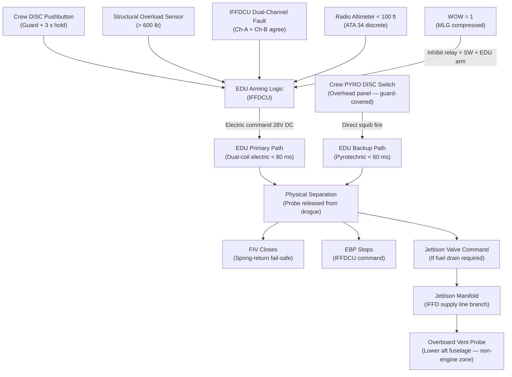
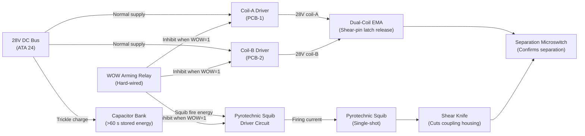
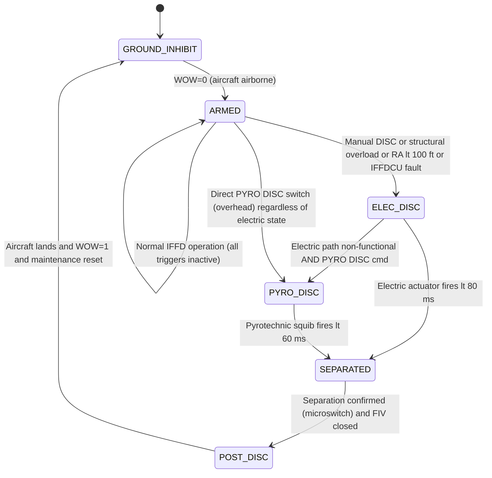

# ATLAS 040-049 · Section 04 · Subsection 048 · 070 — Safety Interlocks Emergency Disconnect and Jettison

## §0. Hyperlink Policy

All internal cross-references use relative Markdown links within the Q+ATLANTIDE CSDB repository. External regulatory citations in §19/§20 are marked  where hyperlinks are pending. Parent context: [ATLAS 048 README](./README.md). Related subsubject documents are linked in §20.

---

## §1. Purpose

This document specifies the **safety interlocks, emergency disconnect mechanisms, and fuel jettison system** for the In-Flight Fuel Dispensing (IFFD) system on the AMPEL360E eWTW aircraft per ATA 48. These functions are the primary safety barriers preventing catastrophic outcomes from IFFD failures during aerial refuelling operations.

The Emergency Disconnect Unit (EDU) provides a dual-path disconnect mechanism: a primary dual-coil electric actuator (< 100 ms activation) and a pyrotechnic backup (single-shot, also < 100 ms). The jettison path provides an overboard fuel vent in a non-engine, non-ignition-source zone, compliant with CS-25 §25.975. Four independent auto-trigger conditions activate emergency disconnect: manual crew switch, coupling structural overload sensor, IFFDCU dual-channel fault agreement, and radio altimeter < 100 ft.

Weight-on-wheels (WOW) inhibits IFFD activation on the ground, and a separate WOW interlock prevents EDU arming below MLG compression threshold.

---

## §2. Applicability

| Attribute | Value |
|-----------|-------|
| Aircraft Program | AMPEL360E eWTW |
| ATA Chapter | ATA 48 — In-Flight Fuel Dispensing |
| EDU Primary Path | Dual-coil electric actuator — < 100 ms |
| EDU Backup Path | Pyrotechnic (single-shot) — < 100 ms |
| Auto-Trigger Conditions | 4 independent triggers (manual, structural, IFFDCU fault, RA < 100 ft) |
| Jettison Path | Overboard vent — non-engine zone (CS-25 §25.975) |
| WOW Inhibit | IFFD activation inhibited on ground (WOW = 1) |
| SFAR 88 | Fuel tank jettison path safety analysis required |
| S1000D SNS | 048-070 |

---

## §3. Functional Description

### §3.1 Emergency Disconnect Unit (EDU)

The EDU is a two-path electromechanical device installed at the probe/coupling interface (Receiver Mode) or at the hose-drogue junction (Tanker Mode). It physically separates the probe from the tanker drogue or the coupling from the receiver probe via:

**Primary Path (Electric)**:
- A dual-coil electromagnetic actuator (28 V DC, dual coil for redundancy) drives a mechanical shear pin / latch release mechanism.
- Activation time: < 80 ms from command to mechanical separation.
- Either coil alone can activate the release — dual-coil design ensures no single wire/coil failure prevents disconnect.
- The electric path is commanded by: (a) manual crew DISC pushbutton (panel), (b) structural overload sensor (> 600 lb probe coupling force), (c) IFFDCU software-generated disconnect (dual-channel agree on fault), or (d) radio altimeter < 100 ft AGL.

**Backup Path (Pyrotechnic)**:
- A single-shot pyrotechnic squib (explosive charge) drives a shear knife through the coupling housing, guaranteeing physical separation regardless of electric actuator state.
- Activation time: < 60 ms from squib firing.
- The pyrotechnic path is commanded by: (a) a dedicated crew PYRO DISC switch (separate from DISC button — located on overhead panel guard-covered), (b) IFFDCU automatic command if electric path is confirmed non-functional (ground detection test failure).
- Single-shot only — EDU must be replaced after pyrotechnic activation.

### §3.2 Auto-Trigger Conditions

| Trigger | Sensor/Source | Threshold | Override? |
|---------|--------------|-----------|---------|
| Manual crew DISC | IFFD panel DISC pushbutton | Guard lift + 3 s hold | Crew-discretionary |
| Structural overload | Probe/coupling force sensor | > 600 lb (primary) / > 800 lb (backup) | None — hardware threshold |
| IFFDCU dual-channel fault | IFFDCU Ch-A + Ch-B fail-agree | Both channels flagged FAULT | None — software auto |
| Radio altimeter < 100 ft | ATA 34 RA discrete | < 100 ft AGL | None — hardware discrete |

### §3.3 Fuel Jettison System

The fuel jettison path provides a route for venting/dumping fuel overboard in emergency conditions (excess fuel, fire warning with IFFD fuel in line, or controlled post-disconnect drain). The jettison path consists of:
- **Override/Jettison Valve** (normally-closed solenoid valve) — opens the jettison manifold branch from the IFFD supply line.
- **Jettison Manifold** — routes fuel to the overboard vent probe.
- **Overboard Vent Probe** — flush-mounted in the lower aft fuselage, in a zone clear of engine intake, hot exhaust, and ignition sources (CS-25 §25.975 compliant).
- **Fuel Vent Mast Heater** — electric heater prevents ice blockage of vent probe in icing conditions.

Jettison is only activated when jettison valve receives a 28 V DC command. Loss of electrical power returns the valve to normally-closed state, preventing inadvertent fuel dump.

### §3.4 WOW and Ground Inhibit Interlocks

The WOW interlock prevents IFFD activation (probe extension, hose deployment, FIV opening, EBP start) while WOW = 1 (aircraft on ground, MLG compressed). This interlock is implemented at three levels:
1. IFFDCU software mode enable condition (see ATA 048-010).
2. Hardware relay in the 28 V DC power supply to the probe/hose actuators — WOW = 1 removes power from actuator bus independent of software.
3. EDU arming is inhibited by WOW = 1 at the EDU electronics — prevents accidental pyrotechnic firing on ground.

### Diagram 1: EDU and Jettison Functional Architecture

---

## §4. System Architecture

The EDU electronics are housed in a dedicated module mounted adjacent to the probe coupling (Receiver Mode) or hose-drogue junction (Tanker Mode). The EDU module contains:
- Dual-coil electric actuator driver circuit (dual-channel, independent coil drivers on separate PCBs).
- Pyrotechnic squib interface circuit (independently powered from a dedicated capacitor-charged firing circuit — not dependent on main 28 V DC bus).
- WOW arming interlock relay (hard-wired, not software).
- Separation confirmation sensor (microswitch confirming physical separation occurred).

The capacitor-charged squib firing circuit provides > 60 s of stored energy to ensure pyrotechnic firing capability even after loss of main 28 V DC bus — addressing the scenario where a bus failure is the cause of the emergency.

### Diagram 2: EDU Internal Architecture

---

## §5. Components and Line-Replaceable Units

| LRU | Part Number | Qty | Location | Replacement Interval |
|-----|-------------|-----|----------|----------------------|
| EDU Module (Receiver) |  | 1 | Probe coupling interface | Replace after each pyro activation; electric path on-condition |
| EDU Module (Tanker — optional) |  | 1 | Hose-drogue junction | Replace after each pyro activation |
| Pyrotechnic Squib (EDU) |  | 1 per EDU | EDU module (sub-component) | Replace after each activation (single-shot) |
| EDU Capacitor Bank |  | 1 | EDU module | 5,000 FH (electrolytic capacitor life) |
| Override / Jettison Valve |  | 1 | IFFD manifold | On-condition / A-check functional test |
| Jettison Manifold Assembly |  | 1 | Center fuselage | On-condition |
| Overboard Vent Probe |  | 1 | Lower aft fuselage skin | On-condition / B-check inspection |
| Vent Mast Heater Element |  | 1 | Vent probe housing | On-condition / 3,000 FH |
| WOW Interlock Relay |  | 1 | EDU module | On-condition / C-check |
| PYRO DISC Switch (overhead) |  | 1 | Overhead panel — guard-covered | On-condition |
| Structural Overload Sensor |  | 1 | Probe coupling housing | On-condition / 5,000 FH |
| Separation Confirmation Microswitch |  | 1 | EDU module | On-condition |

---

## §6. Interfaces

| Interface | Peer System | Protocol / Bus | Data Exchanged |
|-----------|-------------|----------------|----------------|
| Manual DISC command | IFFD panel (DISC button) | 28 V DC discrete | Disconnect command |
| PYRO DISC command | Overhead PYRO DISC switch | 28 V DC discrete (direct to squib) | Direct squib fire |
| Structural overload threshold | Probe/coupling force sensor | Hardware relay (600 lb mechanical) | Overload trigger |
| IFFDCU fault auto-trigger | IFFDCU Ch-A + Ch-B | IFFDCU software output | Both-channel fault agree |
| Radio altimeter trigger | ATA 34 Navigation | 28 V DC discrete (< 100 ft relay) | Ground proximity inhibit |
| WOW inhibit | ATA 32 Landing Gear | 28 V DC discrete (hardware relay) | Ground state inhibit |
| 28 V DC power (EDU) | ATA 24 Electrical | 28 V DC bus | EDU control and coil power |
| Jettison valve command | IFFDCU Ch-A | 28 V DC solenoid | Open jettison path |
| Separation confirmation | IFFDCU Ch-A | 28 V DC discrete (microswitch) | Separation occurred |
| Vent mast heater power | ATA 24 Electrical | 28 V DC bus | Anti-ice heater |

---

## §7. Operations and Modes

| Condition | EDU State | Jettison Valve | WOW Inhibit | ECAM |
|-----------|-----------|---------------|------------|------|
| Ground — IFFD off | Armed (ground inhibit active) | Closed | Inhibit active (WOW=1) | Normal |
| In flight — IFFD STANDBY | Armed | Closed | Inhibit off (WOW=0) | Normal |
| In flight — IFFD active (RCV/TNK) | Armed | Closed | Inhibit off | IFFD synoptic |
| Manual DISC (crew) | Activating — electric path | Open (drain cmd) | N/A | IFFD DISCONNECT (red) |
| Structural overload auto | Activating — electric path | Open (drain cmd) | N/A | IFFD DISCONNECT (red) |
| RA < 100 ft auto-trigger | Activating — electric path | Closed (fuel off) | N/A | IFFD DISCONNECT (red) |
| IFFDCU both-channel fault | Activating — electric path | Closed (fuel off) | N/A | IFFD FAULT + DISCONNECT (red) |
| PYRO DISC (crew override) | Activating — pyro path | Closed (fuel off) | N/A | IFFD PYRO DISC (red) |
| Post-disconnect | Separation confirmed | Closed | N/A | IFFD DISC CONFIRMED |

### Diagram 3: Safety Interlock State Machine

---

## §8. Performance and Budgets

| Parameter | Requirement | Target | Status |
|-----------|-------------|--------|--------|
| EDU electric path activation time | < 100 ms | < 80 ms |  |
| EDU pyrotechnic activation time | < 100 ms | < 60 ms |  |
| Structural overload threshold (primary) | 600 lb ± 50 lb | 600 lb |  |
| Structural overload threshold (backup) | 800 lb ± 50 lb | 800 lb |  |
| Capacitor bank energy reserve | > 60 s post-bus-loss | 90 s |  |
| RA < 100 ft trigger latency | < 200 ms | < 100 ms |  |
| WOW inhibit circuit response | < 50 ms | < 30 ms |  |
| Jettison valve open time | < 2 s | 1.5 s |  |
| EDU PBIT squib continuity test | 100% squib continuity | Pass/Fail discrete |  |

---

## §9. Safety, Redundancy and Fault Tolerance

- **Dual-path EDU**: Electric (primary) + pyrotechnic (backup) — either path independently achieves physical separation within specification. No single failure prevents disconnect.
- **Four independent auto-trigger inputs**: Each trigger is sourced from a different system (crew, mechanical, software, navigation), minimising common-cause failure susceptibility.
- **WOW three-level inhibit**: Prevents ground-based IFFD activation and EDU arming at software, hardware relay, and EDU module levels simultaneously.
- **Capacitor-backed pyro firing**: Pyrotechnic squib has its own energy reserve (60+ s), enabling firing after main 28 V DC bus loss — critical for scenarios where electrical failure causes the emergency.
- **CS-25 §25.975 jettison zone**: Overboard vent probe positioned per structural and aerodynamic analysis to ensure vented fuel does not impinge on engine intakes, nacelles, or hot zones.
- **SFAR 88 fuel tank safety**: Jettison path design reviewed under SFAR 88 requirements; vent mast heating prevents ice blockage that could cause fuel trap in manifold.
- **Separation confirmation feedback**: Microswitch confirms physical separation occurred; IFFDCU logs timestamp of separation for maintenance review. No separation confirmation generates a maintenance CAUTION "IFFD DISC NOT CONFIRMED".
- **Single-shot pyrotechnic policy**: EDU is replaced after any pyrotechnic activation — no reuse of fired squib. Maintenance task: immediate replacement and aircraft technical log entry.

---

## §10. Maintenance and Diagnostics

| Task | Interval | Access | Tools Required |
|------|----------|--------|----------------|
| EDU PBIT squib continuity check | A-check (every flight) | IFFDCU PBIT (automatic) | None — automatic |
| EDU electric path functional test (no squib) | B-check | Probe coupling / hose-reel bay | IFFD IBIT (dry fire test) |
| Squib replacement (post-pyro actuation) | After each activation | Probe coupling / hose bay | Explosive ordnance qualified technician |
| Capacitor bank capacity test | 5,000 FH | EDU module | Capacitor test equipment |
| Jettison valve functional test | A-check | IFFD manifold | IFFDCU IBIT (dry actuation) |
| Overboard vent probe inspection | B-check | Lower aft fuselage | Visual + NDT |
| Vent mast heater continuity check | B-check | Vent probe housing | Continuity tester |
| WOW interlock relay test | C-check | EDU module / landing gear relay bay | Relay test equipment |
| Structural overload sensor calibration | 5,000 FH | Probe coupling housing | Force calibration fixture |
| PYRO DISC switch guard integrity | A-check | Overhead panel | Visual inspection |

---

## §11. Configuration and Software

- EDU auto-trigger logic (IFFDCU dual-channel fault agree) is part of IFFDCU DO-178C DAL B software — auto-disconnect is considered a safety function at DAL B.
- RA < 100 ft trigger is implemented as a hardware discrete relay (ATA 34 radio altimeter output) — no software processing; activates at hardware level.
- Structural overload trigger is a mechanical/analog threshold — no software processing; force sensor signal exceeds hardware relay threshold and directly commands EDU.
- Pyrotechnic squib handling procedures per ATF regulations and manufacturer explosive handling manual. All pyro operations require explosive-qualified technician.
- Squib part number and lot number recorded in aircraft technical log at installation; traceable to manufacturer's explosive batch certification.

---

## §12. Environmental and Physical Constraints

| Constraint | Specification | Standard |
|-----------|--------------|---------|
| EDU operating temperature | −55 °C to +85 °C | DO-160G Section 4 |
| EDU vibration (nose / hose-reel location) | 10–2,000 Hz, 10 g | DO-160G Section 8 |
| Pyrotechnic squib temperature storage | −40 °C to +60 °C (storage) | MIL-DTL-23659 |
| Vent probe icing | Electric heater mat — DO-160G Section 24 | DO-160G Section 24 |
| Vent probe aerodynamic loads | CS-25 §25.305 limit at Vd | CS-25 Amendment 28 |
| Jettison zone clearance | Non-engine zone per CS-25 §25.975 | CS-25 §25.975 |
| EMI (squib circuit) | Shielded squib wiring — MIL-STD-1316 | MIL-STD-1316 |
| Explosive classification | Class 1.4S (squib) | ATF classification |

---

## §13. Human Factors and Crew Interface

- **DISC Pushbutton (center console panel)**: Guard-covered; guard must be raised and button held 3 s to fire electric path. Clear RED illumination on activation.
- **PYRO DISC Switch (overhead panel)**: Separate guard-covered switch for pyrotechnic backup — labeled "PYRO DISC / EMERG ONLY". Two-step action: lift guard + flip switch.
- **ECAM "IFFD DISCONNECT"** (red WARNING): Automatic on separation confirmation — displays type (ELEC or PYRO), time, and post-disconnect checklist prompt.
- **ECAM "IFFD DISC NOT CONFIRMED"** (amber CAUTION): If separation microswitch not triggered within 500 ms of DISC command — crew action: verify probe/hose separation visually, consider PYRO DISC.
- **Post-disconnect checklist**: ECAM automatically displays IFFD post-disconnect checklist on ECAM memo page — FIV closed, EBP off, vent drain sequence, ACARS report send.

---

## §14. Test and Validation

| Test | Method | Acceptance Criterion | Status |
|------|--------|---------------------|--------|
| EDU electric path timing | Ground functional test (no squib) | < 100 ms activation |  |
| EDU pyrotechnic timing | Qualification test (squib fired) | < 100 ms activation |  |
| Structural overload threshold | Force calibration fixture | 600 ± 50 lb trigger |  |
| RA < 100 ft trigger latency | Ground test with RA simulator | < 200 ms from RA signal |  |
| WOW inhibit (all 3 levels) | Ground test | All 3 paths inhibit IFFD |  |
| Capacitor bank capacity | Discharge test | ≥ 60 s firing capability |  |
| Jettison valve open/close | IFFDCU IBIT | < 2 s open, N/C on power loss |  |
| CS-25 §25.975 vent location | Analysis + ground fire risk test | No engine ingestion of vented fuel |  |
| IFFD DISC NOT CONFIRMED CAUTION | Fault injection test | CAUTION within 500 ms of no switch |  |

---

## §15. Regulatory Compliance

| Regulation | Requirement | Compliance Method | Status |
|-----------|-------------|------------------|--------|
| CS-25 §25.975 | Fuel jettison system | Analysis + flight test |  |
| SFAR 88 | Fuel tank safety | Fuel system safety analysis |  |
| CS-25 §25.863 | Flammable fluid fire protection | Zonal safety analysis |  |
| CS-25 §25.305 | Vent probe structural loads | Structural analysis |  |
| MIL-DTL-23659 | Squib (explosive initiating device) | Manufacturer qualification cert |  |
| MIL-STD-1316 | Fuze design — electromagnetic safety | Squib wiring shielding analysis |  |
| DO-178C DAL B | EDU auto-trigger software | SAS + MC/DC coverage |  |
| DO-160G | EDU hardware qualification | Environmental test report |  |

---

## §16. Certification Evidence

-  EDU Qualification Test Report (electric path, timing, vibration, temperature)
-  Pyrotechnic Squib Qualification Certificate (MIL-DTL-23659)
-  Electromagnetic Safety Analysis — Squib Wiring (MIL-STD-1316 HERO/HERF)
-  CS-25 §25.975 Jettison Zone Analysis and Test Report
-  SFAR 88 Fuel Tank Safety Compliance Summary
-  IFFD System Safety Assessment (SSA) — emergency disconnect failure modes
-  WOW Interlock Circuit Qualification Evidence (3-level inhibit)
-  DO-178C DAL B Software Evidence — EDU auto-trigger logic

---

## §17. Open Issues

| ID | Description | Owner | Target | Status |
|----|-------------|-------|--------|--------|
| IFFD-070-OI-001 | Define ATF/EASA approval pathway for pyrotechnic squib installation on civil aircraft | Q-AIR / ORB-LEG |  |  |
| IFFD-070-OI-002 | Confirm HERO/HERF electromagnetic safety analysis scope for squib wiring near HF antenna | Q-MECHANICS |  |  |
| IFFD-070-OI-003 | Assess whether RA < 100 ft trigger should apply in tanker mode (receiver may be at 100 ft!) | Q-AIR |  |  |
| IFFD-070-OI-004 | Define post-disconnect jettison drain volume (hose residual) and vent duration | Q-AIR / Q-MECHANICS |  |  |

---

## §18. Glossary

| Acronym / Term | Definition |
|---------------|-----------|
| EDU | Emergency Disconnect Unit — dual-path (electric + pyrotechnic) probe/hose physical separator |
| Pyrotechnic Squib | Single-shot explosive initiating device (MIL-DTL-23659) — fires shear knife in EDU backup path |
| HERO | Hazard of Electromagnetic Radiation to Ordnance — RF-induced inadvertent squib fire risk |
| HERF | Hazard of Electromagnetic Radiation to Fuel — RF ignition risk near fuel systems |
| WOW | Weight-on-Wheels — MLG compression sensor used as ground safety inhibit |
| RA | Radio Altimeter — provides height above ground; < 100 ft triggers auto-disconnect |
| Structural Overload | Probe/coupling force exceeding rated limit (600 lb primary, 800 lb backup) |
| Jettison | Controlled fuel dump via overboard vent to reduce weight or drain IFFD circuit after disconnect |
| CS-25 §25.975 | EASA certification requirement for fuel jettison system design and vent zone location |
| MIL-STD-1316 | US DoD standard for fuze design safety — covers HERO/HERF analysis for ordnance proximity |

---

## §19. Citations

| Standard | Title | Issuer | Applicability |
|---------|-------|--------|--------------|
| CS-25 Amendment 28 §25.975 | Fuel jettison system | EASA | Jettison zone and system design |
| CS-25 Amendment 28 §25.863 | Flammable fluid fire protection | EASA | Jettison path fire risk |
| CS-25 Amendment 28 §25.305 | Strength and deformation | EASA | Vent probe structural loads |
| SFAR 88 | Fuel Tank Safety | FAA | Jettison path safety analysis |
| MIL-DTL-23659 | Squib, Initiating Device | US DoD | Pyrotechnic squib qualification |
| MIL-STD-1316 | Fuze Design, Safety Criteria | US DoD | HERO/HERF electromagnetic safety |
| DO-178C | Software Considerations in Airborne Systems | RTCA | EDU auto-trigger DAL B |
| DO-160G | Environmental Conditions and Test Procedures | RTCA | EDU hardware qualification |
| S1000D Issue 5.0 | International Specification for Technical Publications | ASD/AIA/ATA | CSDB documentation |

---

## §20. References

| Document | Path | Relation |
|---------|------|---------|
| ATLAS 048-000 | [./048-000-In-Flight-Fuel-Dispensing-General.md](./048-000-In-Flight-Fuel-Dispensing-General.md) | IFFD system overview |
| ATLAS 048-010 | [./048-010-Fuel-Dispensing-Architecture-and-Modes.md](./048-010-Fuel-Dispensing-Architecture-and-Modes.md) | IFFD modes and WOW inhibit |
| ATLAS 048-020 | [./048-020-Refuelling-Probe-Drogue-and-Receptacle-Interfaces.md](./048-020-Refuelling-Probe-Drogue-and-Receptacle-Interfaces.md) | Probe coupling (EDU location) |
| ATLAS 048-050 | [./048-050-Dispensing-Hose-Boom-and-Coupling-Interfaces.md](./048-050-Dispensing-Hose-Boom-and-Coupling-Interfaces.md) | Hose coupling (EDU location) |
| ATLAS 048-060 | [./048-060-In-Flight-Fuel-Dispensing-Control-and-Indication.md](./048-060-In-Flight-Fuel-Dispensing-Control-and-Indication.md) | DISC button and ECAM |
| ATLAS 048 README | [./README.md](./README.md) | Subsection index |
| Q+ATLANTIDE Baseline | [../../../../organization/Q+ATLANTIDE.md](../../../../organization/Q+ATLANTIDE.md) | Governance |

---

## §21. Footprint

| Metric | Value |
|--------|-------|
| Architecture | `ATLAS` — Aircraft Top Level Architecture Schema/System |
| Master range | `000–099` |
| Code range | `040-049` |
| Section | `04` — Aviónica, Información & APU |
| Subsection | `048` — In-Flight Fuel Dispensing |
| Subsubject | `070` — Safety Interlocks Emergency Disconnect and Jettison |
| Primary Q-Division | Q-AIR |
| Support Q-Divisions | Q-MECHANICS, Q-DATAGOV, Q-GREENTECH, Q-GROUND |
| ORB support | ORB-PMO, ORB-LEG |
| Governance class | `baseline` |
| Document ID | `QATL-ATLAS-1000-ATLAS-040-049-04-048-070-SAFETY-INTERLOCKS-EMERGENCY-DISCONNECT-AND-JETTISON` |
| Version | 1.0.0 |
| Status | active |
| Created | 2026-05-10 |
| Updated | 2026-05-10 |

---

## §22. Change Log

| Version | Date | Author | Change Description |
|---------|------|--------|--------------------|
| 1.0.0 | 2026-05-10 | Q-AIR / ATLAS Working Group | Initial baseline release — IFFD safety interlocks, EDU and jettison for AMPEL360E eWTW |
