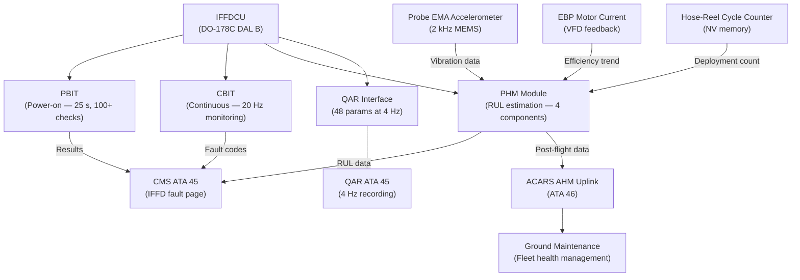
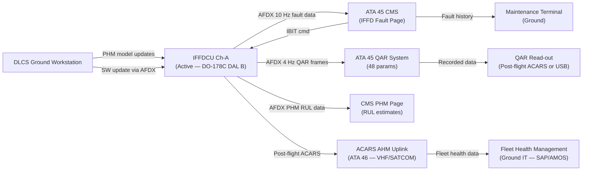
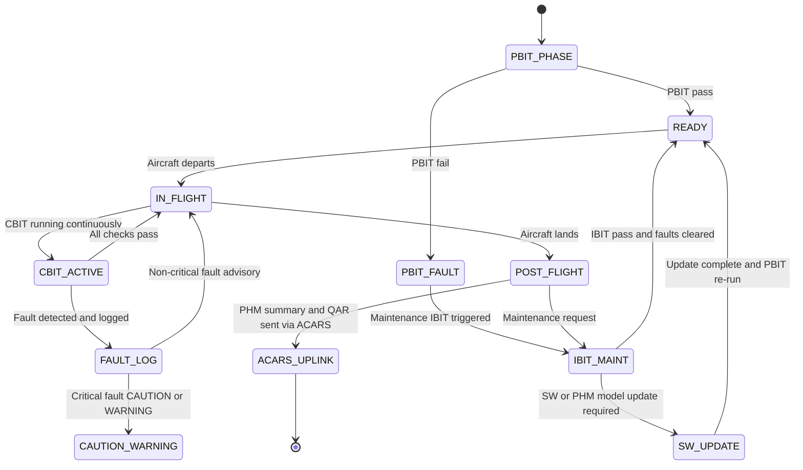

# ATLAS 040-049 · Section 04 · Subsection 048 · 080 — IFFD Monitoring Diagnostics and Control Interfaces

## §0. Hyperlink Policy

All internal cross-references use relative Markdown links within the Q+ATLANTIDE CSDB repository. External regulatory citations in §19/§20 are marked  where hyperlinks are pending. Parent context: [ATLAS 048 README](./README.md). Related subsubject documents are linked in §20.

---

## §1. Purpose

This document specifies the **monitoring, diagnostics, and control interface functions** of the IFFD system for the AMPEL360E eWTW aircraft per ATA 48. These functions ensure continuous health monitoring of IFFD system components, provide maintenance personnel with diagnostic access, and enable fleet-level health management via ACARS AHM uplinks.

The IFFDCU implements Power-On Built-In Test (PBIT) at startup and Continuous Built-In Test (CBIT) during flight, achieving > 97% failure detection coverage across the IFFD subsystem. A Prognostic Health Management (PHM) module within the IFFDCU estimates Remaining Useful Life (RUL) for the probe actuator, hose-reel motor, and EBPs. 48 Quick Access Recorder (QAR) parameters are recorded at 4 Hz. ACARS AHM uplinks provide fleet-level IFFD health data to the ground maintenance system. CMS ATA 45 provides the maintenance crew interface for IFFD fault history, LRU identification, and IBIT execution.

---

## §2. Applicability

| Attribute | Value |
|-----------|-------|
| Aircraft Program | AMPEL360E eWTW |
| ATA Chapter | ATA 48 — In-Flight Fuel Dispensing |
| PBIT / CBIT Coverage | > 97% failure detection |
| PHM Targets | Probe EMA, hose-reel motor, EBP-A, EBP-B |
| QAR Parameter Count | 48 parameters at 4 Hz |
| ACARS AHM Uplink | Post-flight and on-event trigger |
| CMS Interface | ATA 45 IFFD fault page via AFDX |
| EMA Vibration Monitoring | Probe extension motor (IMU/accelerometer) |
| S1000D SNS | 048-080 |

---

## §3. Functional Description

### §3.1 Built-In Test (PBIT and CBIT)

**PBIT (Power-On BIT)**:
Executed at every IFFDCU power-on (pre-flight). PBIT takes approximately 25 s and covers:
- IFFDCU Ch-A and Ch-B processor self-test (CPU, memory, ROM checksum).
- AFDX NIC loopback test (both channels).
- ARINC 429 interface test (FQMS and FMS links).
- Probe EMA actuator continuity test (motor winding resistance check).
- FIV and cross-feed valve actuator continuity check.
- EBP-A and EBP-B motor winding continuity check.
- EDU electric path continuity check (without triggering disconnect).
- EDU pyrotechnic squib continuity check (non-firing resistance measurement).
- RVDT excitation and output range check.
- Coriolis flow meter ARINC 429 alive check.
- Line pressure sensor zero-point check.

PBIT results are recorded in IFFDCU non-volatile fault log and transmitted to CMS on PBIT completion. A PBIT FAIL generates an ECAM CAUTION and prevents IFFD activation until cleared by maintenance.

**CBIT (Continuous BIT)**:
Executed continuously during flight (20 Hz monitoring cycle). CBIT monitors:
- IFFDCU Channel A vs Channel B output cross-comparison (50 ms).
- Sensor plausibility checks (RVDT range, Coriolis range, pressure sensor range).
- Actuator position vs command comparison (EBP speed vs VFD feedback, FIV position vs command).
- EBP overcurrent monitoring (via VFD feedback).
- AFDX frame loss detection (> 3 consecutive frame losses = link fault).
- PHM RUL below threshold warning (< 10% RUL remaining triggers CAUTION).

### §3.2 Prognostic Health Management (PHM)

The PHM module executes within the IFFDCU firmware and estimates RUL for four IFFD components:

| Component | PHM Algorithm | Key Parameter | RUL Alert Threshold |
|-----------|-------------|--------------|-------------------|
| Probe Extension EMA | Vibration RMS trend + bearing frequency analysis | EMA vibration (accelerometer) | < 10% rated life |
| Hose-Reel Motor | Current vs load trend + deployment cycle count | Motor current at rated load | 2,500 deployments (of 3,000 life) |
| EBP-IFFD-A | Hydraulic efficiency trend (flow vs current) | EBP efficiency (%) | < 75% efficiency |
| EBP-IFFD-B | Hydraulic efficiency trend (flow vs current) | EBP efficiency (%) | < 75% efficiency |

PHM data is transmitted to the ground ACARS AHM system post-flight. Maintenance crew can view RUL estimates on CMS ATA 45 IFFD PHM page. PHM model updates are received via DLCS ground uplink.

### §3.3 QAR Parameters (48 at 4 Hz)

Selected QAR parameters from the 48 IFFD parameters recorded:

| # | Parameter | Unit | Rate |
|---|---------|------|------|
| 1 | IFFD mode (OFF/RCV/TNK/XFER/GND) | Enum | 4 Hz |
| 2 | IFFDCU active channel (A/B) | Enum | 4 Hz |
| 3 | Mass flow rate (Coriolis) | lb/min | 4 Hz |
| 4 | Cumulative qty transferred | lb | 4 Hz |
| 5 | Line pressure upstream FIV | psig | 4 Hz |
| 6 | Line pressure downstream EBP | psig | 4 Hz |
| 7 | EBP-A speed (% rated) | % | 4 Hz |
| 8 | EBP-B speed (% rated) | % | 4 Hz |
| 9 | EBP-A motor current | A | 4 Hz |
| 10 | EBP-B motor current | A | 4 Hz |
| 11 | Probe RVDT position | % | 4 Hz |
| 12 | Probe EMA vibration RMS | g | 4 Hz |
| 13 | Probe coupling force | N | 4 Hz |
| 14 | Probe seal DP | PSI/min | 4 Hz |
| 15 | FIV position | % | 4 Hz |
| 16 | Coupling lock status | Discrete | 4 Hz |
| 17 | Hose-reel deployed length | m | 4 Hz |
| 18 | Drogue stability angle deviation | ° | 4 Hz |
| 19 | EDU state (ARMED/FIRED/INHIBIT) | Enum | 4 Hz |
| 20 | WOW state | Discrete | 4 Hz |
| 21–48 | Additional sensor states, valve positions, PHM RUL values, fault codes | Various | 4 Hz |

### §3.4 EMA Vibration Monitoring

The probe extension EMA is fitted with a MEMS accelerometer bonded to the motor housing. Vibration data is sampled at 2 kHz and processed by the PHM module in the IFFDCU to extract:
- Vibration RMS (overall level — trend monitoring for bearing wear).
- Spectral analysis at bearing outer-race and inner-race frequencies (for bearing defect detection).
- Imbalance detection at motor rotational frequency.

Bearing defect detection threshold: 3 dB above baseline RMS at bearing frequency. On threshold crossing, PHM logs a bearing degradation event and updates RUL estimate downward.

### Diagram 1: IFFD Monitoring and Diagnostics Architecture

---

## §4. System Architecture

### §4.1 CMS Integration (ATA 45)

The IFFDCU transmits IFFD fault data to the CMS (ATA 45) via AFDX (ARINC 664 P7). The CMS IFFD fault page provides maintenance crews with:
- Current fault list (active and historical faults with timestamps).
- LRU identification recommendations (derived from fault code logic tree).
- IBIT initiation button (triggers IFFD IBIT from CMS terminal).
- PHM RUL display for all four monitored LRUs.
- Fault correlation analysis (if multiple faults are active, CMS suggests root cause LRU).

Fault codes use the S1000D-compatible DMC schema (see ATA 048-090 for DMRL mapping).

### §4.2 IBIT (Initiated BIT)

IBIT is a maintenance-initiated self-test procedure executed on the ground. IBIT includes:
- All PBIT checks (extended with additional in-situ functional tests).
- FIV open/close cycle with position verification.
- EBP low-speed run (5 s at 20% rated speed) with VFD feedback verification.
- Probe extension to 50% stroke and retraction with RVDT verification.
- Cross-feed manifold valve open/close cycle.
- EDU electric path dry-fire test (coil activated without separation).
- Jettison valve open/close dry test.

IBIT duration: approximately 15 minutes. IBIT results transmitted to CMS and stored in IFFDCU non-volatile log.

### Diagram 2: CMS and ACARS AHM Interface Architecture

---

## §5. Components and Line-Replaceable Units

| LRU | Part Number | Qty | Location | Replacement Interval |
|-----|-------------|-----|----------|----------------------|
| IFFDCU (with PHM module) |  | 2 (Ch-A/B) | Avionics bay | On-condition / 15,000 FH |
| Probe EMA MEMS Accelerometer |  | 1 | Probe EMA housing | On-condition / 10,000 FH |
| AFDX NIC (IFFDCU — CMS link) |  | 2 | IFFDCU chassis | On-condition |
| QAR Interface Module (ATA 45) |  | 1 | Avionics bay (ATA 45 managed) | On-condition (ATA 45 managed) |
| ACARS Data Link Unit (ATA 46) |  | 1 | Avionics bay (ATA 46 managed) | On-condition (ATA 46 managed) |
| DLCS Interface Module (AFDX) |  | 1 | IFFDCU chassis | On-condition |

---

## §6. Interfaces

| Interface | Peer System | Protocol / Bus | Data Exchanged |
|-----------|-------------|----------------|----------------|
| IFFD fault data | ATA 45 CMS | AFDX (ARINC 664 P7) | Fault codes, LRU IDs, RUL data |
| IBIT command | ATA 45 CMS | AFDX (ARINC 664 P7) | IBIT start/stop, test selection |
| QAR recording | ATA 45 QAR | AFDX (ARINC 664 P7) | 48 IFFD parameters at 4 Hz |
| PHM RUL data | ATA 45 CMS | AFDX (ARINC 664 P7) | RUL estimates, degradation events |
| ACARS AHM uplink | ATA 46 ACARS | ACARS VHF/SATCOM | Post-flight health data, PHM summary |
| PHM model update | DLCS ground system | AFDX (DLCS) | Updated PHM degradation models |
| SW update | DLCS ground system | AFDX (DLCS) | IFFDCU software LSPs |
| EMA vibration data | Probe EMA accelerometer | SPI digital (2 kHz) | Vibration spectrum for PHM |
| EBP efficiency data | VFD-A/B | 4–20 mA + AFDX | Motor current, speed, flow cross-correlation |

---

## §7. Operations and Modes

| Monitoring Function | Active When | Data Source | Output |
|--------------------|------------|------------|--------|
| PBIT | Power-on (pre-flight) | IFFDCU internal + sensors | Pass/Fail + fault log |
| CBIT | Continuously in flight | IFFDCU internal + sensors | Real-time fault codes |
| PHM RUL estimation | In flight + post-flight | EMA accel, EBP current, cycle count | RUL %, degradation trend |
| QAR recording | Continuously in flight | All 48 IFFD parameters | 4 Hz recorded data |
| ACARS AHM uplink | Post-flight + on-event | PHM data + fault summary | Ground receipt |
| IBIT | Maintenance command (ground) | IFFDCU + actuators + sensors | Full IBIT report to CMS |
| DLCS SW/model update | Maintenance (ground) | Ground workstation | Updated LSPs/PHM models loaded |

### Diagram 3: IFFD Monitoring and Diagnostic Lifecycle

---

## §8. Performance and Budgets

| Parameter | Requirement | Target | Status |
|-----------|-------------|--------|--------|
| PBIT coverage | > 97% failure detection | 98% |  |
| CBIT coverage | > 95% failure detection in flight | 96% |  |
| PBIT execution time | < 30 s | 25 s |  |
| CBIT cycle time | ≤ 50 ms (20 Hz) | 50 ms |  |
| PHM RUL alert threshold | < 10% RUL remaining | 10% |  |
| QAR parameter count | ≥ 40 parameters | 48 parameters |  |
| QAR recording rate | ≥ 4 Hz | 4 Hz |  |
| ACARS AHM uplink delay | < 5 min post-landing | 3 min |  |
| EMA vibration sampling rate | ≥ 2 kHz for bearing analysis | 2 kHz |  |
| IFFD IBIT duration | < 20 min | 15 min |  |

---

## §9. Safety, Redundancy and Fault Tolerance

- **PBIT before every flight**: Ensures all IFFD safety-critical components (EDU squib continuity, actuator integrity, sensor range) are verified before crew activates IFFD in flight.
- **CBIT cross-comparison (Ch-A vs Ch-B)**: Real-time comparison of both IFFDCU channel outputs at 50 ms interval provides the most rapid detection of control channel failures.
- **PHM proactive maintenance**: RUL estimation enables scheduled replacement of degrading components before failure — shifting from reactive to predictive maintenance for IFFD LRUs.
- **NV fault log**: IFFDCU non-volatile memory retains fault history across power cycles, ensuring fault data is not lost on power removal for maintenance investigation.
- **ACARS on-event trigger**: Significant faults (e.g., EDU activation, channel switch, sensor loss) trigger immediate ACARS uplink — does not wait for post-flight upload.
- **PHM model governance**: PHM degradation models are configuration-controlled and updated only via certified DLCS ground process, preventing inadvertent model corruption.
- **QAR data as certification evidence**: 48 QAR parameters at 4 Hz provide the data record needed for in-service safety monitoring and continued airworthiness reporting.

---

## §10. Maintenance and Diagnostics

| Task | Interval | Access | Tools Required |
|------|----------|--------|----------------|
| Review CMS IFFD fault page | A-check | CMS maintenance terminal | CMS terminal |
| IFFD IBIT (full ground test) | C-check or after fault | CMS terminal → IBIT trigger | CMS + IFFD IBIT mode |
| PHM RUL review (all 4 components) | Per operator schedule | CMS PHM page | CMS terminal |
| QAR IFFD data analysis | Post-event or routine | QAR read-out (ACARS or USB) | QAR analysis software |
| ACARS AHM interface test | B-check | Avionics bay | ACARS loopback test |
| EMA accelerometer calibration | 5,000 FH | Probe EMA housing | Calibration jig |
| IFFDCU non-volatile log download | On maintenance request | CMS terminal | CMS terminal |
| PHM model update (via DLCS) | As released by OEM | Ground workstation | DLCS workstation |
| IFFDCU SW update (via DLCS) | As released | Ground workstation | DLCS workstation |

---

## §11. Configuration and Software

- PBIT/CBIT test library is part of IFFDCU DO-178C DAL B software; Part Number .
- PHM module is an embedded software component of IFFDCU firmware, also at DO-178C DAL B for RUL threshold alerts (alert output is a safety function).
- PHM degradation model parameters are stored in IFFDCU configuration data module — loadable separately from main SW via DLCS to allow in-service model updates without full SW re-qualification.
- QAR parameter list (DITS format, ATA 717 ACMS) defined in IFFD QAR ICD. Parameter list is static (no in-service modification without IFFDCU SW update).
- IBIT procedure is a separate loadable partition in IFFDCU firmware, controlled under DO-200B.

---

## §12. Environmental and Physical Constraints

| Constraint | Specification | Standard |
|-----------|--------------|---------|
| IFFDCU non-volatile memory | 10-year data retention | JEDEC JESD22-A117 |
| EMA accelerometer frequency response | Flat to 5 kHz (for bearing analysis) | DO-160G Section 8 |
| AFDX bandwidth (IFFD monitoring) | ≤ 10 Mbps (IFFD share of AFDX) | ARINC 664 P7 |
| ACARS uplink availability | > 95% continental airspace | ARINC 620 |
| QAR storage capacity | ≥ 128 hours at 48 params, 4 Hz | ATA 45 QAR spec |
| DLCS upload time (full IFFDCU SW) | < 45 min | DO-200B |

---

## §13. Human Factors and Crew Interface

- **CMS IFFD Fault Page**: Accessed via CMS maintenance terminal (ATA 45). Displays current faults (active + historical), LRU recommendation, fault timestamp, flight phase at fault, and correlation with other systems.
- **CMS PHM Page**: Displays RUL bar charts for Probe EMA, Hose-Reel Motor, EBP-A, EBP-B. Colour coding: > 50% = green, 10–50% = amber, < 10% = red. Maintenance planning recommendation displayed.
- **ECAM "IFFD PBIT FAIL"** (amber CAUTION): Crew awareness — IFFD system should not be used until maintenance clears fault. Maintenance recommendation: run IBIT before next IFFD activation.
- **ECAM "IFFD PHM ALERT"** (blue ADVISORY): Crew awareness — one or more IFFD LRUs approaching maintenance threshold. No immediate action required; plan maintenance at next opportunity.
- **Post-flight ACARS AHM**: Automated — no crew action required. Crew may be informed via ACARS printer if operator policy requires printed health summary.

---

## §14. Test and Validation

| Test | Method | Acceptance Criterion | Status |
|------|--------|---------------------|--------|
| PBIT coverage analysis | Software fault injection simulation | > 97% failure detection |  |
| CBIT cross-comparison timing | Real-time scheduler analysis | Cross-check within 50 ms |  |
| PHM RUL accuracy | Accelerated endurance test vs PHM prediction | RUL within ± 15% of actual |  |
| QAR parameter validation | Avionics integration test | All 48 parameters recorded correctly |  |
| ACARS AHM uplink post-flight | ACARS loopback + ground receipt | Data received < 5 min post-landing |  |
| IBIT full-test duration | Ground functional test | IBIT complete < 20 min |  |
| EMA vibration bearing defect | Seeded bearing fault test | Defect detected at 3 dB threshold |  |
| DLCS PHM model update | Ground update + PBIT re-run | Model updated, PBIT pass |  |

---

## §15. Regulatory Compliance

| Regulation | Requirement | Compliance Method | Status |
|-----------|-------------|------------------|--------|
| CS-25 §25.1309 | Equipment, systems and installations | IFFD BITE SSA coverage |  |
| DO-178C DAL B | IFFDCU PBIT/CBIT/PHM software | SAS + structural coverage |  |
| DO-200B | Standards for processing aeronautical data | DLCS data management |  |
| ARINC 664 P7 | AFDX network (CMS link) | ICD compliance review |  |
| ARINC 620 | ACARS operational messages | AHM message format review |  |
| ATA 717 | ACMS parameter coding (QAR) | QAR ICD review |  |

---

## §16. Certification Evidence

-  IFFDCU PBIT/CBIT Coverage Analysis Report (> 97% detection)
-  PHM Module Software Accomplishment Summary (DO-178C DAL B)
-  QAR Parameter ICD (48 params — ATA 717 format)
-  ACARS AHM Message Format ICD (ARINC 620)
-  PHM Degradation Model Validation Report (accelerated endurance test)
-  DLCS Data Management Plan (DO-200B — IFFDCU LSP management)
-  IFFD BITE SSA Coverage Evidence (CS-25 §25.1309)

---

## §17. Open Issues

| ID | Description | Owner | Target | Status |
|----|-------------|-------|--------|--------|
| IFFD-080-OI-001 | Define PHM RUL model validation methodology (endurance test vs fleet correlation) | Q-DATAGOV |  |  |
| IFFD-080-OI-002 | Confirm ACARS AHM uplink availability for military operations (frequency restrictions) | Q-AIR / ORB-LEG |  |  |
| IFFD-080-OI-003 | Assess QAR parameter expansion to 64 parameters for enhanced PHM fleet analytics | Q-DATAGOV |  |  |

---

## §18. Glossary

| Acronym / Term | Definition |
|---------------|-----------|
| PBIT | Power-on Built-In Test — self-test executed at IFFDCU power-on before each flight |
| CBIT | Continuous Built-In Test — ongoing in-flight monitoring executed at 20 Hz by IFFDCU |
| IBIT | Initiated Built-In Test — maintenance-triggered extended self-test on ground |
| PHM | Prognostic Health Management — system predicting component RUL from sensor trends |
| RUL | Remaining Useful Life — estimated service life remaining for a monitored component |
| QAR | Quick Access Recorder — flight data recorder for maintenance/engineering access |
| ACARS AHM | Aircraft Communications Addressing and Reporting System — Aircraft Health Monitoring |
| DLCS | Data Link Control System — ground-to-aircraft software and data loading system |
| DITS | Digital Information Transfer System — ARINC 429 or 717 based data encoding |
| NV | Non-Volatile — memory retaining data after power removal (EEPROM / Flash) |

---

## §19. Citations

| Standard | Title | Issuer | Applicability |
|---------|-------|--------|--------------|
| CS-25 Amendment 28 §25.1309 | Equipment, systems and installations | EASA | BITE SSA coverage |
| DO-178C | Software Considerations in Airborne Systems | RTCA | PBIT/CBIT/PHM software DAL B |
| DO-200B | Standards for Processing Aeronautical Data | RTCA | DLCS data management |
| ARINC 664 P7 | Aircraft Data Network — AFDX | ARINC | CMS data link |
| ARINC 620 | Data Link Ground System Standard | ARINC | ACARS AHM messages |
| ATA iSpec 2200 Chapter 717 | ACMS/QAR Parameter Coding | ATA | QAR parameter list |
| JEDEC JESD22-A117 | Flash Non-Volatile Memory Data Retention | JEDEC | IFFDCU NV fault log |
| S1000D Issue 5.0 | International Specification for Technical Publications | ASD/AIA/ATA | CSDB documentation |

---

## §20. References

| Document | Path | Relation |
|---------|------|---------|
| ATLAS 048-000 | [./048-000-In-Flight-Fuel-Dispensing-General.md](./048-000-In-Flight-Fuel-Dispensing-General.md) | IFFD system overview |
| ATLAS 048-010 | [./048-010-Fuel-Dispensing-Architecture-and-Modes.md](./048-010-Fuel-Dispensing-Architecture-and-Modes.md) | IFFDCU architecture |
| ATLAS 048-040 | [./048-040-Fuel-Quantity-Flow-and-Pressure-Control.md](./048-040-Fuel-Quantity-Flow-and-Pressure-Control.md) | ACARS fuel report |
| ATLAS 048-090 | [./048-090-S1000D-CSDB-Mapping-and-Traceability.md](./048-090-S1000D-CSDB-Mapping-and-Traceability.md) | S1000D DMRL and fault codes |
| ATLAS 048 README | [./README.md](./README.md) | Subsection index |
| Q+ATLANTIDE Baseline | [../../../../organization/Q+ATLANTIDE.md](../../../../organization/Q+ATLANTIDE.md) | Governance |

---

## §21. Footprint

| Metric | Value |
|--------|-------|
| Architecture | `ATLAS` — Aircraft Top Level Architecture Schema/System |
| Master range | `000–099` |
| Code range | `040-049` |
| Section | `04` — Aviónica, Información & APU |
| Subsection | `048` — In-Flight Fuel Dispensing |
| Subsubject | `080` — IFFD Monitoring Diagnostics and Control Interfaces |
| Primary Q-Division | Q-AIR |
| Support Q-Divisions | Q-MECHANICS, Q-DATAGOV, Q-GREENTECH, Q-GROUND |
| ORB support | ORB-PMO, ORB-LEG |
| Governance class | `baseline` |
| Document ID | `QATL-ATLAS-1000-ATLAS-040-049-04-048-080-IFFD-MONITORING-DIAGNOSTICS-AND-CONTROL-INTERFACES` |
| Version | 1.0.0 |
| Status | active |
| Created | 2026-05-10 |
| Updated | 2026-05-10 |

---

## §22. Change Log

| Version | Date | Author | Change Description |
|---------|------|--------|--------------------|
| 1.0.0 | 2026-05-10 | Q-AIR / ATLAS Working Group | Initial baseline release — IFFD monitoring, diagnostics and control interfaces for AMPEL360E eWTW |
