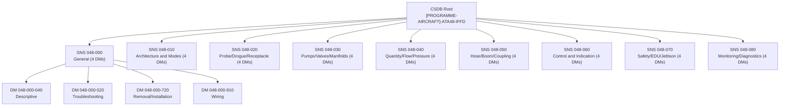
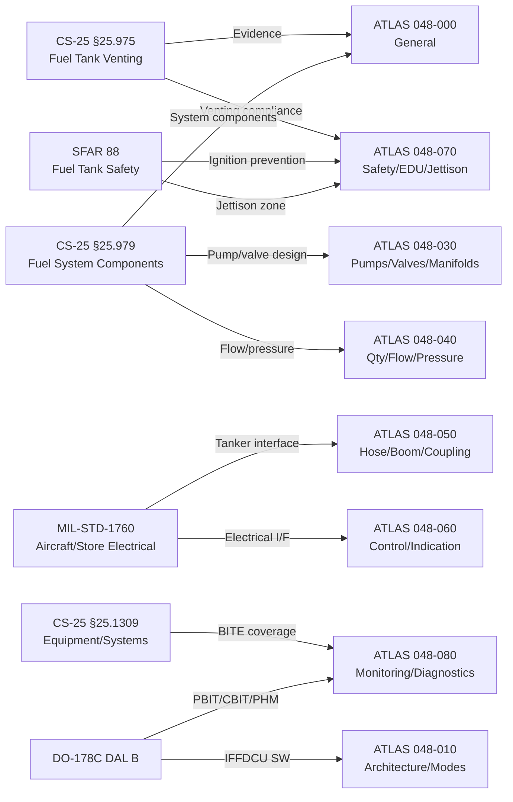
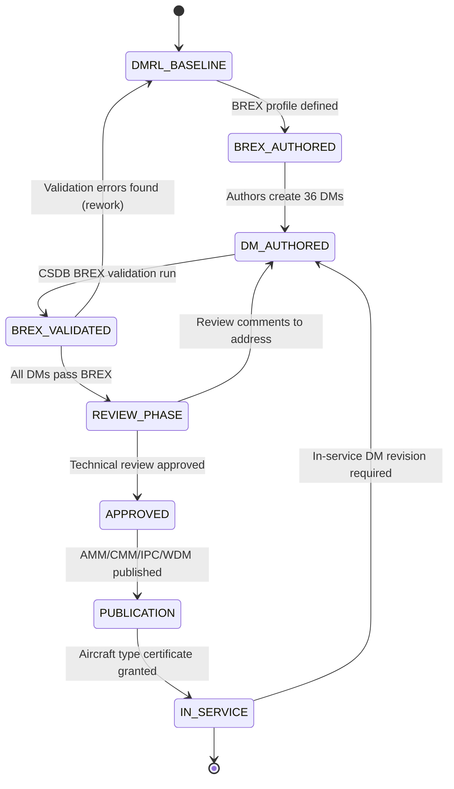

# ATLAS 040-049 · Section 04 · Subsection 048 · 090 — S1000D CSDB Mapping and Traceability

## §0. Hyperlink Policy

All internal cross-references use relative Markdown links within the Q+ATLANTIDE CSDB repository. External regulatory citations in §19/§20 are marked  where hyperlinks are pending. Parent context: [ATLAS 048 README](./README.md). All sibling subsubject documents are listed in §20.

---

## §1. Purpose

This document defines the **S1000D Common Source DataBase (CSDB) mapping and regulatory traceability** for the ATA 48 In-Flight Fuel Dispensing (IFFD) system of the programme-defined aircraft type. It specifies:
1. The Data Module Requirements List (DMRL) for 36 Data Modules across 9 SNS nodes.
2. Information Codes used within the IFFD CSDB (040 Descriptive, 520 Troubleshooting, 720 Removal/Installation, 910 Wiring).
3. The BREX profile (BREX-[PROGRAMME-AIRCRAFT]-[PROGRAMME-VARIANT]-048-v1.0.0) governing IFFD data modules.
4. Applicability coding (tag: [PROGRAMME-VARIANT]) used across all IFFD data modules.
5. Regulatory traceability matrix linking CS-25, SFAR 88, and MIL-STD-1760 requirements to specific ATLAS 048 subsubjects.

This document governs the authoritative data module set for IFFD technical publications (AMM, CMM, IPC, WDM) derived from Q+ATLANTIDE ATLAS 048 source data.

---

## §2. Applicability

| Attribute | Value |
|-----------|-------|
| Aircraft Program | programme-defined aircraft type |
| ATA Chapter | ATA 48 — In-Flight Fuel Dispensing |
| S1000D Issue | 5.0 |
| BREX Profile | BREX-[PROGRAMME-AIRCRAFT]-[PROGRAMME-VARIANT]-048-v1.0.0 |
| CSDB Applicability Tag | [PROGRAMME-VARIANT] |
| DMRL Total Data Modules | 36 |
| SNS Nodes Covered | 9 (048-000 through 048-080) |
| Info Codes in Use | 040, 520, 720, 910 |

---

## §3. Functional Description

### §3.1 S1000D DMRL Overview

The Data Module Requirements List (DMRL) defines all Data Modules (DMs) required to document the IFFD system per S1000D Issue 5.0. The DMRL is divided across 9 SNS nodes corresponding to the 9 ATLAS 048 subsubjects (000–080). Each SNS node contains 4 DMs covering the four primary Info Codes (040 Descriptive, 520 Troubleshooting, 720 Removal/Installation, 910 Wiring).

Total DMs: 9 nodes × 4 info codes = 36 Data Modules.

### §3.2 BREX Profile

The BREX (Business Rules EXchange) profile `BREX-[PROGRAMME-AIRCRAFT]-[PROGRAMME-VARIANT]-048-v1.0.0` defines the CSDB business rules for all IFFD data modules:
- Mandatory YAML/XML fields required in each DM (applicability tag [PROGRAMME-VARIANT], aircraft type [PROGRAMME-AIRCRAFT], ATA 48 chapter code).
- Permitted information codes: 040, 520, 720, 910 (no 100, 200, 300 codes per IFFD scope).
- Applicability framework: [PROGRAMME-VARIANT] as the single applicability tag (no variants for IFFD ATA 48 systems).
- Language: English (en-US) as primary; translations to be defined by operator.
- Graphic reference standard: SVG for schematics; PNG for photos (minimum 300 DPI).
- Warning/Caution/Note hierarchy per S1000D Issue 5.0 §3.9.5.
- Cross-reference DMC format: `DMC-<PROGRAMME>-A-048-{NNN}-{IC}-A-en-US` (see §3.4).

### §3.3 Applicability Coding

All IFFD data modules carry the applicability tag:
- **Tag**: `[PROGRAMME-VARIANT]`
- **Description**: programme-defined aircraft type all-electric wide-twin-wing aircraft
- **Applicability filter expression**: `applic[@applicRefId='[PROGRAMME-VARIANT]']`
- **Scope**: All IFFD ATA 48 data modules apply to the single [PROGRAMME-VARIANT] configuration. No variant filtering within ATA 48.
- **Future variants** (e.g., [PROGRAMME-VARIANT]-F freighter, [PROGRAMME-VARIANT]-ER extended range): To be evaluated in BREX v2.0.0; new tags to be defined if required.

### §3.4 Data Module Code Format

DMC format for IFFD data modules:

```
DMC-<PROGRAMME>-A-048-{NNN}-{IC}-A-en-US
```

Where:
- `[PROGRAMME-AIRCRAFT]` — Model identification code
- `A` — System difference code
- `048` — ATA chapter (IFFD)
- `{NNN}` — SNS node (000, 010, 020, 030, 040, 050, 060, 070, 080)
- `{IC}` — Info code (040, 520, 720, 910)
- `A` — Item location code
- `en-US` — Language/country

### Diagram 1: IFFD CSDB Structure and SNS Hierarchy



---

## §4. System Architecture

### §4.1 DMRL — Full 36-Module Table

| SNS Node | Info Code | DMC | S1000D Type | Title | ATLAS Source |
|---------|-----------|-----|------------|-------|-------------|
| 048-000 | 040 | DMC-<PROGRAMME>-A-048-000-040-A-en-US | Descriptive | IFFD System Overview | [048-000](./048-000-In-Flight-Fuel-Dispensing-General.md) |
| 048-000 | 520 | DMC-<PROGRAMME>-A-048-000-520-A-en-US | Troubleshooting | IFFD System-Level Fault Isolation | [048-000](./048-000-In-Flight-Fuel-Dispensing-General.md) |
| 048-000 | 720 | DMC-<PROGRAMME>-A-048-000-720-A-en-US | Removal/Installation | IFFD System Component Access Procedures | [048-000](./048-000-In-Flight-Fuel-Dispensing-General.md) |
| 048-000 | 910 | DMC-<PROGRAMME>-A-048-000-910-A-en-US | Wiring | IFFD System Wiring Diagram | [048-000](./048-000-In-Flight-Fuel-Dispensing-General.md) |
| 048-010 | 040 | DMC-<PROGRAMME>-A-048-010-040-A-en-US | Descriptive | IFFD Architecture and Modes Description | [048-010](./048-010-Fuel-Dispensing-Architecture-and-Modes.md) |
| 048-010 | 520 | DMC-<PROGRAMME>-A-048-010-520-A-en-US | Troubleshooting | IFFDCU Mode Faults and Recovery | [048-010](./048-010-Fuel-Dispensing-Architecture-and-Modes.md) |
| 048-010 | 720 | DMC-<PROGRAMME>-A-048-010-720-A-en-US | Removal/Installation | IFFDCU Removal and Installation | [048-010](./048-010-Fuel-Dispensing-Architecture-and-Modes.md) |
| 048-010 | 910 | DMC-<PROGRAMME>-A-048-010-910-A-en-US | Wiring | IFFDCU Wiring Diagram | [048-010](./048-010-Fuel-Dispensing-Architecture-and-Modes.md) |
| 048-020 | 040 | DMC-<PROGRAMME>-A-048-020-040-A-en-US | Descriptive | Probe Drogue and Receptacle Description | [048-020](./048-020-Refuelling-Probe-Drogue-and-Receptacle-Interfaces.md) |
| 048-020 | 520 | DMC-<PROGRAMME>-A-048-020-520-A-en-US | Troubleshooting | Probe Extension/Retraction Fault Isolation | [048-020](./048-020-Refuelling-Probe-Drogue-and-Receptacle-Interfaces.md) |
| 048-020 | 720 | DMC-<PROGRAMME>-A-048-020-720-A-en-US | Removal/Installation | Probe EMA Removal and Installation | [048-020](./048-020-Refuelling-Probe-Drogue-and-Receptacle-Interfaces.md) |
| 048-020 | 910 | DMC-<PROGRAMME>-A-048-020-910-A-en-US | Wiring | Probe Interface Wiring Diagram | [048-020](./048-020-Refuelling-Probe-Drogue-and-Receptacle-Interfaces.md) |
| 048-030 | 040 | DMC-<PROGRAMME>-A-048-030-040-A-en-US | Descriptive | Fuel Transfer Pumps Valves and Manifolds Description | [048-030](./048-030-Fuel-Transfer-Pumps-Valves-and-Manifolds.md) |
| 048-030 | 520 | DMC-<PROGRAMME>-A-048-030-520-A-en-US | Troubleshooting | EBP and Valve Fault Isolation | [048-030](./048-030-Fuel-Transfer-Pumps-Valves-and-Manifolds.md) |
| 048-030 | 720 | DMC-<PROGRAMME>-A-048-030-720-A-en-US | Removal/Installation | EBP and FIV Removal and Installation | [048-030](./048-030-Fuel-Transfer-Pumps-Valves-and-Manifolds.md) |
| 048-030 | 910 | DMC-<PROGRAMME>-A-048-030-910-A-en-US | Wiring | EBP and Valve Wiring Diagram | [048-030](./048-030-Fuel-Transfer-Pumps-Valves-and-Manifolds.md) |
| 048-040 | 040 | DMC-<PROGRAMME>-A-048-040-040-A-en-US | Descriptive | Fuel Quantity Flow and Pressure Control Description | [048-040](./048-040-Fuel-Quantity-Flow-and-Pressure-Control.md) |
| 048-040 | 520 | DMC-<PROGRAMME>-A-048-040-520-A-en-US | Troubleshooting | Flow Meter and Pressure Control Fault Isolation | [048-040](./048-040-Fuel-Quantity-Flow-and-Pressure-Control.md) |
| 048-040 | 720 | DMC-<PROGRAMME>-A-048-040-720-A-en-US | Removal/Installation | Coriolis Flow Meter Removal and Installation | [048-040](./048-040-Fuel-Quantity-Flow-and-Pressure-Control.md) |
| 048-040 | 910 | DMC-<PROGRAMME>-A-048-040-910-A-en-US | Wiring | Flow/Pressure Instrumentation Wiring Diagram | [048-040](./048-040-Fuel-Quantity-Flow-and-Pressure-Control.md) |
| 048-050 | 040 | DMC-<PROGRAMME>-A-048-050-040-A-en-US | Descriptive | Dispensing Hose Boom and Coupling Description | [048-050](./048-050-Dispensing-Hose-Boom-and-Coupling-Interfaces.md) |
| 048-050 | 520 | DMC-<PROGRAMME>-A-048-050-520-A-en-US | Troubleshooting | Hose Reel and Drogue Fault Isolation | [048-050](./048-050-Dispensing-Hose-Boom-and-Coupling-Interfaces.md) |
| 048-050 | 720 | DMC-<PROGRAMME>-A-048-050-720-A-en-US | Removal/Installation | Hose Reel and Drogue Assembly Removal and Installation | [048-050](./048-050-Dispensing-Hose-Boom-and-Coupling-Interfaces.md) |
| 048-050 | 910 | DMC-<PROGRAMME>-A-048-050-910-A-en-US | Wiring | Tanker Mode Hose/Boom Wiring Diagram | [048-050](./048-050-Dispensing-Hose-Boom-and-Coupling-Interfaces.md) |
| 048-060 | 040 | DMC-<PROGRAMME>-A-048-060-040-A-en-US | Descriptive | IFFD Control and Indication Description | [048-060](./048-060-In-Flight-Fuel-Dispensing-Control-and-Indication.md) |
| 048-060 | 520 | DMC-<PROGRAMME>-A-048-060-520-A-en-US | Troubleshooting | IFFD ECAM and MCDU Fault Isolation | [048-060](./048-060-In-Flight-Fuel-Dispensing-Control-and-Indication.md) |
| 048-060 | 720 | DMC-<PROGRAMME>-A-048-060-720-A-en-US | Removal/Installation | IFFD Control Panel Removal and Installation | [048-060](./048-060-In-Flight-Fuel-Dispensing-Control-and-Indication.md) |
| 048-060 | 910 | DMC-<PROGRAMME>-A-048-060-910-A-en-US | Wiring | IFFD Control and Indication Wiring Diagram | [048-060](./048-060-In-Flight-Fuel-Dispensing-Control-and-Indication.md) |
| 048-070 | 040 | DMC-<PROGRAMME>-A-048-070-040-A-en-US | Descriptive | Safety Interlocks EDU and Jettison Description | [048-070](./048-070-Safety-Interlocks-Emergency-Disconnect-and-Jettison.md) |
| 048-070 | 520 | DMC-<PROGRAMME>-A-048-070-520-A-en-US | Troubleshooting | EDU and WOW Inhibit Fault Isolation | [048-070](./048-070-Safety-Interlocks-Emergency-Disconnect-and-Jettison.md) |
| 048-070 | 720 | DMC-<PROGRAMME>-A-048-070-720-A-en-US | Removal/Installation | EDU Assembly Removal and Installation (Pyrotechnic) | [048-070](./048-070-Safety-Interlocks-Emergency-Disconnect-and-Jettison.md) |
| 048-070 | 910 | DMC-<PROGRAMME>-A-048-070-910-A-en-US | Wiring | EDU Safety Circuit Wiring Diagram | [048-070](./048-070-Safety-Interlocks-Emergency-Disconnect-and-Jettison.md) |
| 048-080 | 040 | DMC-<PROGRAMME>-A-048-080-040-A-en-US | Descriptive | IFFD Monitoring Diagnostics and Control Interfaces Description | [048-080](./048-080-IFFD-Monitoring-Diagnostics-and-Control-Interfaces.md) |
| 048-080 | 520 | DMC-<PROGRAMME>-A-048-080-520-A-en-US | Troubleshooting | PBIT/CBIT Fault Isolation and PHM Alert Isolation | [048-080](./048-080-IFFD-Monitoring-Diagnostics-and-Control-Interfaces.md) |
| 048-080 | 720 | DMC-<PROGRAMME>-A-048-080-720-A-en-US | Removal/Installation | IFFDCU and PHM Sensor Removal and Installation | [048-080](./048-080-IFFD-Monitoring-Diagnostics-and-Control-Interfaces.md) |
| 048-080 | 910 | DMC-<PROGRAMME>-A-048-080-910-A-en-US | Wiring | IFFD Monitoring and Diagnostics Wiring Diagram | [048-080](./048-080-IFFD-Monitoring-Diagnostics-and-Control-Interfaces.md) |

### Diagram 2: Regulatory Traceability Architecture



---

## §5. Components and Configuration Items

| Item | Identifier | Version | CSDB Status |
|------|-----------|---------|------------|
| BREX Profile | BREX-[PROGRAMME-AIRCRAFT]-[PROGRAMME-VARIANT]-048-v1.0.0 | 1.0.0 |  |
| DMRL (this document) | DMRL-[PROGRAMME-AIRCRAFT]-ATA48-v1.0.0 | 1.0.0 |  |
| CSDB Applicability Tag | [PROGRAMME-VARIANT] | — |  |
| Info Code List (040, 520, 720, 910) | IFFD-IC-LIST-v1.0 | 1.0 |  |
| Common Information Repository | CIR-[PROGRAMME-AIRCRAFT]-ATA48 |  |  |
| Illustrated Parts Catalog (IPC) DMs | IPC-[PROGRAMME-AIRCRAFT]-ATA48 |  |  |

---

## §6. Interfaces

| Interface | Peer | Protocol | Purpose |
|-----------|------|---------|---------|
| DMRL → CSDB | S1000D CSDB software | XML/SGML import | DM creation and management |
| BREX → CSDB | S1000D CSDB editor | BREX XML validation | Enforce IFFD business rules |
| ATLAS 048 → DMRL | Q+ATLANTIDE CSDB | Authoring source | Source data for all 36 DMs |
| DM 910 (Wiring) | Aircraft WDM (ATA 20) | S1000D DMC cross-ref | Wire number cross-reference |
| DM 520 (Troubleshoot) | CMS ATA 45 fault codes | S1000D DMC cross-ref | Fault code to DM mapping |
| Regulatory traceability | CS-25 / SFAR 88 / MIL-STD-1760 | Traceability matrix | Compliance evidence linking |

---

## §7. Operations and Modes

### §7.1 CSDB Lifecycle Phases

| Phase | Activity | Status |
|-------|---------|--------|
| DMRL Baseline | Define 36 DM requirements |  |
| BREX Definition | Author BREX-[PROGRAMME-AIRCRAFT]-[PROGRAMME-VARIANT]-048-v1.0.0 |  |
| DM Authoring | Create all 36 DMs from ATLAS 048 sources |  |
| BREX Validation | Validate all 36 DMs against BREX profile |  |
| Publication | Generate AMM/CMM/IPC/WDM output |  |
| In-Service Update | Manage DM revisions post-certification |  |

### §7.2 Regulatory Traceability Matrix

| Regulation | Section | Requirement Summary | ATLAS 048 Subsubject | DMRL DM |
|-----------|---------|-------------------|---------------------|---------|
| CS-25 Amendment 28 | §25.975 | Fuel tank venting — no in-tank pressure exceeding design | ATLAS 048-000, 048-070 | DMC-<PROGRAMME>-A-048-000-040, -070-040 |
| CS-25 Amendment 28 | §25.979 | Fuel system — pumps, valves, filters design requirements | ATLAS 048-030, 048-040 | DMC-<PROGRAMME>-A-048-030-040, -040-040 |
| CS-25 Amendment 28 | §25.1309 | Equipment, systems and installations — failure probability | ATLAS 048-080 | DMC-<PROGRAMME>-A-048-080-040 |
| CS-25 Amendment 28 | §25.981 | Fuel tank ignition prevention | ATLAS 048-070 | DMC-<PROGRAMME>-A-048-070-040 |
| SFAR 88 | §88 | Fuel tank safety — ignition source elimination | ATLAS 048-070 | DMC-<PROGRAMME>-A-048-070-040, -070-520 |
| MIL-STD-1760 E | §3.4.1 | Aircraft/store electrical interface — power/data bus | ATLAS 048-050 | DMC-<PROGRAMME>-A-048-050-040, -050-910 |
| MIL-STD-1760 E | §3.4.2 | Store separation — electrical inhibit | ATLAS 048-060 | DMC-<PROGRAMME>-A-048-060-040 |
| DO-178C | DAL B | IFFDCU software — PBIT/CBIT/PHM module | ATLAS 048-010, 048-080 | DMC-<PROGRAMME>-A-048-010-040, -080-040 |
| DO-160G | All | Environmental qualification — temperature, vibration, EMI | All subsections | All 040 descriptive DMs |
| ATA iSpec 2200 | ATA 48 | In-flight fuel dispensing system documentation | All subsections | All 36 DMs |

### Diagram 3: DMRL Authoring and Validation Lifecycle



---

## §8. Performance and Budgets

| Parameter | Requirement | Target | Status |
|-----------|-------------|--------|--------|
| DMRL completeness | All 36 DMs defined | 36 DMs |  |
| BREX validation pass rate | 100% on release | 100% |  |
| Traceability coverage | 100% of CS-25/SFAR88/MIL-STD-1760 requirements | 10 requirements mapped |  |
| DM authoring completion | 36 DMs authored and reviewed | 0 DMs authored |  |
| AMM publication readiness | All AMM DMs authored and approved | Pending authoring |  |
| IPC DMs | All components with illustrated parts | 0 IPC DMs |  |

---

## §9. Safety, Regulatory and Certification Considerations

- **SFAR 88 compliance** is mandatory for all fuel system documentation including jettison and vent systems. DM 048-070-040 (Descriptive) and 048-070-520 (Troubleshooting) must contain explicit SFAR 88 safety notices and procedures.
- **EDU pyrotechnic procedures** (DM 048-070-720) require special S1000D DM handling: Hazardous Materials warnings per IATA DGR, pyrotechnic safety zone specifications, and mandatory two-person rule notation.
- **MIL-STD-1760 interface DMs** (048-050 SNS, particularly 910 Wiring) must follow NATO STANAG 3838 wiring identification conventions in addition to ATA iSpec 2200 rules, as tanker mode interfaces are military in origin.
- **DO-178C traceability** from ATLAS 048 documents to DM 040 (Descriptive) must include software version references for IFFDCU executable software. DM release must be linked to IFFDCU SW Part Number and CAS (Customer Acceptance Software) revision.
- **BREX v1.0.0 scope note**: The current BREX covers single-variant [PROGRAMME-VARIANT] aircraft. If multi-variant applicability is introduced ([PROGRAMME-VARIANT]-F, [PROGRAMME-VARIANT]-ER), BREX v2.0.0 will be required with expanded applicability framework.

---

## §10. Maintenance and Diagnostics

| Task | Frequency | Responsible | Tool |
|------|----------|------------|-----|
| DMRL review and update | Per aircraft design change | Q-DATAGOV | DMRL management tool |
| BREX profile update | Per S1000D issue change | Q-DATAGOV | BREX editor |
| CSDB DM validation (BREX) | Each DM revision | Q-DATAGOV / Tech Pubs | CSDB editor with BREX plugin |
| Regulatory traceability matrix update | Per applicable regulation change | Q-AIR / ORB-LEG | Traceability matrix tool |
| AMM publication update | Per TC amendment / SB | Tech Pubs | CSDB publishing tool |
| Applicability tag extension (new variants) | At program milestone | Q-DATAGOV | BREX editor + CSDB config |

---

## §11. Configuration and Software

- BREX profile version: `BREX-[PROGRAMME-AIRCRAFT]-[PROGRAMME-VARIANT]-048-v1.0.0` — controlled under Q-DATAGOV baseline.
- DMRL version: `DMRL-[PROGRAMME-AIRCRAFT]-ATA48-v1.0.0` — this document constitutes the DMRL baseline.
- CSDB software:  (toolchain selection pending — candidate tools: Arbortext, Author-it, or CSDB-S1000D proprietary tools).
- DM authoring standard: S1000D Issue 5.0 (XML schema version 5.0.0.2).
- Output publication types: AMM (Maintenance Manual), CMM (Component Maintenance), IPC (Illustrated Parts Catalog), WDM (Wiring Diagram Manual).
- Version control: All DMs under Q+ATLANTIDE CSDB git governance per Q-DATAGOV policies.

---

## §12. Environmental and Physical Constraints

| Constraint | Specification | Standard |
|-----------|--------------|---------|
| DM XML schema version | S1000D Issue 5.0.0.2 | S1000D Issue 5.0 |
| BREX XML schema | S1000D BREX schema v5.0 | S1000D Issue 5.0 |
| Graphic format | SVG (schematics), PNG ≥ 300 DPI (photos) | S1000D §4.6 |
| Language | en-US (primary) | ISO 639 |
| DM naming convention | See §3.4 DMC format | S1000D §3.6 |
| Applicability CIR | CIR-[PROGRAMME-AIRCRAFT]-ATA48 (to be defined) | S1000D §3.9 |

---

## §13. Human Factors and User Interface

- Technical publications derived from these DMs must follow S1000D Issue 5.0 human factors guidelines for warning/caution/note hierarchy.
- **DM 048-070-720** (EDU pyrotechnic R&I): Must include prominent WARNING callout for pyrotechnic safety — two-person rule, grounding strap requirement, squib cap installation.
- **DM 048-080-520** (PBIT/CBIT Troubleshooting): Must be structured as decision trees (S1000D fault isolation logic) to enable single-technician level 2 fault isolation without specialist tool.
- **Language clarity**: All procedural DMs (720) to use active imperative voice per S1000D §3.10. No passive constructions in safety-critical steps.

---

## §14. Test and Validation

| Test | Method | Acceptance Criterion | Status |
|------|--------|---------------------|--------|
| BREX validation (all 36 DMs) | CSDB BREX validation tool | Zero BREX violations on release |  |
| Traceability coverage review | Regulatory review workshop | 100% CS-25/SFAR88 requirements traced |  |
| DM applicability tag audit | CSDB applicability filter query | All IFFD DMs return [PROGRAMME-VARIANT]=true |  |
| AMM publication proof | Tech Pubs functional test | All AMM procedures executable |  |
| Wiring DM (910) accuracy | WDM vs actual wire list comparison | Zero wiring discrepancies |  |
| DMRL completeness audit | DMRL vs delivered DM count | 36/36 DMs delivered |  |

---

## §15. Regulatory Compliance

| Regulation | Requirement | Compliance Method | Status |
|-----------|-------------|------------------|--------|
| CS-25 §25.975 | Fuel tank venting | ATLAS 048-070 → DM 048-000-040/070-040 |  |
| CS-25 §25.979 | Fuel system components | ATLAS 048-030/040 → DM 030-040/040-040 |  |
| CS-25 §25.1309 | Systems and equipment | ATLAS 048-080 → DM 080-040 |  |
| SFAR 88 | Fuel tank safety | ATLAS 048-070 → DM 070-040/070-520 |  |
| MIL-STD-1760 E | Aircraft/store electrical interface | ATLAS 048-050 → DM 050-040/050-910 |  |
| S1000D Issue 5.0 | Technical publication standard | BREX validation + DM authoring |  |
| ATA iSpec 2200 | ATA 48 chapter structure | DMRL SNS mapping |  |

---

## §16. Certification Evidence

-  DMRL-[PROGRAMME-AIRCRAFT]-ATA48-v1.0.0 (this document, upon formal issue)
-  BREX-[PROGRAMME-AIRCRAFT]-[PROGRAMME-VARIANT]-048-v1.0.0 (BREX profile XML)
-  Regulatory Traceability Matrix — IFFD ATA 48 (CS-25/SFAR88/MIL-STD-1760 to DM map)
-  CSDB BREX Validation Report (36 DMs, zero violations)
-  AMM ATA 48 Publication Proof (maintainability demonstration)

---

## §17. Open Issues

| ID | Description | Owner | Target | Status |
|----|-------------|-------|--------|--------|
| IFFD-090-OI-001 | Select and procure S1000D-compliant CSDB authoring tool for IFFD DM authoring | Q-DATAGOV |  |  |
| IFFD-090-OI-002 | Define CIR (Common Information Repository) for IFFD-specific warnings, part numbers, and units | Q-DATAGOV |  |  |
| IFFD-090-OI-003 | Extend BREX to v2.0.0 if [PROGRAMME-VARIANT]-F or [PROGRAMME-VARIANT]-ER variants are approved | Q-DATAGOV |  |  |
| IFFD-090-OI-004 | Resolve NATO STANAG 3838 vs ATA iSpec 2200 wiring ID conflict in DM 048-050-910 | Q-AIR / ORB-LEG |  |  |

---

## §18. Glossary

| Acronym / Term | Definition |
|---------------|-----------|
| CSDB | Common Source DataBase — S1000D repository for all technical publication data modules |
| DMRL | Data Module Requirements List — document defining all required DMs for a system |
| BREX | Business Rules EXchange — S1000D file defining publisher-specific authoring rules |
| DM | Data Module — atomic unit of S1000D technical information content |
| DMC | Data Module Code — unique identifier for each S1000D data module |
| SNS | System/Subsystem/Sub-subsystem Number Schema — hierarchical numbering used in DMRL |
| Info Code | S1000D code classifying DM information type (040 Descriptive, 520 Troubleshoot, 720 R&I, 910 Wiring) |
| [PROGRAMME-VARIANT] | All-Electric Wide-Twin-Wing — [PROGRAMME-AIRCRAFT] aircraft configuration identifier / applicability tag |
| AMM | Aircraft Maintenance Manual — operator-facing maintenance publication |
| CIR | Common Information Repository — shared S1000D resource for reusable content (warnings, parts, units) |

---

## §19. Citations

| Standard | Title | Issuer | Applicability |
|---------|-------|--------|--------------|
| S1000D Issue 5.0 | International Specification for Technical Publications | ASD/AIA/ATA | CSDB, DMRL, BREX, DM authoring |
| ATA iSpec 2200 | Information Standards for Aviation Maintenance | ATA | ATA 48 chapter numbering |
| CS-25 Amendment 28 §25.975 | Fuel Tank Venting | EASA | Traceability to 048-000/070 |
| CS-25 Amendment 28 §25.979 | Fuel System Components | EASA | Traceability to 048-030/040 |
| CS-25 Amendment 28 §25.981 | Fuel Tank Ignition Prevention | EASA | Traceability to 048-070 |
| SFAR 88 | Fuel Tank Safety | FAA | Traceability to 048-070 |
| MIL-STD-1760 Rev E | Aircraft/Store Electrical Interconnection System | US DoD | Traceability to 048-050/060 |
| NATO STANAG 3838 | Aircrew Systems — Aircraft Electrical Interface for Stores | NATO | Wiring DMs (048-050-910) |

---

## §20. References

| Document | Path | Relation |
|---------|------|---------|
| ATLAS 048-000 | [./048-000-In-Flight-Fuel-Dispensing-General.md](./048-000-In-Flight-Fuel-Dispensing-General.md) | IFFD system overview; source for DM 048-000 |
| ATLAS 048-010 | [./048-010-Fuel-Dispensing-Architecture-and-Modes.md](./048-010-Fuel-Dispensing-Architecture-and-Modes.md) | IFFDCU architecture; source for DM 048-010 |
| ATLAS 048-020 | [./048-020-Refuelling-Probe-Drogue-and-Receptacle-Interfaces.md](./048-020-Refuelling-Probe-Drogue-and-Receptacle-Interfaces.md) | Probe/drogue; source for DM 048-020 |
| ATLAS 048-030 | [./048-030-Fuel-Transfer-Pumps-Valves-and-Manifolds.md](./048-030-Fuel-Transfer-Pumps-Valves-and-Manifolds.md) | Pumps/valves; source for DM 048-030 |
| ATLAS 048-040 | [./048-040-Fuel-Quantity-Flow-and-Pressure-Control.md](./048-040-Fuel-Quantity-Flow-and-Pressure-Control.md) | Flow/pressure; source for DM 048-040 |
| ATLAS 048-050 | [./048-050-Dispensing-Hose-Boom-and-Coupling-Interfaces.md](./048-050-Dispensing-Hose-Boom-and-Coupling-Interfaces.md) | Hose/boom; source for DM 048-050 |
| ATLAS 048-060 | [./048-060-In-Flight-Fuel-Dispensing-Control-and-Indication.md](./048-060-In-Flight-Fuel-Dispensing-Control-and-Indication.md) | Control/indication; source for DM 048-060 |
| ATLAS 048-070 | [./048-070-Safety-Interlocks-Emergency-Disconnect-and-Jettison.md](./048-070-Safety-Interlocks-Emergency-Disconnect-and-Jettison.md) | Safety/EDU; source for DM 048-070 |
| ATLAS 048-080 | [./048-080-IFFD-Monitoring-Diagnostics-and-Control-Interfaces.md](./048-080-IFFD-Monitoring-Diagnostics-and-Control-Interfaces.md) | Monitoring/diagnostics; source for DM 048-080 |
| ATLAS 048 README | [./README.md](./README.md) | Subsection index |
| Q+ATLANTIDE Baseline | [../../../../organization/Q+ATLANTIDE.md](../../../../organization/Q+ATLANTIDE.md) | Governance |

---

## §21. Footprint

| Metric | Value |
|--------|-------|
| Architecture | `ATLAS` — Aircraft Top Level Architecture Schema/System |
| Master range | `000–099` |
| Code range | `040-049` |
| Section | `04` — Aviónica, Información & APU |
| Subsection | `048` — In-Flight Fuel Dispensing |
| Subsubject | `090` — S1000D CSDB Mapping and Traceability |
| Primary Q-Division | Q-DATAGOV |
| Support Q-Divisions | Q-AIR, Q-MECHANICS, Q-GROUND |
| ORB support | ORB-PMO, ORB-LEG |
| Governance class | `baseline` |
| Document ID | `QATL-ATLAS-1000-ATLAS-040-049-04-048-090-S1000D-CSDB-MAPPING-AND-TRACEABILITY` |
| DMRL DM count | 36 |
| DMRL SNS nodes | 9 |
| BREX profile | BREX-[PROGRAMME-AIRCRAFT]-[PROGRAMME-VARIANT]-048-v1.0.0 |
| S1000D issue | 5.0 |
| Version | 1.0.0 |
| Status | active |
| Created | 2026-05-10 |
| Updated | 2026-05-10 |

---

## §22. Change Log

| Version | Date | Author | Change Description |
|---------|------|--------|--------------------|
| 1.0.0 | 2026-05-10 | Q-DATAGOV / ATLAS Working Group | Initial baseline release — IFFD S1000D CSDB DMRL (36 DMs, 9 SNS nodes) and regulatory traceability matrix for programme-defined aircraft type |
