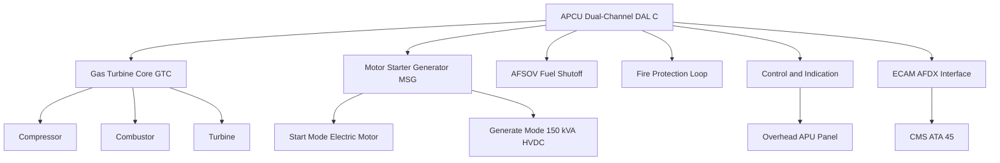
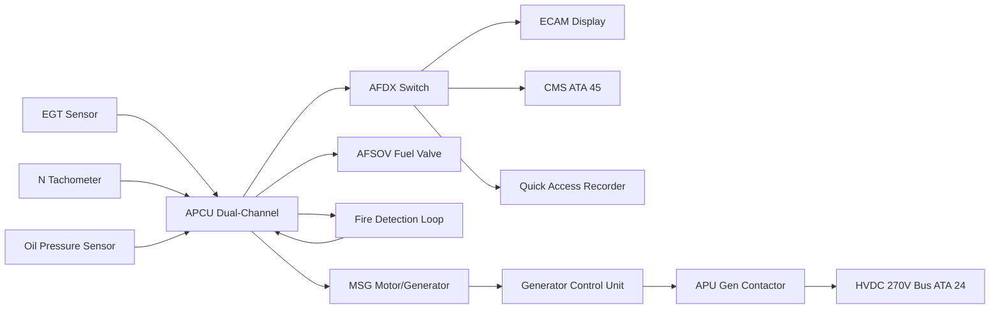
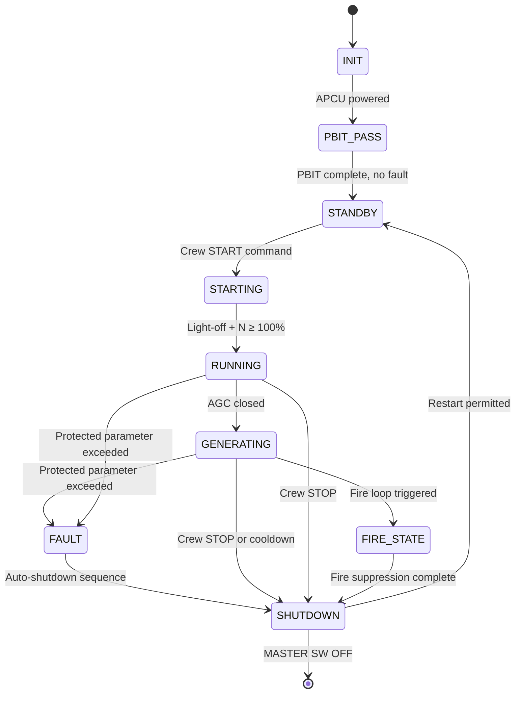

# ATLAS 040-049 · Section 04 · Subsection 049 · 000 — Airborne Auxiliary Power General

## §0. Hyperlink Policy

All hyperlinks within this document use **relative paths** from the current file location. Cross-subsection links navigate to sibling files within `./` (same folder), to the subsection index at [`./README.md`](./README.md), and to parent indexes at `../`, `../../`, and `../../../`. Absolute URLs are used only for external standards references. No link shall reference an absolute filesystem path.

---

## §1. Purpose

This document establishes the general scope, governing standards, and top-level architecture context for **ATA Chapter 49 — Airborne Auxiliary Power** as implemented on the **AMPEL360E eWTW** (electric wide-body twin-wing) aircraft. The AMPEL360E eWTW is a fully bleed-less, all-electric commercial transport aircraft; consequently, the APU in this architecture departs fundamentally from conventional APU implementations that supply both pneumatic and electrical power.

On the AMPEL360E eWTW, the APU is a **conventional small gas turbine** unit retrofitted for electric-output-only operation. Its sole operational purpose is to provide **emergency and ground electrical power** (~150 kVA) to the aircraft's High-Voltage Direct Current (HVDC) distribution bus when the main engine generators are unavailable. The APU does **not** supply bleed air for engine starting, environmental control, or any pneumatic load. Engine starting is accomplished via wing-mounted Electric Motor Starters fed from ground power or the APU generator. Cabin pre-conditioning on the ground is provided by an Electric Air Compressor (EAC) powered through the APU generator contactor (AGC) or ground power.

ATA Chapter 49 on the AMPEL360E eWTW is organised into ten subsubjects (000 through 090), each addressing a distinct functional domain: general overview (this document), system architecture, air inlet and exhaust, fuel supply and control, ignition starting and generation, pneumatic/electrical load interfaces, control/indication/warning, fire protection and safety interlocks, monitoring and diagnostics, and S1000D CSDB mapping. All ten documents are co-governed by Q-AIR as primary Q-Division, with Q-MECHANICS, Q-DATAGOV, Q-GREENTECH, and Q-HPC in support roles.

The APU Control Unit (APCU) is a dual-channel, DO-178C **DAL C** computer that governs all APU operational modes, interfaces with the aircraft Electronic Centralized Aircraft Monitor (ECAM) via ARINC 664 Part 7 (AFDX), and coordinates with the Central Maintenance System (CMS, ATA 45). Regulatory compliance follows EASA **CS-25 §25.1181** (APU fire zone), **§25.1185** (fuel fire zones), and **§25.1195** (fire extinguishing systems), supplemented by the **EASA CS-APU** airworthiness standards for auxiliary power units.

This document is the normative entry point for all ATA 49 content in the Q+ATLANTIDE ATLAS-1000 register. Engineers and certifiers should read this file first before navigating to any specialised subsubject file via [§20 References](#20-references).

---

## §2. Applicability

| Parameter | Value |
|---|---|
| Aircraft Program | AMPEL360E eWTW |
| ATA Chapter | 49 — Airborne Auxiliary Power |
| Certification Basis | EASA CS-25 (Amendment 27+), CS-APU Issue 1 |
| Applicable Standards | CS-25 §25.1181, §25.1185, §25.1195; DO-178C (DAL C); DO-160G; SAE AS6858 |
| Actuation Architecture | Electric-only (no hydraulic, no pneumatic APU output) |
| Control Software DAL | DO-178C DAL C (APCU dual-channel) |
| S1000D SNS | 049-000-00 (General Overview) |
| Bleed Architecture | Bleed-less — APU provides NO pneumatic output |
| Electrical Output | ~150 kVA HVDC 270 V (frequency-wild AC rectified) |
| Fuel Specification | Jet-A, Jet-A-1, SAF ASTM D7566 Annex A/B compatible |

---

## §3. Functional Description

The APU system on the AMPEL360E eWTW comprises a gas turbine core (compressor–combustor–turbine), an integrated Motor Starter/Generator (MSG), an APU Fuel Shutoff Valve (AFSOV), a dual-element thermistor fire detection loop, a single-shot HFC-125 fire bottle, and the APCU dual-channel control computer. Together these components constitute a self-contained power unit capable of autonomous start, governed speed operation, and safe automatic or commanded shutdown.

In the normal ground operational scenario, the APU is started by energising the MSG as an electric motor (fed from ground power or aircraft battery) while simultaneously engaging the dual-channel ignition exciter. Once the gas turbine reaches self-sustaining speed (approximately 50 % N), the ignition system is de-energised and MSG transitions to generator mode. The APCU monitors Exhaust Gas Temperature (EGT), spool speed (N), oil pressure, oil temperature, and vibration throughout all phases. Upon reaching governed speed (100 % N ± 1 %), the Generator Control Unit (GCU) closes the APU Generator Contactor (AGC) and the APU's electrical output is connected to the aircraft HVDC bus.

All APU protection logic — overspeed shutdown (N > 115 %), over-EGT shutdown (EGT > 980 °C), low oil pressure shutdown (< 15 psi), and fire shutdown — is embedded in the APCU with direct hard-wired paths to the AFSOV and MSG power cut to ensure fail-safe behaviour independent of data bus integrity.

### §3.1 Functional Breakdown

| Function | Sub-system | ATA Reference |
|---|---|---|
| APU start and govern | APCU + MSG + GTC | ATA 49-40 |
| Fuel supply and metering | AFSOV + LP pump + FCU | ATA 49-30 |
| Air inlet management | Inlet door EMA + blow-in doors | ATA 49-20 |
| Electrical power generation | MSG (gen mode) + GCU + AGC | ATA 49-50 |
| Fire detection and suppression | Fire loop + fire bottle + APCU | ATA 49-70 |
| Control, indication, warning | APCU + ECAM + overhead panel | ATA 49-60 |
| Monitoring and diagnostics | APCU PBIT/CBIT + CMS + PHM | ATA 49-80 |
| S1000D documentation | CSDB + DMRL + BREX | ATA 49-90 |

### Diagram 1: APU System Functional Hierarchy

---

## §4. System Architecture

The APU system architecture follows a centralised-control, distributed-sensor topology. The APCU is the single point of authority for all APU mode transitions; its dual-channel (A active, B standby) design with cross-channel data comparison provides the fault tolerance required for DO-178C DAL C. Channel B monitors all critical parameters independently and can assume authority within one APCU computation cycle (< 10 ms) upon detection of a Channel A discrepancy exceeding defined thresholds.

Communication with the aircraft-level avionics (ECAM, CMS, QAR, ACARS) uses the AFDX (ARINC 664 Part 7) backbone. All safety-critical discrete commands (AFSOV open/close, fire bottle arm, MSG cut) use dedicated hardwired signal paths that bypass the AFDX network, ensuring availability even in the event of a total AFDX switch failure.

The APU fuel supply is sourced exclusively from the ATA 28 centre tank via a dedicated APU feed line; no cross-feed from wing tanks is used during normal APU operation. The APU fire zone is physically isolated from the aircraft pressurised cabin and main engine nacelles per CS-25 §25.1181 requirements.

### Diagram 2: APU Signal Flow

---

## §5. Components and Line-Replaceable Units

| LRU | Part Number | Qty | Location | Replacement Interval |
|---|---|---|---|---|
| APU Control Unit (APCU) |  | 1 | APU compartment avionics shelf | On condition / 10 000 APU cycles |
| Motor Starter/Generator (MSG) |  | 1 | APU gas turbine shaft | On condition / 5 000 APU cycles |
| APU Fuel Shutoff Valve (AFSOV) |  | 1 | APU feed line, firewall | 6 000 cycles |
| Generator Control Unit (GCU) |  | 1 | APU compartment | On condition |
| APU Generator Contactor (AGC) |  | 1 | HVDC switchgear panel | 8 000 operations |
| Fire Bottle (HFC-125, single-shot) |  | 1 | APU fire zone aft bay | 12 years or on use |
| Dual-element thermistor fire loop |  | 1 set | APU nacelle perimeter | 6 000 flight hours |
| Ignition exciter (dual-channel) |  | 1 | APU accessories gearbox | 3 000 APU cycles |
| Igniter plugs |  | 2 | Combustor casing | 1 500 APU cycles |
| EGT thermocouple harness |  | 1 | Turbine exhaust plane | On condition |

---

## §6. Interfaces

| Interface | Peer System | Protocol / Bus | Data Exchanged |
|---|---|---|---|
| ECAM synoptic and CAS | ATA 31 ECAM | AFDX ARINC 664 P7 | N%, EGT, oil pressure, gen load, door status, fault codes |
| Electrical power output | ATA 24 HVDC Distribution | Hard-wired AGC + GCU | 270 V HVDC up to 150 kVA |
| Fuel supply | ATA 28 Fuel System | Hard-wired AFSOV | APU fuel flow, FQMS quantity signal |
| Central Maintenance | ATA 45 CMS | AFDX | Fault codes, PBIT/CBIT results, PHM data |
| Fire protection commands | ATA 26 Fire Protection | Hard-wired discrete | Fire detect signal, bottle arm/fire command |
| QAR data | ATA 31 / Ground Systems | AFDX → QAR concentrator | 32 parameters at 8 Hz |
| Overhead panel | ATA 31 / Flight Deck | Discrete + ARINC 429 | START/STOP commands, FAULT/AVAIL legends |
| ACARS uplink | ATA 46 / Communications | AFDX → ACARS router | APU health snapshot on shutdown |

---

## §7. Operations and Modes

| Mode | Trigger | State | Action |
|---|---|---|---|
| OFF | Ground or in-flight, crew command | APU not energised | AFSOV closed, MSG de-powered |
| STANDBY | APCU powered, APU MASTER SW ON | Powered, monitoring | APCU PBIT complete, inlet door opening |
| STARTING | Crew presses START pb | Start sequence active | MSG motoring, ignition ON, fuel flowing |
| RUNNING | N ≥ 100 % sustained | Governed operation | Ignition off, MSG in gen mode, EGT monitored |
| GENERATING | AGC closed by GCU | Electrical output active | HVDC bus fed, loads served |
| FAULT | Any protected parameter exceeded | Automatic protection | Auto-shutdown sequence initiated |
| SHUTDOWN | Crew STOP or auto-shutdown | Cooling and securing | AFSOV closed, MSG off, 60 s cooling timer |
| FIRE | Fire loop triggered | Emergency shutdown | AFSOV close + MSG cut + fire bottle arm |

### Diagram 3: APU Finite State Machine

---

## §8. Performance and Budgets

| Parameter | Requirement | Target | Status |
|---|---|---|---|
| Electrical output power | ≥ 150 kVA HVDC | 150 kVA @ 270 V |  |
| Start time (sea level, ISA) | ≤ 90 s to governed speed | 70 s |  |
| EGT limit (governed) | ≤ 950 °C continuous | 880 °C target |  |
| Overspeed trip | N > 115 % | 115 % ± 0.5 % |  |
| Altitude relight capability | FL000 – FL250 | FL250 confirmed |  |
| APCU channel switchover | < 10 ms | < 8 ms target |  |
| Fire detection response | < 5 s | < 3 s target |  |
| Fuel consumption (idle) | TBD kg/h | ~85 kg/h estimated |  |

---

## §9. Safety, Redundancy and Fault Tolerance

- **Dual-channel APCU**: Channel A operates as active; Channel B independently monitors all critical parameters. Cross-channel comparison with automatic authority transfer in < 10 ms ensures no single APCU channel failure causes loss of APU protection.
- **Hardwired safety commands**: AFSOV close, MSG power cut, and fire bottle squib firing are routed via dedicated hardwired discrete lines, bypassing AFDX to prevent software or network failures from masking safety actions.
- **Fail-safe AFSOV**: The APU Fuel Shutoff Valve is spring-loaded to the closed (fuel-off) position; power is required to hold it open, ensuring fuel cutoff on any power loss.
- **Dual-element fire loop**: Two independent thermistor elements per fire zone provide dual-out-of-two (2oo2) fire detection, preventing nuisance shutdowns from single element failure while maintaining detection capability.
- **Overspeed mechanical backup**: An independent overspeed governor (mechanical, non-APCU) is installed to trip the AFSOV at N > 120 % independently of APCU logic.
- **EGT redundant sensors**: Triple EGT thermocouple junctions with median-select logic in APCU prevent a single failed sensor from triggering false over-temperature shutdown or masking a real event.
- **WOW interlock**: Weight-On-Wheels (WOW) signal prevents in-flight fire bottle re-arming to protect against inadvertent ground bottle discharge after an airborne fire event.
- **60-second cooling shutdown**: Post-stop, APCU maintains inlet door open and monitors EGT during a mandatory 60-second thermal cooldown before full power removal to prevent hot-section thermal damage.
- **Battery backup for APCU**: APCU is fed from the aircraft emergency battery (ATA 24) to maintain fire protection and monitoring capability during total generator failure scenarios.
- **No single-point failure for fire suppression**: Fire bottle squib uses dual-initiator design; either initiator alone is sufficient to discharge the agent.

---

## §10. Maintenance and Diagnostics

| Task | Interval | Access | Tools Required |
|---|---|---|---|
| APCU PBIT execution and log review | Pre-flight / 200 FH | MCDU / laptop via AFDX | Maintenance terminal, APCU GSE connector |
| Igniter plug inspection and replacement | 1 500 APU cycles | Remove APU cowling panel | Torque wrench, plug removal tool |
| Fire loop resistance check | 500 FH | APU compartment access | Loop resistance test set |
| Fire bottle hydrostatic test | 12 years | Remove from nacelle | Certified pressure test facility |
| AFSOV functional test (open/close) | C-check | APU feed line access | Fuel pressure test kit, APCU GSE |
| EGT thermocouple calibration check | Annual | Turbine exhaust access | Calibrated temperature reference |
| Oil level check and replenishment | 100 FH | APU oil service panel | Oil specification per AMM |
| MSG vibration signature baseline | Annually / 2 500 APU cycles | APCU download via CMS | Vibration analysis software, MEMS data log |
| Borescope inspection — hot section | 3 000 APU cycles | Combustor inspection ports | Borescope tool, lighting |

---

## §11. Configuration and Software

- **APCU Part Software**: APCU operational software partitioned per DO-178C DAL C; dual-channel binary identical with divergence tolerance monitoring. Software PN identified in CMC.
- **GCU firmware**: Generator Control Unit firmware manages voltage regulation, frequency supervision, and AGC close/open logic; DO-178C DAL D, configured via upload from APCU GSE.
- **APCU configuration data**: Threshold tables for EGT limits, overspeed setpoints, oil pressure limits, and start sequence timing are stored in protected non-volatile memory in APCU and validated at PBIT.
- **AFDX network configuration**: APCU AFDX virtual links (VL) are defined in the aircraft Network Configuration File (NCF); any change requires aircraft-level NCF revalidation.
- **PHM model update**: Prognostic Health Management turbine life prediction model is updatable via ground data link without hardware removal; requires MRO approval per approved data update procedure.
- **Software partitioning**: APCU software partitioned into Safety partition (DAL C — protection and control) and Monitoring partition (DAL D — PHM and diagnostics), with memory and timing isolation per ARINC 653.

---

## §12. Environmental and Physical Constraints

| Constraint | Specification | Standard |
|---|---|---|
| Operating temperature (APCU) | −55 °C to +70 °C | DO-160G Section 4 Cat D2 |
| Vibration (APU compartment) | 7.7 g RMS broadband | DO-160G Section 8 Cat S |
| EMI/EMC | HIRF Zone 3, lightning indirect | DO-160G Sections 19, 22 |
| Humidity (APU bay) | 100 % RH with condensation | DO-160G Section 6 |
| Altitude (operational) | SL to FL410 | DO-160G Section 4 |
| Fire zone temperature (post-fire) | APU zone per CS-25 §25.1181 | CS-25 §25.1181 |
| Fluid susceptibility | Jet-A, hydraulic fluid-free zone | DO-160G Section 11 |
| Salt fog | Category S per DO-160G | DO-160G Section 14 |

---

## §13. Human Factors and Crew Interface

- **Overhead panel layout**: The APU MASTER switch and START pushbutton are located on the overhead panel in Cockpit Zone F4 (aft overhead); their positions and legends conform to EASA CS-25.1302 and Human Factors Design Standard (HFDS).
- **ECAM APU synoptic**: The ECAM APU synoptic page presents N%, EGT, oil pressure, generator load, fuel flow, and door status in a format consistent with AMPEL360E ECAM style guide (ECAM-SG-001); no unique crew training is required beyond standard ECAM familiarisation.
- **CAS message hierarchy**: APU-related Crew Alerting System (CAS) messages are classified into WARNING (red — APU FIRE), CAUTION (amber — APU FAULT, APU OVER EGT), and ADVISORY (cyan — APU GEN OFF); displayed consistently with ATA 31 CAS design standards.
- **Ground crew interface**: APU control is accessible from the ground via a dedicated External Ground Power panel with APU start inhibit when ground power is connected, preventing dual-source conflict.
- **Maintenance access**: APU compartment access doors are colour-coded yellow per aircraft exterior marking standard; access requires two persons per maintenance manual safety requirement.
- **Audio alerts**: APU FIRE condition generates a continuous aural warning (CCAS chime + synthetic voice "APU FIRE") supplemental to the visual warning; volume and tone per CS-25.1322.

---

## §14. Test and Validation

| Test | Method | Acceptance Criterion | Status |
|---|---|---|---|
| APU first engine run (FER) | Ground test bench | N governed 100 ± 1 %, EGT < 950 °C |  |
| APCU PBIT pass rate | Bench test 100 cycles | PBIT PASS in ≤ 90 s, 100 % success |  |
| Electrical load test | Lab + aircraft integration | 150 kVA sustained ≥ 30 min, voltage 270 V ± 5 % |  |
| Overspeed trip test | Controlled APU run | AFSOV closes at 115 % ± 0.5 % N |  |
| Fire bottle discharge test | Qualification bench | Agent discharge < 2 s, full empty |  |
| CS-APU airworthiness test | EASA flight test / analysis | Compliance with all CS-APU requirements |  |
| Altitude relight test | Altitude chamber / aircraft | Relight achieved at FL250 |  |
| EMI / HIRF test | DO-160G Sec 19/22 | No adverse effect on APCU during HIRF |  |

---

## §15. Regulatory Compliance

| Regulation | Requirement | Compliance Method | Status |
|---|---|---|---|
| CS-25 §25.1181 | APU fire zone designation and isolation | Firewall installation + material compliance analysis |  |
| CS-25 §25.1185 | Fuel fire zone — APU feed line | AFSOV normally-closed design + analysis |  |
| CS-25 §25.1195 | Fire extinguishing system effectiveness | Fire bottle qualification test + analysis |  |
| EASA CS-APU Issue 1 | APU airworthiness (overall) | Type certification test program |  |
| DO-178C DAL C | APCU software | Software life cycle data package review |  |
| DO-160G | Environmental qualification | Environmental test reports per each section |  |
| ASTM D7566 | SAF fuel compatibility | Fuel system material compatibility analysis |  |

---

## §16. Certification Evidence

-  APU Type Certificate data sheet (CS-APU) — to be issued by EASA upon APU qualification
-  APCU software life cycle data package (DO-178C DAL C) — pending software qualification
-  CS-25 §25.1181 compliance report — firewall material and installation analysis
-  CS-25 §25.1185 compliance report — fuel system fire zone analysis
-  CS-25 §25.1195 fire extinguishing effectiveness test report
-  DO-160G environmental qualification test reports (all applicable sections)
-  APU first engine run report (ground test bench)
-  Altitude relight test report (FL250 demonstrated)
-  SAF fuel compatibility analysis report (ASTM D7566 Annex A and B)
-  AFSOV fail-safe analysis report (spring-return, normally-closed validation)

---

## §17. Open Issues

| ID | Description | Owner | Target | Status |
|---|---|---|---|---|
| OI-049-000-001 | Confirm APU GTC supplier and TCDS reference | Q-AIR / Procurement | 2026-Q3 |  |
| OI-049-000-002 | Finalise 150 kVA electrical output budget allocation with ATA 24 | Q-AIR + Q-DATAGOV | 2026-Q3 |  |
| OI-049-000-003 | Complete APCU dual-channel fault detection coverage analysis | Q-AIR | 2026-Q4 |  |
| OI-049-000-004 | Determine SAF blend ratio limits for APU combustor | Q-GREENTECH | 2026-Q3 |  |
| OI-049-000-005 | Validate AFDX VL allocation with NCF authority | Q-DATAGOV | 2026-Q4 |  |

---

## §18. Glossary

| Acronym / Term | Definition |
|---|---|
| APCU | APU Control Unit — dual-channel DO-178C DAL C computer governing all APU modes |
| APU | Auxiliary Power Unit — small gas turbine providing ground/emergency electrical power |
| MSG | Motor Starter/Generator — combined electric motor (start) and generator (run) on APU shaft |
| EMA | Electro-Mechanical Actuator — electric motor actuator used for APU inlet door |
| AGC | APU Generator Contactor — high-voltage DC contactor connecting APU gen output to HVDC bus |
| EGT | Exhaust Gas Temperature — measured at APU turbine exit plane via thermocouple array |
| N | APU spool speed expressed as percentage of rated governed speed (100 % = design point) |
| AFSOV | APU Fuel Shutoff Valve — normally-closed, electric-hold-open, fail-safe fuel isolation valve |
| ECAM | Electronic Centralised Aircraft Monitor — cockpit monitoring and alerting system |
| DAL | Design Assurance Level — DO-178C software criticality classification (A=highest, E=lowest) |

---

## §19. Citations

| Standard | Title | Issuer | Applicability |
|---|---|---|---|
| CS-25 §25.1181 | Designated fire zones | EASA | APU firewall and zone designation |
| CS-25 §25.1185 | Fuel lines and fittings | EASA | APU fuel feed line fire zone |
| CS-25 §25.1195 | Fire extinguishing systems | EASA | APU fire bottle effectiveness |
| CS-APU Issue 1 | Airworthiness standards for APU | EASA | APU type certification |
| DO-178C | Software considerations in airborne systems | RTCA | APCU software assurance |
| DO-160G | Environmental conditions and test procedures | RTCA | APCU and LRU environmental qualification |
| ASTM D7566 | SAF specification | ASTM International | APU fuel compatibility |
| ARINC 664 P7 | AFDX network specification | ARINC | APU avionics data bus |
| SAE AS6858 | APU control system architecture | SAE | APCU design guidance |

---

## §20. References

| Document | Path | Relation |
|---|---|---|
| Q+ATLANTIDE Baseline | [../../../../organization/Q+ATLANTIDE.md](../../../../organization/Q+ATLANTIDE.md) | Parent baseline |
| ATLAS 040-049 Architecture | [../../../README.md](../../../README.md) | Parent architecture |
| Section 04 Index | [../../README.md](../../README.md) | Parent section index |
| Subsection 049 Index | [./README.md](./README.md) | Subsection index |
| 049-010 APU Architecture | [./049-010-Auxiliary-Power-Unit-Architecture.md](./049-010-Auxiliary-Power-Unit-Architecture.md) | Sibling subsubject |
| 049-020 Air Inlet and Exhaust | [./049-020-APU-Air-Inlet-and-Exhaust.md](./049-020-APU-Air-Inlet-and-Exhaust.md) | Sibling subsubject |
| 049-030 Fuel Supply and Control | [./049-030-APU-Fuel-Supply-and-Control.md](./049-030-APU-Fuel-Supply-and-Control.md) | Sibling subsubject |
| 049-040 Ignition Starting Generation | [./049-040-APU-Ignition-Starting-and-Generation.md](./049-040-APU-Ignition-Starting-and-Generation.md) | Sibling subsubject |
| 049-050 Load Interfaces | [./049-050-APU-Pneumatic-and-Electrical-Load-Interfaces.md](./049-050-APU-Pneumatic-and-Electrical-Load-Interfaces.md) | Sibling subsubject |
| 049-060 Control Indication Warning | [./049-060-APU-Control-Indication-and-Warning.md](./049-060-APU-Control-Indication-and-Warning.md) | Sibling subsubject |
| 049-070 Fire Protection | [./049-070-APU-Fire-Protection-Shutdown-and-Safety-Interlocks.md](./049-070-APU-Fire-Protection-Shutdown-and-Safety-Interlocks.md) | Sibling subsubject |
| 049-080 Monitoring Diagnostics | [./049-080-APU-Monitoring-Diagnostics-and-Control-Interfaces.md](./049-080-APU-Monitoring-Diagnostics-and-Control-Interfaces.md) | Sibling subsubject |
| 049-090 S1000D Mapping | [./049-090-S1000D-CSDB-Mapping-and-Traceability.md](./049-090-S1000D-CSDB-Mapping-and-Traceability.md) | Sibling subsubject |

---

## §21. Footprint

| Metric | Value |
|---|---|
| Document ID | QATL-ATLAS-1000-ATLAS-040-049-04-049-000-AIRBORNE-AUXILIARY-POWER-GENERAL |
| Subsubject | 000 — Airborne Auxiliary Power General |
| Sections | §0 – §22 (23 sections) |
| Tables | 15 |
| Mermaid diagrams | 3 |
| LRUs documented | 10 |
| Glossary entries | 10 |
| Regulatory references | 7 |
| Open issues | 5 |
| Version | 1.0.0 |
| Status | active |

---

## §22. Change Log

| Version | Date | Author | Change Description |
|---|---|---|---|
| 1.0.0 | 2026-05-10 | Q-AIR / ATLAS Working Group | Initial release — full 22-section content for APU General |
