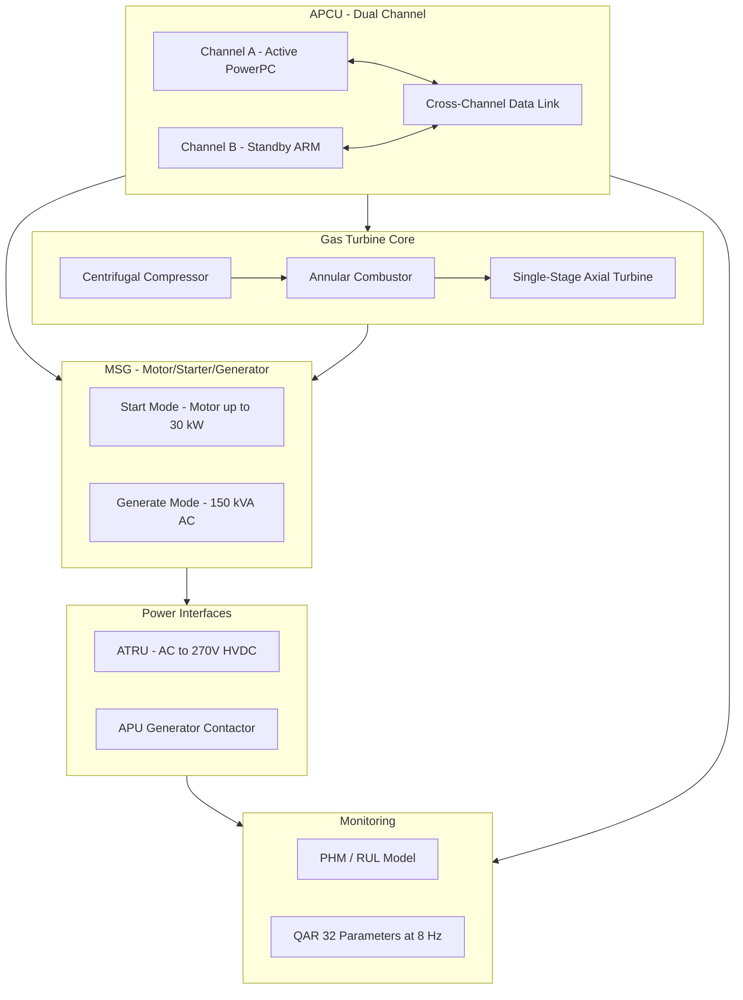
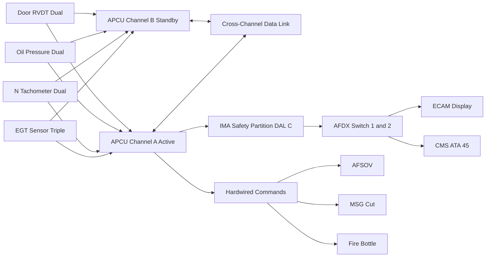
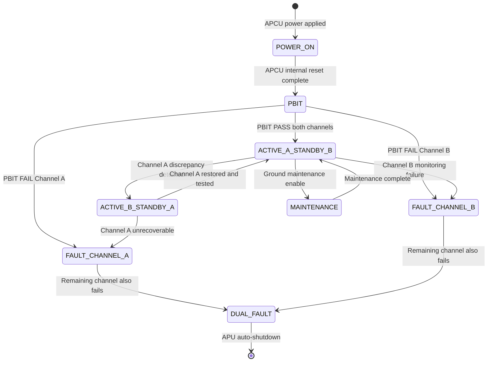

# ATLAS 040-049 · Section 04 · Subsection 049 · 010 — Auxiliary Power Unit Architecture

## §0. Hyperlink Policy

All hyperlinks within this document use **relative paths** from the current file location. Cross-subsection links navigate to sibling files within `./` (same folder), to the subsection index at [`./README.md`](./README.md), and to parent indexes at `../`, `../../`, and `../../../`. Absolute URLs are used only for external standards references. No link shall reference an absolute filesystem path.

---

## §1. Purpose

This document defines the architectural decomposition of the APU system on the **AMPEL360E eWTW** aircraft, with specific focus on the dual-channel APCU design, the gas turbine core (GTC) component hierarchy, the integrated Motor Starter/Generator (MSG), the AFDX communications backbone, and the Integrated Modular Avionics (IMA) partition boundary.

The APU architecture on the AMPEL360E eWTW reflects a deliberate design philosophy to eliminate all pneumatic load interfaces and focus the APU solely on HVDC electrical generation. This results in a fundamentally different LRU set compared to conventional APUs: there is no pneumatic manifold, no load control valve, no pre-cooler, and no surge control valve. Instead, the architecture adds an APU Transformer Rectifier Unit (ATRU), HVDC bus tie protection logic, and enhanced GCU regulation firmware, all coordinated through the APCU's dual-channel control architecture.

The APCU dual-channel design (Channel A active, Channel B standby) is the cornerstone of APU fault tolerance. Both channels receive identical sensor inputs simultaneously; Channel A generates all command outputs while Channel B monitors the inputs and A's outputs for discrepancies. Cross-channel comparison logic detects failures in sensor processing, actuation commands, and internal APCU self-tests (PBIT/CBIT). When a critical discrepancy is detected, Channel B assumes authority within one APCU computation cycle (< 10 ms), maintaining APU protection without interruption. The dual-channel design supports DO-178C DAL C assurance by providing architectural mitigation against common-cause failure in the software partition, supplemented by hardware diversity in the channel A and B processor implementations.

The no-bleed philosophy of the AMPEL360E eWTW fundamentally simplifies the APU pneumatic interface while increasing demands on the electrical generation architecture. A conventional APU typically splits its power output between pneumatic (dominant, for engine starting and ECS) and electrical (secondary). On the eWTW, 100 % of APU useful power output is electrical — requiring higher-rating MSG and ATRU units, more sophisticated GCU voltage regulation across the full load range (0 to 150 kVA), and closer coordination with the ATA 24 electrical power management system. This architectural document traces all these implications through the LRU set, interface matrix, and performance requirements.

---

## §2. Applicability

| Parameter | Value |
|---|---|
| Aircraft Program | AMPEL360E eWTW |
| ATA Chapter | 49 — Airborne Auxiliary Power |
| Architecture Layer | APU sub-system (LRU-level) |
| IMA Platform | ARINC 653 partition host (APCU hosted on aircraft IMA cabinet) |
| Architecture DAL | DO-178C DAL C (APCU safety partition), DO-178C DAL D (GCU firmware) |
| AFDX Topology | Full-duplex switched Ethernet, ARINC 664 Part 7 (two-port end-system in APCU) |
| Certification Basis | EASA CS-25 (Amendment 27+), CS-APU Issue 1, DO-178C, DO-254 (APCU FPGA) |
| S1000D SNS | 049-010-00 (APU Architecture) |
| Bleed Architecture | Bleed-less — no pneumatic output from APU |
| Electrical Output | ~150 kVA HVDC 270 V via ATRU from frequency-wild AC |
| Cross-channel Switchover | < 10 ms authority transfer A→B |

---

## §3. Functional Description

The APCU dual-channel architecture assigns Channel A as the permanently active computing element and Channel B as the continuously monitoring standby. Both channels are implemented on separate processing boards within a single APCU housing. Hardware diversity — Channel A uses a PowerPC-class processor, Channel B uses an ARM Cortex-class processor — eliminates common-mode processor failures from the fault model. Software is binary-identical on both channels (divergence monitoring detects any runtime deviation), satisfying DO-178C DAL C by partitioning the software life cycle evidence between the structural coverage achieved through testing and the architectural independence provided by the dual-channel hardware.

The Gas Turbine Core (GTC) is a single-spool unit comprising a centrifugal compressor stage, an annular combustion chamber with multiple fuel nozzle injectors, and a single-stage axial turbine. The GTC shaft drives the MSG rotor via an accessory gearbox. Compressor pressure ratio is approximately 8:1 at design point (100 % N), generating sufficient airflow for combustion and turbine power extraction. The GTC design is optimised for SAF fuels up to 50 % blend ratio — combustor liner materials (Hastelloy X candidate) and fuel nozzle metallurgy (Inconel 625 candidate) are selected for SAF compatibility per ASTM D7566 Annex A and B.

The MSG is mounted on the accessory gearbox output shaft and transitions between motor mode (during start) and generator mode (during APU-running). In motor mode, MSG consumes up to 30 kW from the aircraft battery or ground power bus, providing motoring torque to spin up the GTC to light-off speed (~15 % N). In generator mode, MSG produces frequency-wild three-phase AC; the ATRU rectifies this to 270 V HVDC for connection to the aircraft main bus via the AGC. The AFDX two-port end-system embedded in the APCU provides two independent AFDX virtual links (VL) for redundancy — VL-APU-A for primary data exchange and VL-APU-B as standby — each connecting to separate AFDX switches in the aircraft backbone.

### §3.1 Functional Breakdown

| Function | Sub-system | Architecture Element |
|---|---|---|
| Dual-channel control | APCU Channel A + Channel B | Dual-board APCU housing, hardware-diverse processors |
| Gas turbine power | GTC (compressor/combustor/turbine) | Single-spool, centrifugal compressor, annular combustor, axial turbine |
| Electrical generation | MSG generator mode | Frequency-wild AC → ATRU → 270 V HVDC |
| Power conditioning | ATRU | AC-DC rectifier, 150 kVA capacity, galvanic isolation |
| Network communication | AFDX two-port end-system | ARINC 664 P7, dual VL, dual switch connection |
| Health monitoring | PHM module + QAR concentrator | MEMS vibration, EGT trend, RUL prediction |

### Diagram 1: APU Architecture Layers

---

## §4. System Architecture

The APCU channels share all sensor inputs through a dedicated sensor bus; each sensor signal is routed to both Channel A and Channel B via independent analogue signal conditioning paths on each channel board. Sensor inputs covered include: EGT (triple thermocouple array with 2-of-3 majority vote), N spool speed (dual magnetic tachometer pickups, higher-of-two selection on each channel independently), oil pressure (dual piezo transducers, lower-of-two selection for conservative protection), and inlet door position (dual RVDT, compared for consistency). The sensor voter logic on each channel is implemented in the FPGA sub-layer (DO-254 DAL C), not in software, providing additional independence from the DO-178C software partition.

The AFDX virtual link allocation for the APCU is defined in the aircraft Network Configuration File (NCF) maintained by Q-DATAGOV. The APCU occupies two VLs on the aircraft AFDX backbone: VL-049-A (primary, connected to AFDX Switch 1) and VL-049-B (redundant, connected to AFDX Switch 2). ECAM and CMS are end-subscribers on both VLs; the AFDX end-system in the APCU selects Channel A VL for normal transmission. Maximum end-to-end latency from APCU data generation to ECAM display is < 2 ms per ARINC 664 P7 scheduling.

The IMA partition boundary for the APCU is defined such that the safety-critical APU control partition (DAL C) is hosted on a dedicated IMA processing module with memory and CPU time partitioned per ARINC 653 from the monitoring partition (DAL D). The safety partition manages all mode transitions, protection logic, and hardwired command outputs. The monitoring partition manages PHM calculations, QAR data formatting, ACARS message preparation, and MCDU maintenance page rendering. Partition boundary violations are detected by the ARINC 653 operating system health monitor and trigger an APCU fault flag to the safety partition.

### Diagram 2: APCU Channel A/B Cross-Comparison and Data Flow

---

## §5. Components and Line-Replaceable Units

| LRU | Part Number | Qty | Location | Replacement Interval |
|---|---|---|---|---|
| APCU dual-channel unit |  | 1 | APU avionics shelf | On condition / 10 000 APU cycles |
| GTC assembly (complete) |  | 1 | APU nacelle | On condition / 20 000 APU cycles |
| MSG unit (motor/generator) |  | 1 | Accessory gearbox output shaft | On condition / 5 000 APU cycles |
| ATRU (APU transformer rectifier) |  | 1 | APU electrical bay | On condition / 8 000 APU hours |
| AFDX end-system module (APCU embedded) |  | 1 | APCU board | On condition |
| Generator Control Unit (GCU) |  | 1 | APU compartment shelf | On condition |
| Cross-channel data link module |  | 1 | APCU internal | On condition |
| APCU FPGA sensor voter board |  | 2 (one per channel) | APCU Channel A and B boards | On condition / APCU replacement |
| Accessory gearbox assembly |  | 1 | GTC shaft aft end | 12 000 APU cycles |
| ARINC 653 OS health monitor module |  | 1 | IMA cabinet | Software, on condition |

---

## §6. Interfaces

| Interface | Peer System | Protocol / Bus | Data Exchanged |
|---|---|---|---|
| ECAM data feed | ATA 31 ECAM | AFDX VL-049-A/B | N%, EGT, oil pressure, gen load, door, fault codes |
| CMS fault reporting | ATA 45 CMS | AFDX | PBIT/CBIT results, fault codes, PHM data |
| IMA safety partition boundary | IMA cabinet (ARINC 653) | Memory map + CPU schedule | Safety partition ↔ monitoring partition isolation |
| Cross-channel discrete | APCU Ch-A to Ch-B internal | Dedicated APCU backplane bus | Parameter comparison, authority transfer signal |
| Sensor bus (EGT/N/oil/RVDT) | All APU sensors | APCU analogue input ports | Sensor voltages, frequencies, resistance values |
| Hardwired safety commands | AFSOV, MSG, fire bottle | Discrete hardwired | Power signals for AFSOV solenoid, MSG cut relay, squib |
| GCU voltage regulation loop | GCU ↔ MSG | Analogue + discrete | Voltage setpoint, load feedback, AGC command |
| AFDX backbone | Aircraft AFDX Switches 1 and 2 | ARINC 664 P7 full-duplex | APU VL-049-A primary, VL-049-B redundant |

---

## §7. Operations and Modes

| Mode | Channel State | Description |
|---|---|---|
| POWER_ON | Both channels initialising | APCU powered; PBIT sequence begins on both channels simultaneously |
| PBIT | Both channels testing | Power-on built-in test; sensor excitation, actuator loop-back, cross-channel compare |
| ACTIVE_A_STANDBY_B | Ch-A active, Ch-B monitor | Normal operation; all commands from Ch-A, Ch-B monitors and compares |
| ACTIVE_B_STANDBY_A | Ch-B active, Ch-A monitor | Ch-A fault detected; automatic authority transfer to Ch-B |
| FAULT_CHANNEL_A | Ch-A faulted | Ch-A isolated; Ch-B operates solo; ECAM APCU FAULT CHAN A advisory |
| FAULT_CHANNEL_B | Ch-B faulted | Ch-B isolated; Ch-A operates solo; ECAM APCU FAULT CHAN B advisory |
| DUAL_FAULT | Both channels faulted | Emergency: APU auto-shutdown initiated via hardwired path; ECAM APCU DUAL FAULT |
| MAINTENANCE | Test mode | Ground maintenance; auto-shutdown protection inhibit available; CBIT extended test |

### Diagram 3: APCU Channel State Machine

---

## §8. Performance and Budgets

| Parameter | Requirement | Target | Status |
|---|---|---|---|
| APCU computation cycle | < 10 ms | 8 ms |  |
| Cross-channel comparison latency | < 5 ms | 3 ms |  |
| PBIT duration (both channels) | < 90 s | 75 s |  |
| CBIT coverage | > 95 % | 97 % |  |
| AFDX VL max end-to-end latency | < 2 ms | 1.5 ms |  |
| Channel A→B authority transfer | < 10 ms | 8 ms |  |
| APCU sensor voter settling | < 2 ms | 1.5 ms |  |
| IMA safety partition CPU utilisation | < 70 % | 55 % |  |
| ATRU conversion efficiency | > 95 % | 96 % |  |
| GTC spool start time (0 to 15% N) | < 30 s | 20 s |  |

---

## §9. Safety, Redundancy and Fault Tolerance

- **Dual-channel APCU with hardware diversity**: Channel A (PowerPC) and Channel B (ARM Cortex) hardware processors ensure no common-mode processor failure can simultaneously disable both channels; architectural mitigation for DO-178C DAL C single-version software.
- **IMA partition isolation (ARINC 653)**: Safety partition (DAL C) is memory- and CPU-time-isolated from monitoring partition (DAL D); a runaway monitoring partition process cannot corrupt safety partition state.
- **AFDX dual virtual link redundancy**: VL-049-A and VL-049-B connect to separate AFDX switches; a single AFDX switch failure does not interrupt APU data communications to ECAM and CMS.
- **FPGA sensor voter logic**: EGT 2-of-3 majority voting and N dual-sensor higher-of-two selection implemented in FPGA (DO-254 DAL C), not software, preventing software errors from corrupting sensor protection logic.
- **Hardwired safety command bypass**: All safety-critical commands (AFSOV close, MSG cut, fire bottle arm) are hardwired discrete signals bypassing the AFDX network and APCU software stack, ensuring protection capability even in a total software failure scenario.
- **Cross-channel data link monitoring**: The dedicated cross-channel link is itself monitored; a detected link failure causes the active channel to generate a DUAL FAULT flag and initiate safe APU shutdown rather than continuing with unmonitored operation.
- **GCU independent voltage protection**: The GCU implements independent analogue overvoltage and undervoltage relay protection for the HVDC output; these relays operate independently of APCU software, providing an additional protection layer.
- **ATRU thermal protection**: The ATRU contains an independent thermal cutout sensor (separate from APCU monitoring) that disconnects the ATRU from the MSG output if winding temperature exceeds 180 °C, preventing insulation damage.
- **Accessory gearbox oil monitoring**: Gearbox oil pressure and temperature are independently sensed and fed to both APCU channels; a gearbox dry-run condition triggers immediate APU shutdown protecting MSG bearings.
- **ARINC 653 health monitor**: The IMA ARINC 653 OS health monitor detects and reports partition timing violations, memory protection faults, and scheduling anomalies to the APCU safety partition, enabling pre-emptive fault response.

---

## §10. Maintenance and Diagnostics

| Task | Interval | Access | Tools Required |
|---|---|---|---|
| APCU PBIT review and channel health log | Pre-flight / 200 FH | MCDU maintenance page / laptop | APCU GSE interface, maintenance terminal |
| CBIT coverage report download | 500 FH | CMS ATA 45 laptop connection | CMS ground station software |
| ATRU thermal history review | 1 000 APU hours | APCU MCDU data export | Maintenance terminal |
| GCU firmware version check | Every scheduled check | APCU GSE | GSE software, firmware library |
| AFDX VL health check | 1 000 FH | AFDX analyser on ground | AFDX network analyser, NCF reference |
| Cross-channel link continuity test | C-check | APCU GSE with maintenance mode | APCU GSE, digital oscilloscope |
| MSG winding resistance check | 2 000 APU cycles | Electrical bay access | Calibrated milli-ohmmeter |
| GTC borescope inspection | 3 000 APU cycles | Combustor inspection ports | Flexible borescope, illuminator |
| FPGA sensor voter test | C-check | APCU GSE with injected sensor signals | GSE signal injection kit |
| ATRU insulation resistance test | Annual | Electrical bay access | Insulation resistance tester 1 kV DC |

---

## §11. Configuration and Software

- **APCU safety partition software**: DO-178C DAL C; binary-identical on Channel A and B; software configuration item (CI) version controlled in CMC; updates require full software qualification evidence package.
- **APCU monitoring partition software**: DO-178C DAL D; PHM model, QAR formatter, ACARS builder, MCDU renderer; updatable via AFDX data load without hardware removal, subject to data load procedure approval.
- **GCU firmware**: DO-178C DAL D; manages voltage regulation PID loop, load-fault detection, AGC control logic; firmware version verified at PBIT by APCU sensor voter FPGA CRC check.
- **APCU FPGA bitstream**: DO-254 DAL C; sensor voter logic, cross-channel arbiter, hardwired command driver; loaded from APCU non-volatile memory at power-up; CRC-verified at each PBIT.
- **IMA partition configuration table**: ARINC 653 partition schedule, memory map, and health monitor parameters are stored in the IMA cabinet configuration file (CDF); any change requires aircraft-level IMA revalidation.
- **NCF AFDX virtual link parameters**: VL-049-A and VL-049-B BAG, jitter, and frame size parameters are embedded in the aircraft NCF; changes require full NCF revalidation and EASA DAI notification.

---

## §12. Environmental and Physical Constraints

| Constraint | Specification | Standard |
|---|---|---|
| APCU operating temperature | −55 °C to +70 °C | DO-160G Section 4 Cat D2 |
| GTC vibration (nacelle mount) | 10 g broadband RMS | DO-160G Section 8 Cat U |
| ATRU thermal dissipation | < 4 % of rated output as heat | Internal thermal model |
| APCU shock (hard landing) | 15 g / 11 ms | DO-160G Section 7 |
| MSG moisture ingress | IP67 equivalent (sealed housing) | Manufacturer specification |
| AFDX end-system EMC | HIRF Zone 3, lightning indirect effects | DO-160G Sections 19, 22 |
| Altitude (APCU operation) | Sea level to FL410 | DO-160G Section 4 |
| ATRU fluid susceptibility | Jet-A, no hydraulic fluid exposure | DO-160G Section 11 |

---

## §13. Human Factors and Crew Interface

- **Channel status transparency**: The ECAM APU synoptic page displays the active APCU channel (A or B) in the bottom status bar, allowing crew to identify single-channel degraded operation without consulting the MCDU maintenance page.
- **Dual-fault aural warning**: An APCU DUAL FAULT condition generates a dedicated CCAS aural alert distinct from the APU FIRE alert, ensuring crews can distinguish between a protection system failure and an actual fire event.
- **Maintenance page readability**: The MCDU APU maintenance page presents channel health, PBIT/CBIT results, and PHM indicators in structured plain-English format consistent with AMPEL360E HFDS; no specialist avionics knowledge is required for first-line interpretation.
- **Authority transfer indication**: Automatic channel authority transfer from A to B generates an amber ECAM advisory "APU APCU CHAN XFER" to alert crew to the degraded but functional condition without requiring immediate action.
- **GCU load indication**: Real-time APU generator load (kVA and % capacity) is displayed on the ECAM APU synoptic, allowing crew and ground crew to monitor load sharing and avoid overload conditions during heavy electrical starts.
- **Software load status**: Following any APCU software update, the MCDU displays a "APCU SW LOAD COMPLETE — VERIFY PBIT" prompt, ensuring crew confirms successful software installation before APU start.

---

## §14. Test and Validation

| Test | Method | Acceptance Criterion | Status |
|---|---|---|---|
| APCU dual-channel PBIT functional test | Laboratory bench with signal injection | Both channels PBIT PASS < 90 s |  |
| Channel authority transfer test | APCU GSE — inject channel A fault | Transfer complete < 10 ms, no command gap |  |
| FPGA sensor voter validation | Signal injection with controlled fault | 2-of-3 EGT voter passes 100 % of test cases |  |
| AFDX VL latency measurement | Network analyser on aircraft AFDX | VL-049-A/B latency < 2 ms, zero loss |  |
| IMA partition isolation test | ARINC 653 OS fault injection | Safety partition unaffected by monitoring partition fault |  |
| ATRU efficiency measurement | Load bank test at 150 kVA | Efficiency ≥ 95 % at full load |  |
| DO-178C DAL C software review | Independent software verification | All DO-178C objectives satisfied, DER reviewed |  |
| DO-254 DAL C FPGA review | FPGA verification plan review | All DO-254 hardware design objectives satisfied |  |

---

## §15. Regulatory Compliance

| Regulation | Requirement | Compliance Method | Status |
|---|---|---|---|
| DO-178C DAL C | APCU software assurance | Software life cycle data package, independent DER |  |
| DO-254 DAL C | APCU FPGA hardware assurance | FPGA design assurance plan, independent review |  |
| ARINC 653 | IMA partition isolation | Partition configuration table, OS health monitor test |  |
| ARINC 664 P7 | AFDX network specification | NCF validation, VL latency measurement |  |
| CS-25 §25.1309 | Equipment, systems and installations | FHA + FMEA + FTA for dual-channel APCU |  |
| CS-APU Issue 1 | APU airworthiness — control system | Control system architecture compliance review |  |
| DO-160G | Environmental qualification | Environmental test reports all sections |  |

---

## §16. Certification Evidence

-  APCU DO-178C DAL C software life cycle data package — pending software qualification
-  APCU FPGA DO-254 DAL C hardware design assurance plan and verification evidence
-  APCU dual-channel FHA (Functional Hazard Assessment) — CS-25 §25.1309 safety analysis
-  APCU FMEA (Failure Modes and Effects Analysis) — channel A/B failure modes
-  AFDX NCF validation report — VL-049-A/B parameters confirmed
-  IMA partition configuration and isolation test report
-  ATRU qualification test report (efficiency, thermal, DO-160G)
-  Channel authority transfer test report (< 10 ms demonstrated)
-  GCU firmware DO-178C DAL D qualification report
-  DO-160G environmental qualification test reports (APCU, ATRU, GCU)

---

## §17. Open Issues

| ID | Description | Owner | Target | Status |
|---|---|---|---|---|
| OI-049-010-001 | Confirm APCU hardware processor selection (PowerPC vs ARM variants) | Q-AIR / Q-HPC | 2026-Q3 |  |
| OI-049-010-002 | Finalise AFDX NCF VL allocation for APU (BAG and jitter parameters) | Q-DATAGOV | 2026-Q3 |  |
| OI-049-010-003 | Complete IMA partition schedule for APCU safety partition CPU budget | Q-HPC | 2026-Q4 |  |
| OI-049-010-004 | Confirm GTC supplier and accessory gearbox interface dimensions | Q-MECHANICS | 2026-Q3 |  |
| OI-049-010-005 | Validate ATRU 150 kVA capacity with thermal model at ISA+20 ground conditions | Q-AIR | 2026-Q4 |  |

---

## §18. Glossary

| Acronym / Term | Definition |
|---|---|
| APCU | APU Control Unit — dual-channel DO-178C DAL C computer governing all APU modes |
| MSG | Motor Starter/Generator — dual-mode machine acting as starter motor and HVDC generator |
| IMA | Integrated Modular Avionics — shared computing platform hosting multiple aircraft functions under ARINC 653 |
| AFDX | Avionics Full-Duplex Switched Ethernet — ARINC 664 Part 7 deterministic aircraft data network |
| DAL | Design Assurance Level — DO-178C/DO-254 software/hardware criticality classification |
| PBIT | Power-on Built-In Test — self-test sequence executed at APCU power-up, duration < 90 s |
| PHM | Prognostic Health Management — system predicting remaining useful life of APU components |
| FCU | Fuel Control Unit — electronic metering unit controlling fuel flow to combustor nozzles |
| ACE | Actuator Control Electronics — generic term for electronic driver for an EMA or solenoid |
| SNS | Standard Numbering System — S1000D hierarchical code for data module identification |

---

## §19. Citations

| Standard | Title | Issuer | Applicability |
|---|---|---|---|
| DO-178C | Software considerations in airborne systems | RTCA | APCU software assurance DAL C |
| DO-254 | Design assurance guidance for airborne electronic hardware | RTCA | APCU FPGA assurance DAL C |
| ARINC 653 | Avionics application software standard interface | ARINC | IMA partition management |
| ARINC 664 P7 | Aircraft data network — AFDX | ARINC | APU AFDX virtual links |
| CS-25 §25.1309 | Equipment, systems and installations | EASA | APCU safety analysis |
| CS-APU Issue 1 | Airworthiness standards for APU | EASA | APU control system compliance |
| DO-160G | Environmental conditions and test procedures | RTCA | APCU/ATRU environmental qualification |
| SAE AS6858 | APU control system architecture | SAE | APCU design guidance |

---

## §20. References

| Document | Path | Relation |
|---|---|---|
| Q+ATLANTIDE Baseline | [../../../../organization/Q+ATLANTIDE.md](../../../../organization/Q+ATLANTIDE.md) | Parent baseline |
| ATLAS 040-049 Architecture | [../../../README.md](../../../README.md) | Parent architecture |
| Section 04 Index | [../../README.md](../../README.md) | Parent section index |
| Subsection 049 Index | [./README.md](./README.md) | Subsection index |
| 049-000 APU General | [./049-000-Airborne-Auxiliary-Power-General.md](./049-000-Airborne-Auxiliary-Power-General.md) | Sibling — parent overview |
| 049-020 Air Inlet | [./049-020-APU-Air-Inlet-and-Exhaust.md](./049-020-APU-Air-Inlet-and-Exhaust.md) | Sibling subsubject |
| 049-030 Fuel Supply | [./049-030-APU-Fuel-Supply-and-Control.md](./049-030-APU-Fuel-Supply-and-Control.md) | Sibling subsubject |
| 049-040 Ignition Starting | [./049-040-APU-Ignition-Starting-and-Generation.md](./049-040-APU-Ignition-Starting-and-Generation.md) | Sibling subsubject |
| 049-050 Load Interfaces | [./049-050-APU-Pneumatic-and-Electrical-Load-Interfaces.md](./049-050-APU-Pneumatic-and-Electrical-Load-Interfaces.md) | Sibling subsubject |

---

## §21. Footprint

| Metric | Value |
|---|---|
| Document ID | QATL-ATLAS-1000-ATLAS-040-049-04-049-010-AUXILIARY-POWER-UNIT-ARCHITECTURE |
| Subsubject | 010 — Auxiliary Power Unit Architecture |
| Sections | §0 – §22 (23 sections) |
| Tables | 16 |
| Mermaid diagrams | 3 |
| LRUs documented | 10 |
| Glossary entries | 10 |
| Regulatory references | 8 |
| Open issues | 5 |
| Version | 1.0.0 |
| Status | active |

---

## §22. Change Log

| Version | Date | Author | Change Description |
|---|---|---|---|
| 1.0.0 | 2026-05-10 | Q-AIR / ATLAS Working Group | Initial release — full 22-section content for APU Architecture |
