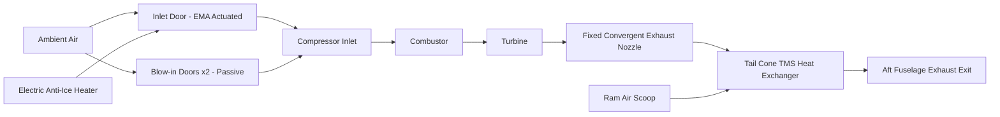
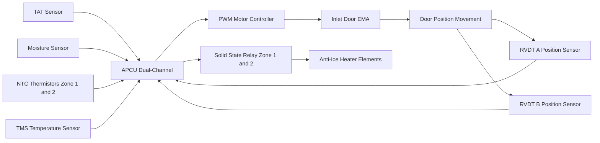
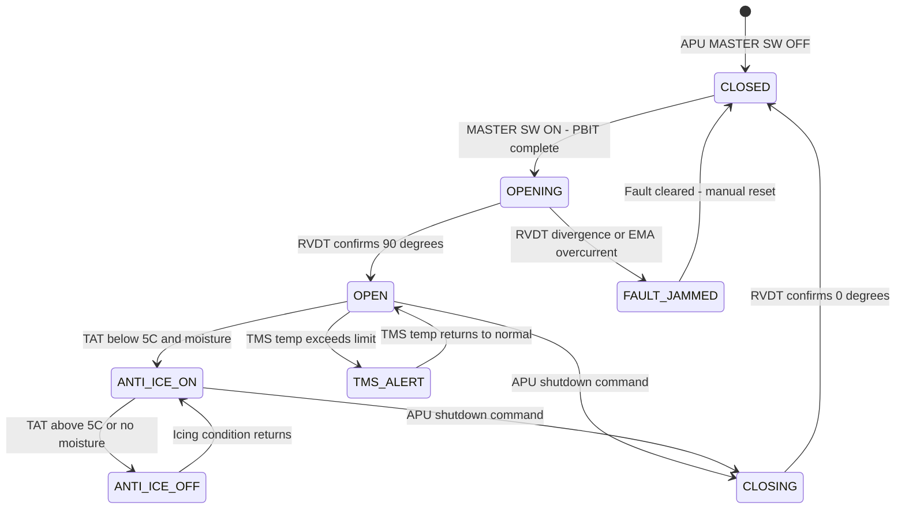

# ATLAS 040-049 · Section 04 · Subsection 049 · 020 — APU Air Inlet and Exhaust

## §0. Hyperlink Policy

All hyperlinks within this document use **relative paths** from the current file location. Cross-subsection links navigate to sibling files within `./` (same folder), to the subsection index at [`./README.md`](./README.md), and to parent indexes at `../`, `../../`, and `../../../`. Absolute URLs are used only for external standards references. No link shall reference an absolute filesystem path.

---

## §1. Purpose

This document defines the APU air inlet and exhaust system on the **programme-defined aircraft type** aircraft. The system comprises three functional domains: the electrically actuated inlet door, the passive blow-in pressure relief doors, the electrically heated inlet anti-ice system (with no bleed air — a critical distinction for the [PROGRAMME-VARIANT] architecture), and the exhaust gas path through the fixed exhaust nozzle to the tail cone thermal management system (TMS).

The APU inlet door is actuated by a single Electro-Mechanical Actuator (EMA) driven by the APCU. Door position is sensed by a dual-redundant Rotary Variable Differential Transformer (RVDT) pair mounted on the door hinge assembly. The APCU cross-compares both RVDT signals; a divergence exceeding 2° triggers an EMA fault flag. The inlet door is required to be in the OPEN position before the APU start sequence may proceed; APCU inhibits the start command until both RVDTs confirm the fully-open position.

Two passive blow-in doors are installed on the APU nacelle lower surface. These doors are spring-loaded to the closed position and open automatically when the inlet differential pressure exceeds −40 kPa (i.e., compressor suction creates a low-pressure zone inside the nacelle). The blow-in doors supplement inlet airflow during ground operation with low wind velocity and cross-wind conditions, preventing compressor stall due to inlet flow distortion.

The inlet anti-ice system uses embedded electrical resistance heating elements in the inlet lip and inlet duct wall, consuming approximately 2 kW at maximum power. This is a fundamental departure from conventional APU installations that use hot bleed air from the compressor for inlet anti-ice. On the [PROGRAMME-VARIANT], no bleed air is available from the APU; the electric heaters are powered from the aircraft battery bus during ground pre-heat or from the APU generator bus once APU generation is online. Anti-ice activation is commanded by the APCU when Total Air Temperature (TAT) falls below +5 °C and visible moisture is sensed (icing condition per CS-25 Appendix C).

The exhaust nozzle is a fixed-geometry convergent nozzle fabricated from Inconel 625 (candidate material), capable of withstanding continuous EGT up to 950 °C and short-term excursions to 1 000 °C. The exhaust gas is directed aft through a tail cone thermal management system that includes a ram-air-cooled heat exchanger to reduce the nacelle skin temperature in the exhaust zone to within structural material limits.

---

## §2. Applicability

| Parameter | Value |
|---|---|
| Aircraft Program | programme-defined aircraft type |
| ATA Chapter | 49 — Airborne Auxiliary Power |
| Subsystem | APU Air Inlet and Exhaust |
| Inlet door actuation | EMA (electric), single actuator, dual RVDT position sensing |
| Inlet anti-ice method | Electric resistance heating, no bleed air ([PROGRAMME-VARIANT] bleed-less design) |
| Anti-ice power consumption | ~2 kW maximum, thermostatically regulated |
| Blow-in door open differential pressure | < −40 kPa inlet differential (passive spring-loaded) |
| Exhaust nozzle material | Inconel 625 (candidate) — CS-25 §25.1181 fire zone compliant |
| Exhaust nozzle exit temperature | Up to 950 °C continuous, 1 000 °C short-term |
| TMS heat exchanger type | Ram-air crossflow, aluminium core with stainless steel endplates |
| S1000D SNS | 049-020-00 (APU Air Inlet and Exhaust) |
| Certification Basis | CS-25 §25.1181, CS-APU Issue 1, DO-178C (APCU) |

---

## §3. Functional Description

The APU inlet door is the primary flow control element for the APU air supply. It is a single-panel door hinged at the forward edge of the APU nacelle inlet aperture. The EMA extends to open the door to approximately 90° (fully open) and retracts to close it flush with the nacelle contour (fully closed). EMA stroke is 120 mm with a maximum open/close time of 8 seconds. The EMA is powered from the APCU control power bus (28 V DC); the APCU drives the EMA via a Pulse-Width-Modulated (PWM) motor controller with current limiting to prevent stall damage. RVDT A and B provide analogue position voltage outputs (0–5 V across 0°–90°) that are independently digitised by each APCU channel; door position agreement between both RVDTs within 2° is a PBIT verification item.

The blow-in doors are passive mechanical devices. Each door is a hinged flap, spring-preloaded to keep it closed against the nacelle outer mould line at all differential pressures above −40 kPa. When the running compressor creates a low-pressure zone inside the nacelle, atmospheric pressure pushes the blow-in doors inward, supplementing the primary inlet airflow. The blow-in doors are sized to provide up to 15 % of the compressor design airflow under worst-case cross-wind ground conditions. They require no electrical connection or APCU command; their operation is transparent to the APCU except that door open/closed position is sensed by simple microswitch position indicators that feed the APCU for ECAM status display.

The electric anti-ice heaters are embedded kapton-insulated resistance elements bonded to the aluminium inlet lip structure. The heater elements are divided into two zones: Zone 1 (inlet lip crown, ~1.2 kW) and Zone 2 (inner duct wall, ~0.8 kW). Each zone is independently controlled by the APCU through solid-state relay drivers. Zone temperature is monitored by NTC thermistors in each zone; the APCU applies bang-bang control to keep zone temperatures within the 5 °C to 25 °C target range during icing conditions. Heater power is sourced from the HVDC bus via a dedicated circuit breaker; the heater system draws ~7.5 A at 270 V DC.

The APU exhaust nozzle is a convergent fixed nozzle with an exit area sized to produce subsonic exhaust velocities at all APU operating conditions. The exhaust is directed 15° below horizontal to minimise fuselage skin heating and prevent exhaust gas ingestion by the main engines or the APU inlet during all operating conditions. The tail cone TMS heat exchanger is a crossflow aluminium-core unit fed by a dedicated ram-air scoop on the aft fuselage; it reduces tail cone skin temperature by up to 120 °C relative to uncooled operation at maximum EGT.

### §3.1 Functional Breakdown

| Function | Sub-system | Control Authority |
|---|---|---|
| Inlet door actuation | EMA + PWM controller | APCU commanded open/close |
| Door position sensing | Dual RVDT | APCU cross-compared; divergence fault |
| Blow-in pressure relief | Passive spring-loaded doors ×2 | Autonomous — no APCU command |
| Electric inlet anti-ice | Resistance heater zones 1 and 2 | APCU bang-bang via solid-state relay |
| Exhaust gas management | Fixed convergent nozzle | Passive — no moving parts |
| TMS tail cone cooling | Ram-air crossflow heat exchanger | Passive — ram-air driven |

### Diagram 1: APU Air and Exhaust Flow Path

---

## §4. System Architecture

The inlet door EMA is the only electrically commanded actuator in the air inlet subsystem; all other elements are passive (blow-in doors, exhaust nozzle, TMS heat exchanger). The APCU EMA control loop is closed via the dual RVDT feedback. Position control algorithm: APCU commands full power open until RVDT target position (90° ± 2°) is reached, then removes power; the EMA self-locking worm gear holds the door open without continuous power. On close command, APCU commands full power close until 0° ± 2°; again, worm gear holds closed.

Anti-ice power demand (~2 kW) is budgeted within the APU generator power margin. During start (before AGC close), anti-ice is powered from the aircraft battery bus if icing conditions exist; this places a ~7.5 A load on the 270 V battery bus in addition to the MSG start motor current (~111 A peak). The APCU manages battery bus load shedding of non-critical loads during combined anti-ice + start demand to protect battery State of Charge (SOC).

The TMS heat exchanger sizing is based on a worst-case ground operation scenario at ISA+20 with APU at 100 % N and maximum EGT (880 °C target, 950 °C limit). The ram-air scoop delivers ambient airflow even during ground operation due to the aircraft's wing-mounted Electric Air Compressor (EAC) creating slight fuselage overpressure; a minimum of 0.5 m/s ambient airspeed at the scoop is assumed for ground TMS operation. In-flight, ram air provides sufficient cooling at all speeds above 80 kt.

### Diagram 2: Inlet Door and Anti-Ice Control Loop

---

## §5. Components and Line-Replaceable Units

| LRU | Part Number | Qty | Location | Replacement Interval |
|---|---|---|---|---|
| Inlet door EMA |  | 1 | Inlet door hinge frame | On condition / 6 000 APU cycles |
| Blow-in door assembly |  | 2 | APU nacelle lower surface | On condition / 10 000 cycles |
| RVDT position sensor (dual) |  | 2 | Inlet door hinge | On condition / 8 000 FH |
| Electric inlet anti-ice heater — Zone 1 |  | 1 | Inlet lip bonded element | On condition / 12 000 FH |
| Electric inlet anti-ice heater — Zone 2 |  | 1 | Inner duct wall bonded element | On condition / 12 000 FH |
| Solid-state relay driver module |  | 1 | APCU control power bay | On condition |
| Exhaust nozzle assembly |  | 1 | APU exhaust port | On condition / life-limited per LLP |
| TMS heat exchanger |  | 1 | Tail cone ram-air bay | On condition / 10 000 FH |
| Blow-in door microswitch position sensor |  | 2 | Blow-in door hinge | On condition / 5 000 FH |
| NTC thermistor zone monitoring |  | 4 (2 per zone) | Heater zone surface | On condition |

---

## §6. Interfaces

| Interface | Peer System | Protocol / Bus | Data Exchanged |
|---|---|---|---|
| EMA drive power | APCU control power bus | 28 V DC, PWM discrete | Motor direction, current limit, position feedback |
| RVDT position signals | APCU analogue input | Analogue 0–5 V | Door position A and B (compared for fault) |
| Anti-ice heater power | ATA 24 HVDC 270 V bus | 270 V DC via circuit breaker | ~7.5 A, two independent circuits (Zone 1, Zone 2) |
| TAT sensor input | ATA 34 Air Data System | ARINC 429 | Total Air Temperature for anti-ice activation logic |
| TMS temperature sensor | APCU analogue input | Analogue thermocouple | Tail cone skin temperature for TMS status |
| Blow-in door status | APCU discrete input | 28 V DC discrete | Door open/closed for ECAM status display |
| ECAM data | ATA 31 ECAM | AFDX ARINC 664 P7 | Door status, anti-ice status, TMS alert |
| CMS fault reporting | ATA 45 CMS | AFDX | EMA fault, RVDT divergence, heater fault codes |

---

## §7. Operations and Modes

| Mode | Trigger | Description | APCU Action |
|---|---|---|---|
| CLOSED | MASTER SW OFF or post-shutdown | Door flush with nacelle, EMA at 0° | EMA de-energised; heater off |
| OPENING | MASTER SW ON — PBIT complete | Door moving from 0° to 90° | EMA full power open; RVDT monitored |
| OPEN | RVDT A and B confirm 90° ± 2° | Door fully open; APU start permitted | EMA de-energised (worm gear hold); start sequence released |
| ANTI-ICE_ON | TAT < +5 °C and moisture sensed | Anti-ice heaters energised | Zone 1 and 2 SSR on; NTC loop active |
| ANTI-ICE_OFF | TAT ≥ +5 °C or no moisture | Anti-ice heaters off | Zone 1 and 2 SSR off |
| FAULT_JAMMED | RVDT divergence or EMA over-current | Door position fault | EMA de-energised; APCU FAULT flag; ECAM CAUTION |
| TMS_ALERT | TMS temp sensor > threshold | Tail cone overtemperature | APCU advisory; ECAM APU TMS TEMP advisory |
| CLOSING | APU shutdown command | Door moving from 90° to 0° | EMA full power close; door closed before final power off |

### Diagram 3: Inlet Door and Anti-Ice State Machine

---

## §8. Performance and Budgets

| Parameter | Requirement | Target | Status |
|---|---|---|---|
| Inlet door open time | ≤ 10 s | 8 s |  |
| Inlet door close time | ≤ 10 s | 8 s |  |
| RVDT position accuracy | ± 2° | ± 1.5° |  |
| Anti-ice Zone 1 power | ≤ 1.5 kW | 1.2 kW |  |
| Anti-ice Zone 2 power | ≤ 1.0 kW | 0.8 kW |  |
| Blow-in door open ΔP | < −40 kPa | −38 kPa spring preload |  |
| Exhaust nozzle continuous EGT | ≤ 950 °C | 880 °C design point |  |
| TMS skin temperature reduction | ≥ 100 °C vs uncooled | 120 °C target at ISA+20 |  |
| EMA stall current protection | < 5 A limit | 4.5 A current limit |  |
| Anti-ice NTC temperature control | 5 °C to 25 °C | ±3 °C dead-band |  |

---

## §9. Safety, Redundancy and Fault Tolerance

- **Dual RVDT position sensing**: RVDT A and RVDT B provide independent position voltages cross-compared by each APCU channel; a > 2° divergence at any position triggers EMA FAULT and halts further door actuation.
- **EMA worm-gear self-lock**: The EMA worm gear is self-locking; loss of drive power does not allow door to back-drive; door remains at last commanded position, preventing inadvertent closure during APU running.
- **Anti-ice dual zone independence**: Zone 1 and Zone 2 heaters are independently powered and controlled; failure of one zone does not affect the other; partial anti-ice protection is maintained with one zone failed.
- **Blow-in door passive redundancy**: Blow-in doors require no electrical power or APCU command; they function correctly even during total APCU failure, providing supplemental inlet airflow for any APU operation.
- **TMS passive operation**: The TMS ram-air heat exchanger requires no electrical power or control; its cooling function is maintained during any electrical failure scenario, protecting tail cone structure during APU operation.
- **Exhaust nozzle material margin**: Inconel 625 candidate material retains structural integrity to 1 100 °C, providing a 150 °C margin above the short-term limit of 950 °C, protecting against undetected over-EGT events.
- **EMA over-current protection**: The APCU PWM controller limits EMA current to 4.5 A; stall (e.g., door frozen or mechanically jammed) is detected within 2 seconds and EMA is de-energised to prevent motor burn-out.
- **Anti-ice heater thermal cutout**: Each anti-ice heater zone includes an independent thermal cutout fuse rated at 60 °C that disconnects the heater element if zone temperature exceeds the NTC-based control range, preventing heater damage.
- **APCU start interlock**: APU start sequence is inhibited by APCU if RVDT A or RVDT B does not confirm the OPEN position (≥ 88°); this prevents GTC start with restricted inlet airflow, protecting the compressor from stall.
- **Blow-in door status monitoring**: Microswitch position indicators on each blow-in door allow APCU to detect a door stuck open on ground (which would indicate airframe damage or foreign object), generating an ECAM advisory.

---

## §10. Maintenance and Diagnostics

| Task | Interval | Access | Tools Required |
|---|---|---|---|
| EMA functional test (open/close cycle) | 500 APU cycles | APU nacelle access, cowl open | APCU GSE, digital timer |
| RVDT calibration and cross-check | Annual | Inlet door hinge access | RVDT calibration bridge, APCU GSE |
| Anti-ice heater element resistance check | Annual | Electrical bay access, Zone 1 and 2 CBs | Calibrated ohmmeter |
| Blow-in door spring tension check | 1 000 FH | APU nacelle lower access | Spring tension gauge |
| Exhaust nozzle visual inspection | 500 FH | Exhaust bay access | Mirror, flashlight, borescope if crack suspected |
| TMS heat exchanger cleaning | 2 000 FH | Tail cone ram-air duct | Compressed air, fin comb |
| NTC thermistor calibration check | Annual | Zone access via SSR panel | Calibrated temperature reference |
| Door microswitch continuity | 500 FH | Blow-in door hinge | Continuity tester |
| EMA worm gear lubrication | 2 000 APU cycles | EMA access, gear train | Approved gear lubricant per AMM |
| Exhaust nozzle borescope inspection | 3 000 APU cycles | Exhaust bay ports | Flexible borescope |

---

## §11. Configuration and Software

- **EMA PWM control algorithm**: Implemented in APCU safety partition (DAL C); position control law, current limiting, and stall detection parameters stored in APCU non-volatile memory and validated at PBIT.
- **Anti-ice control algorithm**: Implemented in APCU safety partition (DAL C); bang-bang control with dead-band temperature thresholds; threshold tables validated at PBIT from non-volatile memory.
- **RVDT calibration data**: Stored in APCU calibration file in non-volatile memory; requires re-loading after APCU replacement or RVDT replacement; verified by GSE during acceptance test.
- **Blow-in door microswitch threshold**: Discrete signal processing threshold (open/closed decision) is a configuration parameter in APCU non-volatile memory; default value set during aircraft configuration.
- **TMS temperature alarm threshold**: APCU monitoring partition (DAL D) configurable parameter; default 250 °C tail cone skin limit; adjustable via APCU maintenance mode.

---

## §12. Environmental and Physical Constraints

| Constraint | Specification | Standard |
|---|---|---|
| EMA operating temperature | −55 °C to +85 °C | DO-160G Section 4 Cat E2 |
| Exhaust nozzle operating temperature | Up to 950 °C continuous | Inconel 625 material spec |
| Anti-ice heater moisture ingress | IP65 equivalent (sealed element) | Manufacturer specification |
| Blow-in door flutter frequency | > 200 Hz (above APU excitation) | Structural resonance analysis |
| RVDT vibration resistance | 7.7 g RMS | DO-160G Section 8 Cat S |
| TMS heat exchanger salt fog | Category S | DO-160G Section 14 |
| Exhaust nozzle fire zone compliance | CS-25 §25.1181 material requirement | CS-25 §25.1181 |
| EMA shock resistance | 15 g / 11 ms | DO-160G Section 7 |

---

## §13. Human Factors and Crew Interface

- **ECAM door status icon**: The ECAM APU synoptic page includes an animated inlet door icon that transitions from closed (grey) to open (green) as the door opens; crews can visually confirm door position before APU start.
- **Anti-ice status indication**: An "A-ICE ON" status indicator on the ECAM APU page activates (amber text) when any anti-ice zone is energised; crews can confirm anti-ice operation without MCDU access.
- **TMS alert message**: An ECAM advisory "APU TMS TEMP HI" is generated when TMS sensor exceeds 250 °C; the advisory includes a recommended crew action (reduce APU load or shut down) displayed on the ECAM actions page.
- **EMA fault indication**: An ECAM caution "APU INLET DOOR FAULT" is generated on EMA fault or RVDT divergence; the accompanying checklist directs crew to inhibit further APU starts and contact maintenance.
- **Ground crew access**: The inlet door position is visible from the ground at the APU nacelle; a red ground lock pin can be inserted through the door frame to mechanically lock the door open during maintenance, preventing inadvertent closure.
- **Blow-in door visible inspection**: Blow-in door hinges are accessible from the ground after removing the APU lower nacelle access panel; spring tension check requires no special equipment beyond the tension gauge specified in the AMM.

---

## §14. Test and Validation

| Test | Method | Acceptance Criterion | Status |
|---|---|---|---|
| EMA open/close cycle timing | Ground test with APCU command | Open and close < 10 s each |  |
| RVDT cross-comparison fault detection | GSE signal injection — introduce 3° divergence | APCU declares EMA FAULT within 1 s |  |
| Anti-ice heater power measurement | Laboratory bench — 270 V source, power meter | Zone 1: 1.2 kW ± 10 %; Zone 2: 0.8 kW ± 10 % |  |
| Anti-ice icing tunnel test | Icing wind tunnel per CS-25 App C | No ice accretion on inlet lip at CS-25 App C conditions |  |
| Blow-in door opening pressure test | Pressure differential rig | Doors open at −38 to −42 kPa differential |  |
| Exhaust nozzle temperature endurance | Furnace test at 950 °C for 100 hours | No cracking, distortion, or corrosion observed |  |
| TMS heat exchanger thermal performance | Ground test at ISA+20, 100 % N | Skin temperature reduction ≥ 100 °C |  |
| EMA stall protection test | Lock EMA mechanically, command open | Current limiting activates < 2 s, no motor damage |  |

---

## §15. Regulatory Compliance

| Regulation | Requirement | Compliance Method | Status |
|---|---|---|---|
| CS-25 §25.1181 | APU fire zone — exhaust nozzle material | Inconel 625 material certification, analysis |  |
| CS-25 Appendix C | Icing conditions — inlet anti-ice | Icing tunnel test demonstrating no inlet ice accretion |  |
| CS-APU Issue 1 | APU inlet and exhaust design | Design review and ground test report |  |
| DO-178C DAL C | APCU inlet door and anti-ice control software | Software life cycle data package |  |
| DO-160G | EMA and RVDT environmental qualification | Environmental test reports |  |
| CS-25 §25.1309 | System safety — EMA fault and inlet jam | FHA and FMEA for inlet door system |  |

---

## §16. Certification Evidence

-  Icing tunnel test report — CS-25 Appendix C compliance for electric inlet anti-ice
-  Exhaust nozzle material certification — Inconel 625 fire zone compliance per CS-25 §25.1181
-  EMA functional qualification test report — open/close cycle timing and stall protection
-  RVDT qualification test report — DO-160G vibration and temperature
-  Anti-ice heater zone power verification report
-  Blow-in door pressure opening test report — spring preload confirmation
-  TMS heat exchanger thermal performance test report — ISA+20 ground conditions
-  Inlet door FHA and FMEA — CS-25 §25.1309 safety analysis
-  APCU inlet door control software DO-178C DAL C life cycle data
-  DO-160G environmental qualification reports (EMA, RVDT, anti-ice SSR module)

---

## §17. Open Issues

| ID | Description | Owner | Target | Status |
|---|---|---|---|---|
| OI-049-020-001 | Confirm Inconel 625 vs Hastelloy X for exhaust nozzle material selection | Q-MECHANICS | 2026-Q3 |  |
| OI-049-020-002 | Finalise blow-in door spring preload value with GTC compressor flow model | Q-AIR | 2026-Q3 |  |
| OI-049-020-003 | Complete icing certification test plan per CS-25 Appendix C for electric anti-ice | Q-AIR / Q-GREENTECH | 2026-Q4 |  |
| OI-049-020-004 | Validate TMS heat exchanger sizing at ISA+20 ground conditions | Q-MECHANICS | 2026-Q4 |  |
| OI-049-020-005 | Confirm RVDT supplier and part number for dual redundant position sensing | Q-AIR / Procurement | 2026-Q3 |  |

---

## §18. Glossary

| Acronym / Term | Definition |
|---|---|
| EMA | Electro-Mechanical Actuator — electric motor with gearbox providing linear or rotary mechanical actuation |
| RVDT | Rotary Variable Differential Transformer — inductive position sensor providing analogue angle output |
| Blow-in door | Passive spring-loaded relief door opening under negative differential pressure to supplement APU inlet airflow |
| APU firewall | Structural barrier isolating the APU fire zone from adjacent aircraft structure per CS-25 §25.1181 |
| TMS | Thermal Management System — ram-air heat exchanger system reducing tail cone skin temperature in APU exhaust zone |
| Electric inlet anti-ice | Resistance heater elements embedded in inlet lip — replaces bleed-air anti-ice used on conventional APUs |
| SCTM | Structural Condition Thermal Margin — temperature margin between operating temperature and material limit |
| Inlet AOA | Inlet Angle of Attack — angle between ambient airflow and APU inlet axis, affects inlet pressure recovery |
| PWM | Pulse-Width Modulation — motor control technique varying duty cycle to control EMA speed and torque |
| NTC | Negative Temperature Coefficient thermistor — resistance temperature sensor used for anti-ice zone temperature control |

---

## §19. Citations

| Standard | Title | Issuer | Applicability |
|---|---|---|---|
| CS-25 §25.1181 | Designated fire zones | EASA | APU exhaust nozzle fire zone material |
| CS-25 Appendix C | Icing conditions | EASA | APU inlet electric anti-ice certification |
| CS-APU Issue 1 | Airworthiness standards for APU | EASA | Inlet and exhaust design |
| DO-178C | Software considerations in airborne systems | RTCA | APCU inlet door and anti-ice control software |
| DO-160G | Environmental conditions and test procedures | RTCA | EMA, RVDT, SSR module qualification |
| CS-25 §25.1309 | Equipment, systems and installations | EASA | Inlet door system safety analysis |

---

## §20. References

| Document | Path | Relation |
|---|---|---|
| Q+ATLANTIDE Baseline | [../../../../organization/Q+ATLANTIDE.md](../../../../organization/Q+ATLANTIDE.md) | Parent baseline |
| ATLAS 040-049 Architecture | [../../../README.md](../../../README.md) | Parent architecture |
| Section 04 Index | [../../README.md](../../README.md) | Parent section index |
| Subsection 049 Index | [./README.md](./README.md) | Subsection index |
| 049-000 APU General | [./049-000-Airborne-Auxiliary-Power-General.md](./049-000-Airborne-Auxiliary-Power-General.md) | Sibling — parent overview |
| 049-010 APU Architecture | [./049-010-Auxiliary-Power-Unit-Architecture.md](./049-010-Auxiliary-Power-Unit-Architecture.md) | Sibling subsubject |
| 049-030 Fuel Supply | [./049-030-APU-Fuel-Supply-and-Control.md](./049-030-APU-Fuel-Supply-and-Control.md) | Sibling subsubject |
| 049-070 Fire Protection | [./049-070-APU-Fire-Protection-Shutdown-and-Safety-Interlocks.md](./049-070-APU-Fire-Protection-Shutdown-and-Safety-Interlocks.md) | Fire zone reference |

---

## §21. Footprint

| Metric | Value |
|---|---|
| Document ID | QATL-ATLAS-1000-ATLAS-040-049-04-049-020-APU-AIR-INLET-AND-EXHAUST |
| Subsubject | 020 — APU Air Inlet and Exhaust |
| Sections | §0 – §22 (23 sections) |
| Tables | 15 |
| Mermaid diagrams | 3 |
| LRUs documented | 10 |
| Glossary entries | 10 |
| Regulatory references | 6 |
| Open issues | 5 |
| Version | 1.0.0 |
| Status | active |

---

## §22. Change Log

| Version | Date | Author | Change Description |
|---|---|---|---|
| 1.0.0 | 2026-05-10 | Q-AIR / ATLAS Working Group | Initial release — full 22-section content for APU Air Inlet and Exhaust |
