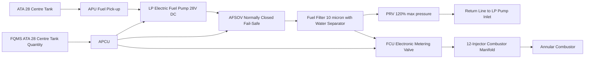
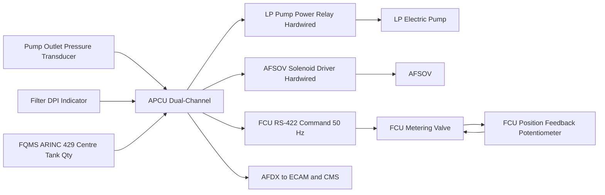
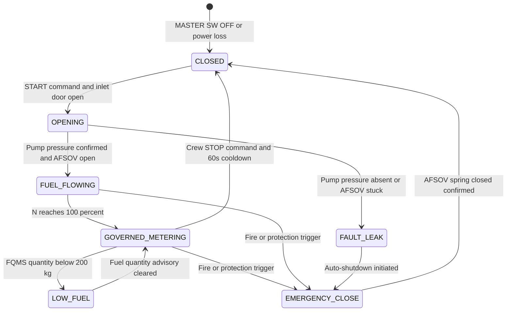

# ATLAS 040-049 · Section 04 · Subsection 049 · 030 — APU Fuel Supply and Control

## §0. Hyperlink Policy

All hyperlinks within this document use **relative paths** from the current file location. Cross-subsection links navigate to sibling files within `./` (same folder), to the subsection index at [`./README.md`](./README.md), and to parent indexes at `../`, `../../`, and `../../../`. Absolute URLs are used only for external standards references. No link shall reference an absolute filesystem path.

---

## §1. Purpose

This document defines the APU fuel supply and control system for the **programme-defined aircraft type** aircraft. The fuel supply path originates at the ATA 28 centre tank pick-up point, passes through a dedicated APU low-pressure (LP) electric fuel pump, through the APU Fuel Shutoff Valve (AFSOV — fail-safe, normally closed), through a combined fuel filter and water separator, then through the electronic Fuel Control Unit (FCU) which meters fuel flow to the annular combustor nozzle distribution manifold.

The AFSOV is the primary safety element of the fuel system. It is a spring-return, electric-hold-open valve: electrical power holds it open; loss of power at any time (commanded or failure) causes the spring to return it to the closed position within 0.5 seconds, stopping fuel flow to the APU. This fail-safe design is a fundamental requirement for CS-25 §25.1185 compliance, ensuring no post-crash or post-failure fuel flow to the APU fire zone.

Fuel compatibility on the programme-defined aircraft type extends to Sustainable Aviation Fuel (SAF) blends up to 50 % by volume, per ASTM D7566 Annex A (HEFA-SPK) and Annex B (FT-SPK). All fuel wetted components — AFSOV seals, FCU internal passages, filter media, and combustor nozzle metallurgy — are qualified for SAF compatibility under the approved fuel specifications. The Fuel Quantity Management System (FQMS) from ATA 28 provides the APCU with a centre tank quantity signal, enabling APCU to generate an "APU FUEL LOW" advisory when APU-dedicated fuel quantity falls below 200 kg estimated APU-only endurance.

The Pressure Relief Valve (PRV) in the fuel manifold downstream of the AFSOV protects the FCU and combustor nozzles from over-pressure in the event of a FCU metering valve jam or manifold blockage. The PRV opens at 120 % of maximum fuel system operating pressure, routing excess fuel back to the LP pump inlet via a return line.

---

## §2. Applicability

| Parameter | Value |
|---|---|
| Aircraft Program | programme-defined aircraft type |
| ATA Chapter | 49 — Airborne Auxiliary Power |
| Fuel source | ATA 28 centre tank dedicated APU pick-up |
| Fuel type | Jet-A / Jet-A-1 / SAF ASTM D7566 Annex A and B (up to 50 % SAF blend) |
| AFSOV type | Normally-closed, electric-hold-open, spring-return, fail-safe |
| AFSOV close time | < 0.5 s (spring return, no power required) |
| AFSOV open time | < 1.0 s (electric actuation) |
| LP pump drive | Electric motor, 28 V DC brushless, 400 W |
| FCU type | Electronic, stepper-motor driven metering valve, APCU-commanded |
| CS-25 reference | CS-25 §25.1185 (fuel fire zone) |
| S1000D SNS | 049-030-00 (APU Fuel Supply and Control) |
| Certification Basis | EASA CS-25 §25.1185, CS-APU Issue 1, ASTM D7566 |

---

## §3. Functional Description

The APU fuel supply path is a dedicated single-line circuit independent from the main engine fuel supply. The ATA 28 centre tank pick-up is located at the lowest point of the centre tank, ensuring fuel availability at all aircraft pitch and roll attitudes within the certified envelope. From the centre tank pick-up, fuel flows through a dedicated APU low-pressure supply line (25 mm diameter, stainless steel tubing with Jet-A compatible seals) to the electric LP pump.

The LP pump is a brushless DC electric motor-driven gear pump, powered from the 28 V DC essential bus. Pump inlet suction is limited to prevent cavitation; the pump is mounted at the lowest point of the APU bay to minimise suction head. The pump delivers fuel at 300–400 kPa upstream of the AFSOV. Pump start is commanded by the APCU at the beginning of the APU start sequence; pump speed is fixed (no variable speed control). A pump outlet pressure transducer provides the APCU with confirmation of pump operation during start (< 250 kPa indicates pump fault).

Downstream of the LP pump, fuel passes through the AFSOV (normally closed). The AFSOV is opened by the APCU only after the APU start command is confirmed and the inlet door is fully open. The AFSOV remains open throughout APU operation and is commanded closed by APCU on any of the following events: crew STOP command, auto-shutdown trigger (overspeed, over-EGT, low oil pressure), fire detection, or total APCU power loss (spring return). The combined fuel filter/water separator downstream of the AFSOV has a 10-micron absolute filtration rating and a manual drain for water accumulation; a differential pressure indicator (DPI) alerts the APCU when filter differential pressure exceeds 70 kPa (filter bypass risk).

The FCU receives a fuel flow demand signal from the APCU (in kg/h equivalent stepper position) and positions its metering valve accordingly. The FCU operates in four control regimes: (1) start enrichment — fixed high-fuel schedule at 15–50 % N to ensure stable light-off; (2) governed metering — proportional-integral control of fuel flow to maintain 100 % N ± 1 %; (3) acceleration limiting — fuel flow rate-of-increase limited to prevent over-temperature surge during rapid load addition; (4) deceleration minimum flow — floor fuel flow preventing flame-out during rapid load shedding. Combustor nozzle fuel distribution is via a twelve-injector annular manifold with equal-flow distribution guaranteed by matched-resistance orifice sizing.

### §3.1 Functional Breakdown

| Function | Sub-system | Control Mode |
|---|---|---|
| Fuel isolation | AFSOV | Normally closed; APCU electric hold-open |
| Low-pressure supply | LP pump | 28 V DC fixed speed; APCU start/stop |
| Fuel filtering | Filter/water separator | Passive; DPI alert at 70 kPa ΔP |
| Metering control | FCU (electronic) | APCU demand signal; 4 metering regimes |
| Pressure protection | PRV | Passive; opens at 120 % max operating pressure |
| Combustor distribution | 12-injector annular manifold | Passive; equal-flow orifice distribution |

### Diagram 1: APU Fuel Supply and Control Flow Path

---

## §4. System Architecture

The APCU manages the fuel system through three independently controlled elements: LP pump power relay, AFSOV solenoid driver, and FCU stepper motor serial command. The LP pump power relay is a hardwired discrete; APCU energises it at start initiation and de-energises it at shutdown completion (after 60-second cooldown). The AFSOV solenoid driver is also hardwired — a critical design feature ensuring the AFSOV can be closed by any APCU fault protection logic even if the AFDX network is inoperative.

The FCU stepper-motor interface uses an RS-422 serial link between APCU and FCU, with a command acknowledge protocol. Each fuel demand update is transmitted at 50 Hz (20 ms intervals). If three consecutive FCU acknowledge frames are missed, APCU flags a FCU COMM FAULT and falls back to last known good metering position while initiating a controlled shutdown. The FCU includes its own internal redundancy: a position feedback potentiometer on the metering valve confirms valve position to the FCU internal processor; if valve position diverges from commanded position by more than 5 % for > 500 ms, the FCU declares an internal fault and closes the metering valve to minimum flow, causing the GTC to decelerate.

The FQMS centre tank quantity signal is received by the APCU via ARINC 429 bus. The APCU maintains a running estimate of fuel consumed during the current APU session (based on FCU metering position and known flow characteristic curves for Jet-A and SAF). When the estimated remaining APU-usable fuel drops below 200 kg, APCU generates an "APU FUEL LOW" advisory on the ECAM APU synoptic page. This advisory does not auto-shutdown the APU — it is an informational alert for the crew or ground controller to prepare for APU shutdown.

### Diagram 2: APU Fuel System Control Interfaces

---

## §5. Components and Line-Replaceable Units

| LRU | Part Number | Qty | Location | Replacement Interval |
|---|---|---|---|---|
| AFSOV (normally closed, electric, fail-safe) |  | 1 | APU feed line, firewall forward | 6 000 APU cycles |
| LP fuel pump (electric motor drive) |  | 1 | APU bay fuel supply station | On condition / 8 000 FH |
| Fuel filter/water separator assembly |  | 1 | APU fuel supply line downstream AFSOV | Filter element: 500 FH |
| Manifold pressure transducer |  | 1 | Fuel manifold downstream FCU | On condition |
| PRV (pressure relief valve) |  | 1 | Fuel manifold branch | On condition / 10 000 cycles |
| FCU (electronic fuel control unit) |  | 1 | APU accessories bay | On condition / 6 000 APU cycles |
| Combustor nozzle manifold assembly |  | 1 | Combustor outer casing | 5 000 APU cycles or borescope condition |
| Pump outlet pressure transducer |  | 1 | LP pump outlet fitting | On condition |
| Filter differential pressure indicator |  | 1 | Filter housing | On condition |
| APU fuel supply line assembly |  | 1 set | Centre tank to AFSOV | On condition / 20 000 FH |

---

## §6. Interfaces

| Interface | Peer System | Protocol / Bus | Data Exchanged |
|---|---|---|---|
| Fuel source | ATA 28 Fuel System (centre tank) | Physical plumbing connection | Jet-A / SAF fuel, LP supply pressure |
| FQMS quantity signal | ATA 28 FQMS | ARINC 429 | Centre tank quantity (kg), for APU fuel remaining estimate |
| AFSOV solenoid command | APCU safety partition | Hardwired 28 V DC discrete | AFSOV open (energise) / close (de-energise) command |
| LP pump power command | APCU safety partition | Hardwired 28 V DC relay | Pump run/stop |
| FCU metering command | APCU safety partition | RS-422 serial, 50 Hz | Fuel demand setpoint, regime flag |
| Pump pressure feedback | APCU analogue input | Analogue 0–5 V | Pump outlet pressure (0–600 kPa) |
| DPI alert | APCU discrete input | 28 V DC discrete | Filter high ΔP warning (bypass risk) |
| ECAM data | ATA 31 ECAM | AFDX ARINC 664 P7 | Fuel flow kg/h, AFSOV status, FCU mode, DPI alert |
| CMS fault reporting | ATA 45 CMS | AFDX | Fuel system fault codes, FCU COMM FAULT |

---

## §7. Operations and Modes

| Mode | Trigger | Description | APCU Fuel Action |
|---|---|---|---|
| CLOSED (fuel off) | Default — MASTER SW OFF | AFSOV spring-closed, pump off | All fuel elements de-energised |
| OPENING (start sequence) | Crew START command, inlet door open | AFSOV opening, pump start | LP pump energised, AFSOV solenoid energised |
| FUEL_FLOWING (start/run) | AFSOV open confirmed, pump pressure confirmed | Fuel flowing to FCU, FCU start enrichment mode | FCU start enrichment schedule active |
| GOVERNED_METERING (100 % N) | N reaches 100 % | FCU in proportional-integral governing mode | FCU PI control of fuel flow for N = 100 % ± 1 % |
| FAULT_LEAK | FCU COMM FAULT or DPI alert | Fuel system anomaly | Fall-back to last FCU position; controlled shutdown initiated |
| EMERGENCY_CLOSE | Fire detect, overspeed, over-EGT, low oil, or APCU power loss | Emergency fuel cutoff | AFSOV solenoid de-energised — spring return < 0.5 s; pump off |
| LOW_FUEL | FQMS centre tank < 200 kg APU estimate | Fuel low advisory | ECAM advisory only; no auto-shutdown; crew action required |

### Diagram 3: APU Fuel System State Machine

---

## §8. Performance and Budgets

| Parameter | Requirement | Target | Status |
|---|---|---|---|
| AFSOV close time (spring return) | < 0.5 s | 0.35 s |  |
| AFSOV open time (electric) | < 1.0 s | 0.8 s |  |
| LP pump outlet pressure | 300–400 kPa | 350 kPa at design flow |  |
| FCU command update rate | 50 Hz | 50 Hz (20 ms) |  |
| FCU metering accuracy | ± 3 % of demand | ± 2 % |  |
| Filter filtration rating | 10 micron absolute | 10 micron (beta 10 ≥ 200) |  |
| PRV opening pressure | 120 % max operating | 480 kPa (at 400 kPa nominal) |  |
| Fuel flow at 100 % N (Jet-A) | TBD kg/h | ~85 kg/h estimated |  |
| SAF blend maximum | 50 % by volume | 50 % (ASTM D7566 Annex A/B) |  |
| FCU fault declare time | < 1 s divergence hold | 500 ms |  |

---

## §9. Safety, Redundancy and Fault Tolerance

- **AFSOV fail-safe design**: The AFSOV spring-return mechanism is independent of electrical power; any loss of solenoid energisation (commanded or failure) automatically closes the valve within 0.5 s, ensuring fuel cutoff in all failure modes.
- **Hardwired AFSOV command path**: AFSOV solenoid de-energisation is commanded via a dedicated hardwired path from the APCU safety partition, bypassing the AFDX network and FCU RS-422 interface, ensuring fuel cutoff even in total avionics bus failure.
- **FCU metering valve position feedback**: The FCU's internal position feedback potentiometer provides independent confirmation of metering valve position; divergence from commanded position triggers FCU internal fault and forces minimum fuel flow, enabling controlled shutdown.
- **PRV over-pressure protection**: The PRV provides passive mechanical protection of combustor nozzles from over-pressure; it operates independently of APCU, FCU, and all electrical systems.
- **DPI filter bypass alert**: The filter differential pressure indicator provides a discrete warning to APCU before filter bypass occurs (at 70 kPa, before bypass pressure of 90 kPa); enabling crew or APCU to schedule filter replacement before fuel contamination reaches the FCU or nozzles.
- **SAF material compatibility qualification**: All fuel-wetted seals, O-rings, and metallic components are qualified for 50 % SAF blends under ASTM D7566; no maintenance action required when transitioning between conventional Jet-A and SAF blends within the approved range.
- **Pump outlet pressure monitoring**: APCU monitors LP pump outlet pressure throughout start and run; absence of expected pressure within 5 seconds of pump start triggers a PUMP FAULT and aborts the start sequence, preventing dry combustor nozzle operation.
- **FQMS fuel low advisory**: The APU FUEL LOW advisory at 200 kg estimated remaining gives the crew approximately 2.3 hours of warning at a typical APU fuel burn of ~85 kg/h, providing ample time for a planned APU shutdown.
- **Centre tank cross-feed inhibit**: No cross-feed from wing tanks to the APU feed line is permitted during normal APU operation; only the centre tank supplies the APU, preventing fuel contamination or pressure incompatibility from wing tank fuel systems.
- **No single-point fuel leak ignition path**: The APU feed line from centre tank to AFSOV is routed outside any hot zone or ignition source; the AFSOV is located at the firewall, ensuring fuel cannot accumulate downstream of the firewall on AFSOV closure.

---

## §10. Maintenance and Diagnostics

| Task | Interval | Access | Tools Required |
|---|---|---|---|
| Fuel filter element replacement | 500 FH | APU bay, filter housing access | Filter wrench, torque specification |
| AFSOV functional test (open/close) | C-check | APU fuel feed line, APCU GSE | APCU GSE, fuel pressure test kit |
| LP pump outlet pressure check | 500 FH | Pump outlet fitting | Calibrated pressure gauge |
| FCU metering accuracy check | 1 000 APU cycles | Fuel bench test or in-situ with APCU GSE | Calibrated fuel flow meter, APCU GSE |
| PRV opening pressure test | 3 000 FH | Fuel bench test facility | Calibrated pressure source |
| DPI indicator function test | 500 FH | Filter housing | DPI test kit (pressure differential source) |
| Fuel filter water separator drain | 100 FH or after wet weather ops | Filter drain point | Drain collection vessel |
| FQMS ARINC 429 signal check | Annual | ARINC 429 bus analyser | ARINC 429 analyser |
| APU fuel line leak check | C-check | Full APU fuel line access | Leak detection fluid per AMM |
| Combustor nozzle flow check | 5 000 APU cycles or borescope-prompted | Combustor access | Flow bench per AMM specification |

---

## §11. Configuration and Software

- **FCU RS-422 command protocol**: Defined in APCU-FCU interface control document (ICD); command format includes regime flag, metering position demand (12-bit value), and frame CRC; protocol version is APCU PBIT-verified.
- **FCU metering schedules**: Start enrichment schedule, governing PI gains, acceleration limiting rate, and deceleration minimum flow floor are configuration parameters in APCU non-volatile memory; validated at PBIT; updates require full parameter re-validation.
- **AFSOV open/close timing parameters**: Solenoid energisation confirm timeout (< 1.5 s) and de-energisation confirm timeout (< 1.0 s) are APCU safety partition configuration parameters.
- **FQMS interface ARINC 429 label**: Label 220 (centre tank quantity) from ATA 28 FQMS; APCU monitoring partition reads at 4 Hz; low-fuel threshold (200 kg) is a configurable parameter.
- **DPI alert threshold**: Configurable in APCU monitoring partition; default 70 kPa; adjustable per fuel system design analysis update.
- **SAF blend ratio configuration**: No APCU reconfiguration is required when changing between Jet-A and approved SAF blends within the 0–50 % range; FCU metering schedules are validated for the full approved fuel range.

---

## §12. Environmental and Physical Constraints

| Constraint | Specification | Standard |
|---|---|---|
| AFSOV operating temperature | −55 °C to +120 °C | CS-25 §25.1185 fire zone |
| LP pump fluid temperature | −40 °C to +70 °C | Pump manufacturer specification |
| FCU operating temperature | −40 °C to +85 °C | DO-160G Section 4 Cat E2 |
| Fuel line fire zone compliance | CS-25 §25.1185 — fire resistant per 15 min | CS-25 §25.1185 |
| Filter water separator capacity | ≥ 100 mL free water per service | FAA AC 43.13 fuel filter guidance |
| PRV fire resistance | Fire-resistant per CS-25 §25.1185 | Material analysis and test |
| Vibration (fuel line fittings) | Fatigue life ≥ 100 000 cycles at 7 g | DO-160G Section 8 |
| Fuel compatibility | Jet-A, Jet-A-1, SAF ASTM D7566 Annex A/B | ASTM D7566, ASTM D1655 |

---

## §13. Human Factors and Crew Interface

- **Fuel flow display on ECAM**: The ECAM APU synoptic page displays APU fuel flow in kg/h at 4 Hz refresh; crews can monitor fuel consumption in real time and estimate APU endurance without MCDU access.
- **AFSOV status icon**: The ECAM APU synoptic page includes a valve symbol that is green when AFSOV is open and grey when closed; a cross-hatched amber symbol indicates AFSOV fault (e.g., stuck position).
- **APU FUEL LOW advisory**: The ECAM advisory "APU FUEL LOW" is displayed in cyan (advisory level) with a "CHECK CTR TANK" sub-label; no aural alert is generated for this advisory to avoid nuisance during routine ground operations.
- **FCU FAULT caution**: A FCU FAULT triggers an amber ECAM caution "APU FCU FAULT" with an action requiring crew to stop the APU; the FCU fault is logged in CMS for maintenance action.
- **DPI filter warning**: An ECAM advisory "APU FUEL FILTER" is generated when DPI threshold is reached; the advisory text includes "SCHEDULE FILTER REPLACEMENT" to guide crew and ground crew action.
- **Maintenance drain access**: The fuel filter water drain point is accessible from a ground-level access panel without requiring APU cowl opening; the drain point is colour-coded blue (fuel) per aircraft exterior marking standard.

---

## §14. Test and Validation

| Test | Method | Acceptance Criterion | Status |
|---|---|---|---|
| AFSOV spring return close time | Test bench — remove solenoid power | Close time < 0.5 s measured |  |
| AFSOV electric open time | Test bench — apply solenoid power | Open time < 1.0 s measured |  |
| LP pump outlet pressure | Bench test with calibrated fuel | 350 ± 30 kPa at design flow rate |  |
| FCU metering accuracy | Flow bench test — 20 points across range | ≤ ± 2 % of demand at each point |  |
| PRV opening pressure | Bench test — increasing pressure ramp | Opens at 480 ± 24 kPa |  |
| SAF compatibility soak test | 1 000-hour soak in 50 % SAF blend | No seal swelling, cracking, or degradation |  |
| Fuel fire zone compliance test | CS-25 §25.1185 fire test on AFSOV and fuel line | 15-minute fire resistance demonstrated |  |
| FCU COMM FAULT response test | Inject RS-422 communication loss | APU controlled shutdown within 10 s |  |

---

## §15. Regulatory Compliance

| Regulation | Requirement | Compliance Method | Status |
|---|---|---|---|
| CS-25 §25.1185 | Fuel fire zone — AFSOV and lines | AFSOV fire test + line material certification |  |
| CS-APU Issue 1 | APU fuel system design | Design review and test program |  |
| ASTM D7566 | SAF specification compliance | Fuel compatibility soak test + material analysis |  |
| ASTM D1655 | Jet-A/Jet-A-1 specification | Material qualification to Jet-A specification |  |
| DO-178C DAL C | APCU fuel system control software | Software life cycle data package |  |
| CS-25 §25.1309 | System safety — fuel system | FHA and FMEA for AFSOV and FCU |  |
| FAA AC 43.13 | Fuel filter guidance | Filter sizing and inspection interval |  |

---

## §16. Certification Evidence

-  AFSOV fire test report — CS-25 §25.1185 15-minute fire resistance
-  AFSOV fail-safe analysis report — spring-return, normally-closed design validation
-  SAF fuel compatibility analysis report — ASTM D7566 Annex A and B soak test
-  FCU metering accuracy qualification test report
-  LP pump qualification test report — pressure, flow, temperature range
-  PRV qualification test report — opening pressure and fire resistance
-  Fuel system FHA and FMEA — CS-25 §25.1309 safety analysis
-  Fuel fire zone line material certification — CS-25 §25.1185
-  APCU fuel control software DO-178C DAL C life cycle data package
-  DO-160G environmental qualification reports (AFSOV, LP pump, FCU)

---

## §17. Open Issues

| ID | Description | Owner | Target | Status |
|---|---|---|---|---|
| OI-049-030-001 | Confirm AFSOV supplier and fire test certification per CS-25 §25.1185 | Q-MECHANICS / Procurement | 2026-Q3 |  |
| OI-049-030-002 | Finalise APU fuel flow rate at 100 % N (pending GTC performance model) | Q-AIR | 2026-Q3 |  |
| OI-049-030-003 | Complete SAF 50 % blend ratio compatibility soak test plan | Q-GREENTECH | 2026-Q4 |  |
| OI-049-030-004 | Validate FCU RS-422 ICD with FCU supplier | Q-AIR / Q-DATAGOV | 2026-Q3 |  |
| OI-049-030-005 | Confirm fuel line routing from centre tank pick-up to AFSOV clear of all heat sources | Q-MECHANICS | 2026-Q4 |  |

---

## §18. Glossary

| Acronym / Term | Definition |
|---|---|
| AFSOV | APU Fuel Shutoff Valve — normally-closed, electric-hold-open, spring-return fail-safe valve |
| LP pump | Low-Pressure fuel pump — electric motor-driven gear pump providing suction from centre tank |
| SAF | Sustainable Aviation Fuel — alternative jet fuel per ASTM D7566 (HEFA-SPK Annex A, FT-SPK Annex B) |
| Fuel manifold | Distribution header connecting FCU outlet to twelve combustor nozzle injectors |
| PRV | Pressure Relief Valve — passive over-pressure protection valve in the fuel manifold circuit |
| FQMS | Fuel Quantity Management System — ATA 28 system providing tank quantity data via ARINC 429 |
| EBP | Engine Boost Pump — not used in APU context; ATA 28 term for main engine LP boost pump |
| Jet-A | Commercial aviation turbine fuel specification per ASTM D1655; primary APU fuel |
| CS-25 §25.1185 | EASA airworthiness requirement for fuel lines and fittings in engine and APU fire zones |
| FWOL | Fuel Wetted O-ring and seal specification — material qualification requirement for fuel-contact elastomers |

---

## §19. Citations

| Standard | Title | Issuer | Applicability |
|---|---|---|---|
| CS-25 §25.1185 | Fuel lines and fittings in fire zones | EASA | AFSOV and fuel line fire resistance |
| CS-APU Issue 1 | APU airworthiness standards | EASA | APU fuel system design |
| ASTM D7566 | SAF specification (Annex A HEFA-SPK, Annex B FT-SPK) | ASTM International | SAF fuel compatibility |
| ASTM D1655 | Jet-A and Jet-A-1 specification | ASTM International | Primary APU fuel specification |
| DO-178C | Software considerations in airborne systems | RTCA | APCU fuel control software |
| CS-25 §25.1309 | Equipment, systems and installations | EASA | Fuel system safety analysis |
| FAA AC 43.13-1B | Acceptable methods — aircraft inspection and repair | FAA | Fuel filter sizing and maintenance |

---

## §20. References

| Document | Path | Relation |
|---|---|---|
| Q+ATLANTIDE Baseline | [../../../../organization/Q+ATLANTIDE.md](../../../../organization/Q+ATLANTIDE.md) | Parent baseline |
| ATLAS 040-049 Architecture | [../../../README.md](../../../README.md) | Parent architecture |
| Section 04 Index | [../../README.md](../../README.md) | Parent section index |
| Subsection 049 Index | [./README.md](./README.md) | Subsection index |
| 049-000 APU General | [./049-000-Airborne-Auxiliary-Power-General.md](./049-000-Airborne-Auxiliary-Power-General.md) | Sibling — parent overview |
| 049-040 Ignition Starting | [./049-040-APU-Ignition-Starting-and-Generation.md](./049-040-APU-Ignition-Starting-and-Generation.md) | Fuel flows to combustor — linked |
| 049-070 Fire Protection | [./049-070-APU-Fire-Protection-Shutdown-and-Safety-Interlocks.md](./049-070-APU-Fire-Protection-Shutdown-and-Safety-Interlocks.md) | AFSOV emergency close on fire |
| 049-080 Monitoring Diagnostics | [./049-080-APU-Monitoring-Diagnostics-and-Control-Interfaces.md](./049-080-APU-Monitoring-Diagnostics-and-Control-Interfaces.md) | FCU fault logging |

---

## §21. Footprint

| Metric | Value |
|---|---|
| Document ID | QATL-ATLAS-1000-ATLAS-040-049-04-049-030-APU-FUEL-SUPPLY-AND-CONTROL |
| Subsubject | 030 — APU Fuel Supply and Control |
| Sections | §0 – §22 (23 sections) |
| Tables | 16 |
| Mermaid diagrams | 3 |
| LRUs documented | 10 |
| Glossary entries | 10 |
| Regulatory references | 7 |
| Open issues | 5 |
| Version | 1.0.0 |
| Status | active |

---

## §22. Change Log

| Version | Date | Author | Change Description |
|---|---|---|---|
| 1.0.0 | 2026-05-10 | Q-AIR / ATLAS Working Group | Initial release — full 22-section content for APU Fuel Supply and Control |
