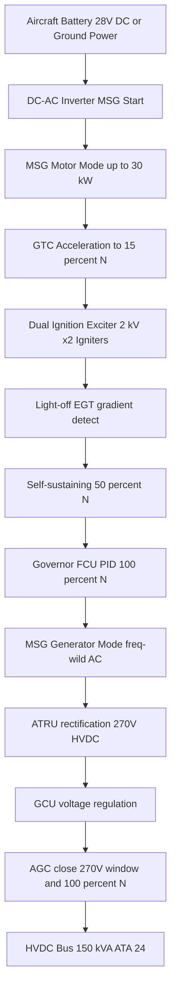
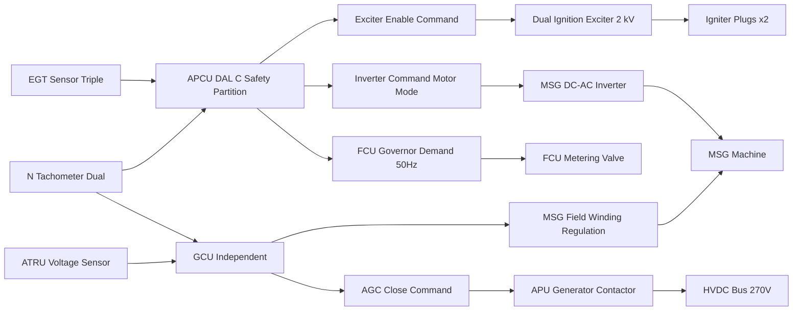
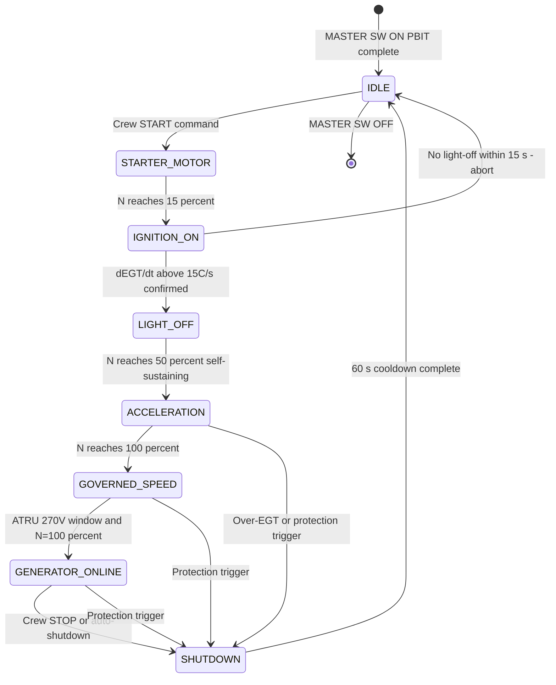

# ATLAS 040-049 · Section 04 · Subsection 049 · 040 — APU Ignition, Starting and Generation

## §0. Hyperlink Policy

All hyperlinks within this document use **relative paths** from the current file location. Cross-subsection links navigate to sibling files within `./` (same folder), to the subsection index at [`./README.md`](./README.md), and to parent indexes at `../`, `../../`, and `../../../`. Absolute URLs are used only for external standards references. No link shall reference an absolute filesystem path.

---

## §1. Purpose

This document defines the APU ignition, starting, and electrical generation system on the **AMPEL360E eWTW** aircraft. The system encompasses three sequential operational phases that together transform the APU from an unpowered state to a full electrical generator supplying 150 kVA to the aircraft HVDC bus.

The Motor Starter/Generator (MSG) is the centrepiece of this system: a dual-mode electrical machine mounted on the APU accessory gearbox output shaft. During the start phase, the MSG operates as an electric motor consuming up to 30 kW from the aircraft 28 V DC battery bus or external ground power, providing motoring torque to spin up the Gas Turbine Core (GTC) from rest to light-off speed. During the run phase, the MSG operates as a high-output AC generator feeding the APU Transformer Rectifier Unit (ATRU) to produce 270 V HVDC output.

The APU start sequence begins with the crew pressing the START pushbutton on the overhead panel. The APCU executes a choreographed sequence: MSG motor energisation → GTC acceleration to 15 % N → dual-channel ignition exciter activation → AFSOV open and FCU start enrichment → light-off detection via EGT gradient monitoring (dEGT/dt > 15 °C/s) → self-sustaining speed confirmation at 50 % N → ignition cut → GTC acceleration to 100 % N under governor control → AGC close and HVDC generation onset. The total start time from START pb to AGC close is typically 70 seconds at sea level ISA conditions.

The dual-channel ignition exciter produces a peak voltage of approximately 2 kV across each igniter plug. Both igniters fire simultaneously on APCU command, ensuring reliable combustion initiation even if one igniter plug has marginal performance. Light-off detection in the APCU uses a rate-of-change algorithm on EGT: if dEGT/dt exceeds 15 °C/s for three consecutive 100 ms sampling intervals, light-off is confirmed. If light-off is not confirmed within 15 seconds of AFSOV opening, the APCU executes an abort sequence (AFSOV close, MSG off, ignition off) and posts an ECAM caution "APU NO LIGHT-OFF".

Electrical generation output is frequency-wild three-phase AC (frequency proportional to N%), which is rectified by the ATRU to produce 270 V HVDC ± 5 %. The GCU closes the APU Generator Contactor (AGC) when ATRU output voltage is within the 270 V ± 5 % window and the APCU confirms N = 100 % ± 1 %. Once the AGC is closed, the APU generator supplies the aircraft HVDC bus and the GCU continuously regulates the HVDC output by adjusting excitation current in the MSG field winding.

---

## §2. Applicability

| Parameter | Value |
|---|---|
| Aircraft Program | AMPEL360E eWTW |
| ATA Chapter | 49 — Airborne Auxiliary Power |
| Start motor power | ≤ 30 kW from aircraft battery bus or ground power |
| Light-off speed | ≈ 15 % N (GTC acceleration phase) |
| Self-sustaining speed | ≈ 50 % N (ignition off above this speed) |
| Governed speed | 100 % N ± 1 % (governor closed-loop control) |
| EGT limit during start | 900 °C transient (1-minute limit) |
| Generation mode output | HVDC 270 V ± 5 %, up to 150 kVA, frequency-wild AC rectified |
| Ignition exciter voltage | ≈ 2 kV peak per igniter plug |
| AGC close condition | ATRU output 270 V ± 5 % and N = 100 % ± 1 % |
| Start time (SL ISA) | ≤ 90 s (typical 70 s) |
| S1000D SNS | 049-040-00 (APU Ignition, Starting and Generation) |

---

## §3. Functional Description

The MSG is a permanent-magnet-assisted synchronous machine designed for dual-mode operation. In motor mode, the aircraft's 28 V DC battery bus feeds a DC-AC inverter co-located with the MSG; the inverter produces variable-frequency three-phase AC to drive the MSG as an induction-type motor. MSG motoring torque is approximately 95 Nm at peak, sufficient to accelerate the GTC (with its compressor air mass load) from rest to 15 % N within 20 seconds at sea level ISA. Above 15 % N, the FCU introduces fuel and the APCU fires the ignition exciters.

The dual-channel ignition exciter receives 28 V DC input and produces a high-voltage output waveform (~2 kV peak) through a flyback transformer. Each exciter channel drives one igniter plug independently. The igniter plugs are annular gap semi-surface discharge type, designed for reliable ignition across the range of fuel-air ratios present during start enrichment. Igniter plug gap is nominally 1.5 mm; plugs are replaced at 1 500 APU cycle intervals to maintain reliable spark energy at gap tolerances. The dual exciter fires both plugs simultaneously during the start sequence; above 50 % N (self-sustaining), the APCU de-energises both exciter channels.

Speed governing is achieved through a closed-loop fuel metering control implemented in the APCU. The control algorithm receives N% from the dual magnetic tachometer (higher-of-two selection) and commands FCU metering position to maintain N = 100 % ± 1 %. The governor uses a proportional-integral-derivative (PID) algorithm with anti-windup to handle the large dynamic range from 50 % N (self-sustaining) to 100 % N (governed). Acceleration limiting is implemented as a rate limiter on the fuel demand command, preventing rapid EGT excursions during GTC acceleration. The GCU receives N% and ATRU output voltage from independent sensor paths and independently confirms the 100 % N + voltage window condition before issuing the AGC close command.

### §3.1 Functional Breakdown

| Function | Sub-system | Control / Operation |
|---|---|---|
| Electric starting | MSG motor mode + DC-AC inverter | APCU commands inverter; MSG provides motoring torque |
| Ignition | Dual ignition exciter + two igniter plugs | APCU fires exciters at 15 % N; both plugs simultaneous |
| Light-off detection | EGT gradient algorithm in APCU | dEGT/dt > 15 °C/s for 3 × 100 ms samples = light-off |
| Speed governing | FCU PID algorithm in APCU | N% closed-loop; fuel demand rate-limited |
| Electrical generation | MSG generator mode (freq-wild AC) | Above 50 % N; field winding excited by GCU |
| Load control | AGC + ATRU + GCU | AGC closes when ATRU output 270 V ± 5 % and N = 100 % ± 1 % |

### Diagram 1: APU Start and Generation System Hierarchy

---

## §4. System Architecture

The APCU governs the entire start sequence through a state-machine implemented in the DAL C safety partition. The state machine advances through IDLE → STARTER_MOTOR → IGNITION_ON → LIGHT_OFF → ACCELERATION → GOVERNED_SPEED → GENERATOR_ONLINE with strict timing guards on each transition. If any timed event is not reached within its guard limit, the APCU aborts the start sequence, closes the AFSOV, de-energises the MSG inverter and exciters, and posts the relevant ECAM caution message.

The GCU operates as a semi-independent unit with its own voltage regulation PID loop. It receives N% from APCU via a dedicated ARINC 429 bus and independently monitors ATRU output voltage via a direct analogue connection. The GCU's AGC close logic is strictly sequential: GCU will not close the AGC until it independently confirms both conditions (ATRU voltage in window AND N = 100 % ± 1 %). This independence from the APCU main data bus provides a redundant protection against premature AGC closure that could damage the aircraft HVDC bus.

The MSG field current regulation by the GCU adjusts the magnetising current in the MSG stator winding to maintain constant HVDC output voltage (270 V ± 5 %) across the full load range (0 to 150 kVA). At no-load, the ATRU output voltage tends to be slightly high; the GCU reduces field current to compensate. At full 150 kVA load, the ATRU output voltage tends to droop; the GCU increases field current. The GCU voltage regulation response time is < 100 ms for a step load change from 0 to 100 kVA, ensuring HVDC bus voltage is maintained within limits during large load transients.

### Diagram 2: Ignition, Speed and Generation Control Loops

---

## §5. Components and Line-Replaceable Units

| LRU | Part Number | Qty | Location | Replacement Interval |
|---|---|---|---|---|
| MSG (combined motor/generator unit) |  | 1 | APU accessory gearbox shaft | On condition / 5 000 APU cycles |
| MSG DC-AC inverter (start mode) |  | 1 | APU electrical bay | On condition / 8 000 start cycles |
| Dual ignition exciter unit |  | 1 | APU accessories gearbox housing | 3 000 APU cycles |
| Igniter plugs |  | 2 | Combustor casing annular positions | 1 500 APU cycles |
| GCU (Generator Control Unit) |  | 1 | APU electrical bay shelf | On condition |
| ATRU (APU Transformer Rectifier Unit) |  | 1 | APU electrical bay | On condition / 8 000 APU hours |
| AGC (APU Generator Contactor) |  | 1 | HVDC switchgear panel | 8 000 operations |
| N tachometer (dual magnetic pickup) |  | 2 | APU gearbox phonic wheel | On condition / 6 000 FH |
| GCU ATRU voltage sensor |  | 1 | ATRU output bus bar | On condition |
| APCU-GCU ARINC 429 interface module |  | 1 | APCU board (embedded) | On condition / APCU replacement |

---

## §6. Interfaces

| Interface | Peer System | Protocol / Bus | Data Exchanged |
|---|---|---|---|
| MSG start power | ATA 24 battery bus / ground power | 28 V DC high current | Up to 30 kW start power via inverter |
| GCU-APCU N% data | APCU safety partition | ARINC 429 | N% tachometer value, GCU status |
| AGC contactor | ATA 24 HVDC bus | Hardwired contactor | 270 V HVDC up to 150 kVA, contactor open/close |
| Ignition exciter command | APCU safety partition | 28 V DC discrete | Exciter on/off command, dual channel |
| MSG inverter command | APCU safety partition | PWM or RS-422 | Inverter enable, torque demand |
| ATRU output to HVDC bus | ATA 24 HVDC distribution | 270 V DC power connection | Up to 150 kVA to HVDC bus |
| EGT sensor feedback | APCU analogue | Thermocouple millivolt | EGT triple sensor for light-off and governor |
| ECAM data | ATA 31 ECAM | AFDX ARINC 664 P7 | Start phase, N%, EGT, AGC status, gen load |
| CMS fault reporting | ATA 45 CMS | AFDX | Start fault codes, ignition fault, AGC fault |

---

## §7. Operations and Modes

| Mode | N Range | Description | APCU Action |
|---|---|---|---|
| IDLE | 0 % N | APU at rest, MASTER SW ON | PBIT complete; awaiting START command |
| STARTER_MOTOR | 0–15 % N | MSG motor mode energised | Inverter on; MSG motoring; no fuel, no ignition |
| IGNITION_ON | ~15 % N | Igniters firing | AFSOV opens; FCU start enrichment; exciters on |
| LIGHT_OFF | ~15–50 % N | Combustion established | EGT rising; dEGT/dt > 15 °C/s confirmed |
| ACCELERATION | 50–100 % N | GTC self-sustaining acceleration | Ignition off; inverter off; FCU governor ramp |
| GOVERNED_SPEED | 100 % N ± 1 % | Full speed, pre-generation | FCU PID control; EGT monitored; GCU checks voltage |
| GENERATOR_ONLINE | 100 % N | AGC closed; HVDC output | AGC closed; GCU regulates 270 V; loads served |
| SHUTDOWN | Decelerating | AFSOV closed; GTC coasting | FCU off; MSG off; 60 s cooldown; AGC open |

### Diagram 3: APU Start Sequence State Machine

---

## §8. Performance and Budgets

| Parameter | Requirement | Target | Status |
|---|---|---|---|
| MSG start motor power | ≤ 30 kW | 28 kW peak |  |
| Acceleration 0 to 15 % N | ≤ 30 s | 20 s |  |
| Light-off within | ≤ 15 s of AFSOV open | < 10 s typical |  |
| Self-sustaining speed | ≈ 50 % N | 48–52 % N |  |
| Total start time (SL ISA) | ≤ 90 s | 70 s |  |
| Governed speed accuracy | 100 % N ± 1 % | ± 0.5 % |  |
| HVDC output voltage | 270 V ± 5 % | 270 V ± 3 % |  |
| GCU step load response | < 100 ms for 0–100 kVA step | 80 ms |  |
| Igniter exciter voltage | ~2 kV peak | 1.8–2.2 kV |  |
| ATRU conversion efficiency | > 95 % at full load | 96 % |  |

---

## §9. Safety, Redundancy and Fault Tolerance

- **Dual igniter plugs fired simultaneously**: Both igniter plugs fire simultaneously on APCU command, ensuring combustion initiation even if one plug has slightly reduced spark energy due to electrode wear; light-off requires only one successful ignition event.
- **EGT gradient light-off algorithm**: The dEGT/dt > 15 °C/s for 3-sample confirmation prevents false light-off declaration from thermocouple noise or transient temperature spikes, ensuring the start sequence does not advance prematurely.
- **No-light-off abort with time limit**: The 15-second light-off timeout prevents prolonged fuel introduction to an unlit combustor, avoiding fuel accumulation and potential deflagration on a subsequent ignition attempt.
- **Self-sustaining speed confirmation**: The transition from IGNITION_ON to ACCELERATION requires N to reach 50 % ± 2 %; if N stalls below 50 % after light-off (surge or rich extinction), APCU initiates an abort, protecting the GTC from hot-section overtemperature.
- **Governed speed fuel rate limiting**: The FCU governor acceleration rate limiter prevents rapid EGT excursions during the 50–100 % N acceleration phase, maintaining EGT below the 950 °C continuous limit during transient acceleration.
- **GCU independent AGC close condition**: The GCU independently verifies ATRU voltage (270 V ± 5 %) and N (100 % ± 1 %) before closing the AGC; APCU cannot force an AGC close — the GCU is the authority, preventing premature HVDC bus connection.
- **AGC overvoltage protection relay**: The GCU contains an independent analogue overvoltage relay (set at 295 V) that opens the AGC within 10 ms if ATRU output exceeds the limit, protecting aircraft HVDC loads from overvoltage regardless of APCU or GCU software state.
- **MSG inverter over-current protection**: The MSG DC-AC inverter has integrated current limiting at 30 kW peak; sustained over-current beyond 5 seconds triggers inverter lockout and APCU STARTER FAULT, protecting battery bus from excessive drain.
- **Igniter plug life tracking**: APCU CBIT monitors the number of ignition events per session and cumulative total; at 1 500 APU cycles, CMS generates an "APU IGNITER REPLACEMENT DUE" message to schedule maintenance before plug performance degrades below ignition reliability threshold.
- **Dual N tachometer redundancy**: Two independent magnetic tachometer pickups from the same phonic wheel provide dual N% measurements; APCU uses the higher-of-two for protection logic (conservative against missed overspeed) and GCU uses independent average for AGC condition check.

---

## §10. Maintenance and Diagnostics

| Task | Interval | Access | Tools Required |
|---|---|---|---|
| Igniter plug inspection and replacement | 1 500 APU cycles | Combustor access panel removal | Torque wrench, plug removal tool, gap gauge |
| Dual ignition exciter output voltage check | 3 000 APU cycles or on FAULT | APU accessories access | High-voltage probe, oscilloscope |
| MSG insulation resistance check | 2 000 APU cycles | MSG terminal access | Insulation resistance tester 500 V DC |
| MSG vibration measurement baseline | Annual or after hard landing | APCU data download via CMS | MEMS accelerometer data, vibration analysis tool |
| GCU firmware version check | Every scheduled check | APCU GSE access | GSE software, firmware reference file |
| ATRU winding temperature log review | 1 000 APU hours | APCU monitoring partition download | Maintenance terminal, APCU GSE |
| AGC contact resistance check | C-check | HVDC switchgear access | Calibrated micro-ohmmeter |
| N tachometer cross-check | Annual | APCU GSE — compare A vs B tachometer | APCU GSE signal comparison function |
| GCU AGC close voltage window verification | C-check | GCU GSE bench or APCU GSE | GCU GSE, calibrated voltage source |
| Start cycle counter review | Pre-flight review | CMS MCDU page | MCDU access |

---

## §11. Configuration and Software

- **APCU start state machine software**: DO-178C DAL C; all timing guards (light-off timeout 15 s, acceleration timeout 120 s, governed speed settle time 5 s) are configurable parameters in APCU non-volatile memory validated at PBIT.
- **FCU governor PID gains**: Proportional, integral, and derivative gains for the N% governor, plus acceleration rate limiter and deceleration minimum flow floor, are configuration parameters validated at PBIT.
- **EGT gradient threshold**: The 15 °C/s light-off detection threshold and 3-sample confirmation requirement are APCU safety partition configuration parameters.
- **GCU AGC close window**: The 270 V ± 5 % ATRU voltage window and 100 % N ± 1 % speed window for AGC close are stored in GCU protected non-volatile memory; update requires GCU supplier re-qualification.
- **GCU overvoltage relay setpoint**: 295 V analogue relay setpoint is hardware-set (resistor divider network); not software-configurable; change requires GCU component-level modification with GCU supplier.
- **Ignition exciter voltage configuration**: Exciter output voltage is determined by transformer turns ratio (hardware); not software-configurable; replacement exciter must match PN to ensure correct output voltage.

---

## §12. Environmental and Physical Constraints

| Constraint | Specification | Standard |
|---|---|---|
| MSG operating temperature | −40 °C to +120 °C (winding insulation) | MSG manufacturer specification |
| Ignition exciter vibration | 7.7 g RMS broadband | DO-160G Section 8 Cat S |
| GCU EMC emissions | Class B DO-160G | DO-160G Section 21 |
| ATRU operating altitude | Sea level to FL410 | DO-160G Section 4 |
| MSG IP rating | IP67 — oil and fuel mist resistant | MSG manufacturer specification |
| AGC contact voltage rating | 600 V DC minimum | AGC manufacturer rating |
| Igniter plug fire zone | CS-25 §25.1181 compliant location | CS-25 §25.1181 |
| ATRU magnetic flux leakage | < 5 gauss at 300 mm | Aircraft magnetic interference analysis |

---

## §13. Human Factors and Crew Interface

- **Start sequence progress indication**: The ECAM APU synoptic page displays the current start phase text (MOTOR → IGNITION → LIGHT-OFF → ACCEL → AVAIL) during the start sequence, providing crews with clear, real-time start progress without requiring MCDU consultation.
- **No-light-off caution message**: The ECAM caution "APU NO LIGHT-OFF" includes a simple crew action "ABORT / RETRY AFTER 2 MIN COOL" displayed on the actions sub-page, guiding crews through the safe retry procedure.
- **Generator online confirmation**: When AGC closes and APU generation is available, the ECAM APU synoptic displays "GEN ON" in green and the generator load (kVA) value appears, providing unambiguous confirmation that HVDC generation is active.
- **Igniter replacement reminder**: CMS-generated "APU IGNITER REPLACEMENT DUE" message is displayed on the MCDU maintenance page during the next scheduled maintenance; no flight deck message is generated, as igniter replacement is a scheduled maintenance event, not a flight-critical alert.
- **MSG start current display**: The APCU MCDU maintenance page displays MSG start current (A) during start sequence review; anomalous current values (outside the expected 700–900 A peak range at 32 V DC) indicate MSG or inverter degradation.
- **AGC contactor operations counter**: The CMS maintenance page displays cumulative AGC operations count; at 8 000 operations, a "AGC CONTACT CHECK DUE" advisory is generated to schedule contact resistance measurement.

---

## §14. Test and Validation

| Test | Method | Acceptance Criterion | Status |
|---|---|---|---|
| APU start sequence timing | Instrumented ground run | All state transitions within timing guards; total ≤ 90 s |  |
| Light-off detection algorithm | Signal injection into APCU EGT input | Light-off declared at dEGT/dt = 15 °C/s; not at 12 °C/s |  |
| No-light-off abort test | Inhibit AFSOV during start | APCU aborts at 15 s; ECAM caution generated |  |
| Governed speed accuracy test | Instrumented ground run at 100 % N | N = 100 % ± 0.5 % maintained over 30 min |  |
| GCU step load response test | AGC connected, step 0 to 100 kVA | HVDC voltage recovers to 270 V ± 5 % within 100 ms |  |
| GCU overvoltage relay test | Inject 296 V at ATRU output monitor | AGC opens within 10 ms of threshold crossing |  |
| Ignition exciter output voltage | Bench test with calibrated HV probe | 1.8–2.2 kV peak per channel |  |
| Altitude relight start test | Altitude chamber or aircraft at FL250 | Start successful within ≤ 90 s at FL250 |  |

---

## §15. Regulatory Compliance

| Regulation | Requirement | Compliance Method | Status |
|---|---|---|---|
| CS-APU Issue 1 | APU starting and generation system design | Design review and ground test report |  |
| CS-25 §25.1309 | System safety — ignition and generation | FHA and FMEA for MSG and GCU |  |
| DO-178C DAL C | APCU start and governor software | Software life cycle data package |  |
| DO-160G | Environmental qualification | Environmental test reports (MSG, GCU, exciter) |  |
| CS-25 §25.1181 | Igniter plug fire zone location | Design review and analysis |  |
| EASA AMC 25.1309 | Safety analysis methods | Quantitative FMEA for single-start failure effects |  |

---

## §16. Certification Evidence

-  APU start sequence test report — all timing guards demonstrated at SL ISA
-  Altitude relight start test report — FL250 demonstrated
-  GCU step load response test report — 0 to 100 kVA within 100 ms
-  GCU overvoltage relay qualification test report — 295 V threshold demonstrated
-  MSG and GCU FHA and FMEA — CS-25 §25.1309 safety analysis
-  Ignition exciter output voltage qualification report
-  ATRU conversion efficiency test report (> 95 % at 150 kVA)
-  APCU start and governor software DO-178C DAL C life cycle data package
-  MSG qualification test report — DO-160G environmental, insulation resistance
-  AGC contact qualification test report — 8 000 operations endurance

---

## §17. Open Issues

| ID | Description | Owner | Target | Status |
|---|---|---|---|---|
| OI-049-040-001 | Confirm MSG motor peak torque at 28 V DC with battery SOC at 80 % | Q-AIR / Q-MECHANICS | 2026-Q3 |  |
| OI-049-040-002 | Finalise GTC self-sustaining speed (50 % N assumption to be validated by GTC model) | Q-AIR | 2026-Q3 |  |
| OI-049-040-003 | Validate EGT gradient light-off threshold 15 °C/s across full start temperature range (−55 °C to +45 °C ISA) | Q-AIR | 2026-Q4 |  |
| OI-049-040-004 | Confirm GCU supplier and ARINC 429 N% interface ICD | Q-AIR / Q-DATAGOV | 2026-Q3 |  |
| OI-049-040-005 | Complete altitude relight certification test plan per CS-APU | Q-AIR | 2026-Q4 |  |

---

## §18. Glossary

| Acronym / Term | Definition |
|---|---|
| MSG | Motor Starter/Generator — dual-mode electrical machine acting as start motor and HVDC-generating AC generator |
| Exciter | Dual-channel ignition exciter — DC-input flyback transformer producing ~2 kV peak to fire igniter plugs |
| EGT gradient | Rate of change of Exhaust Gas Temperature (dEGT/dt) used by APCU to detect combustion light-off |
| N% | APU spool speed expressed as percentage of rated governed speed (100 % = design point RPM) |
| PCU | Power Conditioning Unit — generic term for power electronics converting raw generator output to regulated bus voltage |
| GCU | Generator Control Unit — independent unit managing MSG field excitation and AGC close/open logic |
| HVDC | High-Voltage Direct Current — 270 V DC bus used on the AMPEL360E eWTW for primary electrical distribution |
| AGC | APU Generator Contactor — high-voltage DC contactor connecting ATRU output to aircraft HVDC bus |
| Light-off | The moment of sustained combustion establishment in the APU combustor; confirmed by positive EGT gradient |
| Load Control Unit | Generic term for the combination of AGC and GCU functions managing connection and protection of APU generator output |

---

## §19. Citations

| Standard | Title | Issuer | Applicability |
|---|---|---|---|
| CS-APU Issue 1 | Airworthiness standards for auxiliary power units | EASA | APU start and generation system |
| CS-25 §25.1309 | Equipment, systems and installations | EASA | MSG and GCU system safety analysis |
| DO-178C | Software considerations in airborne systems | RTCA | APCU start state machine and governor |
| DO-160G | Environmental conditions and test procedures | RTCA | MSG, GCU, ignition exciter qualification |
| EASA AMC 25.1309 | Safety analysis methods | EASA | FHA and FMEA for start and generation |
| CS-25 §25.1181 | Designated fire zones | EASA | Igniter plug location in fire zone |

---

## §20. References

| Document | Path | Relation |
|---|---|---|
| Q+ATLANTIDE Baseline | [../../../../organization/Q+ATLANTIDE.md](../../../../organization/Q+ATLANTIDE.md) | Parent baseline |
| ATLAS 040-049 Architecture | [../../../README.md](../../../README.md) | Parent architecture |
| Section 04 Index | [../../README.md](../../README.md) | Parent section index |
| Subsection 049 Index | [./README.md](./README.md) | Subsection index |
| 049-000 APU General | [./049-000-Airborne-Auxiliary-Power-General.md](./049-000-Airborne-Auxiliary-Power-General.md) | Parent overview |
| 049-010 APU Architecture | [./049-010-Auxiliary-Power-Unit-Architecture.md](./049-010-Auxiliary-Power-Unit-Architecture.md) | APCU and dual-channel context |
| 049-030 Fuel Supply | [./049-030-APU-Fuel-Supply-and-Control.md](./049-030-APU-Fuel-Supply-and-Control.md) | FCU and AFSOV reference |
| 049-050 Load Interfaces | [./049-050-APU-Pneumatic-and-Electrical-Load-Interfaces.md](./049-050-APU-Pneumatic-and-Electrical-Load-Interfaces.md) | AGC and HVDC bus tie |

---

## §21. Footprint

| Metric | Value |
|---|---|
| Document ID | QATL-ATLAS-1000-ATLAS-040-049-04-049-040-APU-IGNITION-STARTING-AND-GENERATION |
| Subsubject | 040 — APU Ignition, Starting and Generation |
| Sections | §0 – §22 (23 sections) |
| Tables | 16 |
| Mermaid diagrams | 3 |
| LRUs documented | 10 |
| Glossary entries | 10 |
| Regulatory references | 6 |
| Open issues | 5 |
| Version | 1.0.0 |
| Status | active |

---

## §22. Change Log

| Version | Date | Author | Change Description |
|---|---|---|---|
| 1.0.0 | 2026-05-10 | Q-AIR / ATLAS Working Group | Initial release — full 22-section content for APU Ignition, Starting and Generation |
