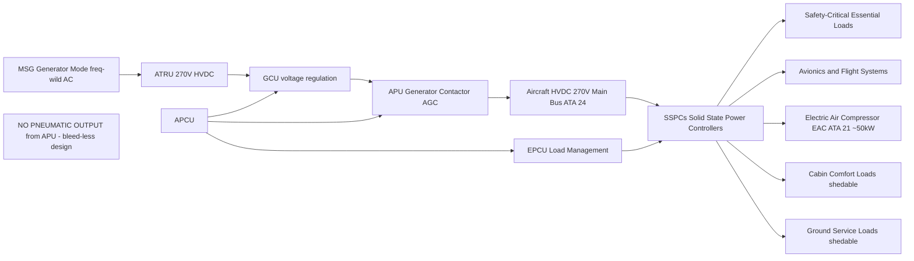
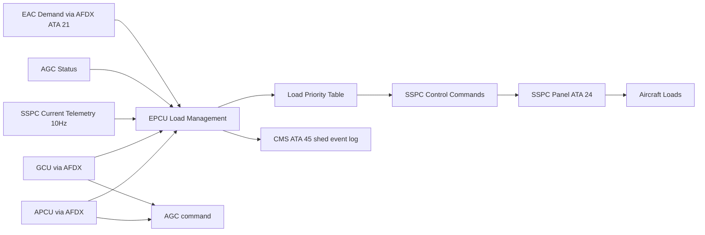
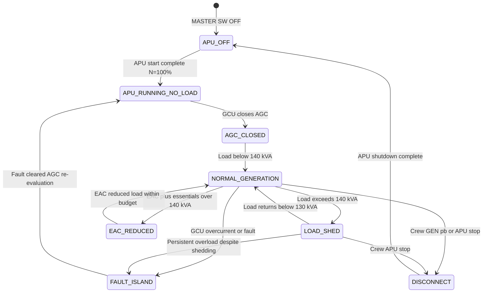

# ATLAS 040-049 · Section 04 · Subsection 049 · 050 — APU Pneumatic and Electrical Load Interfaces

## §0. Hyperlink Policy

All hyperlinks within this document use **relative paths** from the current file location. Cross-subsection links navigate to sibling files within `./` (same folder), to the subsection index at [`./README.md`](./README.md), and to parent indexes at `../`, `../../`, and `../../../`. Absolute URLs are used only for external standards references. No link shall reference an absolute filesystem path.

---

## §1. Purpose

**CRITICAL ARCHITECTURE STATEMENT**: The programme-defined aircraft type APU provides **zero pneumatic output**. There is no bleed air port, no pneumatic manifold, no load control valve, no pre-cooler, no surge control valve, and no customer bleed extraction from the APU compressor stage. This document title retains "Pneumatic" for ATA 49 naming convention compliance only; all pneumatic interface content is explicitly absent by design.

This document covers exclusively the **electrical load interfaces** between the APU generator system and the aircraft ATA 24 HVDC electrical distribution system. The APU's Motor Starter/Generator (MSG), operating through the ATRU and APU Generator Contactor (AGC), is the sole power output interface of the APU. This electrical interface connects to the aircraft's main HVDC 270 V bus via the AGC, providing up to 150 kVA of electrical power for ground operations, emergency electrical supply, and ground air conditioning support via the Electric Air Compressor (EAC).

The EAC — not APU bleed air — provides cabin air conditioning on the ground. The EAC is powered directly from the APU generator output via the HVDC bus and AGC. This is the only "pneumatic adjacent" function supported by the APU: it feeds an electric compressor that generates pressurised air for the ECS, with no thermal or pressure coupling to the APU core whatsoever. The EAC is an ATA 21 system element; this document defines only the electrical power interface between the APU generator and the EAC load.

The Electrical Power Control Unit (EPCU) — the aircraft-level power management computer — coordinates APU generator load management when the APU is the sole electrical source. When total aircraft electrical demand exceeds the APU's 150 kVA capacity, the EPCU applies load shedding in priority order: cabin comfort loads are shed first, followed by non-essential avionic cooling, followed by ground service loads, while safety-critical and flight-essential loads are never shed. The APCU and EPCU exchange load status data via AFDX to enable coordinated load management.

---

## §2. Applicability

| Parameter | Value |
|---|---|
| Aircraft Program | programme-defined aircraft type |
| ATA Chapter | 49 — Airborne Auxiliary Power |
| Pneumatic output | **NONE** — bleed-less architecture; CS-25 §25.1438 not applicable |
| HVDC output voltage | 270 V ± 5 % DC |
| HVDC maximum output | 150 kVA (continuous) |
| EAC interface | EAC powered via HVDC bus from APU generator; no bleed coupling |
| AGC close time | < 200 ms from GCU command to contactor closed |
| AGC open time | < 50 ms from GCU command to contactor open |
| Load shedding coordination | EPCU load priority table; AFDX coordination with APCU |
| EAC power demand | ~50 kW (ATA 21 system, ground ECS) |
| HVDC bus tie function | AGC bridges APU ATRU output to aircraft HVDC bus |
| S1000D SNS | 049-050-00 (APU Load Interfaces) |

---

## §3. Functional Description

**No pneumatic interface exists** on the programme-defined aircraft type APU. Engineers and certifiers confirming ATA 49 pneumatic interface compliance should record "not applicable — bleed-less architecture" against CS-25 §25.1438 (which covers aircraft with engine bleed air systems) and document this exemption with a Means of Compliance (MoC) 0 (statement of compliance by design) in the Compliance Checklist.

The AGC is the electrical interface gateway between the APU generator system and the aircraft HVDC distribution. The GCU closes the AGC when ATRU output is within the 270 V ± 5 % window and APU speed is at 100 % N ± 1 %. Once closed, the AGC connects the ATRU 270 V DC output to the aircraft HVDC main bus. The GCU continuously monitors AGC contactor current and voltage; overcurrent (> 560 A, corresponding to 150 kVA at 270 V) triggers a GCU overcurrent protection response: first, a 2-second overcurrent delay to reject transients; then, if overcurrent persists, GCU opens the AGC and posts an ECAM caution "APU GEN OVLD".

The EPCU load management function receives the APU generator available capacity (in kVA) from the APCU via AFDX. When APU is the sole generator, the EPCU calculates total aircraft electrical demand from all active Solid State Power Controllers (SSPCs) and compares it against APU available capacity. If total demand exceeds 140 kVA (10 kVA margin below 150 kVA limit), EPCU begins non-essential load shedding. The load priority table is a configuration parameter in the EPCU; it ensures EAC (ground ECS support) is maintained at high priority as long as power budget allows, since EAC operation is a key reason for APU running on the ground.

### §3.1 Functional Breakdown

| Function | Sub-system | Notes |
|---|---|---|
| Electrical generation interface | AGC + GCU + ATRU | Primary APU output; 270 V HVDC up to 150 kVA |
| HVDC bus tie | AGC to ATA 24 HVDC main bus | Single contactor connection; no bus tie redundancy needed (APU is backup source) |
| Load shedding coordination | EPCU load management function | AFDX coordination with APCU; priority table |
| EAC power supply | AGC → HVDC bus → EAC (ATA 21) | Electric Air Compressor for ground ECS — no bleed coupling |
| No pneumatic interface | Explicitly absent — bleed-less design | No manifold, no load control valve, no pre-cooler |

### Diagram 1: APU Electrical Load Interface Architecture

---

## §4. System Architecture

The APU electrical output architecture is a single-generator, single-bus-tie configuration. There is no bus-splitting or dual-AGC redundancy for the APU: the APU is a backup source, and its 150 kVA capacity is sized to supply the aircraft's essential electrical loads during main generator unavailability. The HVDC bus tie via AGC is protected by the GCU's overcurrent and overvoltage relays; additional arc-flash protection is provided by the aircraft HVDC bus protection scheme in the ATA 24 power distribution centre.

Load shedding by the EPCU is managed in real time at 100 ms intervals. The EPCU reads all SSPC current telemetry (updated at 10 Hz) and summates the total bus load. When total load exceeds the 140 kVA shed threshold, the EPCU iterates through the load priority table from lowest priority to highest, opening SSPCs of non-essential loads until total load is below 130 kVA (providing 20 kVA headroom above the shed threshold to prevent oscillatory shedding/restoring). Each shed action is logged in the EPCU non-volatile memory and reported to CMS via AFDX.

The EAC is the largest discretionary load on the HVDC bus during APU-only ground operation. The EAC typically draws ~50 kW of the 150 kVA available, leaving 100 kVA for avionics, flight deck, galley partial loads, and ground service equipment. If EPCU determines that EAC plus essential loads exceeds 140 kVA, EAC power is reduced by the EPCU load management function to a minimum flow rate (15 kW minimum ECS recirculation), maintaining minimum cabin comfort while protecting the APU generator from overload.

### Diagram 2: EPCU Load Management and APU Generator Coordination

---

## §5. Components and Line-Replaceable Units

| LRU | Part Number | Qty | Location | Replacement Interval |
|---|---|---|---|---|
| AGC (APU Generator Contactor) |  | 1 | HVDC switchgear panel ATA 24 | 8 000 operations |
| ATRU (APU Transformer Rectifier Unit) |  | 1 | APU electrical bay | On condition / 8 000 APU hours |
| HVDC bus tie contactor (APU-main bus) |  | 1 | HVDC distribution centre | 10 000 operations |
| SSPC panel (APU-fed loads) |  | 1 (APU zone) | HVDC distribution ATA 24 | On condition |
| EPCU (Load management processor) |  | 1 | Avionics bay ATA 24 | On condition |
| APU generator output cable assembly |  | 1 set | ATRU to AGC | On condition / 20 000 FH |
| GCU current sensor (AGC line) |  | 1 | AGC output terminal | On condition |
| HVDC bus voltage sensor (AGC side) |  | 1 | HVDC bus bar | On condition |
| SSPC telemetry concentrator |  | 1 | SSPC panel | On condition |
| EAC power demand signal interface |  | 1 | EPCU input module (ATA 21 interface) | On condition |

---

## §6. Interfaces

| Interface | Peer System | Protocol / Bus | Data Exchanged |
|---|---|---|---|
| Pneumatic | **None** | **N/A** | **No bleed air interface — [PROGRAMME-VARIANT] bleed-less design** |
| HVDC power output | ATA 24 HVDC distribution | AGC contactor | 270 V DC up to 150 kVA via AGC |
| EAC power supply | ATA 21 ECS (EAC) | HVDC bus (via SSPC) | ~50 kW to EAC from HVDC bus |
| EPCU load management | ATA 24 EPCU | AFDX ARINC 664 P7 | APU gen capacity, load shed commands |
| GCU status | GCU internal / APCU | ARINC 429 + AFDX | AGC status, overcurrent flag, voltage |
| SSPC telemetry | ATA 24 SSPC panel | AFDX | SSPC current values (10 Hz, per circuit) |
| CMS load shed log | ATA 45 CMS | AFDX | Load shed event timestamps and circuits |
| ECAM load display | ATA 31 ECAM | AFDX | APU gen load kVA, AGC status, EAC load |

---

## §7. Operations and Modes

| Mode | Trigger | Description | EPCU/GCU Action |
|---|---|---|---|
| APU_OFF | MASTER SW OFF | No APU generation | AGC open; EPCU in main-gen mode |
| APU_RUNNING_NO_LOAD | APU at 100 % N, AGC not closed | APU running, not yet generating | AGC open; EPCU monitoring; EAC off |
| AGC_CLOSED | GCU confirms voltage and speed | APU electrical output connected | AGC closed; EPCU switches to APU-gen load management |
| NORMAL_GENERATION | Load < 140 kVA | Normal load below threshold | All loads active; no shedding |
| LOAD_SHED | Load > 140 kVA | Overload condition | EPCU sheds non-essential SSPCs in priority order |
| FAULT_ISLAND | AGC overcurrent or GCU fault | Generation fault condition | GCU opens AGC; APCU posts caution; EPCU resets |
| DISCONNECT | Crew GEN pb off or APU stop | Deliberate disconnect | AGC opens on crew command; loads transfer to ground power if available |
| EAC_REDUCED | EAC + essentials > 140 kVA | EAC overload contribution | EPCU reduces EAC demand to 15 kW minimum |

### Diagram 3: APU Electrical Load Interface State Machine

---

## §8. Performance and Budgets

| Parameter | Requirement | Target | Status |
|---|---|---|---|
| HVDC output voltage | 270 V ± 5 % | 270 V ± 3 % |  |
| Maximum continuous output | 150 kVA | 150 kVA |  |
| AGC close time | < 200 ms | < 150 ms |  |
| AGC open time (trip) | < 50 ms | < 30 ms |  |
| EPCU load evaluation cycle | ≤ 100 ms | 100 ms |  |
| EAC normal demand | ~50 kW | 50 kW ± 5 % |  |
| EAC minimum reduced demand | ≥ 15 kW | 15 kW |  |
| Load shed response time | < 500 ms from threshold to shed | < 300 ms |  |
| GCU overcurrent delay before trip | 2 s (transient ride-through) | 2 s |  |
| Pneumatic output | Not applicable — bleed-less design | Zero |  |

---

## §9. Safety, Redundancy and Fault Tolerance

- **No pneumatic interface — simplified safety case**: The absence of bleed air extraction eliminates an entire category of failure modes (e.g., compressor bleed over-pressure, pre-cooler fire, surge control valve jam) from the APU safety analysis, significantly reducing the APU system FTA fault tree complexity.
- **GCU independent overcurrent protection**: The GCU contains an independent analogue overcurrent relay (hardwired, not software) that opens the AGC within 50 ms of overcurrent detection, independent of APCU or EPCU software state.
- **GCU overvoltage relay**: The GCU overvoltage relay (295 V threshold) opens the AGC within 10 ms of threshold crossing, protecting all HVDC bus loads from APU regulator failure.
- **EPCU non-oscillatory shedding logic**: The 10 kVA hysteresis band (shed at 140 kVA, restore at 130 kVA) prevents rapid oscillatory shed/restore cycling that could damage loads or cause crew workload issues.
- **Essential loads never shed**: The EPCU load priority table designates safety-critical and flight-essential loads (flight management, ECAM, fire protection, primary flight controls) as non-shedable; these loads are served regardless of APU generator capacity.
- **EAC minimum flow maintenance**: The minimum 15 kW EAC demand floor ensures some cabin pressurisation and temperature control is maintained even under severe load management conditions, meeting minimum passenger comfort and safety requirements.
- **AGC arc-flash protection**: The HVDC distribution centre (ATA 24) includes arc-flash detection relays monitoring the AGC connection bus bar; a detected arc event opens the AGC within 1 ms via the hardwired arc-flash relay, independent of GCU software.
- **Load shed event logging**: Every SSPC shed event is timestamped and logged in EPCU non-volatile memory and CMS, enabling post-flight analysis of load management events and identification of recurring overload conditions for fleet operation improvements.
- **ATRU thermal protection**: The ATRU's thermal cutout protects it from overload-induced overtemperature; an ATRU thermal warning to APCU at 170 °C is generated before the 180 °C cutout, giving the EPCU advance notice to initiate load shedding before ATRU thermal cutout causes total APU generation loss.
- **AGC operations counter**: The CMS tracks cumulative AGC operations; at 8 000 operations, a maintenance advisory is generated to schedule AGC contact resistance measurement, preventing contact degradation causing intermittent generation loss.

---

## §10. Maintenance and Diagnostics

| Task | Interval | Access | Tools Required |
|---|---|---|---|
| AGC contact resistance check | C-check | HVDC switchgear access | Calibrated micro-ohmmeter |
| ATRU thermal history log review | 1 000 APU hours | APCU monitoring partition download | Maintenance terminal |
| EPCU load shed event log review | 500 FH | CMS MCDU page | MCDU maintenance page access |
| SSPC telemetry calibration check | Annual | SSPC panel access | Calibrated current clamp meter |
| GCU overcurrent relay set-point check | C-check | GCU bench test or GSE | GCU GSE, calibrated current source |
| GCU overvoltage relay set-point check | C-check | GCU bench test or GSE | GCU GSE, calibrated voltage source |
| AGC operations count review | Every scheduled check | CMS MCDU page | MCDU maintenance access |
| HVDC cable insulation resistance | 3 000 FH | HVDC bay access | Insulation resistance tester 1 kV DC |
| EAC power interface check | Annual | ATA 21 / ATA 24 shared interface | SSPC panel current measurement |
| EPCU load priority table version check | Software update or annual | EPCU GSE | EPCU GSE, configuration management |

---

## §11. Configuration and Software

- **EPCU load priority table**: Configuration parameter in EPCU non-volatile memory; defines which SSPC circuits are non-shedable (level 1), essential-preferential (level 2), and fully shedable (level 3); version-controlled and change-controlled per aircraft type certificate.
- **EPCU shed and restore thresholds**: 140 kVA shed threshold and 130 kVA restore threshold are configuration parameters; changes require EPCU re-qualification analysis to confirm stability and essential load protection margins.
- **EPCU EAC minimum demand floor**: 15 kW minimum EAC demand parameter is coordinated with ATA 21 ECS system design; changes require ATA 21 and ATA 49 co-review.
- **GCU overcurrent delay timer**: 2-second overcurrent ride-through delay is a GCU configuration parameter; value is determined by analysis of largest expected transient load (e.g., EAC start transient); changes require GCU FTA review.
- **AFDX APU-EPCU virtual link**: VL allocation for APCU-to-EPCU data exchange is defined in aircraft NCF; changes require full NCF revalidation.
- **AGC close confirmation signal**: GCU reports AGC contactor position (closed/open) to APCU via ARINC 429; APCU relays confirmation to ECAM via AFDX; the ARINC 429 label assignment is defined in the GCU-APCU ICD.

---

## §12. Environmental and Physical Constraints

| Constraint | Specification | Standard |
|---|---|---|
| AGC contact voltage rating | ≥ 600 V DC | AGC manufacturer qualification |
| AGC operating current | 560 A continuous (150 kVA at 270 V) | AGC manufacturer qualification |
| ATRU ambient operating temperature | −40 °C to +70 °C | DO-160G Section 4 Cat E2 |
| EPCU vibration | 7.7 g RMS broadband | DO-160G Section 8 |
| HVDC cable temperature rating | −55 °C to +125 °C | Aircraft wiring standard |
| SSPC panel EMC | HIRF Zone 2 | DO-160G Section 19 |
| EPCU altitude (operational) | Sea level to FL410 | DO-160G Section 4 |
| AGC arc-flash energy | < 1.2 cal/cm² at 300 mm (PPE boundary) | NFPA 70E guidance |

---

## §13. Human Factors and Crew Interface

- **APU GEN indication on ECAM**: The ECAM APU synoptic page displays "GEN ON" (green) when AGC is closed and APU generation is active; "GEN OFF" (amber) when APU is running but AGC is open; "GEN FAULT" (amber) when GCU reports a fault.
- **Load display**: The ECAM APU synoptic page displays APU generator load in kVA and % of capacity at 4 Hz; crews can monitor load and anticipate load management actions needed before APU overload occurs.
- **Load shed ECAM indication**: When EPCU initiates load shedding, an ECAM advisory "APU LOAD MANAGEMENT ACTIVE" is displayed; the advisory text identifies which load category is being shed (e.g., "CABIN COMFORT LOADS SHED") to inform crews of the operational impact.
- **EAC status**: The ECAM BLEED/ECS synoptic (ATA 21) displays EAC operation mode (NORMAL / REDUCED / OFF) with power demand in kW; crews can correlate EAC demand with APU load budget.
- **No pneumatic crew actions**: Because the APU has no bleed output, there are no APU bleed-related overhead panel switches, no cross-bleed switches, no pneumatic isolation actions, and no APU bleed-related ECAM messages; this significantly simplifies the APU-related crew procedures compared to conventional APU operations.
- **Ground crew AGC control**: The external ground power panel includes an "APU GEN" indicator showing AGC status; ground crews can confirm APU generation is supplying the aircraft before connecting or disconnecting GPU.

---

## §14. Test and Validation

| Test | Method | Acceptance Criterion | Status |
|---|---|---|---|
| AGC close time measurement | Oscilloscope on AGC command and status | AGC closed < 200 ms from GCU command |  |
| AGC trip time measurement | Inject overcurrent signal at GCU | AGC open < 50 ms from overcurrent confirm |  |
| EPCU load shed test | Load bank, exceed 140 kVA threshold | Non-essential SSPCs shed within 300 ms |  |
| Essential load protection test | EPCU load shed with all loads active | Safety-critical loads never shed regardless of load |  |
| EAC reduced demand test | ATA 21 / ATA 49 integration test | EAC reduces to 15 kW on EPCU command |  |
| GCU overvoltage relay test | Inject 296 V at ATRU output monitor | AGC opens within 10 ms |  |
| Full load 150 kVA test | Load bank 150 kVA sustained 30 min | HVDC voltage 270 V ± 5 %; no thermal event |  |
| Pneumatic output confirmation | Design review and inspection | Zero bleed ports confirmed on APU design |  |

---

## §15. Regulatory Compliance

| Regulation | Requirement | Compliance Method | Status |
|---|---|---|---|
| CS-25 §25.1438 | Pressurisation and bleed air — not applicable | MoC 0 — statement of compliance by design (no bleed) |  |
| CS-25 §25.1309 | Electrical system safety — AGC and GCU | FHA and FMEA for AGC, GCU, EPCU |  |
| CS-25 §25.1351 | Electrical systems and equipment — general | Electrical load analysis with APU as sole source |  |
| CS-APU Issue 1 | APU electrical output interface | Design review and test program |  |
| DO-160G | AGC, ATRU, EPCU environmental qualification | Environmental test reports |  |
| NFPA 70E | Arc-flash boundary analysis | HVDC switchgear arc-flash analysis |  |

---

## §16. Certification Evidence

-  CS-25 §25.1438 non-applicability statement — bleed-less architecture MoC 0 compliance checklist entry
-  AGC qualification test report — 8 000 operations endurance, contact resistance
-  EPCU load shed test report — essential load protection demonstrated
-  Full 150 kVA sustained load test report — 30 minutes at HVDC 270 V ± 5 %
-  GCU overcurrent and overvoltage protection relay qualification report
-  HVDC switchgear arc-flash analysis per NFPA 70E
-  Electrical load analysis — APU as sole source (CS-25 §25.1351)
-  AGC, GCU, EPCU FHA and FMEA — CS-25 §25.1309 safety analysis
-  DO-160G environmental qualification reports (AGC, ATRU, EPCU)
-  EAC electrical interface test report — ATA 21 / ATA 49 integration

---

## §17. Open Issues

| ID | Description | Owner | Target | Status |
|---|---|---|---|---|
| OI-049-050-001 | Complete electrical load analysis with APU as sole source (CS-25 §25.1351) | Q-AIR / Q-DATAGOV | 2026-Q3 |  |
| OI-049-050-002 | Confirm EPCU load priority table with ATA 24 and ATA 21 design authorities | Q-DATAGOV | 2026-Q3 |  |
| OI-049-050-003 | Validate EAC minimum 15 kW demand floor with ATA 21 ECS cabin comfort analysis | Q-AIR / Q-MECHANICS | 2026-Q4 |  |
| OI-049-050-004 | Complete HVDC switchgear arc-flash analysis for AGC bay | Q-MECHANICS | 2026-Q4 |  |
| OI-049-050-005 | File CS-25 §25.1438 MoC 0 non-applicability in compliance checklist with EASA | Q-AIR / ORB-LEG | 2026-Q3 |  |

---

## §18. Glossary

| Acronym / Term | Definition |
|---|---|
| AGC | APU Generator Contactor — high-voltage DC contactor connecting ATRU output to aircraft HVDC main bus |
| HVDC bus | High-Voltage Direct Current bus — 270 V DC primary electrical distribution bus on the programme-defined aircraft type |
| EAC | Electric Air Compressor — ATA 21 device providing compressed air for ECS from HVDC bus; replaces bleed air for cabin conditioning |
| PDU | Power Distribution Unit — component-level grouping of SSPCs and bus bars within the ATA 24 distribution system |
| SSPC | Solid State Power Controller — electronic circuit breaker with current telemetry, remotely commanded by EPCU |
| Load shedding | EPCU-managed disconnection of non-essential electrical loads when total aircraft demand exceeds APU generation capacity |
| ATRU | APU Transformer Rectifier Unit — converts frequency-wild three-phase AC from MSG to regulated 270 V DC |
| TRU | Transformer Rectifier Unit — generic term for AC-to-DC conversion unit in aircraft electrical systems |
| EPCU | Electrical Power Control Unit — aircraft-level power management computer coordinating all generator sources and load management |
| Bus tie contactor | Contactor connecting two HVDC bus segments; allows one generator to supply multiple bus sections |

---

## §19. Citations

| Standard | Title | Issuer | Applicability |
|---|---|---|---|
| CS-25 §25.1438 | Pressurisation and bleed air | EASA | Non-applicable — bleed-less APU (MoC 0) |
| CS-25 §25.1309 | Equipment, systems and installations | EASA | AGC, GCU, EPCU safety analysis |
| CS-25 §25.1351 | Electrical systems and equipment | EASA | Electrical load analysis, APU as sole source |
| CS-APU Issue 1 | APU airworthiness standards | EASA | APU electrical output interface |
| DO-160G | Environmental conditions and test procedures | RTCA | AGC, ATRU, EPCU environmental qualification |
| NFPA 70E | Standard for electrical safety in the workplace | NFPA | Arc-flash boundary analysis |

---

## §20. References

| Document | Path | Relation |
|---|---|---|
| Q+ATLANTIDE Baseline | [../../../../organization/Q+ATLANTIDE.md](../../../../organization/Q+ATLANTIDE.md) | Parent baseline |
| ATLAS 040-049 Architecture | [../../../README.md](../../../README.md) | Parent architecture |
| Section 04 Index | [../../README.md](../../README.md) | Parent section index |
| Subsection 049 Index | [./README.md](./README.md) | Subsection index |
| 049-000 APU General | [./049-000-Airborne-Auxiliary-Power-General.md](./049-000-Airborne-Auxiliary-Power-General.md) | Parent overview |
| 049-040 Ignition Starting | [./049-040-APU-Ignition-Starting-and-Generation.md](./049-040-APU-Ignition-Starting-and-Generation.md) | AGC and GCU generation |
| 049-060 Control Indication | [./049-060-APU-Control-Indication-and-Warning.md](./049-060-APU-Control-Indication-and-Warning.md) | ECAM load display |
| 049-080 Monitoring Diagnostics | [./049-080-APU-Monitoring-Diagnostics-and-Control-Interfaces.md](./049-080-APU-Monitoring-Diagnostics-and-Control-Interfaces.md) | Load shed event logging |

---

## §21. Footprint

| Metric | Value |
|---|---|
| Document ID | QATL-ATLAS-1000-ATLAS-040-049-04-049-050-APU-PNEUMATIC-AND-ELECTRICAL-LOAD-INTERFACES |
| Subsubject | 050 — APU Pneumatic and Electrical Load Interfaces |
| Sections | §0 – §22 (23 sections) |
| Tables | 16 |
| Mermaid diagrams | 3 |
| LRUs documented | 10 |
| Glossary entries | 10 |
| Regulatory references | 6 |
| Open issues | 5 |
| Version | 1.0.0 |
| Status | active |

---

## §22. Change Log

| Version | Date | Author | Change Description |
|---|---|---|---|
| 1.0.0 | 2026-05-10 | Q-AIR / ATLAS Working Group | Initial release — full 22-section, bleed-less APU load interface content |
