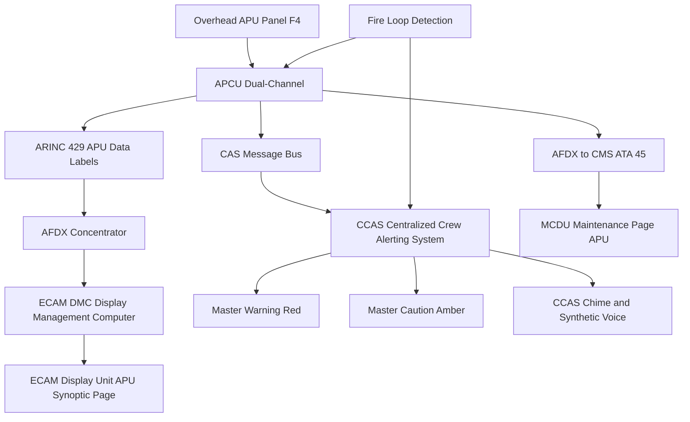
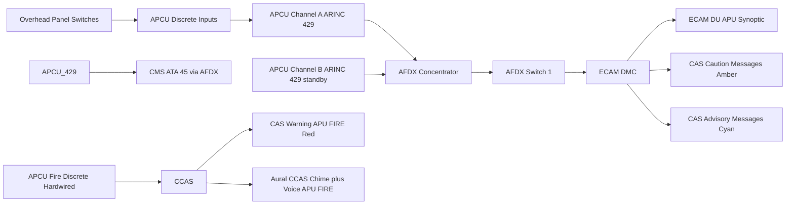
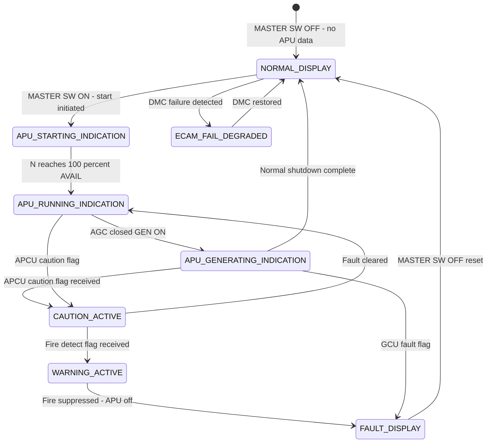

# ATLAS 040-049 · Section 04 · Subsection 049 · 060 — APU Control, Indication and Warning

## §0. Hyperlink Policy

All hyperlinks within this document use **relative paths** from the current file location. Cross-subsection links navigate to sibling files within `./` (same folder), to the subsection index at [`./README.md`](./README.md), and to parent indexes at `../`, `../../`, and `../../../`. Absolute URLs are used only for external standards references. No link shall reference an absolute filesystem path.

---

## §1. Purpose

This document defines the crew interface for APU operation on the **programme-defined aircraft type** aircraft, covering three primary domains: (1) the APU overhead panel on the flight deck providing direct crew control via MASTER SW, START pushbutton, and GEN pushbutton; (2) the ECAM APU synoptic page displaying continuous APU parameters (N%, EGT °C, oil pressure psi, generator load kVA, fuel flow kg/h, inlet door status, and APCU channel status); and (3) the Crew Alerting System (CAS) providing colour-coded alerts for APU fire, fault, over-EGT, and generator status.

All APCU-to-ECAM data transmission uses ARINC 429 label-encoded messages consolidated via an AFDX (ARINC 664 Part 7) network concentrator to the ECAM Display Management Computer (DMC). The DMC processes incoming APU data streams and renders the APU synoptic page on the appropriate ECAM Display Unit (DU) at 4 Hz refresh. The ECAM APU synoptic page is automatically displayed whenever the APU MASTER SW is in the ON position, ensuring crew awareness of APU status throughout ground operations and in-flight APU start.

The APCU overhead panel sub-panel is located in Cockpit Zone F4 (aft overhead), consistent with Airbus-style overhead panel conventions adopted by the programme-defined aircraft type. Panel layout and legend text conform to CS-25.1302 (flight crew interface requirements) and the [PROGRAMME-AIRCRAFT] Human Factors Design Standard (HFDS-001). All APU-related CAS messages conform to CS-25.1322 (warning, caution, advisory classification) and are integrated into the aircraft-wide ECAM Centralized Crew Alerting System (CCAS).

The Central Maintenance System (CMS, ATA 45) provides a dedicated APU maintenance page accessible via the MCDU in maintenance mode. This page presents PBIT/CBIT results, fault code history, PHM indicators, ignition cycle counters, and software version information, enabling maintenance technicians to diagnose APU faults without specialised external test equipment in most cases.

---

## §2. Applicability

| Parameter | Value |
|---|---|
| Aircraft Program | programme-defined aircraft type |
| ATA Chapter | 49 — Airborne Auxiliary Power |
| Overhead panel location | Cockpit Zone F4 — aft overhead, left of centre |
| ECAM interface protocol | ARINC 429 via AFDX concentrator to ECAM DMC |
| CAS message levels | WARNING (red — fire), CAUTION (amber — fault/over-EGT), ADVISORY (cyan — gen off/fuel low) |
| ECAM synoptic page refresh rate | 4 Hz for continuous parameters |
| CCAS aural alerts | CCAS chime + synthetic voice for WARNING level only |
| Overhead panel switches | MASTER SW (latching), START pb (momentary), GEN pb (momentary), FIRE pb (guarded) |
| MCDU maintenance page | APU sub-menu: PBIT results, fault codes, PHM, software versions |
| S1000D SNS | 049-060-00 (APU Control, Indication and Warning) |

---

## §3. Functional Description

The APU overhead panel sub-panel contains four primary controls:

1. **APU MASTER SW** (latching toggle): Powers the APCU and initiates the PBIT sequence. When ON, the APU inlet door begins opening, APCU performs PBIT, and AVAIL is displayed when APU reaches governed speed. When turned OFF, initiates APU shutdown sequence including 60-second cooldown.
2. **START pb** (momentary illuminated pushbutton): Initiates the APU start sequence when pressed (inlet door open and PBIT complete required). START legend illuminates during start sequence; extinguishes when APU reaches governed speed. FAULT legend illuminates amber when APCU detects a start failure or operational fault.
3. **GEN pb** (momentary pushbutton with AVAIL and ON legends): Allows crew to manually connect (close AGC) or disconnect (open AGC) the APU generator from the HVDC bus. Normally the AGC is automatically closed by the GCU when conditions are met; the GEN pb allows crew override. AVAIL legend (green) indicates APU at governed speed and generator ready. ON legend (green) indicates AGC closed and generation active.
4. **FIRE pb** (guarded momentary pushbutton, red): Arms and fires the APU fire bottle. Guard must be lifted before pressing. Generates APCU fire suppression command independent of auto fire detection logic, allowing crew to suppress fire even if fire loop detection fails.

The ECAM APU synoptic page presents the following parameters in a fixed-layout graphic: spool speed (N%) via a vertical tape gauge; EGT (°C) via a vertical tape with yellow caution arc (850–950 °C) and red warning arc (> 950 °C); oil pressure (psi) via a circular gauge; generator load (kVA and % of 150 kVA) via a horizontal bar; fuel flow (kg/h) as a digital readout; inlet door icon (closed/open/fault); APCU channel status (A or B active); and fire suppression status (bottle ARMED or DISCHARGED).

### §3.1 Functional Breakdown

| Function | Sub-system | HMI Element |
|---|---|---|
| Crew control of APU | Overhead panel sub-panel | MASTER SW, START pb, GEN pb, FIRE pb |
| Parameter display | ECAM APU synoptic page | N%, EGT, oil, gen load, fuel flow, door, channel |
| Alerting (WARNING) | CAS + CCAS | Red master warning, CCAS chime + voice |
| Alerting (CAUTION) | CAS | Amber master caution, CCAS chime |
| Alerting (ADVISORY) | CAS | Cyan advisory, no aural |
| Maintenance interface | CMS MCDU maintenance page | PBIT/CBIT results, fault codes, PHM, software version |

### Diagram 1: APU Control, Indication and Warning Architecture

---

## §4. System Architecture

The APCU serves as the sole source of all APU data presented to the crew and maintenance system. Both APCU channels (A and B) generate identical ARINC 429 data streams on separate 429 buses; the ECAM concentrator selects Channel A as primary and Channel B as standby, failing over automatically if Channel A ARINC 429 bus signals are absent for > 500 ms. The data concentrator multiplexes APU ARINC 429 data into AFDX frames and transmits them to the DMC via the aircraft AFDX backbone on VL-049-A.

The ECAM APU synoptic page is pre-rendered by the DMC but activated (made visible to crew) automatically when the APCU transmits an ARINC 429 label indicating MASTER SW = ON status. The page remains active until MASTER SW = OFF and the APU shutdown cooldown complete status is received. During start and shutdown sequences, the synoptic page additionally displays the current start phase text overlay (MOTOR / IGNITION / LIGHT-OFF / ACCEL / AVAIL / COOLING / DONE) to provide real-time start and shutdown progress without requiring crew interpretation of N% tape alone.

CAS message generation for APU alerts is performed by the DMC based on APCU-transmitted status flags. The CAS message generation logic is defined in the DMC ECAM application software (DO-178C DAL C for WARNING-level messages, DAL D for ADVISORY-level); the WARNING-level APU FIRE message is generated by direct hardwired discrete input from the APCU fire detection output to the CCAS, bypassing the AFDX to ensure fire warning is not delayed by network congestion.

### Diagram 2: ECAM Data Flow and CAS Integration

---

## §5. Components and Line-Replaceable Units

| LRU | Part Number | Qty | Location | Replacement Interval |
|---|---|---|---|---|
| APCU (dual-channel — data source) |  | 1 | APU avionics shelf | On condition / 10 000 APU cycles |
| ECAM Display Management Computer (DMC) |  | 2 (DMC1 and DMC2) | Avionics bay | On condition |
| ECAM Display Unit (DU) |  | 6 total (shared aircraft) | Glareshield and centre console | On condition |
| AFDX concentrator (APU ARINC 429 to AFDX) |  | 1 (shared aircraft) | Avionics bay | On condition |
| Overhead APU panel sub-module (Zone F4) |  | 1 | Overhead panel Zone F4 | On condition |
| CCAS audio module |  | 1 (shared aircraft) | Avionics bay | On condition |
| APCU ARINC 429 bus transceiver (Ch A) |  | 1 | APCU board embedded | On condition |
| APCU ARINC 429 bus transceiver (Ch B) |  | 1 | APCU board embedded | On condition |
| Overhead panel legend lamp/LED assembly |  | 4 (per lamp position) | Overhead panel Zone F4 | On condition / LED life |
| CMS concentrator (ATA 45) |  | 1 (shared aircraft) | Avionics bay | On condition |

---

## §6. Interfaces

| Interface | Peer System | Protocol / Bus | Data Exchanged |
|---|---|---|---|
| APCU to ECAM data | ECAM DMC | ARINC 429 via AFDX concentrator | N%, EGT, oil pressure, gen load, fuel flow, door status, channel status, fault flags |
| Overhead panel to APCU | APCU discrete input | 28 V DC hardwired discrete | MASTER SW, START pb, GEN pb, FIRE pb states |
| APCU fire discrete to CCAS | CCAS hardwired | Hardwired discrete | Fire detected — triggers master warning + aural |
| CAS messages | ECAM DMC | AFDX | WARNING/CAUTION/ADVISORY message data to DU |
| CCAS aural | CCAS audio module | Dedicated audio bus | APU FIRE voice + chime audio |
| CMS maintenance data | ATA 45 CMS | AFDX | PBIT/CBIT results, fault codes, PHM data |
| MCDU maintenance page | MCDU (ATA 34/45) | AFDX | APU maintenance data — read/display only |
| Ground crew external panel | External panel (fuselage) | Discrete + CAN bus | APU status LEDs, GEN status for ground crew |

---

## §7. Operations and Modes

| Mode | Display State | CAS State | CCAS Aural |
|---|---|---|---|
| NORMAL_DISPLAY | APU synoptic active with live data | No active APU alerts | None |
| APU_STARTING_INDICATION | Synoptic with start phase overlay text | None if nominal | None |
| APU_RUNNING_INDICATION | Synoptic — N=100%, AVAIL legend green | None | None |
| APU_GENERATING_INDICATION | Synoptic — GEN ON green, load kVA active | None | None |
| CAUTION_ACTIVE | Synoptic — parameter in amber | Amber CAUTION — APU FAULT or APU OVER EGT | CCAS single chime |
| WARNING_ACTIVE | Synoptic — APU FIRE red | Red WARNING — APU FIRE | Continuous chime + "APU FIRE" voice |
| FAULT_DISPLAY | Synoptic — FAULT legend amber on panel | CAUTION — system specific | CCAS single chime |
| ECAM_FAIL_DEGRADED | DMC failure — backup display mode | Hardwired master warning from APCU discrete | APCU hardwired fire aural only |
| MAINTENANCE_PAGE | MCDU APU maintenance menu | N/A — maintenance mode | None |

### Diagram 3: ECAM APU Indication State Machine

---

## §8. Performance and Budgets

| Parameter | Requirement | Target | Status |
|---|---|---|---|
| ECAM APU synoptic refresh rate | 4 Hz minimum | 4 Hz |  |
| APCU ARINC 429 bus rate | 100 kbps (high-speed) | 100 kbps |  |
| CAS fire WARNING display latency | < 1 s from APCU fire detect | < 500 ms via hardwired path |  |
| CAS caution display latency | < 2 s from APCU flag | < 1 s via AFDX path |  |
| CCAS aural fire warning onset | < 500 ms from fire detect | < 300 ms |  |
| ARINC 429 Ch-A to ECAM latency | < 100 ms | 80 ms |  |
| Panel legend brightness | Readable in 100 000 lux | HFDS-001 luminance spec |  |
| MCDU maintenance page load time | < 5 s from menu selection | < 3 s |  |
| Overhead panel switch actuation force | 2–8 N (CS-25.1302) | Per HFDS-001 |  |
| DMC APU page rendering latency | < 250 ms from data receipt | < 150 ms |  |

---

## §9. Safety, Redundancy and Fault Tolerance

- **Hardwired APU FIRE to CCAS**: The APU FIRE CAS WARNING is driven by a hardwired discrete signal from the APCU fire detection output directly to the CCAS, bypassing AFDX and DMC software; this ensures the fire warning is generated even in a total AFDX switch failure or DMC software hang.
- **Dual APCU ARINC 429 channels**: Channel A and Channel B each generate independent ARINC 429 data streams; the ECAM concentrator fails over to Channel B if Channel A signal is absent for > 500 ms, maintaining continuous ECAM display during single-channel APCU failure.
- **DMC dual-redundancy**: Two DMCs (DMC1 and DMC2) are installed; if DMC1 fails, DMC2 assumes APU synoptic page rendering; crew selects backup DMC via ECAM switching panel, restoring full APU indication within 10 seconds.
- **Panel guard on FIRE pb**: The guarded FIRE pushbutton prevents inadvertent APU fire bottle discharge; guard must be lifted before FIRE pb can be pressed; guard position is sensed by APCU to distinguish deliberate crew fire action from accidental contact.
- **ECAM auto-display**: The ECAM APU synoptic page is automatically displayed (without crew action) when APU MASTER SW is ON, ensuring crews cannot overlook APU abnormal indications during start, run, or shutdown sequences.
- **CAS colour coding**: All APU CAS messages conform to CS-25.1322 colour coding (red WARNING, amber CAUTION, cyan ADVISORY); no APU message uses any non-standard colour, ensuring crew recognition is consistent with all other aircraft system alerts.
- **Aural alert uniqueness**: The APU FIRE aural voice message "APU FIRE" uses a distinct tone and synthetic voice phrase that is unique across all CCAS alerts, preventing confusion with main engine fire warnings.
- **MCDU fault data retention**: APCU maintains a rolling fault log of the last 100 fault events in non-volatile memory; this log is accessible via the MCDU maintenance page and is retained through APCU power cycling, ensuring fault data is available for post-flight diagnosis.
- **Overhead panel illumination level control**: All overhead panel legends are LED-based with automatic brightness control referenced to cockpit light sensor; no crew action is needed to adjust panel brightness from day to night operations.
- **External ground panel redundancy**: The external APU status panel provides an independent display of APU GEN status and fire indication for ground crew, independent of flight deck ECAM, ensuring ground personnel are aware of APU state during exterior pre-flight and turnaround.

---

## §10. Maintenance and Diagnostics

| Task | Interval | Access | Tools Required |
|---|---|---|---|
| APCU ARINC 429 bus signal verification | Annual | APCU GSE or ARINC 429 analyser | ARINC 429 bus analyser |
| ECAM APU synoptic display test | Pre-flight self-test | Crew ECAM TEST page | None — ECAM built-in test function |
| CAS message generation test | C-check / ECAM test | MCDU TEST page | MCDU maintenance page |
| CCAS aural fire warning test | C-check | Flight deck — speaker test | MCDU audio test, calibrated SPL meter |
| Overhead panel switch actuation force | Annual or on complaint | Flight deck access | Spring tension gauge |
| Overhead panel LED brightness check | Annual | Night operations check | Photometer |
| MCDU APU maintenance page functional test | Annually | MCDU in maintenance mode | MCDU access |
| APCU fault log review and clear | Pre/post-flight or on FAULT | MCDU APU maintenance page | MCDU access |
| DMC APU page refresh rate measurement | C-check | Oscilloscope on DU output | Frame rate meter |
| External ground panel LED check | Daily line check | External APU panel access | Visual check |

---

## §11. Configuration and Software

- **ECAM APU synoptic template**: Defined in DMC ECAM application software (DO-178C DAL C for WARNING-level elements); synoptic page layout, colour zones (green/yellow/red arcs), parameter scaling, and phase text overlays are configurable in the DMC configuration file.
- **CAS message text**: APU CAS message text, colour, level (WARNING/CAUTION/ADVISORY), and associated action items are defined in the ECAM CAS message database; changes require ECAM software update and EASA DAI notification.
- **ARINC 429 label assignments**: APU ARINC 429 labels (N% — label 221, EGT — label 205, oil pressure — label 203, gen load — label 250) are defined in the APCU-DMC ICD; changes require ICD update and ARINC 429 bus re-analysis.
- **CCAS voice library**: The "APU FIRE" synthetic voice phrase is stored in the CCAS audio module non-volatile memory; phrase content and timing are defined in the CCAS message dictionary (HFDS-001 compliant).
- **MCDU maintenance page data format**: APU fault code format (ATA 49-xxx-yyy) and PHM indicator scale definitions are defined in the APCU MCDU ICD; changes require MCDU software update.
- **Panel switch logic**: MASTER SW and START pb discrete input processing logic (debounce, state machine, interlock conditions) is implemented in the APCU safety partition (DO-178C DAL C); changes require full software change impact assessment.

---

## §12. Environmental and Physical Constraints

| Constraint | Specification | Standard |
|---|---|---|
| Overhead panel switch operating temperature | −55 °C to +70 °C | DO-160G Section 4 |
| ECAM DU luminance in direct sunlight | ≥ 200 cd/m² | CS-25.1302 / HFDS-001 |
| Cockpit EMI | HIRF Zone 1 (severe) | DO-160G Section 19 |
| Overhead panel vibration | 5 g RMS | DO-160G Section 8 |
| CCAS SPL at crew station | 75–90 dB(A) above ambient | CS-25.1322 and HFDS-001 |
| MCDU operating temperature | −15 °C to +55 °C (display) | DO-160G Section 4 Cat B |
| CAS message font size | Minimum 3.5 mm cap height at 700 mm viewing | CS-25.1302 / JAR-25.1302 HF |
| Panel guard force to open | 3–10 N (FIRE pb guard) | CS-25.1302 / HFDS-001 |

---

## §13. Human Factors and Crew Interface

- **Consistent with ECAM style guide**: All APU synoptic page elements conform to the [PROGRAMME-AIRCRAFT] ECAM Style Guide (ECAM-SG-001); no unique APU-specific interface conventions are introduced, minimising crew learning burden.
- **Colour-coded parameter arcs**: EGT tape includes yellow caution arc (850–950 °C) and red warning arc (> 950 °C); N% tape includes green normal range (99–101 %) and red overspeed range (> 115 %); crews receive pre-attentive visual warning before parameter reaches limit.
- **Start phase text overlay**: Phase text (MOTOR / IGNITION / LIGHT-OFF / ACCEL / AVAIL) reduces crew interpretation of N% alone during start, which is particularly useful for crews less familiar with gas turbine start behaviour.
- **Single crew action for normal start**: A normal APU start requires only two crew actions: MASTER SW ON → wait for PBIT → START pb. The GCU automatically closes the AGC when conditions are met; no "GEN" pb action is required for routine generation. This minimises crew workload during high-activity periods (e.g., pre-departure ground preparation).
- **External ground crew interface**: The external panel APU status LEDs follow green = normal / amber = caution / red = fire conventions, consistent with general aviation ramp safety standards; no specialised training is required for ground crew to interpret APU status.
- **MCDU APU fault code plain-English decoder**: The MCDU APU maintenance page displays fault codes with plain-English descriptions (e.g., "ATA 49-030-001 — AFSOV failed to open within 1.0 s of command") alongside the ATA-coded fault number; first-line technicians can assess faults without specialist avionics training.

---

## §14. Test and Validation

| Test | Method | Acceptance Criterion | Status |
|---|---|---|---|
| ECAM APU synoptic display test | Ground ECAM test procedure | All APU parameters displayed within 5 s of MASTER SW ON |  |
| CAS fire WARNING generation test | APCU GSE — inject fire flag | Red WARNING and aural within 500 ms |  |
| CAS caution message generation test | APCU GSE — inject caution flag | Amber CAUTION displayed within 1 s |  |
| AFDX Ch-B failover test | Disconnect ARINC 429 Ch-A | ECAM continues displaying from Ch-B within 500 ms |  |
| DMC failover test | Disable DMC1 | DMC2 renders APU synoptic within 10 s of crew switch |  |
| Overhead panel switch force test | Spring gauge measurement | All switches within 2–8 N per CS-25.1302 |  |
| CCAS aural SPL measurement | Calibrated SPL meter at crew station | 75–90 dB(A) above 60 dB ambient |  |
| MCDU fault code display test | MCDU maintenance mode — inject APCU fault | Fault displayed with correct code and description |  |

---

## §15. Regulatory Compliance

| Regulation | Requirement | Compliance Method | Status |
|---|---|---|---|
| CS-25.1302 | Flight crew interface requirements | ECAM and panel design review, pilot-in-the-loop test |  |
| CS-25.1322 | Warning, caution, advisory levels | CAS message classification analysis, colour review |  |
| CS-25.1329 | Flight crew alerting | CCAS aural design and voice clarity test |  |
| DO-178C DAL C | ECAM DMC fire warning software | Software life cycle data package (WARNING-level) |  |
| DO-160G | MCDU and overhead panel environmental | Environmental test reports |  |
| EASA AMC 25.1302 | Human factors design standard | HFDS-001 compliance review |  |

---

## §16. Certification Evidence

-  ECAM APU synoptic human factors design review report — CS-25.1302 / HFDS-001
-  CAS message classification analysis report — CS-25.1322
-  CCAS aural warning SPL test report — CS-25.1329
-  ECAM DMC fire warning software DO-178C DAL C life cycle data
-  ARINC 429 Ch-A/B failover test report — 500 ms failover demonstrated
-  Overhead panel switch force measurement report — CS-25.1302 compliance
-  Pilot-in-the-loop simulation test report — APU start/stop normal and abnormal procedures
-  ECAM APU synoptic luminance test report — readable at 100 000 lux
-  MCDU maintenance page usability test report (line technician crew)
-  External ground panel design review — ground crew human factors

---

## §17. Open Issues

| ID | Description | Owner | Target | Status |
|---|---|---|---|---|
| OI-049-060-001 | Confirm ARINC 429 label assignments for all APU parameters with DMC supplier | Q-DATAGOV | 2026-Q3 |  |
| OI-049-060-002 | Complete pilot-in-the-loop simulation test plan for APU start/stop procedures | Q-AIR | 2026-Q3 |  |
| OI-049-060-003 | Validate CCAS APU FIRE voice message is distinct from ENGINE FIRE message | Q-AIR / Q-HPC | 2026-Q4 |  |
| OI-049-060-004 | Finalise MCDU APU fault code plain-English decoder string library | Q-DATAGOV | 2026-Q4 |  |
| OI-049-060-005 | Confirm EGT tape colour arc boundaries with GTC performance model | Q-AIR | 2026-Q3 |  |

---

## §18. Glossary

| Acronym / Term | Definition |
|---|---|
| APCU panel | The APU overhead control sub-panel on the flight deck (Zone F4) containing MASTER SW, START pb, GEN pb, FIRE pb |
| ECAM synoptic | ECAM page displaying a graphical overview of an aircraft system — APU synoptic shows N%, EGT, oil, gen, fuel flow |
| N% indication | Spool speed expressed as percentage of rated governed speed — displayed as vertical tape on ECAM APU synoptic |
| EGT indication | Exhaust Gas Temperature in °C — displayed with yellow caution arc (850–950 °C) and red warning arc (> 950 °C) on ECAM |
| CAS | Crew Alerting System — the integrated aircraft-wide alert management system presenting WARNING/CAUTION/ADVISORY messages |
| MCDU maintenance page | Multipurpose Control and Display Unit page accessible in maintenance mode; APU sub-menu shows PBIT, faults, PHM |
| ARINC 429 label | Specific bit-coded word type in the ARINC 429 serial bus protocol identifying the data parameter being transmitted |
| DMC | Display Management Computer — ECAM processing unit rendering synoptic pages and CAS messages on DUs |
| CCAS | Centralized Crew Alerting System — aircraft-wide system managing aural alerts, master warning/caution, and CAS messages |
| EFIS | Electronic Flight Instrument System — primary flight display system sharing display infrastructure with ECAM |

---

## §19. Citations

| Standard | Title | Issuer | Applicability |
|---|---|---|---|
| CS-25.1302 | Flight crew interface requirements | EASA | ECAM and overhead panel design |
| CS-25.1322 | Warning, caution and advisory lights | EASA | CAS message colour and level classification |
| CS-25.1329 | Flight guidance system | EASA | CCAS aural alert design |
| DO-178C | Software considerations in airborne systems | RTCA | ECAM DMC fire warning software |
| DO-160G | Environmental conditions and test procedures | RTCA | Panel, MCDU environmental qualification |
| EASA AMC 25.1302 | Human factors design standard | EASA | HF design review |
| ARINC 429 | Mark 33 digital information transfer | ARINC | APU ARINC 429 data bus |

---

## §20. References

| Document | Path | Relation |
|---|---|---|
| Q+ATLANTIDE Baseline | [../../../../organization/Q+ATLANTIDE.md](../../../../organization/Q+ATLANTIDE.md) | Parent baseline |
| ATLAS 040-049 Architecture | [../../../README.md](../../../README.md) | Parent architecture |
| Section 04 Index | [../../README.md](../../README.md) | Parent section index |
| Subsection 049 Index | [./README.md](./README.md) | Subsection index |
| 049-000 APU General | [./049-000-Airborne-Auxiliary-Power-General.md](./049-000-Airborne-Auxiliary-Power-General.md) | Parent overview |
| 049-070 Fire Protection | [./049-070-APU-Fire-Protection-Shutdown-and-Safety-Interlocks.md](./049-070-APU-Fire-Protection-Shutdown-and-Safety-Interlocks.md) | Fire warning interface |
| 049-080 Monitoring Diagnostics | [./049-080-APU-Monitoring-Diagnostics-and-Control-Interfaces.md](./049-080-APU-Monitoring-Diagnostics-and-Control-Interfaces.md) | MCDU maintenance page data |
| 049-050 Load Interfaces | [./049-050-APU-Pneumatic-and-Electrical-Load-Interfaces.md](./049-050-APU-Pneumatic-and-Electrical-Load-Interfaces.md) | GEN load display source |

---

## §21. Footprint

| Metric | Value |
|---|---|
| Document ID | QATL-ATLAS-1000-ATLAS-040-049-04-049-060-APU-CONTROL-INDICATION-AND-WARNING |
| Subsubject | 060 — APU Control, Indication and Warning |
| Sections | §0 – §22 (23 sections) |
| Tables | 16 |
| Mermaid diagrams | 3 |
| LRUs documented | 10 |
| Glossary entries | 10 |
| Regulatory references | 7 |
| Open issues | 5 |
| Version | 1.0.0 |
| Status | active |

---

## §22. Change Log

| Version | Date | Author | Change Description |
|---|---|---|---|
| 1.0.0 | 2026-05-10 | Q-AIR / ATLAS Working Group | Initial release — full 22-section content for APU Control, Indication and Warning |
