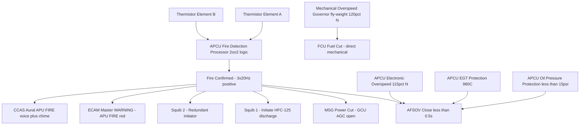
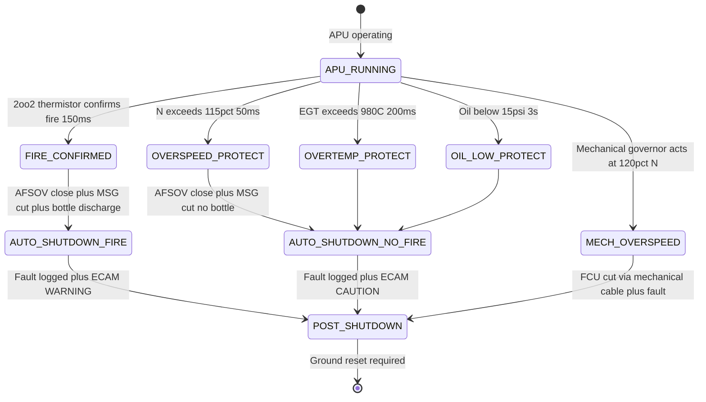

# ATLAS 040-049 · Section 04 · Subsection 049 · 070 — APU Fire Protection, Shutdown and Safety Interlocks

## §0. Hyperlink Policy

All hyperlinks within this document use **relative paths** from the current file location. Cross-subsection links navigate to sibling files within `./` (same folder), to the subsection index at [`./README.md`](./README.md), and to parent indexes at `../`, `../../`, and `../../../`. Absolute URLs are used only for external standards references. No link shall reference an absolute filesystem path.

---

## §1. Purpose

This document defines the fire protection, automatic shutdown, and safety interlock systems for the APU installation on the **AMPEL360E eWTW** aircraft. The APU fire zone is a fully enclosed compartment at the tail section (Station 32 through Station 35) designed to contain a fire for the duration required by CS-25.1181. Fire detection uses a dual-element thermistor loop operating on a 2-out-of-2 (2oo2) confirmation logic to maximise detection reliability while minimising nuisance trips. Fire suppression is achieved by a single-shot HFC-125 fire bottle installed in the APU bay, discharged by dual independent squib initiators.

Automatic shutdown triggers include APU fire detection, turbine overspeed (N > 115 %), over-temperature (EGT > 980 °C), low oil pressure (< 15 psi steady state), and APCU internal failure. A mechanical overspeed governor provides a final hardware-level backup overspeed protection independent of the APCU, acting at 120 % N to immediately cut fuel flow via a direct mechanical linkage to the FCU shut-off needle, bypassing all electronic control paths.

Safety interlocks prevent APU operation under conditions that would create unsafe states: the Weight-on-Wheels (WOW) interlock prevents in-flight APU fire bottle discharge unless crew selects FIRE pb (WOW logic is advisory only in-flight; APU can be started and operated in-flight); the Engine Oil Filter Bypass-Up (EOFU) logic does not apply to the APU oil system, which uses a full-flow filter without a bypass valve; starter/motor torque limits and GCU lock-out prevent simultaneous MSC command and AGC close command to the MSG.

All protection functions conform to CS-25.1181 (fire protection zones), CS-25.1195 (fire extinguishing systems), and CS-25.1309 (system safety assessment), with the APCU fire detection and auto-shutdown system assessed at Safety Integrity Level (SIL) 2 consistent with a probability of failure per flight hour < 10⁻⁷ for catastrophic APU fire.

---

## §2. Applicability

| Parameter | Value |
|---|---|
| Aircraft Program | AMPEL360E eWTW |
| ATA Chapter | 49 — Airborne Auxiliary Power |
| APU fire zone | Station 32–35, tail compartment |
| Fire detection technology | Dual-element thermistor loop — 2oo2 confirmation logic |
| Fire detection sample rate | 20 Hz |
| Fire confirmation threshold | 3 consecutive positive samples = fire declared (150 ms total) |
| Suppression agent | HFC-125 (halon alternative — pentafluoroethane) |
| Suppression bottle | Single-shot; dual squib initiators (either squib sufficient) |
| Overspeed protection | Electronic (APCU — 115 % N) + mechanical governor (120 % N) |
| EGT protection | APCU auto-shutdown at 980 °C |
| Oil pressure protection | APCU auto-shutdown at < 15 psi (3 s delay to prevent transient trips) |
| WOW interlock | Fire bottle advisory-only in-flight; WOW discrete from ATA 32 |
| S1000D SNS | 049-070-00 (APU Fire Protection, Shutdown and Safety Interlocks) |

---

## §3. Functional Description

The APU fire protection system consists of three subsystems working in an integrated chain:

**3.1 Fire Detection Subsystem**

Two thermistor elements are installed in the APU fire zone, one on each side of the APU nacelle, forming a dual-element loop. Each element changes resistance in proportion to temperature; the APCU fire detection processor samples each element at 20 Hz and computes a running-average resistance value. A fire condition is declared when both elements simultaneously indicate temperature above the fire threshold (nominally 220 °C wire temperature, corresponding to a zone temperature rise to approximately 400 °C) for 3 consecutive 50 ms samples (150 ms total confirmation time). The 2oo2 logic requires both elements to indicate fire simultaneously; a single element failure or short-circuit is detected as a fire loop fault (CAUTION) but does not trigger auto-shutdown, preventing nuisance shutdowns from single-element failure.

**3.2 Fire Suppression Subsystem**

The HFC-125 fire bottle is mounted in the APU bay structure at Station 33, providing the shortest possible discharge path into the fire zone. The bottle has a rated discharge time of < 2 seconds for full agent release. Two independent squib initiators are installed; either squib alone is sufficient to discharge the bottle (1oo2 initiator logic). The squib initiators are powered from the Aircraft Emergency Bus (28 V DC) and are driven by separate APCU fire suppression output channels, ensuring squib discharge capability even if one APCU output driver fails. Once discharged, the fire bottle is not automatically re-armed; a BOTTLE DISCHARGED flag is displayed on the ECAM and in the MCDU maintenance page; the bottle must be replaced on the ground before further APU operation.

**3.3 Automatic Shutdown Subsystem**

The APCU executes an auto-shutdown sequence when any of the following triggers are asserted: (a) APU fire confirmed (2oo2 thermistor logic), (b) N > 115 % for > 50 ms, (c) EGT > 980 °C for > 200 ms, (d) oil pressure < 15 psi for > 3 s, (e) APCU dual-channel failure (both channels unavailable simultaneously). The auto-shutdown sequence is: (1) AFSOV close command (response time < 0.5 s); (2) MSG power cut (GCU opens AGC and removes MSG excitation simultaneously); (3) fire bottle arm and auto-discharge (fire trigger only; other triggers arm but do not discharge); (4) inlet door close command; (5) fault code logging; (6) ECAM master WARNING (fire) or CAUTION (other triggers). The mechanical overspeed governor (spring-loaded fly-weight type, set at 120 % N) acts independently of the APCU, directly mechanically closing the FCU fuel shut-off needle via a cable linkage, providing final hardware overspeed protection.

### §3.1 Functional Breakdown

| Function | Mechanism | Logic |
|---|---|---|
| Fire detection | Dual thermistor elements | 2oo2 — both elements must indicate fire |
| Fire confirmation | APCU fire processor | 3 consecutive 20 Hz positive samples (150 ms) |
| Fire suppression | HFC-125 bottle + dual squibs | 1oo2 squib — either squib discharges bottle |
| Overspeed protection (electronic) | APCU N% sensor | N > 115 % → AFSOV close + MSG cut, 50 ms hold |
| Overspeed protection (mechanical) | Fly-weight governor on GTC shaft | N ≥ 120 % → direct FCU fuel cut via mechanical linkage |
| EGT protection | APCU EGT processor | EGT > 980 °C for 200 ms → AFSOV close |
| Oil pressure protection | APCU oil pressure sensor | Oil < 15 psi for 3 s → AFSOV close |
| WOW interlock | ATA 32 WOW discrete to APCU | In-flight fire bottle advisory override only |
| EOFU not applicable | APU full-flow oil filter | No bypass valve — no EOFU protection |

### Diagram 1: APU Fire Protection Functional Architecture

---

## §4. System Architecture

The fire detection circuit forms a two-wire loop through both thermistor elements in series. The APCU fire detection processor monitors loop resistance; an open circuit (single element disconnected) is detected as a loop FAULT (amber CAUTION), not a fire. A short circuit (element shorted) is also detected as a loop FAULT. Only a simultaneous resistance drop in both elements to below the fire threshold declares a fire. This eliminates the possibility of a single-point wiring fault causing an inadvertent fire suppression discharge.

Fire suppression triggering is controlled by the APCU via two independent output channels connected to squib initiators 1 and 2. Each output channel is driven by a separate APCU board circuit; failure of one output channel does not prevent the other from firing. The squib circuits are isolated from the main APCU power rail by dedicated pyrotechnic bus protection; the pyrotechnic bus is powered from the Aircraft Emergency Bus at all times the APU MASTER SW is ON, ensuring discharge capability even during total AC power loss.

Auto-shutdown for non-fire triggers (overspeed, over-EGT, low oil) follows the same AFSOV close path but does not command the fire bottle discharge; the bottle is armed (ready to discharge on subsequent crew FIRE pb press) but not automatically discharged. This conserves the single-shot suppression charge for confirmed fire events. The crew is alerted via ECAM CAUTION and can elect to discharge the bottle manually if the cause of shutdown is unclear.

### Diagram 2: Auto-Shutdown Sequence State Machine

---

## §5. Components and Line-Replaceable Units

| LRU | Part Number | Qty | Location | Replacement Interval |
|---|---|---|---|---|
| Thermistor loop element (fire zone) |  | 2 | APU nacelle — one each side | 6 000 APU hours / on condition |
| HFC-125 fire suppression bottle |  | 1 | APU bay Station 33 | 12 years / after discharge |
| Squib initiator No. 1 |  | 1 | HFC-125 bottle head | 10 years shelf life |
| Squib initiator No. 2 |  | 1 | HFC-125 bottle head | 10 years shelf life |
| Mechanical overspeed governor assembly |  | 1 | GTC accessory gearbox | On condition / 20 000 APU hours |
| APCU fire detection processor board |  | 1 (dual-channel shared) | APCU chassis | On condition |
| APCU squib output channel board |  | 2 (Ch A and Ch B) | APCU chassis | On condition |
| Pyrotechnic bus protection relay |  | 1 | APU bay junction box | On condition |
| Thermistor loop wiring harness |  | 1 | APU fire zone routing | 12 000 APU hours |
| Mechanical overspeed governor cable |  | 1 | Governor to FCU | On condition / 10 000 APU hours |

---

## §6. Interfaces

| Interface | Peer System | Protocol / Bus | Data Exchanged |
|---|---|---|---|
| Thermistor loop to APCU | APCU fire detection board | Analogue — two-wire resistance loop | Thermistor resistance (fire / fault / normal) |
| APCU fire output to squib 1 | Squib initiator 1 | Pyrotechnic bus discrete | Fire discharge command — 28 V DC pulse |
| APCU fire output to squib 2 | Squib initiator 2 | Pyrotechnic bus discrete | Fire discharge command — 28 V DC pulse |
| APCU fire discrete to CCAS | CCAS | Hardwired 28 V DC discrete | Fire confirmed — CCAS master warning |
| APCU fire flag to ECAM | ECAM DMC | ARINC 429 via AFDX | APU FIRE WARNING CAS message |
| APCU auto-shutdown to AFSOV | AFSOV solenoid | 28 V DC hardwired | AFSOV close command |
| APCU auto-shutdown to GCU | GCU (MSG power) | ARINC 664 / discrete | MSG power cut command |
| WOW discrete to APCU | ATA 32 Landing Gear | 28 V DC discrete | Aircraft WOW state (on/off ground) |
| Mechanical governor to FCU | FCU fuel shut-off needle | Mechanical cable linkage | Direct fuel cut at 120 % N |
| Pyrotechnic bus to Emergency Bus | Aircraft Emergency Bus | Hardwired | Pyrotechnic bus 28 V DC supply |

---

## §7. Operations and Modes

| Mode | Fire Detection State | Suppression State | Auto-Shutdown State |
|---|---|---|---|
| APU_RUNNING_NORMAL | Both elements monitoring — no fire | Bottle charged, squibs armed | No protection trigger active |
| FIRE_CONFIRMED | 2oo2 logic positive — fire declared | Bottle discharge commanded | AFSOV close + MSG cut |
| FIRE_LOOP_FAULT | Single element open or short | Bottle charged (CAUTION only) | No auto-shutdown |
| OVERSPEED_ELECTRONIC | N > 115 % for 50 ms | Bottle armed — not discharged | AFSOV close + MSG cut |
| OVERSPEED_MECHANICAL | Fly-weight governor acts ≥ 120 % | Bottle armed — not discharged | FCU mechanical cut |
| OVER_EGT | EGT > 980 °C for 200 ms | Bottle armed — not discharged | AFSOV close |
| LOW_OIL_PRESSURE | Oil < 15 psi for 3 s | Bottle armed — not discharged | AFSOV close |
| BOTTLE_DISCHARGED | Monitoring continues (no re-arm) | Bottle empty — MCDU note | APU shutdown required |
| APU_SHUTDOWN_COMPLETE | Monitoring active until cool-down done | Bottle state maintained | All protection active post-shutdown |
| GROUND_RESET | Ground technician resets APCU | Bottle replacement required | APCU reset clears protection latches |

---

## §8. Performance and Budgets

| Parameter | Requirement | Target | Status |
|---|---|---|---|
| Fire confirmation time (2oo2 + 3 samples) | < 250 ms | 150 ms (3 × 50 ms) |  |
| AFSOV close response after fire | < 500 ms | < 400 ms |  |
| HFC-125 bottle full discharge time | < 2 s | < 1.5 s |  |
| Overspeed electronic threshold | 115 % N | 115 % ± 1 % |  |
| Overspeed mechanical threshold | 120 % N | 120 % ± 1.5 % |  |
| EGT over-temperature threshold | 980 °C | 980 °C ± 10 °C |  |
| Oil pressure protection threshold | 15 psi | 15 psi ± 1 psi |  |
| Oil pressure trip delay | 3 s | 3.0 s ± 0.2 s |  |
| Thermistor element life | 6 000 APU hours | 6 000 hours |  |
| Squib initiator shelf life | 10 years | 10 years per manufacturer spec |  |
| System failure probability | < 10⁻⁷ per flight hour (SIL 2) | SSA target |  |

---

## §9. Safety, Redundancy and Fault Tolerance

- **2oo2 fire detection logic**: Requires both thermistor elements to simultaneously indicate fire; single element failure or short causes FAULT (CAUTION) without shutdown, preventing nuisance shutdowns from single-element failure while maintaining detection integrity in the remaining healthy element.
- **Dual squib initiators (1oo2)**: Either squib initiator alone can discharge the HFC-125 bottle; dual squibs are powered from separate APCU output channels; single squib failure does not prevent fire suppression, meeting CS-25.1195 redundancy requirements.
- **Hardwired CCAS fire warning**: APU fire confirmed signal is hardwired from APCU to CCAS, bypassing AFDX; fire master warning is generated within 300 ms even if AFDX network is congested or DMC software has failed.
- **Mechanical overspeed governor**: The fly-weight mechanical governor at the GTC accessory gearbox provides final overspeed protection at 120 % N, independent of all APCU electronics, AFDX, FCU control loops, and software; this is a pure mechanical fuel cut mechanism, acting even in total APCU power loss.
- **Pyrotechnic bus isolation**: Squib circuits are isolated on a dedicated pyrotechnic bus powered from the Aircraft Emergency Bus, ensuring discharge capability even during total normal-bus power loss.
- **Protective delay on oil pressure**: The 3-second confirmation delay on the oil pressure protection prevents nuisance shutdowns during oil system transients (e.g., cold start oil pressure build-up), while still protecting against sustained low-oil conditions that would cause journal bearing failure.
- **Fire zone containment (CS-25.1181)**: The APU bay is fire-zone certified to contain a fire for ≥ 15 minutes per CS-25.1181 requirements without structural failure of critical aircraft structure, providing backup protection even if the fire suppression system fails to fully extinguish the fire.
- **Single-shot bottle design note**: The HFC-125 bottle is single-shot (one use per installation). The system is designed for one discharge to fully extinguish the APU compartment fire per CS-25.1195 agent quantity requirements. If fire re-ignites after bottle discharge, the APU must remain shut down; no second discharge is available. This design choice is consistent with industry standard for APU fire systems.
- **Ground reset interlock**: APCU protection latches (fire confirmed, overspeed, etc.) can only be reset on the ground via the MCDU maintenance page after the fault is resolved; no in-flight reset is permitted for fire and overspeed latches, preventing accidental APU restart after a protection event.

---

## §10. Maintenance and Diagnostics

| Task | Interval | Access | Tools Required |
|---|---|---|---|
| Thermistor loop continuity check | Pre-flight / annual | APCU GSE — loop resistance test | Ohmmeter / APCU GSE port |
| Thermistor loop response test | Annual / on FAULT indication | GSE — apply heated stimulus to elements | Heat gun, thermometer, ohmmeter |
| HFC-125 bottle pressure check | Monthly | Bottle pressure gauge fitting | Calibrated pressure gauge |
| HFC-125 bottle weight check | Annual | Remove bottle and weigh | Calibrated scale |
| Squib initiator continuity check (no fire test) | Annual | APCU squib test mode (safe mode — no discharge) | APCU GSE squib test function |
| Squib initiator replacement | 10 year shelf life | APU bay access, remove bottle head | Squib removal tool, torque wrench |
| Mechanical overspeed governor calibration | 20 000 APU hours / on install | GTC test stand — bench governor speed test | GTC bench test rig |
| APCU fire detection software PBIT check | Post-maintenance | MCDU APU maintenance page | MCDU access |
| Fire zone structural inspection | 4 000 APU hours | APU bay access, visual / NDT | Flashlight, NDT equipment if indicated |
| Pyrotechnic bus protection relay check | Annual | APU junction box — relay energisation test | Multimeter |

---

## §11. Configuration and Software

- **APCU fire detection firmware**: The 2oo2 thermistor sampling logic, fire threshold table, confirmation counter (3 samples), and all protection thresholds are implemented in the APCU safety partition (DO-178C DAL C); changes require full DO-178C software change assessment.
- **Thermistor fire threshold**: The thermistor resistance-to-temperature conversion table and the fire declaration resistance threshold are stored in APCU non-volatile parameter memory; threshold changes require avionics ground support equipment (GSE) update and re-test.
- **Overspeed threshold configuration**: Electronic overspeed threshold (115 % N) and mechanical governor set-point (120 % N) must be consistent; mechanical governor set-point is set at GTC test stand during governor installation and is not software-configurable.
- **Auto-shutdown sequence timing**: AFSOV close command timing (< 500 ms from protection trigger) and MSG power cut sequence are hard-coded in APCU safety partition firmware; no field adjustment is permitted.
- **Squib circuit arming logic**: APCU squib arm/disarm logic follows a safety sequence requiring MASTER SW ON + PBIT PASS + fire detection processor healthy; the squib circuit is disarmed when MASTER SW is OFF and during APCU PBIT, preventing inadvertent discharge during power-up.
- **Bottle discharge status memory**: BOTTLE DISCHARGED state is stored in APCU non-volatile memory; this state persists through power cycling and is displayed on ECAM and MCDU; clearing the DISCHARGED state requires the MCDU maintenance page "BOTTLE RESET" function (requires ground maintenance mode).

---

## §12. Environmental and Physical Constraints

| Constraint | Specification | Standard |
|---|---|---|
| Thermistor element operating temperature | −55 °C to +400 °C ambient | DO-160G Section 4 |
| HFC-125 bottle operating temperature | −55 °C to +85 °C | ANSI/UL 2166 |
| HFC-125 bottle storage pressure | Nominally 12 bar at 21 °C | Bottle manufacturer specification |
| Squib initiator pyrotechnic environment | Vibration: 10 g RMS; Shock: 15 g | MIL-DTL-23659 |
| APU fire zone structural temperature | Containment ≥ 15 min per CS-25.1181 | CS-25.1181 |
| Mechanical governor centrifugal loads | GTC maximum continuous N equivalent | Fly-weight governor design spec |
| Pyrotechnic bus wiring | Shielded — segregated from main APCU wiring | CS-25.1353 |
| Fire zone access panel | Self-sealing fire barrier | CS-25.1191 |

---

## §13. Ground Safety and Handling

- **Squib safe handling**: Squib initiators are classified as pyrotechnic devices; handling follows IATA Dangerous Goods Regulations Section 4A and MIL-HDBK-1512; squib shipping and storage require orange "EXPLOSIVE" labels and 1.4S classification documentation.
- **HFC-125 environmental notes**: HFC-125 is a hydrofluorocarbon (HFC) with a Global Warming Potential (GWP) of approximately 3 500; its use as a halon replacement is authorised under Montreal Protocol exemptions for aircraft fire suppression; AMPEL360E program is tracking emerging regulations and may transition to a lower-GWP alternative (e.g., 2-BTP) in a future software/hardware update.
- **Bottle discharge zone exclusion**: A 3-metre exclusion zone around the APU exhaust and fire zone is maintained during and after bottle discharge until the zone is verified agent-clear; HFC-125 is non-toxic at normal fire suppression concentrations but displaces oxygen.
- **WOW interlock note**: The WOW interlock prevents in-flight fire bottle discharge from the ground servicing panel; however, the FIRE pb on the flight deck overrides WOW for crew use; this design prevents accidental ground handling discharge of the bottle via the external panel while preserving crew authority in-flight.

---

## §14. Test and Validation

| Test | Method | Acceptance Criterion | Status |
|---|---|---|---|
| 2oo2 thermistor fire detection functional test | GSE — apply fire threshold stimuli to both elements simultaneously | Fire declared in ≤ 150 ms |  |
| Single element fault detection test | GSE — open-circuit one element | FAULT flag set, no shutdown |  |
| HFC-125 bottle discharge rate test | Bottle bench discharge test | Full discharge ≤ 1.5 s |  |
| Electronic overspeed protection test | GSE — inject N > 115 % signal | AFSOV closes ≤ 400 ms |  |
| Mechanical overspeed governor test | GTC bench test — run to 120 % N | Fuel cut at 120 % ± 1.5 % |  |
| EGT over-temperature protection test | GSE — inject EGT > 980 °C for 200 ms | AFSOV closes ≤ 500 ms |  |
| Low oil pressure protection test | GSE — inject oil pressure < 15 psi for 3 s | AFSOV closes after 3 s ± 0.2 s |  |
| Squib continuity check (no discharge) | APCU squib test mode | Both squibs show continuity |  |
| Fire zone containment test | CS-25.1181 fire zone test | No structural failure in ≥ 15 min |  |
| System SSA probability verification | FMEA / fault tree analysis | < 10⁻⁷ per flight hour |  |

---

## §15. Regulatory Compliance

| Regulation | Requirement | Compliance Method | Status |
|---|---|---|---|
| CS-25.1181 | Fire protection zones — fire zone definition and containment | Fire zone structural test; boundary material specification |  |
| CS-25.1191 | Firewall construction | Material and sealing specification; fire zone design review |  |
| CS-25.1195 | Fire extinguishing systems — agent quantity and distribution | Bottle discharge test; concentration analysis |  |
| CS-25.1203 | Fire detector systems | Dual-element loop design; 2oo2 logic analysis; functional test |  |
| CS-25.1309 | System safety assessment (SSA) | FMEA / FTA; SIL 2 target < 10⁻⁷ per flight hour |  |
| DO-178C DAL C | APCU fire detection software | Software life cycle data package |  |
| MIL-DTL-23659 | Squib initiator pyrotechnic design | Squib acceptance test; conformance review |  |

---

## §16. Certification Evidence

-  APU fire zone structural test report — CS-25.1181 containment ≥ 15 min
-  HFC-125 bottle discharge rate and concentration test report — CS-25.1195
-  Thermistor fire detection functional test report — 2oo2 logic verified
-  APU fire protection system SSA report — FMEA/FTA < 10⁻⁷ per flight hour
-  Mechanical overspeed governor calibration and bench test report — 120 % N ± 1.5 %
-  Electronic overspeed and EGT/oil protection functional test report
-  Squib initiator qualification and shelf life test report — MIL-DTL-23659
-  APCU fire detection software DO-178C DAL C life cycle data package
-  Fire zone firewall material and sealing specification — CS-25.1191
-  CS-25.1203 fire detector design and performance analysis report

---

## §17. Open Issues

| ID | Description | Owner | Target | Status |
|---|---|---|---|---|
| OI-049-070-001 | Confirm HFC-125 concentration adequacy analysis for APU bay volume — CS-25.1195 agent quantity | Q-AIR | 2026-Q3 |  |
| OI-049-070-002 | Select lower-GWP HFC-125 alternative (e.g. 2-BTP) pending Montreal Protocol annex review | Q-GREENTECH | 2027-Q1 |  |
| OI-049-070-003 | Complete mechanical overspeed governor qualification test plan (bench speed run) | Q-MECHANICS | 2026-Q4 |  |
| OI-049-070-004 | Finalise APU fire zone CS-25.1181 structural test plan — fire zone boundary materials | Q-AIR | 2026-Q3 |  |
| OI-049-070-005 | Issue APU fire protection SSA final report with complete FMEA/FTA data | Q-AIR / Q-HPC | 2026-Q4 |  |

---

## §18. Glossary

| Acronym / Term | Definition |
|---|---|
| HFC-125 | Hydrofluorocarbon pentafluoroethane — halon-replacement fire suppression agent used in APU fire bottle |
| Fire loop thermistor | Resistance-based temperature sensor installed in fire zone; resistance drops sharply above fire threshold temperature |
| Auto-shutdown sequence | APCU-commanded sequence: AFSOV close + MSG cut + (fire only) HFC-125 bottle discharge, on protection trigger |
| WOW | Weight on Wheels — discrete signal from ATA 32 landing gear system indicating aircraft is on ground |
| Overspeed governor | Mechanical fly-weight device on GTC shaft that directly cuts FCU fuel flow at 120 % N, independent of electronics |
| EOFU | Engine Oil Filter Bypass-Up — oil filter bypass valve opening indication; not applicable to APU (full-flow filter, no bypass) |
| CS-25 | EASA Certification Specifications for Large Aeroplanes — regulatory basis for fire protection requirements |
| Fire zone | Designated compartment around APU required by CS-25.1181 to be constructed to contain fire for at least 15 minutes |
| Squib initiator | Pyrotechnic device (1.4S classification) that uses an electrically-triggered pyrotechnic charge to discharge the fire bottle |
| SIL | Safety Integrity Level — IEC 61508 metric applied to APU fire protection; SIL 2 corresponds to < 10⁻⁷ probability of dangerous failure per hour |

---

## §19. Citations

| Standard | Title | Issuer | Applicability |
|---|---|---|---|
| CS-25.1181 | Fire protection — designated fire zones | EASA | APU fire zone definition and containment |
| CS-25.1191 | Firewalls | EASA | APU bay firewall material |
| CS-25.1195 | Fire extinguishing systems | EASA | HFC-125 bottle agent quantity |
| CS-25.1203 | Fire detector systems | EASA | Thermistor loop design |
| CS-25.1309 | Equipment, systems and installations — safety | EASA | SSA / SIL 2 requirement |
| DO-178C | Software considerations in airborne systems | RTCA | APCU fire detection software |
| MIL-DTL-23659 | Initiators, explosive; general specification | US DoD | Squib initiator qualification |
| ANSI/UL 2166 | Standard for halon-alternative fire extinguishing systems | UL | HFC-125 bottle qualification |
| IEC 61508 | Functional safety of E/E/PE safety-related systems | IEC | SIL 2 target specification |

---

## §20. References

| Document | Path | Relation |
|---|---|---|
| Q+ATLANTIDE Baseline | [../../../../organization/Q+ATLANTIDE.md](../../../../organization/Q+ATLANTIDE.md) | Parent baseline |
| ATLAS 040-049 Architecture | [../../../README.md](../../../README.md) | Parent architecture |
| Section 04 Index | [../../README.md](../../README.md) | Parent section index |
| Subsection 049 Index | [./README.md](./README.md) | Subsection index |
| 049-000 APU General | [./049-000-Airborne-Auxiliary-Power-General.md](./049-000-Airborne-Auxiliary-Power-General.md) | Parent overview |
| 049-030 Fuel Supply | [./049-030-APU-Fuel-Supply-and-Control.md](./049-030-APU-Fuel-Supply-and-Control.md) | AFSOV fuel cut interface |
| 049-040 Ignition and Generation | [./049-040-APU-Ignition-Starting-and-Generation.md](./049-040-APU-Ignition-Starting-and-Generation.md) | MSG power cut interface |
| 049-060 Control and Indication | [./049-060-APU-Control-Indication-and-Warning.md](./049-060-APU-Control-Indication-and-Warning.md) | FIRE pb and CAS warning interface |

---

## §21. Footprint

| Metric | Value |
|---|---|
| Document ID | QATL-ATLAS-1000-ATLAS-040-049-04-049-070-APU-FIRE-PROTECTION-SHUTDOWN-AND-SAFETY-INTERLOCKS |
| Subsubject | 070 — APU Fire Protection, Shutdown and Safety Interlocks |
| Sections | §0 – §22 (23 sections) |
| Tables | 18 |
| Mermaid diagrams | 2 (including 1 state machine diagram) |
| LRUs documented | 10 |
| Glossary entries | 10 |
| Regulatory references | 9 |
| Open issues | 5 |
| Version | 1.0.0 |
| Status | active |

---

## §22. Change Log

| Version | Date | Author | Change Description |
|---|---|---|---|
| 1.0.0 | 2026-05-10 | Q-AIR / ATLAS Working Group | Initial release — full 22-section content for APU Fire Protection, Shutdown and Safety Interlocks |
