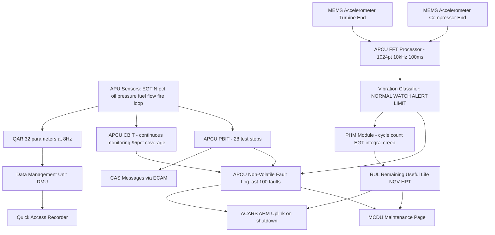
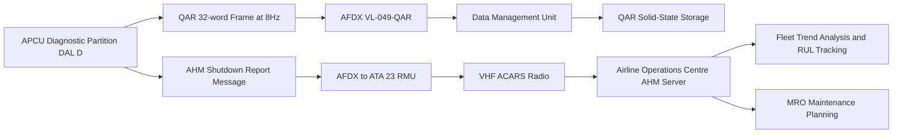
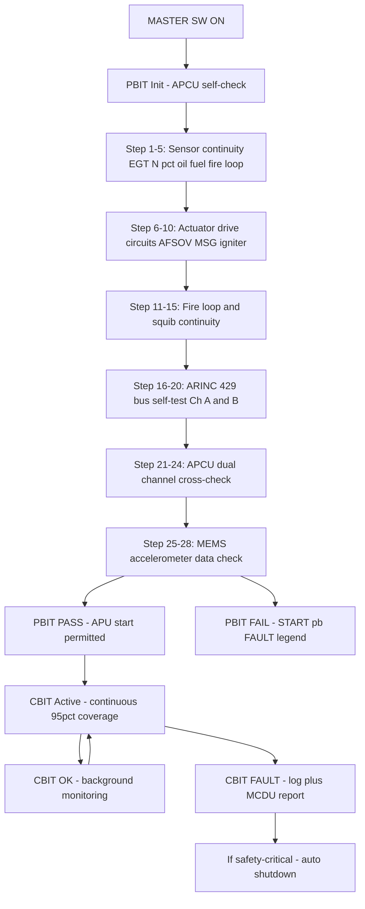

# ATLAS 040-049 · Section 04 · Subsection 049 · 080 — APU Monitoring, Diagnostics and Control Interfaces

## §0. Hyperlink Policy

All hyperlinks within this document use **relative paths** from the current file location. Cross-subsection links navigate to sibling files within `./` (same folder), to the subsection index at [`./README.md`](./README.md), and to parent indexes at `../`, `../../`, and `../../../`. Absolute URLs are used only for external standards references. No link shall reference an absolute filesystem path.

---

## §1. Purpose

This document defines the monitoring, diagnostics, and external control interfaces for the APU on the **AMPEL360E eWTW** aircraft, covering Built-In Test (PBIT/CBIT), Prognostic and Health Management (PHM), vibration monitoring using MEMS accelerometers, Quick Access Recorder (QAR) parameter streaming, Aircraft Communications Addressing and Reporting System (ACARS) Aircraft Health Monitoring (AHM) uplink, and Central Maintenance System (CMS, ATA 45) integration.

The APCU executes a Power-on Built-In Test (PBIT) of < 90 seconds duration on every APU MASTER SW ON event, verifying continuity and functionality of all APU sensors, actuator drive circuits, fire detection circuits, squib circuit continuity, ARINC 429 data output buses, and the APCU dual-channel hardware itself. Continuous Built-In Test (CBIT) runs in the APCU background partition with > 95 % fault coverage, monitoring all critical control paths between scheduled PBIT events.

The PHM subsystem uses a combination of thermodynamic performance degradation tracking (N%, EGT margin, fuel flow trend) and mechanical vibration signature analysis (via two MEMS accelerometers at 10 kHz sampling with onboard FFT) to compute a Remaining Useful Life (RUL) estimate for the APU hot section. This estimate is updated on every APU shutdown and transmitted to the Airline Operations Centre via ACARS AHM uplink.

Thirty-two QAR parameters covering all major APU operating variables are streamed at 8 Hz to the aircraft Quick Access Recorder, enabling post-flight trend analysis, maintenance optimisation, and fleet-wide health monitoring by the operator. The CMS ATA 45 provides maintenance technicians with a structured fault tree and fault code interface, reporting faults in ATA 49-xxx-yyy format with plain-English descriptions and corrective action guidance.

---

## §2. Applicability

| Parameter | Value |
|---|---|
| Aircraft Program | AMPEL360E eWTW |
| ATA Chapter | 49 — Airborne Auxiliary Power |
| PBIT duration | < 90 s from MASTER SW ON |
| PBIT fault coverage | All sensors, actuators, fire detection, squib circuits, ARINC 429 |
| CBIT coverage | > 95 % of critical control paths |
| MEMS vibration sensors | 2 × MEMS accelerometers (GTC accessory gearbox front and rear) |
| Vibration sample rate | 10 kHz per channel |
| Vibration FFT resolution | 1 Hz bins, 0–5 kHz range |
| QAR parameters | 32 APU parameters at 8 Hz |
| ACARS AHM uplink | On every APU shutdown event |
| CMS fault code format | ATA 49-xxx-yyy |
| S1000D SNS | 049-080-00 (APU Monitoring, Diagnostics and Control Interfaces) |

---

## §3. Functional Description

The APU monitoring system has four tiers of increasing analysis complexity:

**Tier 1 — Real-time PBIT/CBIT**: The APCU PBIT performs a structured test sequence covering 28 discrete test steps verifying all sensors (EGT, N%, oil pressure, fuel flow, fire loop resistance), actuator drive outputs (AFSOV solenoid continuity, MSG enable, igniter trigger), fire protection squib continuity, and ARINC 429 data bus self-test. Failures cause a FAULT legend on the START pb and a CAUTION CAS message; PBIT failures that affect safety-critical paths (fire detection, overspeed protection) are flagged at WARNING level and prevent APU start. CBIT monitors a subset of critical paths continuously; CBIT faults are logged and reported via MCDU but do not immediately stop a running APU unless the fault is in a shutdown-critical path.

**Tier 2 — Vibration Monitoring**: Two MEMS accelerometers are mounted on the GTC accessory gearbox bearing housing — one at the compressor end bearing and one at the turbine end bearing. Each accelerometer samples at 10 kHz and transmits raw data to the APCU diagnostic processor. The APCU performs a 1024-point FFT on 100 ms time windows, producing a 5 kHz bandwidth spectrum with 1 Hz bin resolution. Characteristic blade-pass frequencies, bearing defect frequencies, and rotor unbalance signatures are tracked against baseline spectra established at APU commissioning. Vibration level exceedances and spectral anomalies are classified as NORMAL, WATCH, ALERT, or LIMIT. LIMIT level triggers an MCDU CAUTION and AHM uplink request.

**Tier 3 — PHM and RUL**: The PHM module tracks thermodynamic cycle counting (EGT×time integral per cycle), hot-section creep exposure, ignition cycle counts, and accumulated vibration fatigue. A physics-informed model (linearised turbine life consumption model per ARP 5765) computes a RUL estimate in remaining APU cycles for the turbine nozzle guide vane (NGV) and high-pressure turbine blade (HPT blade) hot-section components. RUL is updated on every shutdown and stored in APCU non-volatile memory. When RUL reaches < 200 cycles, a WATCH indication is displayed on the MCDU maintenance page. When RUL < 50 cycles, a CAUTION CAS message is generated and ACARS AHM uplink is initiated.

**Tier 4 — QAR and ACARS AHM**: All 32 APU QAR parameters are streamed at 8 Hz to the aircraft Data Management Unit (DMU) for recording in the Quick Access Recorder. On every APU shutdown, the APCU generates an AHM report message (using the ACARS uplink sub-network via ATA 23 VHF ACARS radio) containing the latest RUL estimates, peak vibration levels, fault code log summary, and cycle counts. The AHM report is formatted in accordance with the airline's ACARS aircraft health monitoring schema (operator-configurable; default AMPEL360E AHM message format version 1.0).

### §3.1 Functional Breakdown

| Tier | Function | Data Rate / Interval |
|---|---|---|
| Tier 1 | PBIT — 28-step test on MASTER SW ON | Once per APU start (< 90 s) |
| Tier 1 | CBIT — continuous background monitoring | Continuous, > 95 % coverage |
| Tier 2 | MEMS vibration FFT analysis | 100 ms window, 10 kHz sampling |
| Tier 2 | Vibration spectral anomaly classification | Each FFT window |
| Tier 3 | PHM cycle counting | Per-cycle accumulation |
| Tier 3 | RUL computation and update | On every APU shutdown |
| Tier 4 | QAR parameter streaming | 32 parameters at 8 Hz |
| Tier 4 | ACARS AHM uplink | On every APU shutdown event |

### Diagram 1: APU Monitoring and Diagnostics Architecture

---

## §4. System Architecture

The APCU diagnostic processor is a dedicated computational partition within the APCU (ARINC 653 partition 3 — Diagnostic), separate from the control partition (partition 1) and the safety monitoring partition (partition 2). The diagnostic partition has a dedicated 128 MB RAM allocation and a real-time DSP processing pipeline for FFT computation. It operates at lower DO-178C assurance level (DAL D) than the control partition (DAL C), reflecting its advisory-only function — no diagnostic output can command APU hardware directly.

The two MEMS accelerometers are connected to the APCU diagnostic processor via dedicated analogue-to-digital conversion channels (16-bit, 10 kHz) on the APCU sensor interface board. Data is not shared with the control partition to prevent FFT processing load from affecting control loop timing. The FFT output (spectral magnitude arrays) is stored in a circular buffer covering the last 1 000 FFT windows (approximately 100 seconds of data) in APCU non-volatile memory.

QAR parameter streaming uses a dedicated AFDX Virtual Link (VL-049-QAR) from the APCU to the DMU. The 32 QAR parameters are defined in the APCU-DMU ICD (ARINC 767-compatible format); parameters are transmitted in a fixed-structure 32-word frame at 8 Hz (125 ms period). The DMU records all frames to the QAR solid-state storage device (SSD).

ACARS AHM uplink messages are generated by the APCU at shutdown and queued in the APCU transmit buffer; the APCU requests uplink via an AFDX message to the ATA 23 VHF ACARS radio management unit (RMU). The RMU transmits the AHM message when a VHF ACARS sub-band is available; typical uplink latency after shutdown is < 5 minutes. The AHM message format is proprietary to the operator but conforms to the AMPEL360E default AHM schema using standard ACARS BI/BX message addressing.

### Diagram 2: QAR and ACARS AHM Data Flow

---

## §5. Components and Line-Replaceable Units

| LRU | Part Number | Qty | Location | Replacement Interval |
|---|---|---|---|---|
| APCU (with embedded diagnostic processor and FFT) |  | 1 | APU avionics shelf | On condition / 10 000 APU cycles |
| MEMS accelerometer — compressor end |  | 1 | GTC accessory gearbox front bearing housing | On condition / 6 000 APU hours |
| MEMS accelerometer — turbine end |  | 1 | GTC accessory gearbox rear bearing housing | On condition / 6 000 APU hours |
| MEMS accelerometer signal conditioning board |  | 1 | APCU chassis (integrated) | On condition |
| Data Management Unit (DMU) — QAR host |  | 1 (shared aircraft) | Avionics bay | On condition |
| Quick Access Recorder (QAR SSD) |  | 1 (shared aircraft) | Avionics bay | 5 years / SSD wear life |
| ACARS VHF Radio Management Unit (RMU) |  | 1 (shared aircraft, ATA 23) | Avionics bay | On condition |
| AFDX switch (shared) |  | 2 (aircraft) | Avionics bay | On condition |
| MCDU (shared) |  | 2 (flight deck) | Glareshield centre pedestal | On condition |
| APCU non-volatile memory module |  | 1 (embedded in APCU) | APCU chassis | On condition |

---

## §6. Interfaces

| Interface | Peer System | Protocol / Bus | Data Exchanged |
|---|---|---|---|
| MEMS accelerometers to APCU | APCU sensor interface board | Analogue ADC 16-bit 10 kHz | Acceleration signal (2 channels) |
| APCU QAR stream to DMU | DMU | AFDX VL-049-QAR at 8 Hz | 32 APU parameters per frame |
| DMU to QAR SSD | QAR SSD | Internal DMU bus | All aircraft QAR parameters including APU |
| APCU AHM message to RMU | ATA 23 VHF ACARS RMU | AFDX | AHM uplink request + message payload |
| APCU fault log to MCDU | MCDU via CMS ATA 45 | AFDX | Fault codes, PHM indicators, PBIT/CBIT results |
| APCU CBIT alert to ECAM | ECAM DMC | ARINC 429 via AFDX | CBIT fault CAS messages (CAUTION) |
| APCU PHM RUL to CMS | CMS ATA 45 | AFDX | RUL values, cycle counts, vibration alerts |
| APCU diagnostic to control partition | Internal APCU ARINC 653 | Shared memory (read-only from control) | Selected PHM indicators only (advisory) |
| CMS ATA 45 to MCDU | MCDU | AFDX | APU maintenance page data display |
| AOC to APCU (ground uplink) | ACARS / AFDX | ACARS return link via RMU | Optional: PHM threshold updates from AOC |

---

## §7. Operations and Modes

| Mode | PBIT/CBIT State | Vibration Monitor State | PHM/RUL State | QAR/AHM State |
|---|---|---|---|---|
| MASTER_SW_OFF | PBIT idle | Sensors off | RUL stored in NVM | QAR idle |
| PBIT_RUNNING | PBIT active — 28 steps | Baseline acquisition | PHM reading last cycle | QAR idle |
| APU_STARTING | PBIT complete | Vibration monitoring active | PHM cycle start | QAR streaming 8 Hz |
| APU_RUNNING_NORMAL | CBIT active | Spectral analysis continuous | PHM accumulating | QAR streaming 8 Hz |
| VIBRATION_WATCH | CBIT active | WATCH flag set | PHM fatigue accelerated | QAR streaming + AHM flag |
| VIBRATION_LIMIT | CBIT active | LIMIT flag — CAUTION | RUL impact significant | ACARS AHM uplink immediate |
| PHM_RUL_WATCH | CBIT active | Monitoring | RUL < 200 cycles — WATCH | MCDU advisory |
| PHM_RUL_CAUTION | CBIT active | Monitoring | RUL < 50 cycles — CAUTION | ACARS AHM uplink at shutdown |
| APU_SHUTDOWN | CBIT final | Final FFT capture | RUL update computed | AHM report generated |
| MAINTENANCE_MODE | PBIT on demand | Baseline re-calibration available | PHM reset available | QAR data extraction via DMU |

### Diagram 3: PBIT Test Sequence and CBIT Monitoring

---

## §8. Performance and Budgets

| Parameter | Requirement | Target | Status |
|---|---|---|---|
| PBIT duration | < 90 s | < 75 s |  |
| PBIT fault coverage | All 28 defined test steps | 28 steps defined and automated |  |
| CBIT coverage | > 95 % critical paths | > 95 % |  |
| MEMS sampling rate | 10 kHz per channel | 10 kHz |  |
| FFT resolution | 1 Hz bins 0–5 kHz | 1 Hz — 1024 pt FFT at 10 kHz |  |
| QAR parameter count | 32 APU parameters | 32 |  |
| QAR streaming rate | 8 Hz | 8 Hz |  |
| ACARS AHM uplink latency | < 5 min after shutdown | < 5 min (VHF ACARS availability permitting) |  |
| RUL model update interval | On every APU shutdown | Per shutdown |  |
| APCU NVM fault log capacity | ≥ 100 fault events | 100 events (rolling buffer) |  |
| PHM model accuracy (RUL) | ± 30 % of true remaining life | ± 25 % target |  |

---

## §9. Safety, Redundancy and Fault Tolerance

- **PBIT safety-critical path separation**: PBIT step failures for safety-critical paths (fire detection, overspeed protection, fuel shut-off) produce WARNING-level ECAM messages and prevent APU start; failures in non-safety-critical paths (QAR streaming, ACARS AHM) produce CAUTION-level messages only, permitting APU start with degraded monitoring.
- **Diagnostic partition isolation (ARINC 653)**: The diagnostic partition (DAL D) cannot write to APCU control memory; advisory information is passed to the control partition via a read-only shared memory region; the diagnostic partition cannot command any APU hardware.
- **MEMS single-point tolerance**: If one MEMS accelerometer fails (APCU detects loss of signal), vibration monitoring continues on the remaining sensor with a WATCH flag set; single MEMS failure does not prevent APU operation.
- **QAR streaming non-safety**: QAR streaming failure (AFDX VL-049-QAR loss) produces a MCDU advisory only; the fault does not affect APU control or safety systems.
- **ACARS AHM non-mandatory**: AHM uplink failure (VHF ACARS unavailable) results in APCU queuing the AHM report for subsequent uplink; reports are queued for up to 5 flight legs before overwriting oldest; AHM uplink failure does not affect APU operational status.
- **NVM data integrity**: APCU non-volatile memory uses error-correcting code (ECC) to detect and correct single-bit errors; double-bit errors cause NVM FAULT flag set and CMS advisory; RUL and fault log data are verified with CRC-32 on each read; corrupted data is flagged as invalid and crew/maintenance is notified via MCDU.
- **PHM model conservatism**: The RUL model intentionally uses conservative (pessimistic) life consumption factors during high-EGT and high-vibration conditions, ensuring that predicted maintenance events occur before actual failure; model conservatism factor is defined by the GTC OEM and is not operator-adjustable.
- **CBIT safe monitoring**: CBIT applies test stimuli (where applicable) only to sensor conditioning circuits, not to actuators or pyrotechnic circuits; all CBIT test stimuli are < 10 mV to prevent false actuator commands; squib circuits are never stimulated by CBIT.

---

## §10. Maintenance and Diagnostics

| Task | Interval | Access | Tools Required |
|---|---|---|---|
| PBIT execution and review | Every APU start | Automatic — crew ECAM or MCDU | MCDU maintenance page |
| CBIT fault review | Post-flight or on MCDU advisory | MCDU APU maintenance page | MCDU access |
| MEMS vibration baseline calibration | On new APCU or accelerometer replacement | MCDU APU — vibration baseline mode | MCDU + APU running (ground) |
| Vibration spectral review | Monthly or on WATCH flag | MCDU maintenance page or GSE download | MCDU / APCU GSE laptop |
| PHM RUL review | Weekly or on WATCH flag | MCDU APU maintenance page | MCDU access |
| Fault log download | Every C-check or on FAULT | APCU GSE download port | APCU GSE laptop |
| QAR data extraction | Post-flight (ground) | DMU via QAR reader port | QAR reader laptop / USB |
| AHM report confirmation | Per ACARS link | AOC ACARS health monitoring server | AOC system access |
| APCU NVM integrity check | Annual | APCU PBIT step 24 NVM CRC verification | Automatic — MCDU review |
| RUL model parameter update | On GTC OEM SB or APCU software update | APCU GSE — NVM parameter write | Authorised APCU GSE |

---

## §11. Configuration and Software

- **APCU diagnostic partition software**: Vibration FFT algorithm, spectral classifier thresholds, PHM model parameters, RUL calculation, PBIT step definitions, and CBIT monitoring logic are all implemented in the APCU diagnostic partition (DO-178C DAL D); changes require a software change impact assessment under APCU SCI process.
- **PHM model parameters**: Turbine life consumption model coefficients (EGT weighting, vibration fatigue exponent, creep model constants) are stored in APCU NVM and are updateable via authorised APCU GSE; parameter updates require GTC OEM engineering approval and documentation.
- **QAR parameter list configuration**: The 32 APU QAR parameters and their ARINC 767-compatible label codes are defined in the APCU-DMU ICD; adding or modifying parameters requires ICD update, DMU software update, and QAR analysis tool reconfiguration.
- **AHM message schema**: The ACARS AHM report format is defined in the AMPEL360E AHM Schema v1.0 (operator-customisable); the schema defines parameter names, units, and encoding; airline customisation requires an AHM schema update process with APCU software change.
- **Vibration classifier thresholds**: NORMAL/WATCH/ALERT/LIMIT vibration level boundaries are defined per ISO 10816-3 adapted for gas turbine APU; initial thresholds are set at GTC OEM commissioning values and are updateable via APCU GSE after APCU GTC OEM approval.
- **CBIT coverage matrix**: A CBIT test-to-function coverage matrix defines which APCU functions are monitored by CBIT at > 95 % coverage; the matrix is maintained as part of the APCU DO-178C qualification data and is reviewed on each software change.

---

## §12. Environmental and Physical Constraints

| Constraint | Specification | Standard |
|---|---|---|
| MEMS accelerometer operating temperature | −55 °C to +150 °C | DO-160G Section 4 |
| MEMS accelerometer vibration range | 0–50 g RMS | DO-160G Section 8 |
| MEMS accelerometer frequency response | DC to 5 kHz (−3 dB) | Sensor manufacturer specification |
| APCU NVM operating retention | 10 years unpowered | JEDEC JESD47H |
| QAR SSD write endurance | 10 TBW (terabytes written) | SSD manufacturer specification |
| AFDX VL-049-QAR bandwidth | ≤ 100 kbps | ARINC 664 Part 7 VL allocation |
| ACARS ARINC 618 message size | ≤ 220 characters per uplink block | ARINC 618 |
| APCU diagnostic processor WCET | < 20 ms per FFT window (1024 pt) | APCU timing analysis |

---

## §13. Data Governance and Privacy

- **QAR data ownership**: All QAR data recorded by the DMU is the property of the aircraft operator; AMPEL360E program does not have direct access to individual aircraft QAR data without operator consent.
- **AHM uplink data scope**: The ACARS AHM uplink contains only APU technical health parameters (RUL, vibration levels, fault codes, cycle counts); no crew identification, passenger, or flight path data is included in APU AHM messages.
- **Fault log access control**: APCU fault log access via MCDU maintenance page requires maintenance mode activation with PIN-protected access; fault log data is not accessible in normal flight mode; fault log data is retained for 100 events and cannot be cleared by crew — only by authorised maintenance access.
- **PHM model IP**: The turbine life consumption model coefficients stored in APCU NVM are GTC OEM proprietary data; the APCU GSE tool required to update model parameters is controlled by the GTC OEM; operators do not have direct access to model parameter values.

---

## §14. Test and Validation

| Test | Method | Acceptance Criterion | Status |
|---|---|---|---|
| PBIT duration test | Time PBIT from MASTER SW ON to PASS/FAIL | PBIT complete in < 90 s |  |
| PBIT fault coverage verification | FMEA-driven step coverage analysis | 28 steps verified against all defined fault modes |  |
| CBIT coverage analysis | Software coverage analysis (MC/DC) | > 95 % of critical path functions monitored |  |
| MEMS accelerometer frequency response test | Calibration shaker — 10 Hz to 5 kHz | ≤ −3 dB at 5 kHz |  |
| FFT spectral accuracy test | Known-frequency calibration signal injection | FFT peak within ± 1 Hz of injected frequency |  |
| QAR streaming continuity test | Ground run — confirm all 32 params at 8 Hz | 100 % frame completeness over 60 min run |  |
| ACARS AHM uplink functional test | Simulated APU shutdown — confirm AHM sent | AHM received at AOC within 5 min |  |
| NVM data integrity test | APCU power cycle — verify ECC and CRC | All stored data correct after 100 power cycles |  |
| PHM RUL model validation | Accelerated lifecycle test data vs RUL prediction | RUL within ± 30 % of actual remaining life |  |
| MCDU fault code display functional test | APCU GSE — inject fault; confirm MCDU display | Correct code and description within 5 s |  |

---

## §15. Regulatory Compliance

| Regulation | Requirement | Compliance Method | Status |
|---|---|---|---|
| CS-25.1309 | System safety — PBIT/CBIT diagnostic coverage | FMEA/FTA with PBIT/CBIT coverage matrix |  |
| DO-178C DAL D | Diagnostic partition software | Software life cycle data (DAL D) |  |
| DO-160G | MEMS accelerometer environmental qualification | Environmental test reports |  |
| ARINC 767 | QAR data format | QAR parameter label conformance |  |
| ARINC 618 | ACARS message format | AHM message format conformance review |  |
| ARP 5765 | PHM turbine life consumption model basis | PHM model derivation document |  |
| ISO 10816-3 | Vibration classifier level basis | Vibration threshold analysis document |  |

---

## §16. Certification Evidence

-  PBIT test sequence specification and coverage analysis report — CS-25.1309
-  CBIT coverage matrix analysis report — > 95 % critical path coverage
-  MEMS accelerometer DO-160G environmental test report
-  FFT spectral accuracy calibration test report — ± 1 Hz bin accuracy
-  QAR streaming continuity test report — 32 parameters at 8 Hz, 60 min
-  ACARS AHM uplink functional test report — AOC receipt confirmed < 5 min
-  PHM RUL model validation report — accelerated lifecycle test comparison
-  APCU diagnostic partition DO-178C DAL D life cycle data package
-  NVM data integrity test report — 100 power cycles ECC/CRC verified
-  AHM message format conformance review — ARINC 618 compliance

---

## §17. Open Issues

| ID | Description | Owner | Target | Status |
|---|---|---|---|---|
| OI-049-080-001 | Finalise PBIT 28-step test sequence against sensor/actuator interface list | Q-DATAGOV / Q-AIR | 2026-Q3 |  |
| OI-049-080-002 | Validate PHM RUL model coefficients with GTC OEM accelerated test data | Q-HPC / GTC OEM | 2026-Q4 |  |
| OI-049-080-003 | Confirm 32 QAR parameter list with airline operations requirements | Q-DATAGOV | 2026-Q3 |  |
| OI-049-080-004 | Define AMPEL360E AHM schema v1.0 and submit to AOC integration partners | Q-DATAGOV | 2026-Q4 |  |
| OI-049-080-005 | Select MEMS accelerometer part and complete DO-160G qualification test | Q-MECHANICS | 2026-Q4 |  |

---

## §18. Glossary

| Acronym / Term | Definition |
|---|---|
| PBIT | Power-on Built-In Test — structured 28-step self-test executed by APCU each time MASTER SW is turned ON |
| CBIT | Continuous Built-In Test — background monitoring of critical APCU functions at > 95 % coverage between PBIT events |
| PHM | Prognostic and Health Management — system tracking APU health indicators and computing turbine component life consumption |
| RUL | Remaining Useful Life — predicted number of APU cycles before a monitored component (NGV, HPT blade) reaches life limit |
| QAR | Quick Access Recorder — flight data recording device storing all aircraft and APU parameters for post-flight analysis |
| ACARS | Aircraft Communications Addressing and Reporting System — digital VHF radio data link for aircraft-to-airline uplink/downlink |
| AHM | Aircraft Health Monitoring — airline system receiving ACARS uplinked health reports from aircraft systems including APU |
| CMS | Central Maintenance System — ATA 45 aircraft system consolidating fault codes and maintenance data from all LRU systems |
| MEMS accelerometer | Micro-Electro-Mechanical System accelerometer — miniature vibration sensor using silicon microfabrication; 10 kHz sampling |
| Vibration signature | Characteristic frequency-domain pattern of APU vibration; used to identify bearing defects, rotor unbalance, blade damage |

---

## §19. Citations

| Standard | Title | Issuer | Applicability |
|---|---|---|---|
| CS-25.1309 | Equipment, systems and installations — safety | EASA | PBIT/CBIT diagnostic coverage |
| DO-178C | Software considerations in airborne systems | RTCA | APCU diagnostic partition software |
| DO-160G | Environmental conditions and test procedures | RTCA | MEMS accelerometer qualification |
| ARINC 618 | ACARS applications — message format | ARINC | AHM uplink message format |
| ARINC 767 | Quick Access Recorder — data format | ARINC | QAR parameter frame format |
| ARP 5765 | Guidelines for developing civil aircraft and systems PHM | SAE | PHM turbine life consumption model |
| ISO 10816-3 | Mechanical vibration — in-situ measurement of rotating machinery | ISO | Vibration classifier level basis |
| JEDEC JESD47H | Stress-test-driven qualification of IC devices | JEDEC | APCU NVM retention specification |

---

## §20. References

| Document | Path | Relation |
|---|---|---|
| Q+ATLANTIDE Baseline | [../../../../organization/Q+ATLANTIDE.md](../../../../organization/Q+ATLANTIDE.md) | Parent baseline |
| ATLAS 040-049 Architecture | [../../../README.md](../../../README.md) | Parent architecture |
| Section 04 Index | [../../README.md](../../README.md) | Parent section index |
| Subsection 049 Index | [./README.md](./README.md) | Subsection index |
| 049-000 APU General | [./049-000-Airborne-Auxiliary-Power-General.md](./049-000-Airborne-Auxiliary-Power-General.md) | Parent overview |
| 049-010 APU Architecture | [./049-010-Auxiliary-Power-Unit-Architecture.md](./049-010-Auxiliary-Power-Unit-Architecture.md) | APCU partition architecture |
| 049-060 Control and Indication | [./049-060-APU-Control-Indication-and-Warning.md](./049-060-APU-Control-Indication-and-Warning.md) | MCDU maintenance page interface |
| 049-070 Fire Protection | [./049-070-APU-Fire-Protection-Shutdown-and-Safety-Interlocks.md](./049-070-APU-Fire-Protection-Shutdown-and-Safety-Interlocks.md) | PBIT fire circuit tests |

---

## §21. Footprint

| Metric | Value |
|---|---|
| Document ID | QATL-ATLAS-1000-ATLAS-040-049-04-049-080-APU-MONITORING-DIAGNOSTICS-AND-CONTROL-INTERFACES |
| Subsubject | 080 — APU Monitoring, Diagnostics and Control Interfaces |
| Sections | §0 – §22 (23 sections) |
| Tables | 17 |
| Mermaid diagrams | 3 |
| LRUs documented | 10 |
| Glossary entries | 10 |
| Regulatory references | 8 |
| Open issues | 5 |
| Version | 1.0.0 |
| Status | active |

---

## §22. Change Log

| Version | Date | Author | Change Description |
|---|---|---|---|
| 1.0.0 | 2026-05-10 | Q-DATAGOV / ATLAS Working Group | Initial release — full 22-section content for APU Monitoring, Diagnostics and Control Interfaces |
