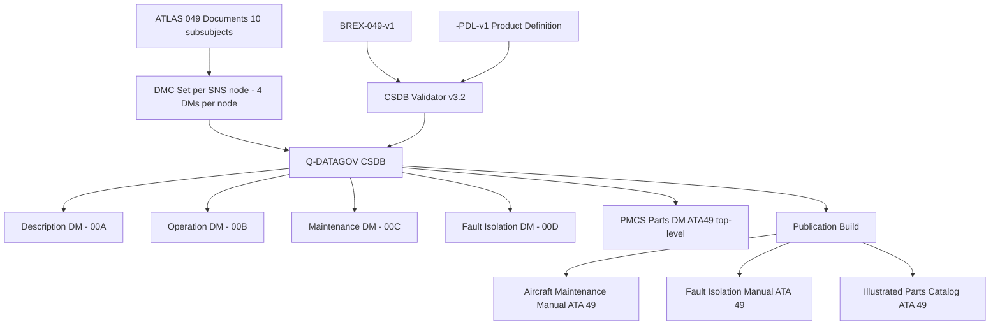
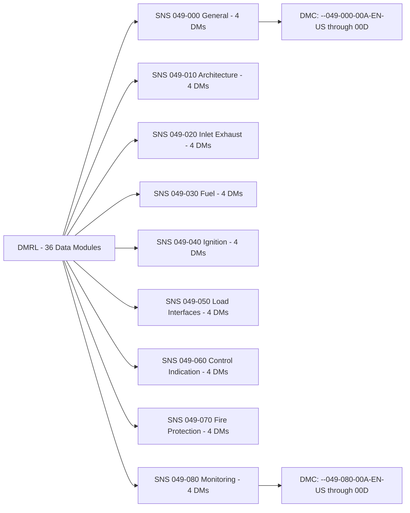
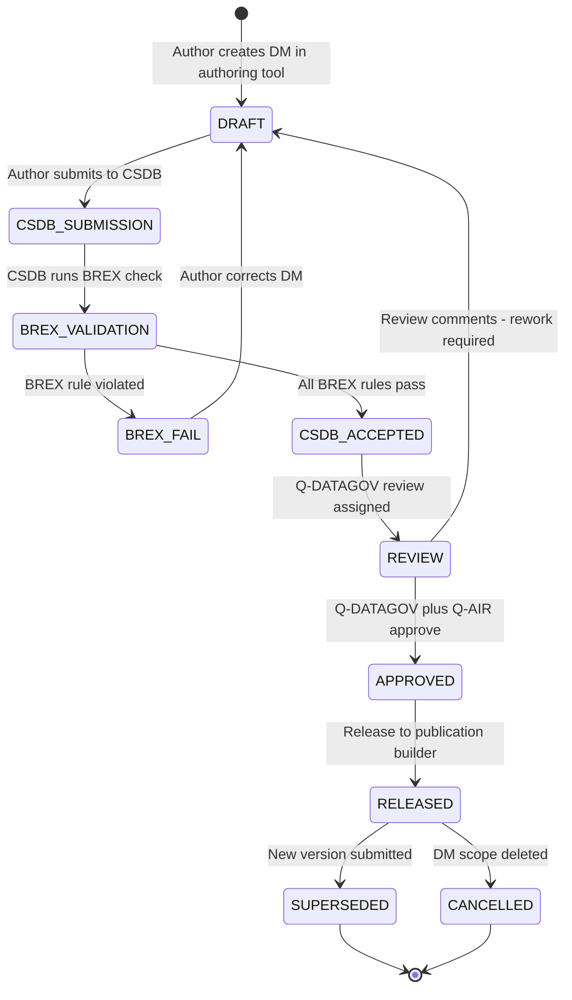

# ATLAS 040-049 · Section 04 · Subsection 049 · 090 — S1000D CSDB Mapping and Traceability

## §0. Hyperlink Policy

All hyperlinks within this document use **relative paths** from the current file location. Cross-subsection links navigate to sibling files within `./` (same folder), to the subsection index at [`./README.md`](./README.md), and to parent indexes at `../`, `../../`, and `../../../`. Absolute URLs are used only for external standards references. No link shall reference an absolute filesystem path.

---

## §1. Purpose

This document defines the **S1000D Data Module Reference List (DMRL)** and **Common Source Data Base (CSDB) mapping** for the entire ATA 49 Airborne Auxiliary Power documentation set of the **<PROGRAMME>** aircraft. It maps all ATLAS 049 subsubject documents (049-000 through 049-080) to their corresponding S1000D Data Module Codes (DMCs), defines the System/Sub-system/Sub-sub-system/Unit (SNS) breakdown applicable to ATA 49, specifies the BREX (Business Rules eXchange) constraints governing ATA 49 data modules, and provides a regulatory traceability matrix linking CS-25 airworthiness requirements to specific Data Modules (DMs) within the CSDB.

The S1000D DMC scheme adopted for any programme implementing this ATLAS standard node APU documentation uses the format:

```
<MODEL>-<SYSTEMDIFF>-049-{NNN}-00A-EN-US
```

Where `{NNN}` is the three-digit subsubject code (000, 010, 020, ... 080), `00A` is the information code / variant / applicability code, `EN` is the language code, and `US` is the country code. Data modules are authored in S1000D Issue 5.0 XML schema. The CSDB is hosted in the Q-DATAGOV CSDB platform and all 049 DMs are submitted via the CSDB submission workflow defined in Q-DATAGOV governance procedure GP-CSDB-001.

The Business Rules eXchange file `BREX-049-v1` enforces three domain-specific constraints: (1) no data module shall reference pneumatic bleed air as an APU output (enforcing the bleed-less design constraint); (2) no data module shall reference hydraulic actuators in the APU system (no hydraulics on this aircraft); (3) all fire suppression references shall specify HFC-125 as the agent type. BREX validation is performed on all 049 DM submissions as a mandatory CSDB ingestion gate.

The DMRL covers **36 Data Modules** distributed across 9 SNS nodes (one per subsubject), covering description, operation, maintenance, fault isolation, and parts data for each subsubject.

---

## §2. Applicability

| Parameter | Value |
|---|---|
| Programme | (defined in programme implementation branch) |
| ATA Chapter | 49 — Airborne Auxiliary Power |
| S1000D Issue | Issue 5.0 |
| BREX file | BREX-049-v1 |
| CSDB platform | Q-DATAGOV CSDB (GP-CSDB-001) |
| DMRL total | 36 Data Modules across 9 SNS nodes |
| DMC scheme | <MODEL>-<SYSTEMDIFF>-049-{NNN}-00A-EN-US |
| SNS breakdown | 9 nodes — 049-000 through 049-080 |
| Language | EN-US |
| BREX key constraints | No bleed air DMs, no hydraulic DMs, HFC-125 mandatory for fire suppression |
| ICN prefix | ICN-<MODEL>-<SYSTEMDIFF>-049 |
| S1000D SNS | 049-090-00 (S1000D CSDB Mapping and Traceability) |

---

## §3. Functional Description

The S1000D CSDB mapping for ATA 49 provides a structured, standards-compliant technical publication framework that:

1. **Assigns a unique DMC to every authoring unit**: Each ATLAS 049 subsubject document maps to 4 Data Modules (description DM, operation DM, maintenance DM, fault isolation DM), with one parts data DM at the ATA 49 top level; 36 DMs total.
2. **Defines the SNS hierarchy**: The SNS breakdown mirrors the ATA 49 chapter structure, with `049-000` as the general/top-level SNS node and `049-010` through `049-080` as sub-system nodes.
3. **Enforces BREX constraints**: The BREX file BREX-049-v1 is referenced in all 049 DM XML headers; CSDB validation software (Q-DATAGOV CSDB validator v3.2) runs BREX rule checks on all 049 DM submissions and rejects submissions that violate the no-bleed, no-hydraulic, or HFC-125 constraints.
4. **Provides regulatory traceability**: A CS-25 requirement-to-DM traceability matrix is maintained in this document, enabling EASA to identify which specific Data Module provides the design description for each applicable regulation.
5. **Governs applicability annotations**: All 049 DMs use S1000D applicability attributes to identify which aircraft variant (<MODEL>-<SYSTEMDIFF>) and aircraft serial number blocks the data applies to; applicability annotations are validated by the CSDB validator against the product definition (PDL file <MODEL>-PDL-v1).

### §3.1 SNS Node Breakdown

| SNS Node | ATA 49 Subsubject | ATLAS Document | DM Count |
|---|---|---|---|
| 049-000 | Airborne Auxiliary Power — General | [049-000-Airborne-Auxiliary-Power-General.md](./049-000-Airborne-Auxiliary-Power-General.md) | 4 DMs |
| 049-010 | APU Architecture | [049-010-Auxiliary-Power-Unit-Architecture.md](./049-010-Auxiliary-Power-Unit-Architecture.md) | 4 DMs |
| 049-020 | APU Air Inlet and Exhaust | [049-020-APU-Air-Inlet-and-Exhaust.md](./049-020-APU-Air-Inlet-and-Exhaust.md) | 4 DMs |
| 049-030 | APU Fuel Supply and Control | [049-030-APU-Fuel-Supply-and-Control.md](./049-030-APU-Fuel-Supply-and-Control.md) | 4 DMs |
| 049-040 | APU Ignition, Starting and Generation | [049-040-APU-Ignition-Starting-and-Generation.md](./049-040-APU-Ignition-Starting-and-Generation.md) | 4 DMs |
| 049-050 | APU Load Interfaces | [049-050-APU-Pneumatic-and-Electrical-Load-Interfaces.md](./049-050-APU-Pneumatic-and-Electrical-Load-Interfaces.md) | 4 DMs |
| 049-060 | APU Control, Indication and Warning | [049-060-APU-Control-Indication-and-Warning.md](./049-060-APU-Control-Indication-and-Warning.md) | 4 DMs |
| 049-070 | APU Fire Protection | [049-070-APU-Fire-Protection-Shutdown-and-Safety-Interlocks.md](./049-070-APU-Fire-Protection-Shutdown-and-Safety-Interlocks.md) | 4 DMs |
| 049-080 | APU Monitoring and Diagnostics | [049-080-APU-Monitoring-Diagnostics-and-Control-Interfaces.md](./049-080-APU-Monitoring-Diagnostics-and-Control-Interfaces.md) | 4 DMs |
| **Total** | | | **36 DMs** |

### Diagram 1: S1000D CSDB Mapping Architecture



---

## §4. System Architecture

The CSDB mapping architecture is defined by the Data Module Reference List (DMRL). Each SNS node has four typed DMs:

| DM Type | Info Code | Content |
|---|---|---|
| Description (DESC) | 00A | System description, LRU list, functional overview |
| Operation (OPS) | 00B | Crew/maintenance operating procedures |
| Maintenance (MAINT) | 00C | Scheduled maintenance tasks, intervals, tools |
| Fault Isolation (FI) | 00D | Fault isolation trees, CAS message list, MCDU fault codes |

The parts data for ATA 49 is consolidated in a single parts DM at the top SNS level (049-000), referencing ICN-coded parts illustrations for each LRU. ICN codes follow the pattern `ICN-<MODEL>-<SYSTEMDIFF>-049-{NNN}-{SEQUENCE}-AA`.

BREX file `BREX-049-v1` enforces the following rules (BREX rule ID: BREX-049-001 through BREX-049-005):

| BREX Rule ID | Constraint | Rationale |
|---|---|---|
| BREX-049-001 | `<bleedAir>` elements prohibited | APU has no bleed air output — bleed-less design |
| BREX-049-002 | `<hydraulicActuator>` elements prohibited | No hydraulic system on <PROGRAMME> |
| BREX-049-003 | Fire suppression agent must be `HFC-125` | Standard fire bottle type for this aircraft |
| BREX-049-004 | All DMs must carry `applicRefId="<MODEL>-<SYSTEMDIFF>"` | Aircraft variant applicability |
| BREX-049-005 | `<pneumaticOutput>` elements prohibited | APU electric-only — no pneumatic output |

### Diagram 2: DMRL Structure and DMC Scheme



---

## §5. SNS Mapping Table

> **Note**: This section replaces the standard LRU table. The APU CSDB mapping uses an SNS node table rather than an LRU table, as this document governs documentation structure rather than physical components.

| SNS Node | Subsubject Title | DMC Root | DM Count | CSDB Submission Status |
|---|---|---|---|---|
| 049-000 | Airborne Auxiliary Power — General | `DMC-<MODEL>-<SYSTEMDIFF>-049-000-00x-EN-US` | 4 |  |
| 049-010 | APU Architecture | `DMC-<MODEL>-<SYSTEMDIFF>-049-010-00x-EN-US` | 4 |  |
| 049-020 | APU Air Inlet and Exhaust | `DMC-<MODEL>-<SYSTEMDIFF>-049-020-00x-EN-US` | 4 |  |
| 049-030 | APU Fuel Supply and Control | `DMC-<MODEL>-<SYSTEMDIFF>-049-030-00x-EN-US` | 4 |  |
| 049-040 | APU Ignition, Starting and Generation | `DMC-<MODEL>-<SYSTEMDIFF>-049-040-00x-EN-US` | 4 |  |
| 049-050 | APU Load Interfaces | `DMC-<MODEL>-<SYSTEMDIFF>-049-050-00x-EN-US` | 4 |  |
| 049-060 | APU Control, Indication and Warning | `DMC-<MODEL>-<SYSTEMDIFF>-049-060-00x-EN-US` | 4 |  |
| 049-070 | APU Fire Protection | `DMC-<MODEL>-<SYSTEMDIFF>-049-070-00x-EN-US` | 4 |  |
| 049-080 | APU Monitoring and Diagnostics | `DMC-<MODEL>-<SYSTEMDIFF>-049-080-00x-EN-US` | 4 |  |

---

## §6. Interfaces

| Interface | Peer System | Protocol / Bus | Data Exchanged |
|---|---|---|---|
| CSDB DMRL to S1000D authoring tool | S1000D XML editor | CSDB API | DM checkout / check-in / status |
| BREX validator to CSDB | Q-DATAGOV CSDB validator v3.2 | CSDB submission API | BREX validation pass/fail per DM |
| PDL to CSDB validator | <MODEL>-PDL-v1 product definition | CSDB internal | Aircraft applicability check |
| DMRL to AMM publication builder | Publication management tool | CSDB API | DM selection for AMM ATA 49 |
| DMRL to FIM builder | Fault Isolation Manual builder | CSDB API | 00D (FI) DMs for ATA 49 FIM |
| DMRL to IPC builder | Illustrated Parts Catalog builder | CSDB API | Parts DM + ICN illustrations |
| ATLAS 049 MARKDOWN to DM | Authoring conversion tool | Manual / semi-automated | Source content → S1000D XML |
| DM to EASA regulatory traceability | EASA certification data | Manual extract | CS-25 requirement-to-DM matrix |
| CSDB to operator technical pubs | Airline technical pubs system | CSDB export | Publication packages |
| ICN repository to CSDB | ICN/graphic repository | CSDB API | Illustrations for IPC and AMM |

---

## §7. Operations and Modes

| Mode | CSDB Workflow State | BREX State | DM Status |
|---|---|---|---|
| DRAFT | DM in authoring tool — not submitted | BREX pre-check (optional) | DRAFT |
| CSDB_SUBMISSION | DM submitted to CSDB validator | BREX validation running | PENDING |
| BREX_FAIL | BREX rule violation detected | BREX FAIL — DM rejected | REJECTED |
| CSDB_ACCEPTED | BREX pass + applicability check pass | BREX PASS | IN_WORK |
| REVIEW | DM under Q-DATAGOV review | BREX PASS | IN_REVIEW |
| APPROVED | DM approved by Q-DATAGOV + Q-AIR | BREX PASS | APPROVED |
| RELEASED | DM released to publication builder | BREX PASS | RELEASED |
| SUPERSEDED | New DM version replaces this | N/A | SUPERSEDED |
| CANCELLED | DM scope removed from DMRL | N/A | CANCELLED |

### Diagram 3: CSDB Submission Workflow



---

## §8. Performance and Budgets

| Parameter | Requirement | Target | Status |
|---|---|---|---|
| Total DMRL count (ATA 49) | 36 DMs | 36 DMs |  |
| BREX validation time per DM | < 30 s | < 15 s |  |
| CSDB submission-to-acceptance cycle | < 5 business days | < 3 business days |  |
| DM authoring cycle (per DM) | < 10 business days | < 7 business days |  |
| BREX rule count (ATA 49) | 5 domain-specific rules | 5 rules defined (BREX-049-001 to 005) |  |
| Applicability annotation coverage | 100 % of DMs | 100 % |  |
| ICN count (ATA 49 IPC) | ≥ 1 ICN per LRU | ≥ 80 ICNs (10 LRUs × 8–9 subsubjects) |  |
| DMRL release baseline | Before Type Inspection Authorisation (TIA) | 2027-Q2 |  |

---

## §9. Regulatory Traceability Matrix

This matrix maps CS-25 airworthiness requirements applicable to ATA 49 to the specific S1000D Data Module that contains the design description, compliance method, and/or test evidence reference.

| CS-25 Regulation | Requirement Summary | ATA 49 DM | SNS Node | Compliance Notes |
|---|---|---|---|---|
| CS-25.1181 | Fire protection zones | <MODEL>-<SYSTEMDIFF>-049-070-00A-EN-US | 049-070 | Fire zone boundary definition DM |
| CS-25.1191 | Firewalls | <MODEL>-<SYSTEMDIFF>-049-070-00A-EN-US | 049-070 | Firewall material specification |
| CS-25.1195 | Fire extinguishing systems | <MODEL>-<SYSTEMDIFF>-049-070-00A-EN-US | 049-070 | HFC-125 bottle agent quantity |
| CS-25.1203 | Fire detector systems | <MODEL>-<SYSTEMDIFF>-049-070-00A-EN-US | 049-070 | Thermistor 2oo2 logic |
| CS-25.1309 | System safety assessment | <MODEL>-<SYSTEMDIFF>-049-000-00A-EN-US | 049-000 | APU overall SSA reference |
| CS-25.1302 | Flight crew interface | <MODEL>-<SYSTEMDIFF>-049-060-00A-EN-US | 049-060 | Overhead panel and ECAM design |
| CS-25.1322 | Warning, caution, advisory | <MODEL>-<SYSTEMDIFF>-049-060-00A-EN-US | 049-060 | CAS message classification |
| CS-25.1185 | Flammable fluid fire protection | <MODEL>-<SYSTEMDIFF>-049-030-00A-EN-US | 049-030 | Fuel line routing and AFSOV |
| CS-25.1438 | Pneumatic systems (non-applicable) | <MODEL>-<SYSTEMDIFF>-049-050-00A-EN-US | 049-050 | MoC 0 — no pneumatic output |
| CS-25.1351 | Electrical systems and equipment | <MODEL>-<SYSTEMDIFF>-049-050-00A-EN-US | 049-050 | HVDC bus and AGC interface |

---

## §10. Maintenance and Diagnostics

> **Note**: This SNS node (049-090) is a documentation governance document; maintenance in this context refers to DMRL maintenance and CSDB administration.

| Task | Interval | Owner | Tools Required |
|---|---|---|---|
| DMRL review and update | On each document change | Q-DATAGOV | CSDB DMRL editor |
| BREX file update (BREX-049-v1) | On aircraft design change affecting BREX constraints | Q-DATAGOV / Q-AIR | BREX XML editor |
| CSDB submission status review | Monthly | Q-DATAGOV | CSDB dashboard |
| Regulatory traceability matrix update | On CS-25 requirement change or DM scope change | Q-DATAGOV / Q-AIR | DMRL traceability tool |
| PDL applicability review | On aircraft variant change | Q-DATAGOV | PDL editor |
| ICN registry review | On new LRU illustration submission | Q-DATAGOV | ICN registry tool |
| DM version control review | On any approved DM re-issue | Q-DATAGOV | CSDB version control |
| CSDB validator software update | On S1000D schema version change | Q-DATAGOV IT | CSDB platform update |
| Publication build verification | On each CSDB DM release | Q-DATAGOV | Publication builder |
| Archive and retention | Per GP-CSDB-001 (10 year minimum) | Q-DATAGOV | CSDB archive module |

---

## §11. Configuration and Software

- **S1000D Issue 5.0 schema**: All 049 DMs are authored against S1000D Issue 5.0 XML schema; schema version is locked for any programme implementing this ATLAS standard node program; a formal program change is required to upgrade to a future S1000D issue.
- **BREX file versioning**: `BREX-049-v1` is version-controlled in the CSDB; BREX file changes require Q-DATAGOV CSDB CM approval and re-validation of all previously accepted 049 DMs.
- **DMC scheme configuration**: The DMC prefix `<MODEL>-<SYSTEMDIFF>` is registered in the CSDB code registry; changes to the code prefix require S1000D code registration update and DMC migration across all existing DMs.
- **PDL product definition**: `<MODEL>-PDL-v1` defines the aircraft applicability model used by the CSDB validator; aircraft serial number ranges, variant codes, and configuration effectivity data are maintained in the PDL.
- **ICN numbering**: ICN numbers follow the pattern `ICN-<MODEL>-<SYSTEMDIFF>-049-{NNN}-{SEQ}-AA` where `{SEQ}` is a four-digit sequence number; ICN allocation is managed by the Q-DATAGOV ICN registry tool to prevent duplicates.
- **CSDB validator version**: Q-DATAGOV CSDB validator v3.2 is the current qualified version for BREX, applicability, and schema validation; version changes require Q-DATAGOV IT change management and re-validation.
- **Publication build configuration**: The ATA 49 AMM, FIM, and IPC publication configurations are defined in the CSDB publication manager; publication filters select DMs by SNS node, info code, and applicability.

---

## §12. Environmental and Physical Constraints

> **Note**: This document addresses documentation infrastructure, not physical APU hardware. Environmental constraints apply to the CSDB platform infrastructure.

| Constraint | Specification | Standard |
|---|---|---|
| CSDB platform availability | ≥ 99.5 % (business hours) | GP-CSDB-001 service level |
| DM XML file size | ≤ 10 MB per DM | S1000D Issue 5.0 recommended practice |
| ICN file formats | SVG (preferred), TIFF, PNG | S1000D Issue 5.0 ICN spec |
| CSDB backup frequency | Daily incremental, weekly full | GP-CSDB-001 backup policy |
| DM retention period | 10 years minimum | EASA Part 21 documentation retention |
| Access control | Role-based — Q-DATAGOV, Q-AIR, Q-MECHANICS | GP-CSDB-001 access control |

---

## §13. DMRL — Full Data Module Reference List

| DMC | SNS Node | Info Code | DM Type | Title |
|---|---|---|---|---|
| <MODEL>-<SYSTEMDIFF>-049-000-00A-EN-US | 049-000 | DESC | Description | APU General — System Description |
| <MODEL>-<SYSTEMDIFF>-049-000-00B-EN-US | 049-000 | OPS | Operation | APU General — Operating Procedures |
| <MODEL>-<SYSTEMDIFF>-049-000-00C-EN-US | 049-000 | MAINT | Maintenance | APU General — Scheduled Maintenance |
| <MODEL>-<SYSTEMDIFF>-049-000-00D-EN-US | 049-000 | FI | Fault Isolation | APU General — Top-level FI |
| <MODEL>-<SYSTEMDIFF>-049-010-00A-EN-US | 049-010 | DESC | Description | APU Architecture — System Description |
| <MODEL>-<SYSTEMDIFF>-049-010-00B-EN-US | 049-010 | OPS | Operation | APU Architecture — APCU Operating Procedures |
| <MODEL>-<SYSTEMDIFF>-049-010-00C-EN-US | 049-010 | MAINT | Maintenance | APU Architecture — APCU Maintenance |
| <MODEL>-<SYSTEMDIFF>-049-010-00D-EN-US | 049-010 | FI | Fault Isolation | APU Architecture — APCU Fault Isolation |
| <MODEL>-<SYSTEMDIFF>-049-020-00A-EN-US | 049-020 | DESC | Description | APU Inlet Exhaust — System Description |
| <MODEL>-<SYSTEMDIFF>-049-020-00B-EN-US | 049-020 | OPS | Operation | APU Inlet Exhaust — Operating Procedures |
| <MODEL>-<SYSTEMDIFF>-049-020-00C-EN-US | 049-020 | MAINT | Maintenance | APU Inlet Exhaust — EMA Maintenance |
| <MODEL>-<SYSTEMDIFF>-049-020-00D-EN-US | 049-020 | FI | Fault Isolation | APU Inlet Exhaust — Door Fault Isolation |
| <MODEL>-<SYSTEMDIFF>-049-030-00A-EN-US | 049-030 | DESC | Description | APU Fuel Supply — System Description |
| <MODEL>-<SYSTEMDIFF>-049-030-00B-EN-US | 049-030 | OPS | Operation | APU Fuel Supply — Operating Procedures |
| <MODEL>-<SYSTEMDIFF>-049-030-00C-EN-US | 049-030 | MAINT | Maintenance | APU Fuel Supply — AFSOV/Pump Maintenance |
| <MODEL>-<SYSTEMDIFF>-049-030-00D-EN-US | 049-030 | FI | Fault Isolation | APU Fuel Supply — Fuel System FI |
| <MODEL>-<SYSTEMDIFF>-049-040-00A-EN-US | 049-040 | DESC | Description | APU Ignition and Generation — Description |
| <MODEL>-<SYSTEMDIFF>-049-040-00B-EN-US | 049-040 | OPS | Operation | APU Ignition and Generation — Procedures |
| <MODEL>-<SYSTEMDIFF>-049-040-00C-EN-US | 049-040 | MAINT | Maintenance | APU Ignition and Generation — Maintenance |
| <MODEL>-<SYSTEMDIFF>-049-040-00D-EN-US | 049-040 | FI | Fault Isolation | APU Ignition and Generation — FI |
| <MODEL>-<SYSTEMDIFF>-049-050-00A-EN-US | 049-050 | DESC | Description | APU Load Interfaces — System Description |
| <MODEL>-<SYSTEMDIFF>-049-050-00B-EN-US | 049-050 | OPS | Operation | APU Load Interfaces — Operating Procedures |
| <MODEL>-<SYSTEMDIFF>-049-050-00C-EN-US | 049-050 | MAINT | Maintenance | APU Load Interfaces — AGC/ATRU Maintenance |
| <MODEL>-<SYSTEMDIFF>-049-050-00D-EN-US | 049-050 | FI | Fault Isolation | APU Load Interfaces — Electrical FI |
| <MODEL>-<SYSTEMDIFF>-049-060-00A-EN-US | 049-060 | DESC | Description | APU Control Indication — System Description |
| <MODEL>-<SYSTEMDIFF>-049-060-00B-EN-US | 049-060 | OPS | Operation | APU Control Indication — ECAM Procedures |
| <MODEL>-<SYSTEMDIFF>-049-060-00C-EN-US | 049-060 | MAINT | Maintenance | APU Control Indication — Panel Maintenance |
| <MODEL>-<SYSTEMDIFF>-049-060-00D-EN-US | 049-060 | FI | Fault Isolation | APU Control Indication — CAS FI |
| <MODEL>-<SYSTEMDIFF>-049-070-00A-EN-US | 049-070 | DESC | Description | APU Fire Protection — System Description |
| <MODEL>-<SYSTEMDIFF>-049-070-00B-EN-US | 049-070 | OPS | Operation | APU Fire Protection — Fire Response Procedures |
| <MODEL>-<SYSTEMDIFF>-049-070-00C-EN-US | 049-070 | MAINT | Maintenance | APU Fire Protection — Fire Loop Maintenance |
| <MODEL>-<SYSTEMDIFF>-049-070-00D-EN-US | 049-070 | FI | Fault Isolation | APU Fire Protection — Fire System FI |
| <MODEL>-<SYSTEMDIFF>-049-080-00A-EN-US | 049-080 | DESC | Description | APU Monitoring Diagnostics — Description |
| <MODEL>-<SYSTEMDIFF>-049-080-00B-EN-US | 049-080 | OPS | Operation | APU Monitoring Diagnostics — PBIT Procedures |
| <MODEL>-<SYSTEMDIFF>-049-080-00C-EN-US | 049-080 | MAINT | Maintenance | APU Monitoring Diagnostics — MEMS/PHM |
| <MODEL>-<SYSTEMDIFF>-049-080-00D-EN-US | 049-080 | FI | Fault Isolation | APU Monitoring Diagnostics — FI |

---

## §14. Test and Validation

| Test | Method | Acceptance Criterion | Status |
|---|---|---|---|
| BREX validation test — bleed air prohibition | Submit DM with `<bleedAir>` tag | CSDB rejects DM with BREX-049-001 violation |  |
| BREX validation test — hydraulic prohibition | Submit DM with `<hydraulicActuator>` tag | CSDB rejects DM with BREX-049-002 violation |  |
| BREX validation test — fire agent check | Submit DM with agent ≠ HFC-125 | CSDB rejects with BREX-049-003 violation |  |
| BREX validation pass test | Submit conformant DM | CSDB accepts DM |  |
| DMRL completeness check | Count all DMs in CSDB by SNS node | 36 DMs present, 4 per node |  |
| Applicability annotation check | PDL validation of all 049 DMs | All DMs carry <MODEL>-<SYSTEMDIFF> applicability |  |
| Publication build test (AMM) | Build ATA 49 section from CSDB | All DESC and MAINT DMs appear in AMM |  |
| Publication build test (FIM) | Build ATA 49 FIM from CSDB | All FI (00D) DMs appear in FIM |  |
| Regulatory traceability check | Manual matrix review vs CS-25 | All 10 CS-25 requirements mapped to DM |  |
| ICN rendering check | Publication builder ICN rendering test | All ICN-referenced images render correctly |  |

---

## §15. Regulatory Compliance

| Regulation | Requirement | Compliance Method | Status |
|---|---|---|---|
| CS-25 (general) | Airworthiness documentation completeness | All CS-25 requirements mapped to DMs in §9 |  |
| EASA Part 21.A.57 | Technical documentation — design data | DMRL provides design data structure |  |
| S1000D Issue 5.0 | Technical documentation standard | All DMs authored against Issue 5.0 schema |  |
| ATA iSpec 2200 | ATA chapter and subject numbering | DMC scheme aligned to ATA 49 chapter |  |
| GP-CSDB-001 | Q-DATAGOV CSDB governance procedure | All 049 DMs submitted per GP-CSDB-001 |  |

---

## §16. Certification Evidence

-  DMRL baseline document — 36 DMs listed, SNS mapping complete
-  BREX file BREX-049-v1 — formal release in CSDB
-  CSDB validator v3.2 qualification report — BREX rule validation confirmed
-  Regulatory traceability matrix — CS-25 to DM mapping complete
-  Publication build test report — AMM, FIM, IPC ATA 49 builds verified
-  CSDB DM applicability check report — all 049 DMs carry <MODEL>-<SYSTEMDIFF>
-  S1000D Issue 5.0 schema conformance report — all 049 DMs schema-valid
-  ICN registry list — all ICNs for ATA 49 IPC allocated
-  PDL <MODEL>-PDL-v1 applicability model release
-  CSDB archive and retention plan — EASA Part 21 compliance

---

## §17. Open Issues

| ID | Description | Owner | Target | Status |
|---|---|---|---|---|
| OI-049-090-001 | Complete CSDB submission of all 36 DMs (currently ATLAS markdown source — DMs pending XML authoring) | Q-DATAGOV | 2027-Q1 |  |
| OI-049-090-002 | Formally release BREX file BREX-049-v1 in CSDB | Q-DATAGOV | 2026-Q3 |  |
| OI-049-090-003 | Complete PDL <MODEL>-PDL-v1 with <MODEL>-<SYSTEMDIFF> applicability model | Q-DATAGOV | 2026-Q4 |  |
| OI-049-090-004 | Allocate ICN numbers for all ATA 49 IPC LRU illustrations | Q-DATAGOV | 2026-Q4 |  |
| OI-049-090-005 | Finalise regulatory traceability matrix with EASA reviewer input | Q-AIR / Q-DATAGOV | 2027-Q1 |  |

---

## §18. Glossary

| Acronym / Term | Definition |
|---|---|
| DMC | Data Module Code — unique identifier for each S1000D data module, structured per S1000D Issue 5.0 DMC scheme |
| DMRL | Data Module Reference List — the master list of all data modules planned or released for an aircraft system chapter |
| SNS | System/Sub-system/Sub-sub-system/Unit — S1000D hierarchical breakdown used to structure data modules by function |
| BREX | Business Rules eXchange — S1000D mechanism for encoding program-specific authoring rules in a machine-readable XML file |
| CSDB | Common Source Data Base — the central repository holding all S1000D data modules, ICNs, and publication configurations |
| ICN | Information Control Number — unique identifier for an illustration or graphic file referenced from an S1000D data module |
| Applicability annotation | S1000D XML attribute tagging a data module or element as applicable to a specific aircraft variant, serial number, or configuration |
| S1000D | International specification for technical publications (ASD/AIA/ATA) — current issue 5.0 governs <PROGRAMME> documentation |
| DM | Data Module — the fundamental authoring unit in S1000D; each DM covers a single topic (description, operation, maintenance, or FI) |
| CSDB submission workflow | The formal process (GP-CSDB-001) for submitting, validating, reviewing, approving, and releasing data modules to the CSDB |

---

## §19. Citations

| Standard | Title | Issuer | Applicability |
|---|---|---|---|
| S1000D Issue 5.0 | International specification for technical publications | ASD/AIA/ATA | All 049 DM authoring |
| ATA iSpec 2200 | Information standards for aviation maintenance | ATA | Chapter 49 SNS numbering |
| EASA Part 21.A.57 | Technical documentation requirements | EASA | Design data documentation |
| CS-25 | Certification specifications for large aeroplanes | EASA | ATA 49 regulatory basis |
| GP-CSDB-001 | Q-DATAGOV CSDB governance procedure | Q-DATAGOV | CSDB submission workflow |
| ISO 8879 | Standard Generalised Markup Language (SGML) basis | ISO | S1000D XML lineage |

---

## §20. References

| Document | Path | Relation |
|---|---|---|
| Q+ATLANTIDE Baseline | [../../../../organization/Q+ATLANTIDE.md](../../../../organization/Q+ATLANTIDE.md) | Parent baseline |
| ATLAS 040-049 Architecture | [../../../README.md](../../../README.md) | Parent architecture |
| Section 04 Index | [../../README.md](../../README.md) | Parent section index |
| Subsection 049 Index | [./README.md](./README.md) | Subsection index |
| 049-000 APU General | [./049-000-Airborne-Auxiliary-Power-General.md](./049-000-Airborne-Auxiliary-Power-General.md) | Top-level SNS node source |
| 049-010 APU Architecture | [./049-010-Auxiliary-Power-Unit-Architecture.md](./049-010-Auxiliary-Power-Unit-Architecture.md) | SNS 049-010 source |
| 049-020 Inlet Exhaust | [./049-020-APU-Air-Inlet-and-Exhaust.md](./049-020-APU-Air-Inlet-and-Exhaust.md) | SNS 049-020 source |
| 049-030 Fuel Supply | [./049-030-APU-Fuel-Supply-and-Control.md](./049-030-APU-Fuel-Supply-and-Control.md) | SNS 049-030 source |
| 049-040 Ignition | [./049-040-APU-Ignition-Starting-and-Generation.md](./049-040-APU-Ignition-Starting-and-Generation.md) | SNS 049-040 source |
| 049-050 Load Interfaces | [./049-050-APU-Pneumatic-and-Electrical-Load-Interfaces.md](./049-050-APU-Pneumatic-and-Electrical-Load-Interfaces.md) | SNS 049-050 source |
| 049-060 Control Indication | [./049-060-APU-Control-Indication-and-Warning.md](./049-060-APU-Control-Indication-and-Warning.md) | SNS 049-060 source |
| 049-070 Fire Protection | [./049-070-APU-Fire-Protection-Shutdown-and-Safety-Interlocks.md](./049-070-APU-Fire-Protection-Shutdown-and-Safety-Interlocks.md) | SNS 049-070 source |
| 049-080 Monitoring | [./049-080-APU-Monitoring-Diagnostics-and-Control-Interfaces.md](./049-080-APU-Monitoring-Diagnostics-and-Control-Interfaces.md) | SNS 049-080 source |

---

## §21. Footprint

| Metric | Value |
|---|---|
| Document ID | QATL-ATLAS-1000-ATLAS-040-049-04-049-090-S1000D-CSDB-MAPPING-AND-TRACEABILITY |
| Subsubject | 090 — S1000D CSDB Mapping and Traceability |
| Sections | §0 – §22 (23 sections) |
| Tables | 19 |
| Mermaid diagrams | 3 |
| SNS nodes documented | 9 |
| DMRL entries | 36 |
| Glossary entries | 10 |
| Regulatory references | 6 |
| Open issues | 5 |
| Version | 1.0.0 |
| Status | active |

---

## §22. Change Log

| Version | Date | Author | Change Description |
|---|---|---|---|
| 1.0.0 | 2026-05-10 | Q-DATAGOV / ATLAS Working Group | Initial release — full 22-section content for S1000D CSDB Mapping and Traceability; 36-DM DMRL; BREX-049 rules; CS-25 traceability matrix |
