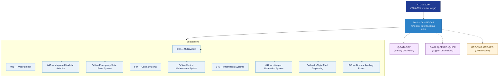

# ATLAS 040-049 · Section 04 — Aviónica, Información & APU

## 1. Purpose

Section-level index for *Aviónica, Información & APU* (`040-049`) within the ATLAS band. Multisistema, lastre de agua, aviónica modular integrada (IMA), panel solar de emergencia, sistemas de cabina, sistema central de mantenimiento, sistemas de información, generación de nitrógeno, suministro de combustible en vuelo y APU aerotransportada.

This section is part of the **ATLAS-1000** register, a subpart of the controlled **Q+ATLANTIDE** baseline[^baseline][^n001]. Bands classify technologies, Q-Divisions provide technical authority and ORB-Functions provide enterprise support[^n002].

## 2. Scope

- Aggregates the subsections within the `040-049` code range listed in §3.
- Inherits Q-Division authority and ORB support from the parent row in [`../README.md` §3](../README.md#3-architecture-table)[^archtable].
- Each subsection folder contains its own `README.md` (subsection index) and may contain Overview and subsubject documents.

## 3. Subsection Index

| Code | Title | Folder | Status |
|---:|---|---|---|
| `040` | Multisystem | [`040_Multisystem/`](./040_Multisystem/) | reserved |
| `041` | Water Ballast | [`041_Water-Ballast/`](./041_Water-Ballast/) | reserved |
| `042` | Integrated Modular Avionics | [`042_Integrated-Modular-Avionics/`](./042_Integrated-Modular-Avionics/) | reserved |
| `043` | Emergency Solar Panel System | [`043_Emergency-Solar-Panel-System/`](./043_Emergency-Solar-Panel-System/) | reserved |
| `044` | Cabin Systems | [`044_Cabin-Systems/`](./044_Cabin-Systems/) | reserved |
| `045` | Central Maintenance System | [`045_Central-Maintenance-System/`](./045_Central-Maintenance-System/) | reserved |
| `046` | Information Systems | [`046_Information-Systems/`](./046_Information-Systems/) | reserved |
| `047` | Nitrogen Generation System | [`047_Nitrogen-Generation-System/`](./047_Nitrogen-Generation-System/) | reserved |
| `048` | In-Flight Fuel Dispensing | [`048_In-Flight-Fuel-Dispensing/`](./048_In-Flight-Fuel-Dispensing/) | reserved |
| `049` | Airborne Auxiliary Power | [`049_Airborne-Auxiliary-Power/`](./049_Airborne-Auxiliary-Power/) | reserved |

## 4. Interfaces Diagram

*Solid arrows show parent→section→subsection ownership and primary Q-Division authority; dotted arrows show support Q-Divisions, ORB enterprise support, and notable cross-section interfaces.*

## 5. Footprint

| Metric | Value |
|---|---|
| Architecture | `ATLAS` — Aircraft Top Level Architecture Schema/System (controlled term) |
| Master range | `000–099` |
| Code range | `040-049` |
| Section | `04` — Aviónica, Información & APU |
| Subsections | 10 populated |
| Primary Q-Division | Q-DATAGOV[^qdiv] |
| Support Q-Divisions | Q-AIR, Q-SPACE, Q-HPC |
| ORB support | ORB-PMO, ORB-LEG |
| Governance class | `baseline`[^gov] |
| Folder path | `Q+ATLANTIDE/000-099_ATLAS/040-049_Avionica-Informacion-y-APU/` |
| Document | `README.md` (this file) |
| Parent architecture | [`../README.md`](../README.md) |
| Parent baseline | [`organization/Q+ATLANTIDE.md`](../../../organization/Q+ATLANTIDE.md) |

## Governance

Governed by [`organization/Q+ATLANTIDE.md`](../../../organization/Q+ATLANTIDE.md)[^baseline]. All subsections under this section inherit `architecture_code = ATLAS`, `primary_q_division = Q-DATAGOV` and `governance_class = baseline` from this section header. Templates declared in this section must populate `architecture_band`, `architecture_code = ATLAS`, `q_division_owner` and `orb_function_support` per the Templates System[^templates]. The No-AAA Rule[^n004] applies.

## 6. References & Citations

[^baseline]: **Q+ATLANTIDE controlled baseline (v1.0.0)** — [`organization/Q+ATLANTIDE.md`](../../../organization/Q+ATLANTIDE.md). Defines the controlled `000-999` architecture-band taxonomy and the ATLAS-1000 register subpart.

[^archtable]: **§3 — Architecture Table (parent)** — [`../README.md` §3](../README.md#3-architecture-table). Source of authority for primary/support Q-Divisions and ORB support of this section.

[^qdiv]: **Q-Division authority** — [`organization/Q-Divisions/`](../../../organization/Q-Divisions/). Technical-authority units for the Q+ATLANTIDE baseline.

[^gov]: **Governance class** — `baseline` denotes documents under controlled change management within the Q+ATLANTIDE baseline.

[^templates]: **§5 — Templates System** — [`organization/Q+ATLANTIDE.md` §5](../../../organization/Q+ATLANTIDE.md#5-templates-system).

[^n001]: **Note N-001** — Q+ATLANTIDE (with its ATLAS-1000 register subpart) is a taxonomy and traceability ecosystem, not an organization chart. See [`organization/Q+ATLANTIDE.md` §4](../../../organization/Q+ATLANTIDE.md#4-notes).

[^n002]: **Note N-002** — Architecture bands classify technologies; Q-Divisions provide technical authority; ORB-Functions provide enterprise support. See [`organization/Q+ATLANTIDE.md` §4](../../../organization/Q+ATLANTIDE.md#4-notes).

[^n004]: **Note N-004 (No-AAA Rule)** — "AAA" is not a valid domain, division, architecture, interface or function in this baseline. See [`organization/Q+ATLANTIDE.md` §4](../../../organization/Q+ATLANTIDE.md#4-notes).
