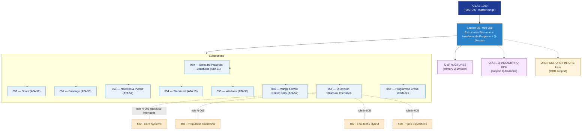

# ATLAS 050-059 · Section 05 — Estructuras Primarias e Interfaces de Programa / Q-Division

## 1. Purpose

Section-level index for *Estructuras Primarias e Interfaces de Programa / Q-Division* (`050-059`) within the ATLAS band. Prácticas estándar estructurales, fuselaje, alas/BWB, nacelles, estabilizadores, ventanas e interfaces estructurales Q-Division.

This section is part of the **ATLAS-1000** register, a subpart of the controlled **Q+ATLANTIDE** baseline[^baseline][^n001]. Bands classify technologies, Q-Divisions provide technical authority and ORB-Functions provide enterprise support[^n002].

## 2. Scope

- Aggregates the subsections within the `050-059` code range listed in §3.
- Inherits Q-Division authority and ORB support from the parent row in [`../README.md` §3](../README.md#3-architecture-table)[^archtable].
- Each subsection folder contains its own `README.md` (subsection index) and may contain Overview and subsubject documents.

## 3. Subsection Index

| Code | Title | Folder | Status |
|---:|---|---|---|
| `050` | Standard Practices — Structures | [`050_Standard-Practices-Structures/`](./050_Standard-Practices-Structures/) | active |
| `051` | Doors | [`051_Doors/`](./051_Doors/) | active |
| `052` | Fuselage | [`052_Fuselage/`](./052_Fuselage/) | active |
| `053` | Nacelles and Pylons | [`053_Nacelles-and-Pylons/`](./053_Nacelles-and-Pylons/) | active |
| `054` | Stabilizers | [`054_Stabilizers/`](./054_Stabilizers/) | active |
| `055` | Windows | [`055_Windows/`](./055_Windows/) | active |
| `056` | Wings and BWB Center Body | [`056_Wings-and-BWB-Center-Body/`](./056_Wings-and-BWB-Center-Body/) | active |
| `057` | Q-Division Structural Interfaces | [`057_Q-Division-Structural-Interfaces/`](./057_Q-Division-Structural-Interfaces/) | active |
| `058` | Programme Cross-Interfaces | [`058_Programme-Cross-Interfaces/`](./058_Programme-Cross-Interfaces/) | active |

## 4. Interfaces Diagram

*Solid arrows show parent→section→subsection ownership and primary Q-Division authority; dotted arrows show support Q-Divisions, ORB enterprise support, and notable cross-section interfaces.*

## 5. Footprint

| Metric | Value |
|---|---|
| Architecture | `ATLAS` — Aircraft Top Level Architecture Schema/System (controlled term) |
| Master range | `000–099` |
| Code range | `050-059` |
| Section | `05` — Estructuras Primarias e Interfaces de Programa / Q-Division |
| Subsections | 9 populated |
| Primary Q-Division | Q-STRUCTURES[^qdiv] |
| Support Q-Divisions | Q-AIR, Q-INDUSTRY, Q-HPC |
| ORB support | ORB-PMO, ORB-FIN, ORB-LEG |
| Governance class | `baseline`[^gov] |
| Folder path | `Q+ATLANTIDE/000-099_ATLAS/050-059_Estructuras-Primarias-e-Interfaces-de-Programa-Q-Division/` |
| Document | `README.md` (this file) |
| Parent architecture | [`../README.md`](../README.md) |
| Parent baseline | [`organization/Q+ATLANTIDE.md`](../../../organization/Q+ATLANTIDE.md) |

## Governance

Governed by [`organization/Q+ATLANTIDE.md`](../../../organization/Q+ATLANTIDE.md)[^baseline]. All subsections under this section inherit `architecture_code = ATLAS`, `primary_q_division = Q-STRUCTURES` and `governance_class = baseline` from this section header. Templates declared in this section must populate `architecture_band`, `architecture_code = ATLAS`, `q_division_owner` and `orb_function_support` per the Templates System[^templates]. The No-AAA Rule[^n004] applies.

## 6. References & Citations

[^baseline]: **Q+ATLANTIDE controlled baseline (v1.0.0)** — [`organization/Q+ATLANTIDE.md`](../../../organization/Q+ATLANTIDE.md). Defines the controlled `000-999` architecture-band taxonomy and the ATLAS-1000 register subpart.

[^archtable]: **§3 — Architecture Table (parent)** — [`../README.md` §3](../README.md#3-architecture-table). Source of authority for primary/support Q-Divisions and ORB support of this section.

[^qdiv]: **Q-Division authority** — [`organization/Q-Divisions/`](../../../organization/Q-Divisions/). Technical-authority units for the Q+ATLANTIDE baseline.

[^gov]: **Governance class** — `baseline` denotes documents under controlled change management within the Q+ATLANTIDE baseline.

[^templates]: **§5 — Templates System** — [`organization/Q+ATLANTIDE.md` §5](../../../organization/Q+ATLANTIDE.md#5-templates-system).

[^n001]: **Note N-001** — Q+ATLANTIDE (with its ATLAS-1000 register subpart) is a taxonomy and traceability ecosystem, not an organization chart. See [`organization/Q+ATLANTIDE.md` §4](../../../organization/Q+ATLANTIDE.md#4-notes).

[^n002]: **Note N-002** — Architecture bands classify technologies; Q-Divisions provide technical authority; ORB-Functions provide enterprise support. See [`organization/Q+ATLANTIDE.md` §4](../../../organization/Q+ATLANTIDE.md#4-notes).

[^n004]: **Note N-004 (No-AAA Rule)** — "AAA" is not a valid domain, division, architecture, interface or function in this baseline. See [`organization/Q+ATLANTIDE.md` §4](../../../organization/Q+ATLANTIDE.md#4-notes).
