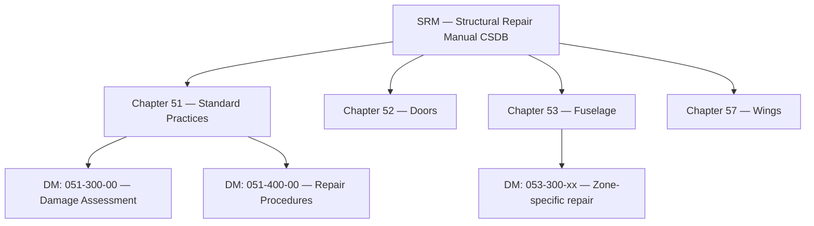

# ATLAS 050-059 · 05.050.000 — Maintenance, Inspection and Repair Concept General

## 1. Purpose

Establishes the **structural maintenance and inspection concept** for the AMPEL360 eWTW: MSG-3 process application, inspection programme structure, repair classification, and the Structural Repair Manual (SRM) data module architecture within the S1000D CSDB.

## 2. Scope

### 2.1 Maintenance Programme Development Process

The AMPEL360 structural maintenance programme is developed via:

1. **MSG-3 Level 1 analysis** — identification of SSIs (Structurally Significant Items).
2. **MSG-3 Level 2 analysis** — identification of PSEs and fatigue-critical detail.
3. **Damage-tolerance analysis (DTA)** — crack growth and residual strength per CS-25.571.
4. **CPCP development** — Corrosion Prevention and Control Programme per CS-25 AMC 25.571.

### 2.2 Inspection Programme Structure

| Level | Name | Interval (indicative) | Scope |
|---|---|---|---|
| A-check | Line maintenance visual | 500–700 FH | PSE visual, BVID detection, fluid leak |
| 2C-check | Heavy transit check | 3,000–5,000 FH | PSE HFEC/PAUT on primary skin zones |
| 4C-check (C-check) | Base maintenance | 6-year / 24,000 FH | Full NDT programme, fastener inspection |
| D-check | Heavy maintenance visit | 12-year / 48,000 FH | Full structure strip and inspect |

### 2.3 Repair Classification

| Class | Designation | Requirements |
|---|---|---|
| Minor | Class 1 | No strength restoration needed; cosmetic; SRM Chapter 51 |
| Minor Repair Requiring DT Assessment | Class 2 | Bowtie NDT; DTA update required |
| Major Repair | Class 3 | Engineering order (EO); DT analysis and load test; EASA/FAA 337/STC if applicable |
| MRDA | Major Repair Disposition Authority | Operator engineering with EASA/FAA approval; recorded in CSDB |

### 2.4 SRM Data Module Architecture

## 3. Footprint

| Metric | Value |
|---|---|
| Document ID | `QATL-ATLAS-1000-ATLAS-050-059-05-050-000-MAINTENANCE-INSPECTION-AND-REPAIR-CONCEPT-GENERAL` |
| Status |  |

## 4. References

[^baseline]: Q+ATLANTIDE Baseline — [`organization/Q+ATLANTIDE.md`](../../../../../organization/Q+ATLANTIDE.md)

| Ref | Document |
|---|---|
| CS-25.571 | Damage-tolerance and fatigue evaluation |
| AMC 25.571 | Acceptable Means of Compliance for DT |
| MSG-3 Rev 3 | Airline/Manufacturer Maintenance Programme Development |
| S1000D Issue 5.0 | International specification for technical publications |
| [`./README.md`](./README.md) | Subsubject index |
