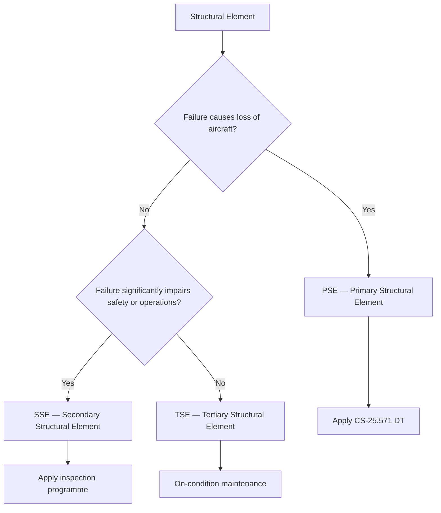

# ATLAS 050-059 · 05.050.000 — Primary, Secondary and Tertiary Structure Classification

## 1. Purpose

Defines the [PROGRAMME-AIRCRAFT] **structural classification scheme**: Primary (PSE), Secondary (SSE), and Tertiary Structure, including PSE-list, associated inspection categories, and MSG-3 classification matrix.

## 2. Scope

### 2.1 Classification Definitions

| Class | Acronym | Definition |
|---|---|---|
| Primary Structure | PSE | Structural elements whose failure would result in loss of the aircraft or would significantly reduce structural integrity; subject to CS-25.571 DT requirements |
| Secondary Structure | SSE | Structural elements that, upon failure, would not directly cause loss of the aircraft but may compromise safety, impede continued operations, or cause significant consequential damage |
| Tertiary Structure | TSE | Non-safety-critical structural elements (fairings, brackets, antenna mounts) whose failure has no direct effect on airworthiness |

### 2.2 PSE List (Top-Level, Baseline)

| PSE ID | Description | CS-25 basis | Inspection category |
|---|---|---|---|
| PSE-F01 | Fuselage pressure vessel skin (all stations) | §25.571 DT | A-check visual + 2C HFEC |
| PSE-W01 | Wing box upper and lower skins | §25.571 DT | A-check visual + LFEC/PAUT |
| PSE-W02 | Wing front and rear spar | §25.571 DT | C-check PAUT |
| PSE-J01 | WFIJ primary fittings | §25.571 DT + safe-life by analysis | 2C NDT |
| PSE-P01 | Pylon main fitting and attach bolts | §25.571 + §25.581 | C-check ACFM + OTF inspection |
| PSE-H01 | HTP attachment fittings | §25.571 | 2C HFEC/PAUT |
| PSE-D01 | Passenger door primary frames | §25.571 | 4C PAUT |

### 2.3 Classification Decision Flowchart

### 2.4 Regulatory Mapping

| Classification | Inspection basis | SRM reference |
|---|---|---|
| PSE | Damage-Tolerant per CS-25.571(b) | SRM Chapter 51 |
| PSE (exceptions) | Safe-life per CS-25.571(c) — landing gear, fasteners | SRM Chapter 32 |
| SSE | MSG-3 task analysis | SRM Chapter 05 |
| TSE | On-condition, no programmed inspection | SRM Chapter 51 |

## 3. Footprint

| Metric | Value |
|---|---|
| Document ID | `QATL-ATLAS-1000-ATLAS-050-059-05-050-000-PRIMARY-SECONDARY-AND-TERTIARY-STRUCTURE-CLASSIFICATION` |
| Status |  |

## 4. References

[^baseline]: Q+ATLANTIDE Baseline — [`organization/Q+ATLANTIDE.md`](../../../../../organization/Q+ATLANTIDE.md)

| Ref | Document |
|---|---|
| CS-25.571 | Damage-tolerance and fatigue evaluation of structure |
| MSG-3 Rev 3 | Airline/Manufacturer Maintenance Program Development |
| [`./README.md`](./README.md) | Subsubject index |
