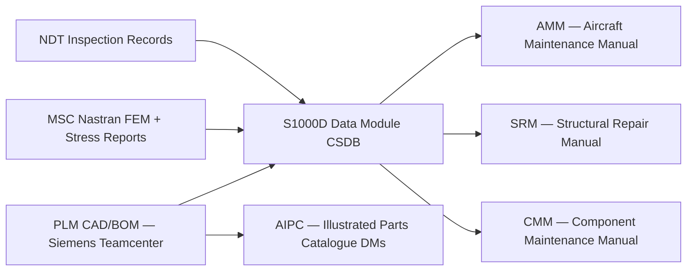

# ATLAS 050-059 · 05.050.000 — S1000D CSDB Mapping and Traceability

## 1. Purpose

Defines the **S1000D Data Module Code (DMC) schema** and CSDB traceability mapping for the ATLAS `050-059` *Estructuras* section, covering the DMC numbering convention, information-code allocation, ACT/PCT/CCT applicability, and PLM-to-CSDB link architecture.

## 2. Scope

### 2.1 DMC Schema for Estructuras

S1000D DMCs for AMPEL360 structural data modules follow the schema:

```
DMC-AMPEL360-{modelIdentCode}-{systemCode}-{subSystemCode}{subSubSystemCode}-{assyCode}-{disassyCode}{disassyCodeVariant}-{infoCode}{infoCodeVariant}-{itemLocationCode}
```

For `050-059` structural chapters:
- **systemCode**: `051` (Standard Practices), `052` (Doors), `053` (Fuselage), `054` (Nacelles), `055` (Stabilizers), `056` (Windows), `057` (Wings)
- **infoCode** allocation:

| Info code | Description | Structural use |
|---|---|---|
| `040` | Description — General | Structural overview DMs |
| `200` | Maintenance procedures | Inspection and repair procedures |
| `300` | Detailed inspection | NDT and damage assessment |
| `520` | Troubleshooting — General | Damage evaluation and repair disposition |
| `940` | Wiring / interface data | SHM sensor wiring and interface data |

### 2.2 ACT / PCT / CCT Applicability

| Applicability document | Structural use |
|---|---|
| **ACT** (Applicability Cross-reference Table) | Maps structural DMs to aircraft serial number families (eWTW Gen 1 / Gen 2 / freighter) |
| **PCT** (Product Cross-reference Table) | Maps structural DMs to wing type, fuselage variant, and door arrangement |
| **CCT** (Conditions Cross-reference Table) | Maps structural repair DMs to damage size/type conditions |

### 2.3 PLM-to-CSDB Link Architecture



### 2.4 Key CSDB Identifiers

| Identifier | Value |
|---|---|
| Model ident code | `AMPEL360` |
| CAGE code | TBD |
| SNS system code family | `050`–`059` |
| CSDB instance | Q+ATLANTIDE CSDB v1.0 |
| S1000D issue | 5.0 |

## 3. Footprint

| Metric | Value |
|---|---|
| Document ID | `QATL-ATLAS-1000-ATLAS-050-059-05-050-000-S1000D-CSDB-MAPPING-AND-TRACEABILITY` |
| Status |  |

## 4. References

[^baseline]: Q+ATLANTIDE Baseline — [`organization/Q+ATLANTIDE.md`](../../../../../organization/Q+ATLANTIDE.md)

| Ref | Document |
|---|---|
| S1000D Issue 5.0 | International specification for technical publications |
| ASD-STE100 | Simplified Technical English specification |
| [`./README.md`](./README.md) | Subsubject index |
| [`../README.md`](../README.md) | 050_General subsection index |
| [`../../README.md`](../../README.md) | 050-059_Estructuras section index |
