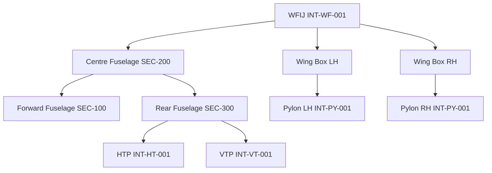

# ATLAS 050-059 · 05.050.000 — Structural Interfaces General

## 1. Purpose

Documents the **top-level structural interface matrix** for the AMPEL360 eWTW, identifying inter-assembly joints, structure-to-systems attachment interfaces, and the governing Interface Control Documents (ICDs).

## 2. Scope

### 2.1 Primary Structural Interfaces

| Interface ID | Description | Assemblies | ICD ref |
|---|---|---|---|
| INT-WF-001 | Wing-Fuselage Interface Joint (WFIJ) | Wing box ↔ centre fuselage | ICD-WF-001 |
| INT-PY-001 | Pylon-to-wing attach | Pylon ↔ wing front spar | ICD-PY-001 |
| INT-HT-001 | HTP-to-rear-fuselage attach | HTP ↔ tail cone | ICD-HT-001 |
| INT-VT-001 | VTP-to-rear-fuselage attach | VTP ↔ tail cone keel | ICD-VT-001 |
| INT-LG-001 | MLG-to-wing / fuselage | MLG beam ↔ wing box rib / fuselage frame | ICD-LG-001 |
| INT-NLG-001 | NLG-to-fuselage | NLG ↔ fwd fuselage keel | ICD-NLG-001 |
| INT-DOR-001 | Passenger door frame to fuselage | Door frame ↔ fuselage frames | ICD-DOR-001 |

### 2.2 Structure-to-Systems Interfaces

| Interface ID | Structure element | System | Notes |
|---|---|---|---|
| INT-SYS-EMA-001 | Control surface hinge rib | EMA actuator | Side-load, inertia load, fail-jammed load |
| INT-SYS-BAT-001 | Wing box lower skin / keel beam | Battery bay floor | Distributed load; thermal isolation pad |
| INT-SYS-SHM-001 | Fuselage frames / wing ribs | FBG/PWAS sensor nodes | Bonded attachment; no structural penetration |
| INT-SYS-AFDX-001 | SHM SCU bracket | AFDX network switch unit | Vibration envelope per DO-160G |

### 2.3 Interface Definition Diagram

## 3. Footprint

| Metric | Value |
|---|---|
| Document ID | `QATL-ATLAS-1000-ATLAS-050-059-05-050-000-STRUCTURAL-INTERFACES-GENERAL` |
| Status |  |

## 4. References

[^baseline]: Q+ATLANTIDE Baseline — [`organization/Q+ATLANTIDE.md`](../../../../../organization/Q+ATLANTIDE.md)

| Ref | Document |
|---|---|
| CS-25.301 | Loads — interface load definition |
| CS-25.365 | Pressurised compartment loads — pressure vessel interfaces |
| [`./README.md`](./README.md) | Subsubject index |
