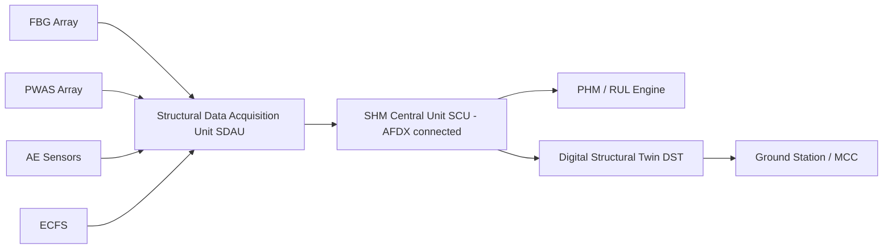

# ATLAS 050-059 · 05.050.000 — Structural Monitoring, Diagnostics and Evidence General

## 1. Purpose

Defines the **Structural Health Monitoring (SHM) architecture** for the AMPEL360 eWTW: sensor types, data acquisition, on-board processing, ground-station synchronisation, PHM credit, and regulatory evidence pathway under CS-25 AMC 20-29A.

## 2. Scope

### 2.1 SHM Sensor Architecture

| Sensor type | Acronym | Application | Quantity (est.) |
|---|---|---|---|
| Fibre Bragg Grating | FBG | Strain, temperature — fuselage + wing skin | ~2,400 nodes |
| Piezoelectric wafer active sensor | PWAS | Lamb-wave damage detection — PSE zones | ~800 nodes |
| Acoustic emission sensor | AE | Crack initiation monitoring — WFIJ/pylon | ~120 nodes |
| Eddy-current film sensor | ECFS | Corrosion monitoring — lap-joint zones | ~400 nodes |

### 2.2 Data Acquisition and Processing

### 2.3 PHM Credit Pathway

SHM data may be used to extend inspection intervals subject to regulatory credit per CS-25 AMC 20-29A (onboard maintenance systems). The credit pathway requires:

1. **Sensor qualification** — DO-160G environmental; DO-254 hardware; sensor accuracy characterisation.
2. **Algorithm qualification** — DO-178C DAL C for damage-state classifier; uncertainty quantification report.
3. **Regulatory submission** — Special Condition or AMC letter to EASA SA/FAA ACO covering SHM credit.
4. **Fleet demonstration** — minimum 500 aircraft-flights with validated sensor performance prior to interval extension.

### 2.4 Evidence and Traceability

All SHM findings are recorded in the S1000D CSDB as:
- **Event DMs** (info-code 012) — sensor alert events.
- **Inspection DMs** (info-code 300) — correlated visual/NDT findings.
- **Maintenance DMs** (info-code 200) — follow-on maintenance actions.

Digital twin correlation results are stored in the **Fleet Health Management System (FHMS)** and linked to individual aircraft serial numbers.

## 3. Footprint

| Metric | Value |
|---|---|
| Document ID | `QATL-ATLAS-1000-ATLAS-050-059-05-050-000-STRUCTURAL-MONITORING-DIAGNOSTICS-AND-EVIDENCE-GENERAL` |
| Status |  |

## 4. References

[^baseline]: Q+ATLANTIDE Baseline — [`organization/Q+ATLANTIDE.md`](../../../../../organization/Q+ATLANTIDE.md)

| Ref | Document |
|---|---|
| CS-25 AMC 20-29A | Onboard maintenance systems |
| DO-160G | Environmental conditions and test procedures |
| DO-178C | Software considerations in airborne systems |
| DO-254 | Design assurance guidance for airborne electronic hardware |
| [`./README.md`](./README.md) | Subsubject index |
