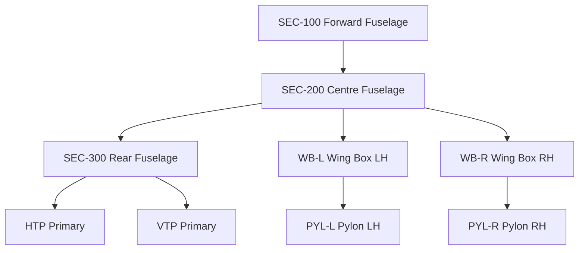

# ATLAS 050-059 · 05.050.000 — Structural Zones and Major Assemblies

## 1. Purpose

Defines the **structural zone map** and **major assembly list** for the AMPEL360 eWTW, providing the reference coordinate system, zone identifiers, and major assembly part-number families used across all structural documentation.

## 2. Scope

### 2.1 Coordinate System and Station Reference

- **FS** (Fuselage Station): measured aft from datum FS 0.000 at nose reference plane, in mm.
- **WS** (Wing Station): measured outboard from aircraft centreline, in mm.
- **WL** (Water Line): measured upward from ground datum, in mm.
- **BL** (Buttock Line): measured laterally from aircraft centreline, in mm.

### 2.2 Zone Map Summary

| Zone | Description | FS range (approx.) | ATLAS subsection |
|---|---|---|---|
| Z100 | Forward fuselage (nose to fwd pressure bulkhead) | 0–2500 | 053_Fuselage |
| Z200 | Forward cabin (fwd bulkhead to wing leading edge) | 2500–7000 | 053_Fuselage |
| Z300 | Centre wing box / cabin intersection | 7000–11000 | 053_Fuselage + 057_Wings |
| Z400 | Rear cabin (wing TE to aft pressure bulkhead) | 11000–17500 | 053_Fuselage |
| Z500 | Tail cone and empennage attach | 17500–21000 | 053_Fuselage + 055_Stabilizers |
| Z600 | Wing — inboard box | WS 0–4500 | 057_Wings |
| Z700 | Wing — outboard box | WS 4500–16000 | 057_Wings |
| Z800 | Pylons and nacelles | — | 054_Nacelles-and-Pylons |
| Z900 | Doors and frames | Multiple FS | 052_Doors |

### 2.3 Major Structural Assemblies

| Assembly | Designation | Material | Supplier class |
|---|---|---|---|
| Forward fuselage section | SEC-100 | CFRP (IM7/8552) | TBD |
| Centre fuselage section | SEC-200 | CFRP (IM7/8552) | TBD |
| Rear fuselage section | SEC-300 | CFRP (IM7/8552) | TBD |
| Wing box — LH | WB-L | CFRP (IM7/977-3) | TBD |
| Wing box — RH | WB-R | CFRP (IM7/977-3) | TBD |
| Wing-fuselage interface joint | WFIJ | Ti-6Al-4V + CFRP | TBD |
| HTP primary structure | HTP-PRIM | CFRP | TBD |
| VTP primary structure | VTP-PRIM | CFRP | TBD |
| Pylon — LH | PYL-L | Ti-6Al-4V primary | TBD |
| Pylon — RH | PYL-R | Ti-6Al-4V primary | TBD |

### 2.4 Assembly Interface Diagram

## 3. Footprint

| Metric | Value |
|---|---|
| Document ID | `QATL-ATLAS-1000-ATLAS-050-059-05-050-000-STRUCTURAL-ZONES-AND-MAJOR-ASSEMBLIES` |
| Status |  |

## 4. References

[^baseline]: Q+ATLANTIDE Baseline — [`organization/Q+ATLANTIDE.md`](../../../../../organization/Q+ATLANTIDE.md)

| Ref | Document |
|---|---|
| CS-25.301 | Loads — structural zone applicability |
| [`./README.md`](./README.md) | Subsubject index |
| [`../README.md`](../README.md) | 050_General subsection index |
