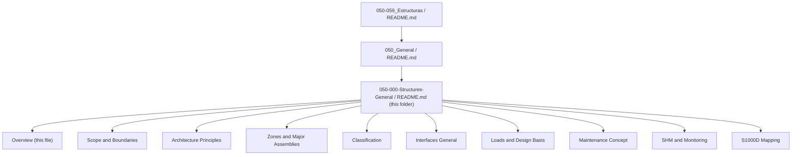

# ATLAS 050-059 · 05.050.000 — Structures General Overview

## 1. Purpose

Provides the **programme-level overview** of the AMPEL360 eWTW structural system: its design objectives, regulatory context (CS-25 / FAR 25), the electric-WetThroughWing (eWTW) structural philosophy, and the relationship between the structural architecture and the Q+ATLANTIDE digital thread.

This document is part of the **ATLAS-1000** register, a subpart of the controlled **Q+ATLANTIDE** baseline[^baseline].

## 2. Scope

### 2.1 Programme Structural Context

The AMPEL360 eWTW is a wide-body civil transport aircraft featuring a blended-wing/conventional fuselage hybrid ("WetThroughWing") configuration. The primary structural concept is:

- **All-composite primary structure** (CFRP fuselage barrel, CFRP wing box, CFRP empennage) with metallic fittings at high-load interfaces.
- **Electric-only power and propulsion** — no engine-bleed structural loads on pylon; all EMA actuator attachment loads included in structural design basis.
- **Fail-safe / Damage-Tolerant** design philosophy per CS-25 Subpart C / FAR 25.571.
- **Digital-twin structural monitoring** via integrated FBG and PWAS sensor networks.

### 2.2 Regulatory Framework

| Regulation | Applicability |
|---|---|
| CS-25 Subpart C (§25.301–§25.625) | Structural requirements — loads, flutter, fatigue, damage tolerance |
| FAR 25 Subpart C | US market certification mirror |
| CS-25 Appendix K | Composite structure special conditions |
| DO-326A / ED-202A | Airworthiness security — cyber-physical structural monitoring |
| EASA SC-VTOL (informative) | eWTW novel configuration structural aspects |

### 2.3 Structural Document Hierarchy

## 3. Footprint

| Metric | Value |
|---|---|
| Document ID | `QATL-ATLAS-1000-ATLAS-050-059-05-050-000-STRUCTURES-GENERAL-OVERVIEW` |
| Architecture | `ATLAS` |
| Code range | `050-059` |
| Section | `05` — Estructuras |
| Subsection | `050` — General |
| Subsubject | `000` — Structures General Overview |
| Folder path | `Q+ATLANTIDE/000-099_ATLAS/050-059_Estructuras/050_General/050-000-Structures-General/` |
| Status |  |

## 4. References

[^baseline]: Q+ATLANTIDE Baseline — [`organization/Q+ATLANTIDE.md`](../../../../../organization/Q+ATLANTIDE.md)

| Ref | Document | Relevance |
|---|---|---|
| CS-25 | EASA Certification Specifications for Large Aeroplanes | Primary structural airworthiness standard |
| FAR 25 | US FAR Part 25 — Airworthiness Standards | US mirror standard |
| DO-326A | Airworthiness Security Process Specification | Cybersecurity for airborne systems incl. SHM |
| [`../README.md`](../README.md) | 050_General Subsection Index | Parent subsection |
| [`../../README.md`](../../README.md) | 050-059_Estructuras Section Index | Parent section |
