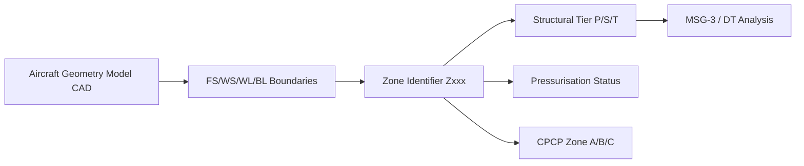

# ATLAS 050-059 · 05.050.010 — Aircraft Structural Zone Definition

## 1. Purpose

Defines the **structural zone taxonomy** for the AMPEL360 eWTW, establishing top-level zone identifiers, their geometric extents, structural classification, and the mapping to ATA/S1000D zone codes.

## 2. Scope

### 2.1 Zone Numbering Convention

Structural zones use a three-digit identifier in the range `Z100`–`Z900`. The first digit denotes the primary structural region:

| Range | Region |
|---|---|
| Z100–Z199 | Forward fuselage |
| Z200–Z299 | Centre forward fuselage |
| Z300–Z399 | Centre wing box and cabin crossing |
| Z400–Z499 | Rear cabin and rear fuselage |
| Z500–Z599 | Tail cone and empennage |
| Z600–Z699 | Wing inboard |
| Z700–Z799 | Wing outboard |
| Z800–Z899 | Nacelles and pylons |
| Z900–Z999 | Doors and access panels |

### 2.2 Zone Spatial Extents (Top-Level)

| Zone | FS start | FS end | WS / BL limits | WL limits |
|---|---|---|---|---|
| Z100 | 0 | 2,500 | ±BL 2,000 | WL 1,000–4,500 |
| Z300 | 7,000 | 11,000 | ±WS 16,000 (with wing) | WL 800–5,000 |
| Z600 | — | — | WS 0–4,500 | per wing contour |
| Z700 | — | — | WS 4,500–16,000 | per wing contour |

(Full zone table in Design Basis Document DBD-AMPEL360-STRUCT-001 §3.)

### 2.3 Zone Classification Attributes

Each zone carries the following classification attributes:

| Attribute | Options |
|---|---|
| Structural tier | Primary / Secondary / Tertiary |
| Pressurisation | Pressurised / Unpressurised |
| Access type | Routine (every C-check) / Periodic (every D-check) / Special |
| DT basis | Damage-tolerant / Safe-life / On-condition |
| CPCP zone | Zone A (severe) / Zone B (average) / Zone C (benign) |

### 2.4 Zone Definition Flowchart

## 3. Footprint

| Metric | Value |
|---|---|
| Document ID | `QATL-ATLAS-1000-ATLAS-050-059-05-050-010-AIRCRAFT-STRUCTURAL-ZONE-DEFINITION` |
| Status |  |

## 4. References

[^baseline]: Q+ATLANTIDE Baseline — [`organization/Q+ATLANTIDE.md`](../../../../../organization/Q+ATLANTIDE.md)

| Ref | Document |
|---|---|
| CS-25.571 | Damage-tolerance and fatigue evaluation |
| AMC 25.571 | CPCP zone classification |
| [`./README.md`](./README.md) | Subsubject index |
