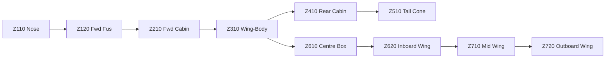

# ATLAS 050-059 · 05.050.010 — Fuselage, Wing and Centre-Body Zoning

## 1. Purpose

Provides the **detailed zone map** for the [PROGRAMME-AIRCRAFT] [PROGRAMME-VARIANT] fuselage, wing, and centre wing-body junction, including sub-zone identifiers, station-referenced geometric boundaries, and CPCP zone assignments.

## 2. Scope

### 2.1 Fuselage Sub-Zones

| Zone | Sub-zone | FS range | Description |
|---|---|---|---|
| Z100 | Z110 | 0–1,200 | Nose radome and pressure bulkhead |
| Z100 | Z120 | 1,200–2,500 | Forward fuselage (first pressure dome to fwd cabin) |
| Z200 | Z210 | 2,500–5,000 | Forward cabin barrel |
| Z200 | Z220 | 5,000–7,000 | Forward cabin to wing LE |
| Z300 | Z310 | 7,000–9,000 | Wing-box/cabin intersection (upper) |
| Z300 | Z320 | 7,000–9,000 | Wing-box/cabin intersection (lower/keel) |
| Z400 | Z410 | 9,000–13,000 | Rear cabin |
| Z400 | Z420 | 13,000–17,500 | Aft fuselage |
| Z500 | Z510 | 17,500–21,000 | Tail cone |

### 2.2 Wing Sub-Zones

| Zone | Sub-zone | WS range | Description |
|---|---|---|---|
| Z600 | Z610 | 0–1,500 | Centre section (within fuselage) |
| Z600 | Z620 | 1,500–4,500 | Inboard wing box |
| Z700 | Z710 | 4,500–10,000 | Mid-span wing box |
| Z700 | Z720 | 10,000–16,000 | Outboard wing box and winglet root |

### 2.3 Zone Diagram

## 3. Footprint

| Metric | Value |
|---|---|
| Document ID | `QATL-ATLAS-1000-ATLAS-050-059-05-050-010-FUSELAGE-WING-AND-CENTER-BODY-ZONING` |
| Status |  |

## 4. References

[^baseline]: Q+ATLANTIDE Baseline — [`organization/Q+ATLANTIDE.md`](../../../../../organization/Q+ATLANTIDE.md)

| Ref | Document |
|---|---|
| CS-25.571 | DT zone assignments |
| AMC 25.571 | CPCP zone map |
| [`./README.md`](./README.md) | Subsubject index |
