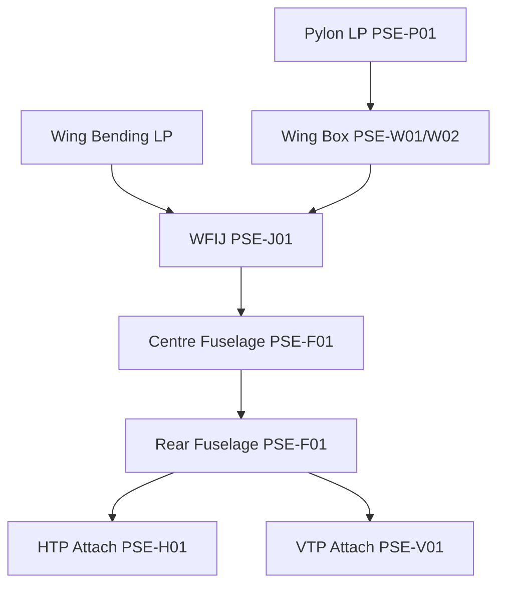

# ATLAS 050-059 · 05.050.010 — Primary Structural Architecture

## 1. Purpose

Describes the **primary structural architecture** of the AMPEL360 eWTW: the PSE network, principal load paths, key structural elements, and their architectural arrangement across the airframe.

## 2. Scope

### 2.1 Primary Load Paths

The AMPEL360 primary structural architecture is built around four principal load paths:

| Load path | Description | Key PSEs |
|---|---|---|
| **Wing bending** | Wing lift loads transferred inboard through spars to WFIJ | PSE-W01, PSE-W02, PSE-J01 |
| **Fuselage hoop** | Pressure vessel hoop stress in fuselage frames and skin | PSE-F01 |
| **Fuselage bending** | Fuselage bending carried by keel beam, crown beam, skin | PSE-F01 |
| **Empennage** | HTP/VTP loads transferred to rear fuselage via attach fittings | PSE-H01, PSE-V01 |

### 2.2 PSE Arrangement Diagram

### 2.3 Key Design Features

| Feature | AMPEL360 specific |
|---|---|
| Wing-fuselage joint | WFIJ — 4-bolt carbon/titanium joint; multi-load-path |
| Fuselage barrel | 6-barrel all-CFRP semi-monocoque; integral tear-straps |
| Wing box | 2-spar CFRP box with CFRP ribs; no hydraulic pump bay in wing |
| Centre box | Full-depth centre wing box integrated with fuselage floor beam grid |
| Pylon | Short, stiff titanium pylon; electric motor attachment loads |

### 2.4 CS-25 Compliance Basis

| PSE group | CS-25 basis |
|---|---|
| Wing, fuselage, WFIJ | §25.571(b) — Damage-tolerant design |
| Pylon main fittings | §25.571(b) + §25.581 lightning criteria |
| Landing gear attach | §25.571(c) — Safe-life (no damage-tolerant design possible) |

## 3. Footprint

| Metric | Value |
|---|---|
| Document ID | `QATL-ATLAS-1000-ATLAS-050-059-05-050-010-PRIMARY-STRUCTURAL-ARCHITECTURE` |
| Status |  |

## 4. References

[^baseline]: Q+ATLANTIDE Baseline — [`organization/Q+ATLANTIDE.md`](../../../../../organization/Q+ATLANTIDE.md)

| Ref | Document |
|---|---|
| CS-25.571 | Damage-tolerance and fatigue evaluation |
| CS-25.581 | Lightning protection — structures |
| [`./README.md`](./README.md) | Subsubject index |
