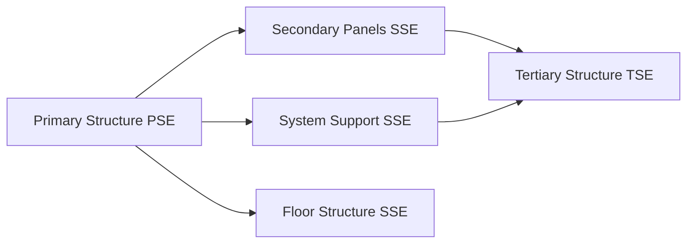

# ATLAS 050-059 · 05.050.010 — Secondary Structural Architecture

## 1. Purpose

Describes the **secondary structural architecture** of the AMPEL360 eWTW: SSE inventory, architectural arrangement, failure-effect classification, and MSG-3 maintenance basis.

## 2. Scope

### 2.1 SSE Categories

Secondary structure elements (SSEs) are those whose failure does not immediately cause loss of the aircraft but may impair safety, continued operations, or cause consequential damage to primary structure.

| SSE category | Examples | Failure effect class |
|---|---|---|
| Stiffened secondary panels | Wing leading/trailing edge panels, belly fairing structure | Class II — affects performance |
| System support structure | EMA bracket attachments, CDN tray brackets, battery bay walls | Class II — may affect systems |
| Floor structure (non-pressure-critical) | Cabin floor beams in aft fuselage, galley floor panels | Class II — affects cabin operations |
| Control surface secondary attach | Trailing-edge flap track fittings (non-PSE attachment) | Class II — affects controllability |

### 2.2 SSE Maintenance Basis

SSEs are maintained on an **inspection programme** basis derived from MSG-3 Level II structural analysis. Inspection intervals are based on:
- Fatigue analysis with scatter factor ≥ 4 (no DT required).
- Environmental deterioration assessment (corrosion, wear).
- Service experience data from fleet monitoring.

### 2.3 SSE Architecture Summary

## 3. Footprint

| Metric | Value |
|---|---|
| Document ID | `QATL-ATLAS-1000-ATLAS-050-059-05-050-010-SECONDARY-STRUCTURAL-ARCHITECTURE` |
| Status |  |

## 4. References

[^baseline]: Q+ATLANTIDE Baseline — [`organization/Q+ATLANTIDE.md`](../../../../../organization/Q+ATLANTIDE.md)

| Ref | Document |
|---|---|
| MSG-3 Rev 3 | Maintenance programme development |
| CS-25.571 | Fatigue evaluation — scatter factor |
| [`./README.md`](./README.md) | Subsubject index |
