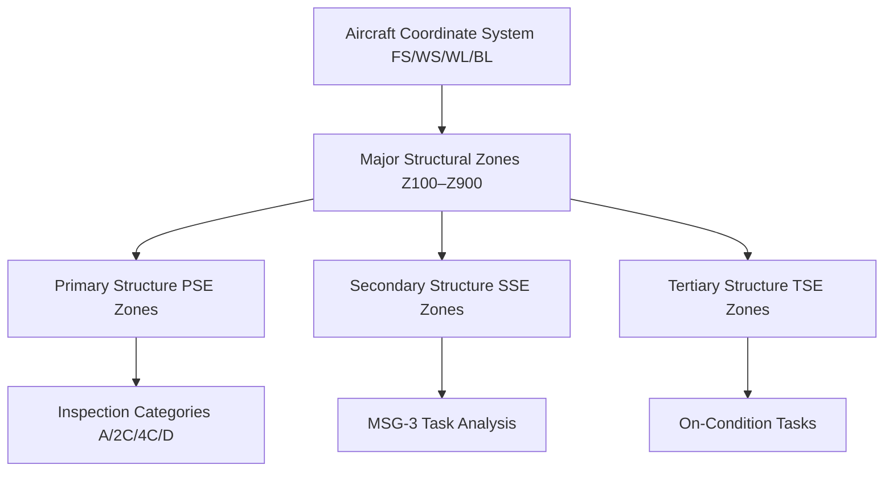

# ATLAS 050-059 · 05.050.010 — Structural Architecture and Zoning Overview

## 1. Purpose

Provides the programme-level overview of the AMPEL360 eWTW **structural architecture and zoning framework**: how structural zones are defined, how they relate to the aircraft coordinate system, and how zone-based documentation supports maintenance, inspection, and S1000D data module production.

## 2. Scope

### 2.1 Context

The AMPEL360 eWTW structural architecture follows a three-tier hierarchy (primary/secondary/tertiary) with an overlay zone-code system that:
- Enables unambiguous zone-referenced inspection tasks in S1000D data modules.
- Supports damage-tolerance zone categorisation per CS-25.571.
- Provides the address space for SHM sensor placement and FBG/PWAS node referencing.

### 2.2 Zone Framework Summary

### 2.3 Architecture Layer Overview

| Layer | Code | Description |
|---|---|---|
| Primary | `P` | Load-bearing structure critical to safe flight; CS-25.571 DT |
| Secondary | `S` | Supporting structure; failure does not cause immediate loss |
| Tertiary | `T` | Non-structural fairings, access panels, non-load brackets |

## 3. Footprint

| Metric | Value |
|---|---|
| Document ID | `QATL-ATLAS-1000-ATLAS-050-059-05-050-010-STRUCTURAL-ARCHITECTURE-AND-ZONING-OVERVIEW` |
| Status |  |
| Folder path | `Q+ATLANTIDE/000-099_ATLAS/050-059_Estructuras/050_General/050-010-Structural-Architecture-and-Zoning/` |

## 4. References

[^baseline]: Q+ATLANTIDE Baseline — [`organization/Q+ATLANTIDE.md`](../../../../../organization/Q+ATLANTIDE.md)

| Ref | Document |
|---|---|
| CS-25.571 | Damage-tolerance and fatigue evaluation of structure |
| MSG-3 Rev 3 | Airline/Manufacturer Maintenance Programme Development |
| [`./README.md`](./README.md) | Subsubject index |
| [`../README.md`](../README.md) | 050_General subsection index |
