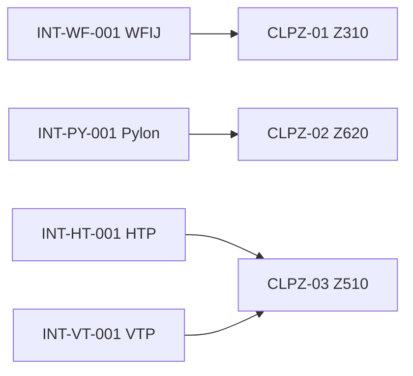

# ATLAS 050-059 · 05.050.010 — Structural Interfaces and Load-Path Zoning

## 1. Purpose

Maps the **structural interfaces and primary load paths** to their corresponding zones, identifying joint sub-zones, load transfer mechanisms, and associated ICD references.

## 2. Scope

### 2.1 Load-Path Zone Mapping

| Load path | Originating zone | Transfer zone | Receiving zone | Interface |
|---|---|---|---|---|
| Wing bending | Z620/Z710 | Z610 | Z310 | WFIJ INT-WF-001 |
| Pylon/engine | Z800 | Z620 spar | Z610/Z310 | INT-PY-001 |
| HTP loads | Z500/Z550 | Z510 | Z420 | INT-HT-001 |
| VTP loads | Z500/Z560 | Z510 | Z420 keel | INT-VT-001 |
| NLG ground loads | Z100/Z110 | Z120 keel | Z210 | INT-NLG-001 |
| MLG ground loads | Z640 | Z620 rib | Z310 | INT-LG-001 |

### 2.2 Critical Load-Path Zones

The following zones are designated **Critical Load-Path Zones (CLPZs)** requiring enhanced inspection:

| Zone | CLPZ designation | Reason |
|---|---|---|
| Z310 | CLPZ-01 | WFIJ — highest structural criticality |
| Z620 (front spar) | CLPZ-02 | Wing bending + pylon shear concentration |
| Z510 (empennage) | CLPZ-03 | HTP/VTP multi-load path junction |

### 2.3 Interface-to-Zone Traceability

## 3. Footprint

| Metric | Value |
|---|---|
| Document ID | `QATL-ATLAS-1000-ATLAS-050-059-05-050-010-STRUCTURAL-INTERFACES-AND-LOAD-PATH-ZONING` |
| Status |  |

## 4. References

[^baseline]: Q+ATLANTIDE Baseline — [`organization/Q+ATLANTIDE.md`](../../../../../organization/Q+ATLANTIDE.md)

| Ref | Document |
|---|---|
| CS-25.301 | Loads general |
| [`050-030-Structural-Interfaces-General/README.md`](../050-030-Structural-Interfaces-General/README.md) | Structural interfaces subsubject |
| [`./README.md`](./README.md) | Subsubject index |
