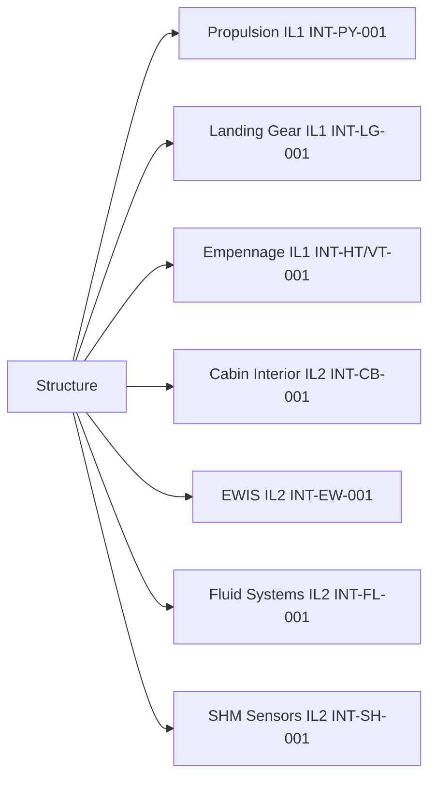

# ATLAS 050-059 · 05.050.030 — Structural Interfaces General Overview

## 1. Purpose

Provides the programme-level overview of the AMPEL360 eWTW **structural interface framework**: the top-level interface matrix, ICD governance process, and interface classification scheme covering all airframe-to-systems attachment and boundary interfaces.

## 2. Scope

### 2.1 Interface Classification

Structural interfaces are classified in three tiers:

| Tier | Code | Definition |
|---|---|---|
| Level 1 | IL1 | Major PSE-to-PSE interfaces (e.g., WFIJ, pylon-to-wing spar) |
| Level 2 | IL2 | PSE-to-SSE or PSE-to-systems interfaces (e.g., EMA bracket to frame) |
| Level 3 | IL3 | SSE-to-TSE or minor systems attachment interfaces |

### 2.2 Top-Level Interface Matrix

### 2.3 eWTW-Specific Interface Features

| Interface group | eWTW-specific requirement |
|---|---|
| Propulsion | Electric motor axial/torque loads — no gas thrust mount needed; pylon designed for electric drive reaction |
| EWIS | Large HVDC cable routes (±270 V DC, 400 A) require dedicated structural tie-points and bonding straps |
| Battery bay | Battery module tray structural attachment must withstand 20 g crash load per CS-25.561 |
| SHM | FBG strain gauges and PWAS transducers embedded in CFRP layup at WFIJ and wing root require structural design accommodation |

## 3. Footprint

| Metric | Value |
|---|---|
| Document ID | `QATL-ATLAS-1000-ATLAS-050-059-05-050-030-STRUCTURAL-INTERFACES-GENERAL-OVERVIEW` |
| Status |  |

## 4. References

[^baseline]: Q+ATLANTIDE Baseline — [`organization/Q+ATLANTIDE.md`](../../../../../organization/Q+ATLANTIDE.md)

| Ref | Document |
|---|---|
| CS-25.561 | Emergency landing conditions |
| CS-25.571 | Damage-tolerance |
| [`./README.md`](./README.md) | Subsubject index |
