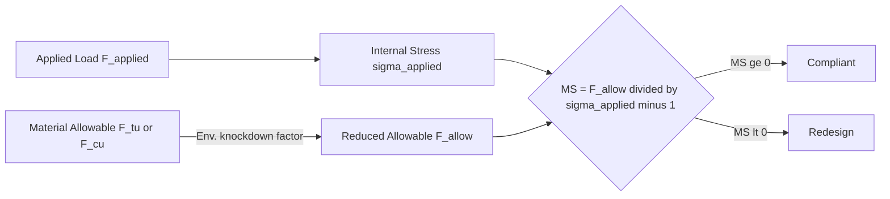

# ATLAS 050-059 · 05.050.040 — Design Allowables and Margins General

## 1. Purpose

Defines the **design allowables and margin-of-safety (MS) framework** for the AMPEL360 eWTW structural programme: how material property allowables (A-basis and B-basis) are established for metallic and composite materials, how environmental knockdown factors are applied, and how MS is calculated and reported for each structural element and load case.

## 2. Scope

### 2.1 Context

Material allowables are statistical properties derived from coupon test databases conforming to MMPDS (metallic materials) or CMH-17 (composite materials). For the AMPEL360 eWTW, B-basis allowables are used for primary structure with multiple load paths; A-basis allowables are required for single-load-path (fail-unsafe) elements. Environmental knockdown factors (ETW, CTD, ETD) are applied to composite allowables to account for moisture absorption and temperature effects across the operating range.

The minimum acceptable margin of safety at ultimate load is MS ≥ 0.0. A positive programme-level design margin of MS ≥ +0.05 is maintained at the preliminary sizing stage to absorb model uncertainties and manufacturing variability. Final-substantiation analyses may carry MS ≥ 0.0 following refined FE analysis and physical test correlation.

### 2.2 Margin of Safety Calculation

### 2.3 Allowables Hierarchy

| Material Family | Database | Basis | Env. Factors Applied |
|---|---|---|---|
| 7xxx-series aluminium | MMPDS-12 | B-basis | CTD, ETW temperature |
| Ti-6Al-4V titanium | MMPDS-12 | B-basis | Temperature only |
| CFRP UD tape (primary) | CMH-17 Vol. 1 | B-basis | ETW, moisture absorption |
| CFRP woven fabric | CMH-17 Vol. 1 | B-basis | ETW, moisture absorption |
| Cryo-rated CFRP (LH₂) | Programme DB | A-basis | CTD −253 °C + cycling |
| HTA adhesive bondline | Programme DB | B-basis | ETW, fatigue knockdown |

## 3. Footprint

| Metric | Value |
|---|---|
| Document ID | `QATL-ATLAS-1000-ATLAS-050-059-05-050-040-DESIGN-ALLOWABLES-AND-MARGINS-GENERAL` |
| Status |  |
| Folder path | `Q+ATLANTIDE/000-099_ATLAS/050-059_Estructuras/050_General/050-040-Loads-Environment-and-Design-Basis/` |

## 4. References

[^baseline]: Q+ATLANTIDE Baseline — [`organization/Q+ATLANTIDE.md`](../../../../../organization/Q+ATLANTIDE.md)

| Ref | Document |
|---|---|
| CS-25.303 | Factor of safety |
| MMPDS-12 | Metallic Materials Properties Development and Standardisation |
| CMH-17 Vol. 1 | Composite Materials Handbook — Polymer Matrix Composites |
| AC 20-107B | Composite Aircraft Structure — allowables guidance |
| [`./README.md`](./README.md) | Subsubject 040 index |
| [`../README.md`](../README.md) | 050_General subsection index |
