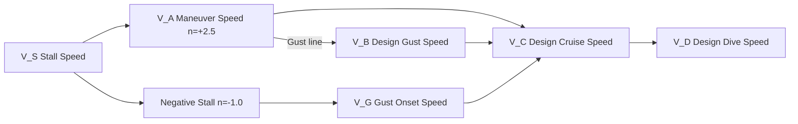

# ATLAS 050-059 · 05.050.040 — Flight Loads and Maneuver Loads

## 1. Purpose

Defines the **flight loads and maneuver loads** envelope for the [PROGRAMME-AIRCRAFT] [PROGRAMME-VARIANT] structural programme, covering the V-n flight envelope, symmetrical and asymmetrical maneuver cases, gust loads, and the aerodynamic load redistribution associated with distributed-propulsion failure cases.

## 2. Scope

### 2.1 Context

CS-25.333 defines the flight maneuver and gust envelope. For the [PROGRAMME-AIRCRAFT] [PROGRAMME-VARIANT], the design positive limit maneuver load factor is n_z = +2.5 g at maximum take-off weight, with a negative limit of n_z = −1.0 g. The distributed-electric-propulsion architecture introduces asymmetric thrust failure cases (partial DEP pod loss) that generate critical yaw and roll moments not present in conventional twin-engine aircraft. These are treated as maneuver load cases combined with engine-failure inertia relief per CS-25.367.

Gust loads are computed via the discrete gust method (CS-25.341) and the continuous turbulence method, with the more critical case governing each structural element.

### 2.2 V-n Flight Envelope

### 2.3 Critical Maneuver Load Cases

| Case ID | Description | Governing n_z | Critical Component |
|---|---|---|---|
| MC-01 | Symmetric pull-up at V_A | +2.5 g | Wing root bending |
| MC-02 | Symmetric push-over at V_D | −1.0 g | Upper skin buckling |
| MC-03 | Rolling pull-out | +2.5 g combined roll | Wing tip, aileron hinge |
| MC-04 | Yaw maneuver (rudder kick) | n/a lateral | Vertical tail, fin attach |
| MC-05 | DEP asymmetric thrust failure | +2.5 + yaw | Centre-section frames |

## 3. Footprint

| Metric | Value |
|---|---|
| Document ID | `QATL-ATLAS-1000-ATLAS-050-059-05-050-040-FLIGHT-LOADS-AND-MANEUVER-LOADS` |
| Status |  |
| Folder path | `Q+ATLANTIDE/000-099_ATLAS/050-059_Estructuras/050_General/050-040-Loads-Environment-and-Design-Basis/` |

## 4. References

[^baseline]: Q+ATLANTIDE Baseline — [`organization/Q+ATLANTIDE.md`](../../../../../organization/Q+ATLANTIDE.md)

| Ref | Document |
|---|---|
| CS-25.333 | Flight maneuver and gust envelope |
| CS-25.341 | Gust and turbulence loads |
| CS-25.367 | Unsymmetrical loads due to engine failure |
| [`./README.md`](./README.md) | Subsubject 040 index |
| [`../README.md`](../README.md) | 050_General subsection index |
