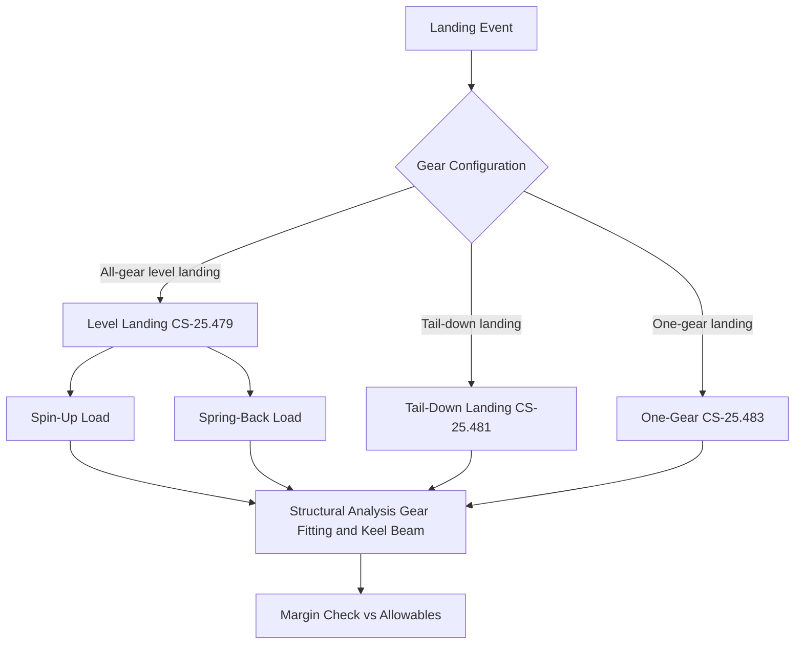

# ATLAS 050-059 · 05.050.040 — Ground Loads and Landing Loads

## 1. Purpose

Defines the **ground loads and landing loads** applicable to the [PROGRAMME-AIRCRAFT] [PROGRAMME-VARIANT] structure, including landing-gear vertical and drag reactions, ground-handling towing and jacking loads, braking and pivoting loads, and the influence of the aircraft's high-energy-density cryogenic mass on gear-strut dynamic response.

## 2. Scope

### 2.1 Context

CS-25.471 governs ground loads. For the [PROGRAMME-AIRCRAFT] [PROGRAMME-VARIANT], the adoption of an unconventional undercarriage arrangement (tricycle with centre-mounted main gear due to the low-wing distributed-propulsion layout) produces atypical spin-up/spring-back load distributions. The LH₂ tank mass located aft of centre also creates a critical nose-gear reaction during braked roll-out. All landing-gear load cases are computed for maximum landing weight (MLW) and maximum take-off weight (MTOW) where applicable.

Taxi loads account for runway roughness exceedances per CS-25.491. Towing, jacking, and tie-down loads are specified in the ground-handling load cases per CS-25.509 and programme requirements.

### 2.2 Ground Load Cases Flowchart

### 2.3 Key Ground Load Cases

| Case | CS-25 Ref | Load Factor (n_z) | Critical Structure |
|---|---|---|---|
| Level landing | 25.479 | ≤ 2.0 (per sink rate) | Main gear fitting, keel beam |
| Tail-down landing | 25.481 | Variable | Aft fuselage keel, bulkhead |
| One-gear landing | 25.483 | n_z + lateral | Fuselage frame, skin lap joints |
| Braking on runway | 25.493 | Braking coefficient 0.8 | Nose-gear drag strut |
| Pivoting on ground | 25.495 | Lateral | Main gear drag brace |
| Towing | 25.509 | 0.6 × MTOW (forward) | Tow bar attachment |

## 3. Footprint

| Metric | Value |
|---|---|
| Document ID | `QATL-ATLAS-1000-ATLAS-050-059-05-050-040-GROUND-LOADS-AND-LANDING-LOADS` |
| Status |  |
| Folder path | `Q+ATLANTIDE/000-099_ATLAS/050-059_Estructuras/050_General/050-040-Loads-Environment-and-Design-Basis/` |

## 4. References

[^baseline]: Q+ATLANTIDE Baseline — [`organization/Q+ATLANTIDE.md`](../../../../../organization/Q+ATLANTIDE.md)

| Ref | Document |
|---|---|
| CS-25.471 | Ground loads — general |
| CS-25.479 | Level-landing conditions |
| CS-25.481 | Tail-down landing conditions |
| CS-25.493 | Braked-roll conditions |
| CS-25.509 | Towing loads |
| [`./README.md`](./README.md) | Subsubject 040 index |
| [`../README.md`](../README.md) | 050_General subsection index |
