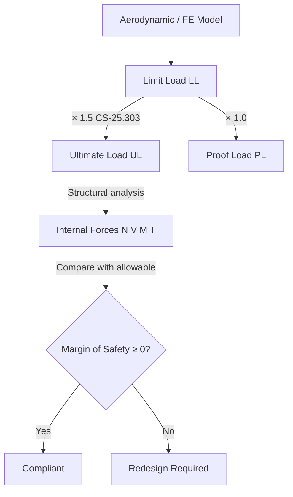

# ATLAS 050-059 · 05.050.040 — Limit and Ultimate Load Definitions

## 1. Purpose

Defines **limit loads** and **ultimate loads** for the [PROGRAMME-AIRCRAFT] [PROGRAMME-VARIANT] structural programme, establishes the safety factors and design criteria mandated by CS-25 Subpart C, and specifies the acceptance criteria for structural demonstrations at each load level.

## 2. Scope

### 2.1 Context

CS-25.301 defines *limit loads* as the maximum loads expected in service; the structure must support limit loads without detrimental permanent deformation. CS-25.303 mandates a safety factor of 1.5 applied to limit loads to obtain *ultimate loads*, which the structure must sustain without failure for at least three seconds. For the [PROGRAMME-AIRCRAFT] [PROGRAMME-VARIANT], additional programme-specific safety factors are applied where novel materials (CFRP laminates, metal-matrix composites) or novel load types (cryogenic cycling, hydrogen embrittlement) create elevated uncertainty in analytical models.

Proof loads (1.0 × limit) apply to pressurised vessels and tank attachment fittings; these are verified by pressurisation proof tests during ground testing.

### 2.2 Load Level Derivation Chain

### 2.3 Safety Factor Summary

| Load Level | Factor vs. Limit | Acceptance Criterion |
|---|---|---|
| Proof load | 1.00 | No leakage; elastic behaviour |
| Limit load | 1.00 | No detrimental permanent deformation |
| Ultimate load | 1.50 | No failure for ≥ 3 s |
| CFRP scatter factor | ×1.15 add. (B-basis) | Per AC 20-107B |
| Cryogenic penalty | ×1.10 add. (programme SC) | LH₂ thermal cycling uncertainty |

## 3. Footprint

| Metric | Value |
|---|---|
| Document ID | `QATL-ATLAS-1000-ATLAS-050-059-05-050-040-LIMIT-AND-ULTIMATE-LOAD-DEFINITIONS` |
| Status |  |
| Folder path | `Q+ATLANTIDE/000-099_ATLAS/050-059_Estructuras/050_General/050-040-Loads-Environment-and-Design-Basis/` |

## 4. References

[^baseline]: Q+ATLANTIDE Baseline — [`organization/Q+ATLANTIDE.md`](../../../../../organization/Q+ATLANTIDE.md)

| Ref | Document |
|---|---|
| CS-25.301 | Loads — general |
| CS-25.303 | Factor of safety |
| CS-25.305 | Strength and deformation |
| AC 20-107B | Composite Aircraft Structure |
| [`./README.md`](./README.md) | Subsubject 040 index |
| [`../README.md`](../README.md) | 050_General subsection index |
