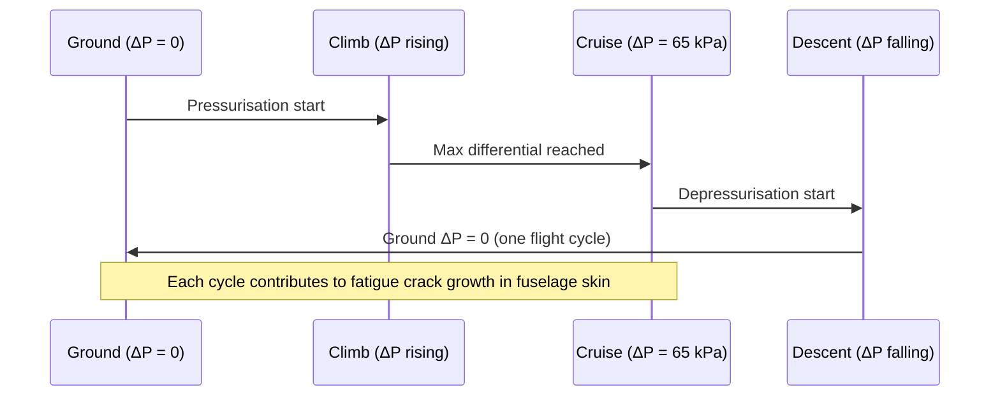

# ATLAS 050-059 · 05.050.040 — Pressurization and Pressure Differential Loads

## 1. Purpose

Defines the **pressurisation and pressure-differential loads** for the [PROGRAMME-AIRCRAFT] [PROGRAMME-VARIANT] fuselage and tank attachment structures, including the maximum differential pressure, proof and burst pressure criteria, combined pressurisation-plus-bending load cases, and fatigue contributions from pressurisation cycling.

## 2. Scope

### 2.1 Context

The [PROGRAMME-AIRCRAFT] [PROGRAMME-VARIANT] cabin is pressurised to maintain a 6,000 ft cabin altitude at the aircraft's maximum operating altitude of FL 410. This produces a maximum differential pressure (ΔP_max) of 65.0 kPa at operational conditions. The design relief valve setting provides an upper bound of 68.5 kPa. Combined with fuselage bending loads, the pressurisation cases drive skin thickness and frame pitch in the constant-section fuselage barrel.

The LH₂ fuel tanks operate at internal overpressure (ullage management) and must also withstand a negative differential (sloshing and cryogenic shrinkage) addressed by Special Condition SC-[PROGRAMME-AIRCRAFT]-LH2-001. Pressurisation cycling contributes the dominant fatigue mechanism for the fuselage skin and is tracked against the design service goal (DSG) of 90,000 flight cycles.

### 2.2 Pressurisation Load Cycle

### 2.3 Pressure Load Cases

| Case | ΔP (kPa) | Combined Load | Acceptance Criterion |
|---|---|---|---|
| Normal max diff | 65.0 | + fuselage bending | MS ≥ 0.0 (ultimate) |
| Relief valve setting | 68.5 | Cabin pressurisation alone | No failure |
| Proof test | 68.5 | Static, no bending | Elastic, no leakage |
| Burst (CS-25.365) | 68.5 × 2.0 = 137 | Pressurisation only | No catastrophic failure |
| LH₂ tank negative | −10.0 | Cryogenic shrinkage | MS ≥ 0.0 (limit) |

## 3. Footprint

| Metric | Value |
|---|---|
| Document ID | `QATL-ATLAS-1000-ATLAS-050-059-05-050-040-PRESSURIZATION-AND-PRESSURE-DIFFERENTIAL-LOADS` |
| Status |  |
| Folder path | `Q+ATLANTIDE/000-099_ATLAS/050-059_Estructuras/050_General/050-040-Loads-Environment-and-Design-Basis/` |

## 4. References

[^baseline]: Q+ATLANTIDE Baseline — [`organization/Q+ATLANTIDE.md`](../../../../../organization/Q+ATLANTIDE.md)

| Ref | Document |
|---|---|
| CS-25.365 | Pressurised compartment loads |
| CS-25.571 | Fatigue evaluation — pressurisation cycling |
| AMC 25.365 | Compliance methods for pressurised structure |
| SC-[PROGRAMME-AIRCRAFT]-LH2-001 | Special Condition — LH₂ tank pressurisation |
| [`./README.md`](./README.md) | Subsubject 040 index |
| [`../README.md`](../README.md) | 050_General subsection index |
