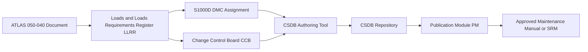

# ATLAS 050-059 · 05.050.040 — S1000D CSDB Mapping and Traceability

## 1. Purpose

Defines the **S1000D data module code (DMC) mapping and CSDB traceability** for all loads, environment, and design-basis documentation within subsubject `040`, ensuring each ATLAS document has a corresponding S1000D DMC and that the CSDB accurately reflects the approved design-basis state.

## 2. Scope

### 2.1 Context

The AMPEL360 eWTW technical publication system is built on S1000D Issue 5.0. All structural design-basis data modules reside in the Common Source Data Base (CSDB) under the project identifier `AMPEL360`. The DMC scheme follows the structure: `DMC-AMPEL360-A-050-040-00AA-{infoCode}-{infoCodeVariant}-{itemLocationCode}`. Design-basis descriptive data modules (infoCode `040`) capture the load definitions and environmental envelopes; procedural data modules are not applicable to this pure design-basis content.

Traceability between ATLAS documents and S1000D DMCs is maintained through the Loads and Loads Requirements Register (LLRR), which provides a bidirectional index from ATLAS document IDs to DMC codes and vice versa.

### 2.2 S1000D Traceability Flow

### 2.3 DMC Assignment Table

| ATLAS Document | DMC (abbreviated) | Info Code | Status |
|---|---|---|---|
| Loads-Environment-Overview | `DMC-AMPEL360-A-050-040-00AA-040A-A` | 040 — Description | draft |
| Structural-Loads-General | `DMC-AMPEL360-A-050-040-01AA-040A-A` | 040 — Description | draft |
| Limit-and-Ultimate-Load-Defs | `DMC-AMPEL360-A-050-040-02AA-040A-A` | 040 — Description | draft |
| Flight-and-Maneuver-Loads | `DMC-AMPEL360-A-050-040-03AA-040A-A` | 040 — Description | draft |
| Ground-and-Landing-Loads | `DMC-AMPEL360-A-050-040-04AA-040A-A` | 040 — Description | draft |
| Pressurization-Loads | `DMC-AMPEL360-A-050-040-05AA-040A-A` | 040 — Description | draft |
| Thermal-Cryogenic-Loads | `DMC-AMPEL360-A-050-040-06AA-040A-A` | 040 — Description | draft |
| Vibration-Fatigue-DT-Basis | `DMC-AMPEL360-A-050-040-07AA-040A-A` | 040 — Description | draft |
| Design-Allowables-Margins | `DMC-AMPEL360-A-050-040-08AA-040A-A` | 040 — Description | draft |

## 3. Footprint

| Metric | Value |
|---|---|
| Document ID | `QATL-ATLAS-1000-ATLAS-050-059-05-050-040-S1000D-CSDB-MAPPING-AND-TRACEABILITY` |
| Status |  |
| Folder path | `Q+ATLANTIDE/000-099_ATLAS/050-059_Estructuras/050_General/050-040-Loads-Environment-and-Design-Basis/` |

## 4. References

[^baseline]: Q+ATLANTIDE Baseline — [`organization/Q+ATLANTIDE.md`](../../../../../organization/Q+ATLANTIDE.md)

| Ref | Document |
|---|---|
| S1000D Issue 5.0 | International specification for technical publications |
| ASD-STE100 | Simplified Technical English |
| [`./README.md`](./README.md) | Subsubject 040 index |
| [`../README.md`](../README.md) | 050_General subsection index |
