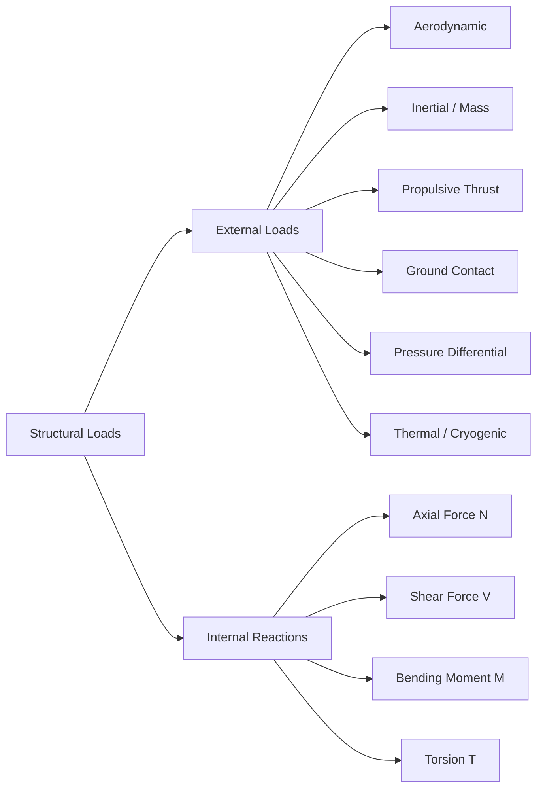

# ATLAS 050-059 · 05.050.040 — Structural Loads General

## 1. Purpose

Defines the **general structural loads framework** for the [PROGRAMME-AIRCRAFT] [PROGRAMME-VARIANT]: the classification taxonomy of all load types, the principles for load combination, the load sources mapped to structural components, and the governing regulatory references that control each load category.

## 2. Scope

### 2.1 Context

Structural loads on the [PROGRAMME-AIRCRAFT] [PROGRAMME-VARIANT] arise from aerodynamic, inertial, propulsive, pressurisation, thermal, and ground-handling sources. All loads are classified as either *external* (directly specified by CS-25 or the design basis) or *internal* (derived by structural analysis from external inputs). Load combinations follow CS-25.301 and the programme-specific load combination matrix LCM-[PROGRAMME-AIRCRAFT]-001.

Loads are further classified by probability of occurrence: *limit loads* (probable in service), *ultimate loads* (limit × 1.5 safety factor), and *proof loads* (for pressurised components). Each classification dictates the allowable structural response and margin-of-safety criteria.

### 2.2 Load Classification Tree

### 2.3 Load Source–Component Mapping

| Load Source | Primary Structural Component | Governing CS-25 Article |
|---|---|---|
| Aerodynamic lift | Wing spar, centre-wing box | 25.301, 25.333 |
| Fuselage inertia | Fuselage frames, longerons | 25.301 |
| Thrust / torque | Engine mount, pylon, rear spar | 25.361 |
| Landing impact | Main-gear fitting, keel beam | 25.473 |
| Pressurisation | Fuselage skin, frames, bulkheads | 25.365 |
| Cryogenic gradient | LH₂ tank attachment structure | Special Condition |

## 3. Footprint

| Metric | Value |
|---|---|
| Document ID | `QATL-ATLAS-1000-ATLAS-050-059-05-050-040-STRUCTURAL-LOADS-GENERAL` |
| Status |  |
| Folder path | `Q+ATLANTIDE/000-099_ATLAS/050-059_Estructuras/050_General/050-040-Loads-Environment-and-Design-Basis/` |

## 4. References

[^baseline]: Q+ATLANTIDE Baseline — [`organization/Q+ATLANTIDE.md`](../../../../../organization/Q+ATLANTIDE.md)

| Ref | Document |
|---|---|
| CS-25.301 | Loads — general |
| CS-25.303 | Factor of safety |
| CS-25.305 | Strength and deformation |
| LCM-[PROGRAMME-AIRCRAFT]-001 | Load Combination Matrix (programme document) |
| [`./README.md`](./README.md) | Subsubject 040 index |
| [`../README.md`](../README.md) | 050_General subsection index |
