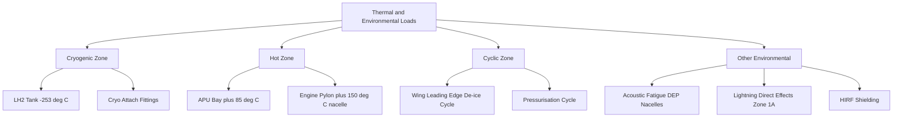

# ATLAS 050-059 · 05.050.040 — Thermal, Cryogenic and Environmental Loads

## 1. Purpose

Defines the **thermal, cryogenic, and environmental loads** that the AMPEL360 eWTW structure must accommodate: temperature gradients from the LH₂ propulsion system, kinetic heating at high Mach conditions, atmospheric icing, acoustic loads, lightning, and HIRF; and their structural implications for material properties, allowables, and fatigue life.

## 2. Scope

### 2.1 Context

The AMPEL360 eWTW presents a uniquely wide thermal operating range. LH₂ fuel storage at −253 °C (20 K) generates cryogenic gradients in tank-attachment fittings, internal bulkheads, and adjacent frames — requiring cryogenically rated CFRP and metallic material specifications. At the opposite extreme, APU bay skin reaches +85 °C during extended ground operations, and leading-edge de-icing systems cycle between −55 °C (cruise) and +120 °C. These gradients impose thermally induced strains that are combined with mechanical loads in the sizing analyses.

Environmental loads also encompass: acoustic fatigue from distributed-propulsion noise (≥ 165 dB OASPL near nacelle fairings); lightning direct-effects zoning per CS-25.581; and HIRF susceptibility per CS-25.1317.

### 2.2 Thermal Load Source Map

### 2.3 Thermal Environment Zones

| Zone ID | Location | T_min (°C) | T_max (°C) | Governing Load |
|---|---|---|---|---|
| TZ-01 | LH₂ tank and attach | −253 | +20 | Cryogenic ΔT gradient |
| TZ-02 | APU bay skin | −55 | +85 | Hot soak + pressurisation |
| TZ-03 | Wing L/E (de-ice) | −55 | +120 | Thermal cycle fatigue |
| TZ-04 | Nacelle fairing | −55 | +150 | Acoustic + thermal |
| TZ-05 | Fuselage skin (general) | −55 | +70 | Kinetic heating + ΔP |

## 3. Footprint

| Metric | Value |
|---|---|
| Document ID | `QATL-ATLAS-1000-ATLAS-050-059-05-050-040-THERMAL-CRYOGENIC-AND-ENVIRONMENTAL-LOADS` |
| Status |  |
| Folder path | `Q+ATLANTIDE/000-099_ATLAS/050-059_Estructuras/050_General/050-040-Loads-Environment-and-Design-Basis/` |

## 4. References

[^baseline]: Q+ATLANTIDE Baseline — [`organization/Q+ATLANTIDE.md`](../../../../../organization/Q+ATLANTIDE.md)

| Ref | Document |
|---|---|
| CS-25.581 | Lightning protection |
| CS-25.1317 | HIRF protection |
| AC 20-107B | Composite aircraft structure — environmental effects |
| SC-AMPEL360-LH2-001 | Special Condition — cryogenic structural effects |
| [`./README.md`](./README.md) | Subsubject 040 index |
| [`../README.md`](../README.md) | 050_General subsection index |
