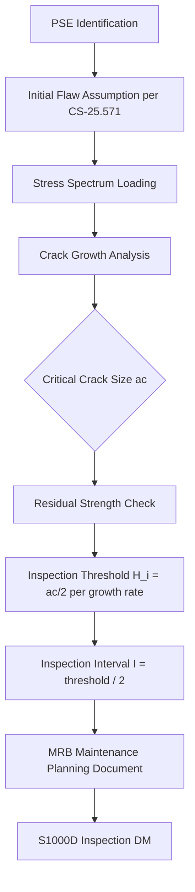

# ATLAS 050-059 · 05.050.040 — Vibration, Fatigue and Damage Tolerance Basis

## 1. Purpose

Establishes the **vibration, fatigue, and damage-tolerance (DT) basis** for the AMPEL360 eWTW structural programme per CS-25.571, defining the fatigue spectrum, damage-tolerant design philosophy for Principal Structural Elements (PSEs), inspection threshold and interval derivation methodology, and the WFD/MSD assessment approach.

## 2. Scope

### 2.1 Context

CS-25.571 requires that transport-category aircraft structures be evaluated for fatigue and damage tolerance. For the AMPEL360 eWTW, all PSEs are designed to be damage-tolerant: cracks must be detectable before reaching critical length, and residual strength must be maintained throughout the inspection interval. Safe-life design is reserved for a limited set of landing-gear primary elements where DT analysis is impractical.

The distributed-electric-propulsion configuration introduces vibration environments dominated by rotor blade-passage frequencies, which are significantly higher in frequency than turbofan fan-blade-passage tones. This necessitates high-cycle acoustic fatigue analysis for nacelle attachment frames and fairing panels adjacent to the DEP pods. The design service goal (DSG) is 90,000 flight cycles / 180,000 flight hours.

### 2.2 Damage-Tolerance Process

### 2.3 Damage-Tolerance Classification

| PSE | DT Category | Design Life (cycles) | Inspection Method |
|---|---|---|---|
| Wing lower spar cap | Fail-safe multi-load-path | 90,000 | HFEC at C-check |
| Fuselage skin lap joints | WFD/MSD monitored | 90,000 | HFEC + visual |
| Centre-wing box lower panel | Damage tolerant | 90,000 | HFEC at 2C-check |
| Main-gear primary fitting | Safe-life | 60,000 | Retire at life limit |
| LH₂ tank attach lugs | DT + leak-before-break | 90,000 | Dye-penetrant D-check |

## 3. Footprint

| Metric | Value |
|---|---|
| Document ID | `QATL-ATLAS-1000-ATLAS-050-059-05-050-040-VIBRATION-FATIGUE-AND-DAMAGE-TOLERANCE-BASIS` |
| Status |  |
| Folder path | `Q+ATLANTIDE/000-099_ATLAS/050-059_Estructuras/050_General/050-040-Loads-Environment-and-Design-Basis/` |

## 4. References

[^baseline]: Q+ATLANTIDE Baseline — [`organization/Q+ATLANTIDE.md`](../../../../../organization/Q+ATLANTIDE.md)

| Ref | Document |
|---|---|
| CS-25.571 | Damage-tolerance and fatigue evaluation of structure |
| AMC 25.571 | Acceptable means of compliance |
| MSG-3 Rev 3 | Damage-tolerant structural task derivation |
| AC 25.571-1D | Airworthiness Standards — damage tolerance and fatigue |
| [`./README.md`](./README.md) | Subsubject 040 index |
| [`../README.md`](../README.md) | 050_General subsection index |
