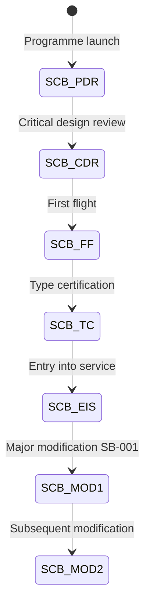

# ATLAS 050-059 · 05.050.050 — Aircraft Effectivity and Configuration Baselines

## 1. Purpose

Defines the **aircraft effectivity and configuration baselines** used to bound the structural documentation set: the structural configuration baseline (SCB) identifiers, their scope relative to production lots and design changes, and how configuration baselines are referenced in maintenance and repair documentation.

## 2. Scope

### 2.1 Context

A structural configuration baseline (SCB) is a formally controlled snapshot of the [PROGRAMME-AIRCRAFT] [PROGRAMME-VARIANT] structural definition at a given programme phase or production lot boundary. SCBs are issued at first-flight, type-certification, entry-into-service, and after each major structural modification campaign. All structural ATLAS documents carry a `baseline_ref` indicating the SCB under which their content was validated.

Effectivity within an SCB is further resolved by the PDCM master aircraft register, which maps each aircraft serial number (SN) to the SCB applicable at delivery and records all subsequent SB incorporations. Maintenance documentation applicability is filtered against the current SCB + SB-incorporation state of the specific aircraft.

### 2.2 Configuration Baseline Lifecycle

### 2.3 Structural Configuration Baseline Register

| SCB ID | Milestone | SN Range | Structural Scope |
|---|---|---|---|
| SCB-01 | PDR | — | Pre-design baseline |
| SCB-02 | CDR | — | Frozen design baseline |
| SCB-03 | First Flight | SN 001 | Flight-test configuration |
| SCB-04 | Type Cert | SN 001–010 | Certification baseline |
| SCB-05 | EIS | SN 001–050 | Delivery baseline |
| SCB-06 | SB-001 retrofit | SN 001–050 post-SB | Post-modification baseline |

## 3. Footprint

| Metric | Value |
|---|---|
| Document ID | `QATL-ATLAS-1000-ATLAS-050-059-05-050-050-AIRCRAFT-EFFECTIVITY-AND-CONFIGURATION-BASELINES` |
| Status |  |
| Folder path | `Q+ATLANTIDE/000-099_ATLAS/050-059_Estructuras/050_General/050-050-Applicability-and-Effectivity/` |

## 4. References

[^baseline]: Q+ATLANTIDE Baseline — [`organization/Q+ATLANTIDE.md`](../../../../../organization/Q+ATLANTIDE.md)

| Ref | Document |
|---|---|
| S1000D Issue 5.0 | Configuration baseline management |
| ATA iSpec 2200 | Aircraft effectivity chapter |
| PDCM-[PROGRAMME-AIRCRAFT]-001 | Product Definition and Configuration Management Plan |
| [`./README.md`](./README.md) | Subsubject 050 index |
| [`../README.md`](../README.md) | 050_General subsection index |
