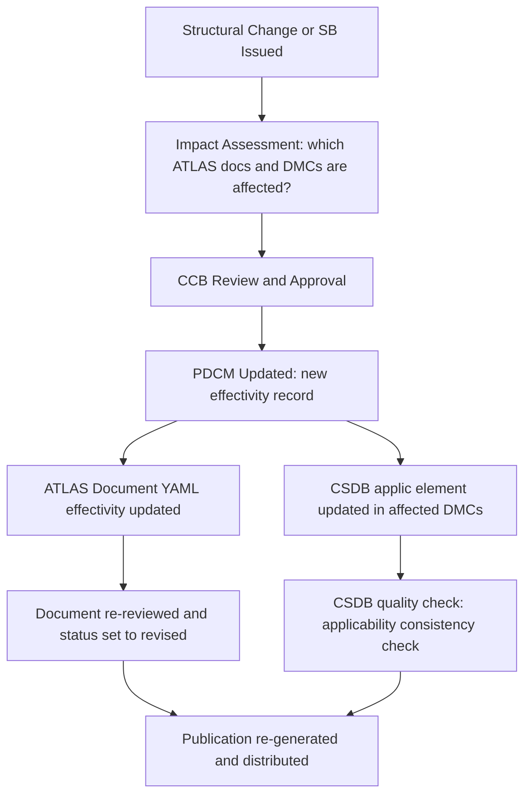

# ATLAS 050-059 · 05.050.050 — Applicability Data Governance and Change Control

## 1. Purpose

Defines the **governance and change-control framework** for applicability and effectivity data within the [PROGRAMME-AIRCRAFT] [PROGRAMME-VARIANT] structural documentation set, specifying the roles, processes, and tools that ensure applicability information in ATLAS documents and S1000D CSDB data modules remains accurate, consistent, and traceable throughout the aircraft lifecycle.

## 2. Scope

### 2.1 Context

Applicability data quality is a safety-critical function: an incorrect effectivity annotation in a maintenance data module can cause a maintenance action to be performed on an aircraft for which it was not substantiated, or conversely, to be omitted from an aircraft that requires it. The [PROGRAMME-AIRCRAFT] [PROGRAMME-VARIANT] applicability governance framework assigns clear ownership: the PDCM is owned by the Configuration Management Office (CMO); CSDB applicability annotations are owned by the Technical Publications team; and ATLAS document effectivity fields are owned by the Structures Design team.

Changes to applicability data require a formal Change Control Board (CCB) approval, a documented impact assessment against all affected documents and data modules, and a verification check confirming that affected publications have been updated and re-validated prior to distribution.

### 2.2 Applicability Change Control Process

### 2.3 Governance Roles

| Role | Owner | Responsibility |
|---|---|---|
| Configuration Management Office | CMO | PDCM master effectivity register |
| Structures Design Authority | Chief Structures Engineer | ATLAS document effectivity fields |
| Technical Publications | Tech Pubs Manager | CSDB applicability annotations |
| Change Control Board | Programme Director | CCB approval authority |
| Airworthiness Authority | EASA/FAA DAS | Mandatory changes (AD applicability) |

## 3. Footprint

| Metric | Value |
|---|---|
| Document ID | `QATL-ATLAS-1000-ATLAS-050-059-05-050-050-APPLICABILITY-DATA-GOVERNANCE-AND-CHANGE-CONTROL` |
| Status |  |
| Folder path | `Q+ATLANTIDE/000-099_ATLAS/050-059_Estructuras/050_General/050-050-Applicability-and-Effectivity/` |

## 4. References

[^baseline]: Q+ATLANTIDE Baseline — [`organization/Q+ATLANTIDE.md`](../../../../../organization/Q+ATLANTIDE.md)

| Ref | Document |
|---|---|
| S1000D Issue 5.0 | CSDB applicability management |
| PDCM-[PROGRAMME-AIRCRAFT]-001 | Product Definition and Configuration Management Plan |
| CCB-[PROGRAMME-AIRCRAFT]-PROC-001 | Change Control Board Procedure |
| [`./README.md`](./README.md) | Subsubject 050 index |
| [`../README.md`](../README.md) | 050_General subsection index |
