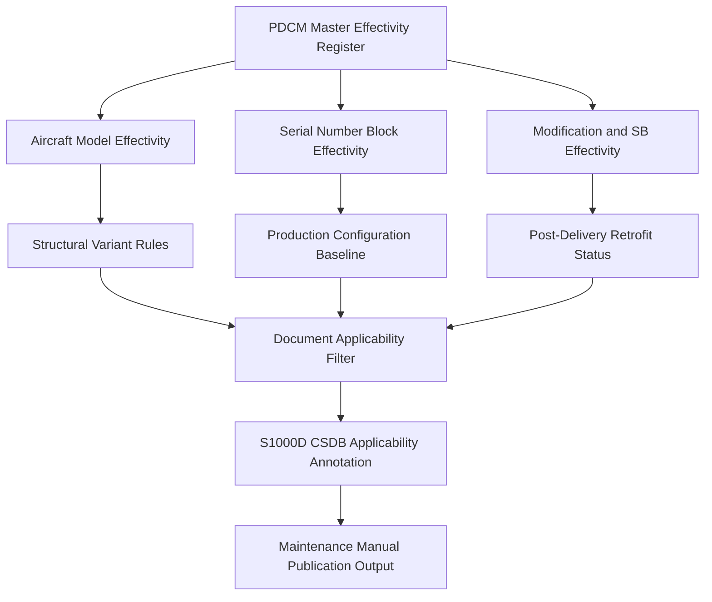

# ATLAS 050-059 · 05.050.050 — Applicability and Effectivity Overview

## 1. Purpose

Provides the programme-level overview of the **applicability and effectivity** framework for AMPEL360 eWTW structural documentation: the rules by which documents, tasks, limits, and repair schemes are scoped to specific aircraft, configuration variants, serial-number blocks, and modification states.

## 2. Scope

### 2.1 Context

Applicability and effectivity are the mechanisms that prevent applying an incorrect maintenance task, repair scheme, or structural limit to an aircraft it was not designed for. The AMPEL360 eWTW programme anticipates multiple structural variants (baseline, extended-range, freighter derivative) and a long production run during which modifications, retrofits, and service bulletins will progressively change the configuration of individual aircraft.

All structural documents — including inspection thresholds, repair allowances, and replacement limits — carry an explicit applicability statement encoded in both human-readable form and in S1000D applicability annotations (using the CSDB applicability filtering mechanism). The AMPEL360 Product Definition and Configuration Management system (PDCM) provides the master effectivity register from which applicability is derived.

### 2.2 Applicability Framework

### 2.3 Applicability Types Summary

| Type | Scope | Owner | Update Trigger |
|---|---|---|---|
| Programme applicability | All AMPEL360 aircraft | Programme office | New derivative launch |
| Model applicability | Specific variant (e.g., ER) | Structures design | Design change order |
| Serial-number effectivity | Production block | Production planning | SB incorporation |
| SB/modification effectivity | Post-delivery aircraft | Service engineering | SB release |

## 3. Footprint

| Metric | Value |
|---|---|
| Document ID | `QATL-ATLAS-1000-ATLAS-050-059-05-050-050-APPLICABILITY-AND-EFFECTIVITY-OVERVIEW` |
| Status |  |
| Folder path | `Q+ATLANTIDE/000-099_ATLAS/050-059_Estructuras/050_General/050-050-Applicability-and-Effectivity/` |

## 4. References

[^baseline]: Q+ATLANTIDE Baseline — [`organization/Q+ATLANTIDE.md`](../../../../../organization/Q+ATLANTIDE.md)

| Ref | Document |
|---|---|
| S1000D Issue 5.0 | Applicability filtering chapter |
| ATA iSpec 2200 | Configuration and effectivity management |
| [`./README.md`](./README.md) | Subsubject 050 index |
| [`../README.md`](../README.md) | 050_General subsection index |
