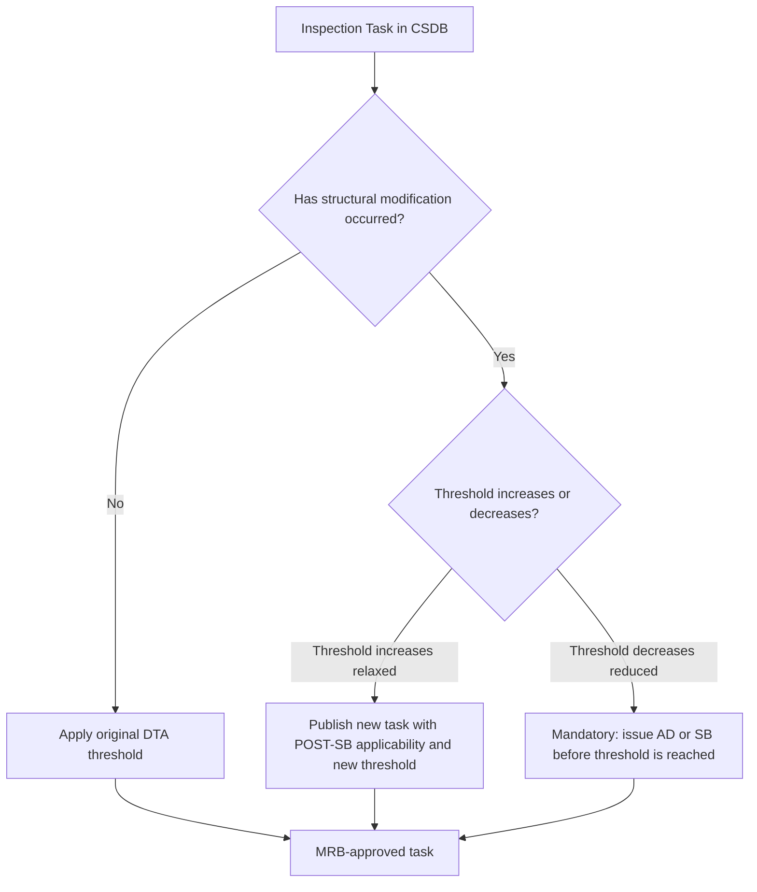

# ATLAS 050-059 · 05.050.050 — Inspection Applicability and Threshold Rules

## 1. Purpose

Defines the **inspection applicability and threshold rules** for AMPEL360 eWTW structural inspections: how inspection thresholds and intervals are scoped to specific aircraft variants, serial-number blocks, and SB-incorporation states, and how threshold extensions or reductions are governed when configuration changes affect fatigue and damage-tolerance analyses.

## 2. Scope

### 2.1 Context

Structural inspection thresholds and intervals are derived from the damage-tolerance analysis (DTA) for each PSE and validated through the Maintenance Review Board (MRB) process. Each inspection task in the S1000D CSDB carries an applicability annotation that binds the threshold value to the structural configuration for which the DTA was performed. When a structural modification changes the stress state of a PSE (e.g., by adding plies, changing fastener type, or altering load path), the associated inspection threshold must be re-derived and a new applicability-bounded version of the task published.

The MRB document (MRBD) is the governing reference for approved thresholds and intervals. ATLAS subsubject 050 documents provide the applicability binding rules that connect MRBD entries to CSDB data modules.

### 2.2 Threshold Applicability Decision Logic

### 2.3 Threshold Applicability Rules Summary

| Rule | Trigger | Action |
|---|---|---|
| Original threshold | No SB incorporated | Apply MRBD threshold as-is |
| Threshold increase (SB benefit) | Optional SB incorporated | New applicability POST-SB; extended threshold |
| Threshold reduction (SB finding) | Mandatory SB/AD | Reduced threshold mandatory; operator notified |
| New PSE added by modification | STC or major repair | New DTA required; new inspection task issued |
| Safe-life element replaced | Life-limit reached | New life limit per replacement part paperwork |

## 3. Footprint

| Metric | Value |
|---|---|
| Document ID | `QATL-ATLAS-1000-ATLAS-050-059-05-050-050-INSPECTION-APPLICABILITY-AND-THRESHOLD-RULES` |
| Status |  |
| Folder path | `Q+ATLANTIDE/000-099_ATLAS/050-059_Estructuras/050_General/050-050-Applicability-and-Effectivity/` |

## 4. References

[^baseline]: Q+ATLANTIDE Baseline — [`organization/Q+ATLANTIDE.md`](../../../../../organization/Q+ATLANTIDE.md)

| Ref | Document |
|---|---|
| CS-25.571 | Damage-tolerance and inspection threshold derivation |
| MSG-3 Rev 3 | Structural task development and threshold logic |
| MRBD-AMPEL360-001 | Maintenance Review Board Document |
| [`./README.md`](./README.md) | Subsubject 050 index |
| [`../README.md`](../README.md) | 050_General subsection index |
