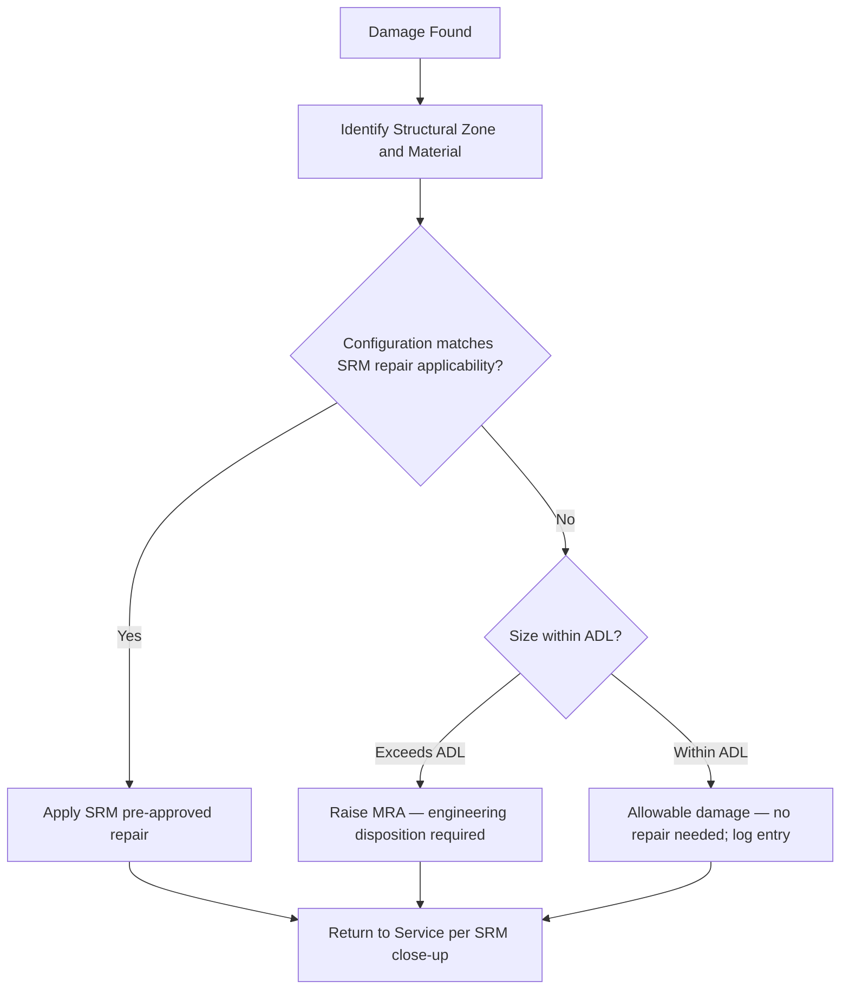

# ATLAS 050-059 · 05.050.050 — Repair Applicability and Damage Limit Boundaries

## 1. Purpose

Defines the **repair applicability and damage-limit boundary** rules for the AMPEL360 eWTW Structural Repair Manual (SRM): how repair schemes are scoped to structural variants and configurations, how allowable damage limits (ADL) vary with configuration, and the applicability boundaries beyond which a Manufacturer Repair Approval (MRA) is required.

## 2. Scope

### 2.1 Context

The AMPEL360 eWTW SRM provides pre-approved repair schemes classified by structural zone, damage type, and applicable aircraft configuration. A repair scheme is valid only for the structural configuration for which its DTA was performed. If the damaged area falls within a structural zone that has been modified by an incorporated SB or variant change, the SRM repair scheme must be replaced by a configuration-specific MRA.

Allowable damage limits are defined per zone and per material type. For CFRP primary structure, ADLs reflect the barely visible impact damage (BVID) threshold for delamination depth and area. For metallic structure, ADLs are expressed as maximum scratch depth, corrosion pit area, and crack-free zone dimensions around fasteners.

### 2.2 Repair Applicability Decision Tree

### 2.3 ADL Boundaries by Material

| Material | Damage Type | ADL (no repair) | SRM Repair Limit | MRA Required |
|---|---|---|---|---|
| CFRP skin | BVID delamination | Depth ≤ 1.0 mm, area ≤ 2 500 mm² | Up to 10 000 mm² | > 10 000 mm² |
| CFRP spar cap | Through crack | None (zero tolerance) | None (MRA always) | Any crack |
| Aluminium skin | Corrosion pit | Depth ≤ 10 % t, area ≤ 800 mm² | Up to 25 % t area | > 25 % t |
| Titanium fitting | Scratch | Depth ≤ 0.25 mm | N/a | Any deeper scratch |

## 3. Footprint

| Metric | Value |
|---|---|
| Document ID | `QATL-ATLAS-1000-ATLAS-050-059-05-050-050-REPAIR-APPLICABILITY-AND-DAMAGE-LIMIT-BOUNDARIES` |
| Status |  |
| Folder path | `Q+ATLANTIDE/000-099_ATLAS/050-059_Estructuras/050_General/050-050-Applicability-and-Effectivity/` |

## 4. References

[^baseline]: Q+ATLANTIDE Baseline — [`organization/Q+ATLANTIDE.md`](../../../../../organization/Q+ATLANTIDE.md)

| Ref | Document |
|---|---|
| CS-25.571 | Damage-tolerance — residual strength |
| AC 20-107B | BVID and damage-limit guidance for composites |
| SRM-AMPEL360-050 | Structural Repair Manual — Chapter 050 |
| [`./README.md`](./README.md) | Subsubject 050 index |
| [`../README.md`](../README.md) | 050_General subsection index |
