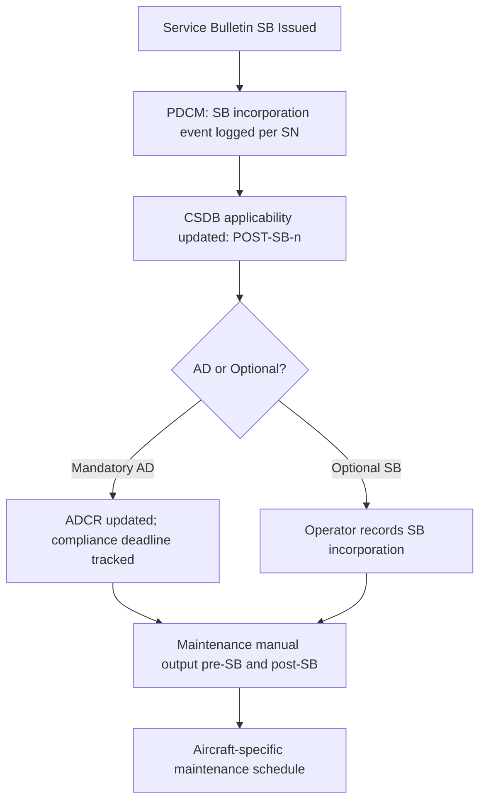

# ATLAS 050-059 · 05.050.050 — Retrofit, Modification and Service Bulletin Effectivity

## 1. Purpose

Defines the **retrofit, modification, and service-bulletin (SB) effectivity** framework for [PROGRAMME-AIRCRAFT] [PROGRAMME-VARIANT] structural documentation, specifying how post-delivery structural changes are tracked, how SB incorporation state affects applicable maintenance limits and inspection thresholds, and how CSDB applicability annotations are updated post-SB.

## 2. Scope

### 2.1 Context

Once an [PROGRAMME-AIRCRAFT] aircraft enters service, its structural configuration evolves through the incorporation of service bulletins, airworthiness directives (ADs), and operator-requested modifications. Each incorporated SB changes the structural definition of the affected aircraft, which in turn changes the applicability of structural maintenance tasks, repair schemes, and inspection limits. The [PROGRAMME-AIRCRAFT] CSDB maintains a parallel document state for pre- and post-SB configurations, allowing publication outputs to reflect the actual aircraft configuration.

Mandatory SBs triggered by AD actions are tracked in the AD Compliance Register (ADCR), which is cross-referenced against the PDCM to determine current aircraft structural state. Optional SBs are tracked per aircraft in the operator's own configuration management system, with the CSDB providing the filtering logic.

### 2.2 SB Effectivity Processing

### 2.3 SB Effectivity Encoding Rules

| SB Status | Effectivity Token | Documentation Action |
|---|---|---|
| Pre-SB (original config) | `PRE-SB-{number}` | Retain original task/limit in CSDB |
| Post-SB (SB incorporated) | `POST-SB-{number}` | Add new task/limit with post-SB applicability |
| Mandatory AD compliance | `POST-AD-{ref}` | Replace original data module with revised |
| Operator modification (STC) | `STC-{number}` | Separate applicability in CSDB |

## 3. Footprint

| Metric | Value |
|---|---|
| Document ID | `QATL-ATLAS-1000-ATLAS-050-059-05-050-050-RETROFIT-MODIFICATION-AND-SERVICE-BULLETIN-EFFECTIVITY` |
| Status |  |
| Folder path | `Q+ATLANTIDE/000-099_ATLAS/050-059_Estructuras/050_General/050-050-Applicability-and-Effectivity/` |

## 4. References

[^baseline]: Q+ATLANTIDE Baseline — [`organization/Q+ATLANTIDE.md`](../../../../../organization/Q+ATLANTIDE.md)

| Ref | Document |
|---|---|
| S1000D Issue 5.0 | Applicability annotations for SB incorporation |
| CS-25 Subpart D | Airworthiness Directives process |
| ADCR-[PROGRAMME-AIRCRAFT]-001 | AD Compliance Register |
| [`./README.md`](./README.md) | Subsubject 050 index |
| [`../README.md`](../README.md) | 050_General subsection index |
